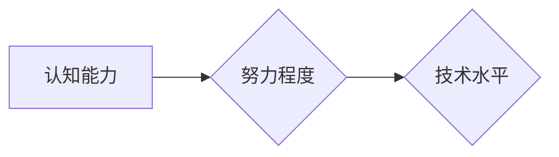

> 认知能力、努力程度、技术上限、学习方法、实践经验、创新驱动、技术发展

## 1. 背景介绍

在瞬息万变的科技时代，技术发展日新月异，涌现出无数令人惊叹的创新成果。从人工智能的飞速发展到量子计算的突破性进展，这些成就都离不开人类的智慧和努力。然而，在追求技术进步的道路上，我们常常会遇到一个共同的瓶颈：认知能力的局限性。

认知能力是人类理解、思考和解决问题的能力，它决定了我们能够掌握和应用技术的深度和广度。然而，认知能力并非天生就具备，它需要通过学习、实践和积累不断提升。而努力程度则决定了我们能否突破认知能力的局限，实现技术突破。

## 2. 核心概念与联系

### 2.1 认知能力

认知能力是指人类通过感知、记忆、思考、语言等方式获取、处理和利用信息的能力。它包括以下几个方面：

* **感知能力:** 接收和理解来自外部世界的各种信息。
* **记忆能力:** 将信息存储在脑海中，并能够在需要时回忆起来。
* **思考能力:** 对信息进行分析、判断、推理和解决问题。
* **语言能力:** 使用语言表达自己的想法和理解他人的信息。

### 2.2 努力程度

努力程度是指个体在追求目标时投入的时间、精力和心血。它是一个多维度的概念，包括以下几个方面：

* **时间投入:** 投入多少时间学习和实践。
* **精力投入:** 将多少精力集中在目标上。
* **心血投入:** 对目标的热情和坚持程度。

### 2.3 认知能力与努力程度的关系

认知能力和努力程度之间存在着相互促进、相互影响的关系。

* **认知能力决定了努力程度的上限:** 认知能力越强，个体能够理解和掌握知识的深度和广度越大，也就能够制定更清晰的目标，并投入更多精力去实现目标。
* **努力程度决定了认知能力的下限:** 努力程度越高，个体能够接触和学习的知识越多，经验积累也越丰富，从而促进认知能力的提升。

**Mermaid 流程图**

## 3. 核心算法原理 & 具体操作步骤

### 3.1 算法原理概述

**算法**是解决特定问题的一系列步骤或规则，它可以帮助我们更高效地处理信息和完成任务。

**核心算法原理**是指算法的核心思想和逻辑结构，它决定了算法的效率、准确性和适用范围。

### 3.2 算法步骤详解

**具体操作步骤**是指按照算法原理，将问题分解成一个个小的步骤，并对每个步骤进行详细描述。

### 3.3 算法优缺点

**算法的优缺点**是指算法在实际应用中表现出的优势和不足，它需要根据具体问题和环境进行评估。

### 3.4 算法应用领域

**算法的应用领域**是指算法能够应用于哪些领域和问题，它体现了算法的广泛性和实用性。

## 4. 数学模型和公式 & 详细讲解 & 举例说明

### 4.1 数学模型构建

**数学模型**是利用数学语言和符号来描述和模拟现实世界现象的抽象模型。

### 4.2 公式推导过程

**公式推导过程**是指从数学模型出发，通过逻辑推理和数学运算，推导出描述现象的数学公式。

### 4.3 案例分析与讲解

**案例分析与讲解**是指利用数学模型和公式，对实际案例进行分析和解释，验证公式的正确性和实用性。

## 5. 项目实践：代码实例和详细解释说明

### 5.1 开发环境搭建

**开发环境搭建**是指为项目开发准备必要的软件和硬件环境。

### 5.2 源代码详细实现

**源代码详细实现**是指根据算法原理和设计方案，编写出具体的代码实现。

### 5.3 代码解读与分析

**代码解读与分析**是指对代码进行详细的解释和分析，理解代码的逻辑结构和功能实现。

### 5.4 运行结果展示

**运行结果展示**是指运行代码后，展示代码的运行结果和效果。

## 6. 实际应用场景

### 6.1 应用场景介绍

**应用场景介绍**是指介绍算法在实际应用中的具体场景和应用案例。

### 6.2 应用效果分析

**应用效果分析**是指对算法在实际应用中的效果进行分析和评估。

### 6.3 应用前景展望

**应用前景展望**是指对算法在未来发展中的应用前景进行展望和预测。

## 7. 工具和资源推荐

### 7.1 学习资源推荐

**学习资源推荐**是指推荐一些学习相关知识和技能的资源，例如书籍、课程、网站等。

### 7.2 开发工具推荐

**开发工具推荐**是指推荐一些用于开发和测试算法的工具，例如编程语言、开发环境、测试工具等。

### 7.3 相关论文推荐

**相关论文推荐**是指推荐一些与算法相关的学术论文，以便读者深入了解算法的理论基础和最新研究进展。

## 8. 总结：未来发展趋势与挑战

### 8.1 研究成果总结

**研究成果总结**是指对本文所述内容进行总结，并强调其重要意义和价值。

### 8.2 未来发展趋势

**未来发展趋势**是指对算法未来发展方向进行预测和展望，例如算法的智能化、自动化、个性化等。

### 8.3 面临的挑战

**面临的挑战**是指算法发展过程中可能遇到的挑战和问题，例如算法的安全性、可靠性、可解释性等。

### 8.4 研究展望

**研究展望**是指对未来算法研究方向进行展望，并提出一些新的研究问题和思路。

## 9. 附录：常见问题与解答

**常见问题与解答**是指解答读者可能遇到的常见问题，例如算法的应用范围、算法的优缺点、算法的学习方法等。

作者：禅与计算机程序设计艺术 / Zen and the Art of Computer Programming 
<end_of_turn>