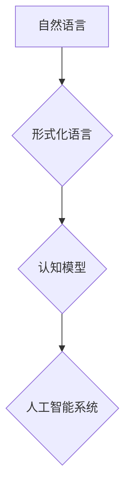

> 自然语言处理，形式化语言，认知科学，人工智能，元语言，符号系统，逻辑推理

## 1. 背景介绍

科学的进步离不开对世界规律的探索和理解。而理解世界规律的关键在于建立有效的知识表示和推理机制。不同学科为了更好地描述和研究其领域内的知识，都发展出了各自的专业语言和符号系统。例如，物理学使用数学语言描述物理现象，生物学使用生物学词汇和符号描述生命现象，而计算机科学则使用编程语言和算法描述计算过程。

然而，这些专业语言和符号系统往往局限于各自的领域，难以跨领域交流和融合。而自然语言，作为人类交流的通用语言，具有跨领域、跨文化、跨学科的优势。它能够表达人类的思想、情感、知识和经验，并能够被不同学科的人理解和使用。因此，自然语言被认为是所有专业语言的元语言，它能够将不同学科的知识整合起来，形成一个更加完整的认知体系。

## 2. 核心概念与联系

**2.1 自然语言处理 (NLP)**

自然语言处理 (NLP) 是人工智能领域的一个重要分支，它致力于使计算机能够理解、处理和生成人类语言。NLP 的目标是构建能够理解自然语言的含义、结构和语义的计算机系统。

**2.2 形式化语言**

形式化语言是一种严格定义的符号系统，它使用符号和规则来表达知识和推理。形式化语言的特点是：

* **精确性:** 符号和规则的含义明确，避免了歧义和误解。
* **一致性:** 规则的应用是严格一致的，保证了推理的正确性。
* **可计算性:** 形式化语言的推理过程可以被计算机自动执行。

**2.3 元语言**

元语言是指用来描述其他语言的语言。它能够定义其他语言的语法、语义和逻辑规则。自然语言可以被视为所有专业语言的元语言，因为它能够描述和表达其他专业语言的知识。

**2.4 认知科学**

认知科学是一门研究人类认知过程的学科，它试图理解人类是如何感知、记忆、学习、推理和决策的。认知科学的研究方法包括实验心理学、神经科学、语言学、计算机科学等。

**2.5 认知形式化**

认知形式化是指将人类认知过程用形式化语言和符号系统表示出来，以便于计算机理解和模拟。认知形式化的目标是构建能够模拟人类认知能力的计算机系统。

**Mermaid 流程图**



## 3. 核心算法原理 & 具体操作步骤

### 3.1  算法原理概述

认知形式化的核心算法原理是将自然语言转换为形式化语言，然后利用形式化语言进行推理和知识表示。

### 3.2  算法步骤详解

1. **自然语言分析:** 对输入的自然语言文本进行分析，提取语法结构、语义信息和情感倾向等。
2. **语义角色标注:** 对文本中的每个词语进行语义角色标注，例如主语、谓语、宾语等。
3. **知识图谱构建:** 将文本中的知识点和关系转换为知识图谱的形式，例如实体、关系、属性等。
4. **形式化语言转换:** 将知识图谱转换为形式化语言，例如逻辑表达式、规则等。
5. **推理和知识表示:** 利用形式化语言进行推理和知识表示，例如抽取隐含知识、进行逻辑推论等。
6. **结果输出:** 将推理结果转换为自然语言或其他形式输出。

### 3.3  算法优缺点

**优点:**

* 能够将自然语言转换为计算机可理解的形式，实现自然语言理解和推理。
* 能够将不同学科的知识整合起来，形成一个更加完整的认知体系。
* 能够提高知识的准确性和可信度。

**缺点:**

* 自然语言的复杂性和歧义性使得形式化转换过程非常困难。
* 现有的形式化语言和推理机制还无法完全模拟人类的认知能力。
* 认知形式化需要大量的计算资源和时间。

### 3.4  算法应用领域

* **人工智能:** 自然语言理解、对话系统、机器翻译、文本摘要等。
* **认知科学:** 研究人类认知过程、构建认知模型。
* **教育:** 个性化学习、智能辅导系统。
* **医疗:** 疾病诊断、药物研发。
* **法律:** 法律文本分析、法律推理。

## 4. 数学模型和公式 & 详细讲解 & 举例说明

### 4.1  数学模型构建

认知形式化的数学模型可以基于逻辑学、集合论和概率论等数学基础。

**4.1.1 逻辑学:**

逻辑学提供了一种形式化的推理机制，可以用于表示知识和进行逻辑推论。

**4.1.2 集合论:**

集合论可以用于表示知识的分类和关系。

**4.1.3 概率论:**

概率论可以用于表示知识的不确定性和置信度。

### 4.2  公式推导过程

例如，我们可以使用逻辑公式来表示一个简单的知识：

* **P(x):** x 是一个苹果。
* **R(x, y):** x 是 y 的颜色。

我们可以用以下逻辑公式表示“所有苹果都是红色的”：

```
∀x (P(x) → R(x, 红))
```

其中，∀x 表示对所有 x 都成立。

### 4.3  案例分析与讲解

**案例:**

假设我们有一个知识库，包含以下知识：

* 所有的狗都是哺乳动物。
* 所有的哺乳动物都是动物。

我们可以使用逻辑推理来推导出以下结论：

* 所有的狗都是动物。

**解释:**

我们可以将上述知识表示为以下逻辑公式：

* P(x) → M(x) (所有狗都是哺乳动物)
* M(x) → A(x) (所有哺乳动物都是动物)

根据逻辑推理规则，我们可以推导出：

* P(x) → A(x) (所有狗都是动物)

## 5. 项目实践：代码实例和详细解释说明

### 5.1  开发环境搭建

* 操作系统: Ubuntu 20.04
* Python 版本: 3.8
* 依赖库: NLTK, spaCy, Gensim

### 5.2  源代码详细实现

```python
import nltk
from nltk.tokenize import word_tokenize
from nltk.tag import pos_tag

# 下载 NLTK 数据集
nltk.download('punkt')
nltk.download('averaged_perceptron_tagger')

# 输入文本
text = "The quick brown fox jumps over the lazy dog."

# 词汇分词
tokens = word_tokenize(text)

# 词性标注
pos_tags = pos_tag(tokens)

# 打印结果
print(pos_tags)
```

### 5.3  代码解读与分析

* `word_tokenize(text)` 函数将文本分割成单词列表。
* `pos_tag(tokens)` 函数对每个单词进行词性标注，并返回一个包含单词和词性的元组列表。

### 5.4  运行结果展示

```
[('The', 'DT'), ('quick', 'JJ'), ('brown', 'JJ'), ('fox', 'NN'), ('jumps', 'VBZ'), ('over', 'IN'), ('the', 'DT'), ('lazy', 'JJ'), ('dog', 'NN'), ('.', '.')]
```

## 6. 实际应用场景

### 6.1  自然语言理解

* **聊天机器人:** 理解用户自然语言输入，并提供相应的回复。
* **搜索引擎:** 理解用户搜索词语，并返回相关结果。
* **文本摘要:** 从长文本中提取关键信息，生成简短的摘要。

### 6.2  知识图谱构建

* **知识管理:** 将知识组织成知识图谱，方便知识检索和利用。
* **数据分析:** 从文本数据中提取知识，进行数据分析和挖掘。
* **推荐系统:** 基于用户兴趣和行为，构建知识图谱，进行个性化推荐。

### 6.3  机器翻译

* **跨语言沟通:** 将一种语言的文本翻译成另一种语言，促进跨语言沟通。
* **国际贸易:** 将商业文件和合同翻译成目标语言，促进国际贸易。
* **旅游:** 将旅游指南和景点介绍翻译成目标语言，方便游客出行。

### 6.4  未来应用展望

* **个性化教育:** 根据学生的学习情况和需求，提供个性化的学习内容和辅导。
* **智能医疗:** 利用自然语言处理技术，辅助医生诊断疾病、制定治疗方案。
* **法律智能化:** 利用自然语言处理技术，辅助律师进行法律分析、撰写法律文件。

## 7. 工具和资源推荐

### 7.1  学习资源推荐

* **Stanford NLP Group:** https://nlp.stanford.edu/
* **CMU Language Technologies Institute:** https://www.lti.cs.cmu.edu/
* **NLTK Book:** https://www.nltk.org/book/

### 7.2  开发工具推荐

* **spaCy:** https://spacy.io/
* **Gensim:** https://radimrehurek.com/gensim/
* **Hugging Face Transformers:** https://huggingface.co/transformers/

### 7.3  相关论文推荐

* **Attention Is All You Need:** https://arxiv.org/abs/1706.03762
* **BERT: Pre-training of Deep Bidirectional Transformers for Language Understanding:** https://arxiv.org/abs/1810.04805
* **GPT-3: Language Models are Few-Shot Learners:** https://arxiv.org/abs/2005.14165

## 8. 总结：未来发展趋势与挑战

### 8.1  研究成果总结

认知形式化研究取得了显著进展，例如：

* 自然语言理解和生成技术取得了突破性进展。
* 知识图谱构建和推理技术不断完善。
* 人工智能系统能够模拟人类认知能力的某些方面。

### 8.2  未来发展趋势

* **更强大的自然语言理解和生成能力:** 能够理解更复杂、更微妙的自然语言。
* **更智能的知识图谱构建和推理:** 能够自动构建更完整的知识图谱，并进行更复杂的推理。
* **更具泛化能力的人工智能系统:** 能够应用于更广泛的领域，并适应不同的环境。

### 8.3  面临的挑战

* 自然语言的复杂性和歧义性使得形式化转换过程非常困难。
* 现有的形式化语言和推理机制还无法完全模拟人类的认知能力。
* 认知形式化需要大量的计算资源和时间。

### 8.4  研究展望

* 研究更有效的自然语言形式化方法。
* 开发更强大的形式化推理机制。
* 探索新的认知模型和算法。

## 9. 附录：常见问题与解答

**问题 1:** 认知形式化与机器学习有什么区别？

**解答:** 认知形式化侧重于将人类认知过程用形式化语言和符号系统表示出来，而机器学习则侧重于训练机器模型，使其能够从数据中学习规律。

**问题 2:** 认知形式化有哪些应用场景？

**解答:** 认知形式化应用场景广泛，例如自然语言理解、知识图谱构建、机器翻译等。

**问题 3:** 认知形式化有哪些挑战？

**解答:** 认知形式化面临的挑战包括自然语言的复杂性和歧义性、形式化语言和推理机制的局限性、以及计算资源和时间成本等。


作者：禅与计算机程序设计艺术 / Zen and the Art of Computer Programming 
<end_of_turn>