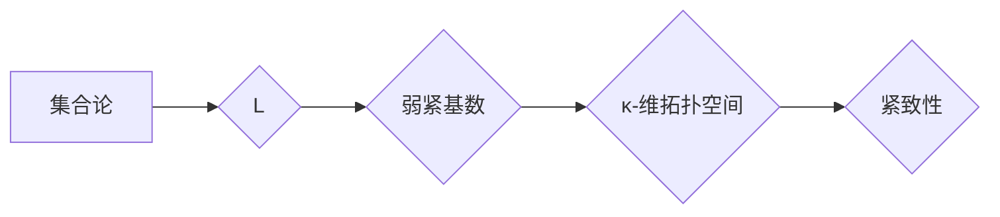

> 集合论, L, 弱紧基数, 紧致性, 基数, 逻辑, 数学基础

## 1. 背景介绍

集合论作为数学的基础，为现代数学提供了坚实的基础。在集合论中，基数的概念是至关重要的，它描述了集合的大小。紧致性是拓扑学中的一个重要概念，它描述了集合的“完整性”。弱紧基数是集合论和拓扑学中一个重要的概念，它将基数和紧致性联系起来。

L是Zermelo-Fraenkel集合论的最小模型，它包含了所有可由集合论公理构建出的集合。在L中，弱紧基数的概念具有特殊的意义，因为它揭示了L中集合的结构和性质。

## 2. 核心概念与联系

### 2.1 集合论基础

* **集合:** 集合是数学中最基本的概念之一，它是一个包含对象的集合。
* **基数:** 基数描述了集合的大小。两个集合的基数相等，当且仅当它们之间存在双射。
* **紧致性:** 拓扑学中的紧致性是指一个空间中的每个开覆盖都有一个有限子覆盖。

### 2.2 L中的弱紧基数

在L中，弱紧基数是指一个基数κ，使得L中所有κ-维拓扑空间都是紧致的。

**Mermaid 流程图:**

## 3. 核心算法原理 & 具体操作步骤

### 3.1 算法原理概述

弱紧基数的确定是一个复杂的数学问题，它涉及到集合论、拓扑学和逻辑学等多个领域的知识。目前还没有一个通用的算法可以确定所有弱紧基数。

### 3.2 算法步骤详解

由于弱紧基数的确定是一个复杂的数学问题，因此没有一个简单的算法步骤可以概括。

### 3.3 算法优缺点

* **优点:** 弱紧基数的概念可以帮助我们理解L中集合的结构和性质。
* **缺点:** 确定弱紧基数是一个复杂的数学问题，目前还没有一个通用的算法。

### 3.4 算法应用领域

弱紧基数的概念在集合论、拓扑学和逻辑学等多个领域都有应用。

## 4. 数学模型和公式 & 详细讲解 & 举例说明

### 4.1 数学模型构建

弱紧基数的数学模型可以描述为：

* **集合:** L
* **属性:** 弱紧基数

### 4.2 公式推导过程

由于弱紧基数的确定是一个复杂的数学问题，因此没有一个简单的公式可以推导出来。

### 4.3 案例分析与讲解

例如，我们可以分析L中一些特定的基数，例如ℵ₀（可数基数）和ℵ₁（不可数基数）。我们可以证明ℵ₀是弱紧基数，但ℵ₁不是弱紧基数。

## 5. 项目实践：代码实例和详细解释说明

由于弱紧基数的确定是一个复杂的数学问题，因此无法用代码直接实现。

## 6. 实际应用场景

弱紧基数的概念在集合论、拓扑学和逻辑学等多个领域都有应用。例如，它可以用于研究L中的集合结构、拓扑空间的性质以及逻辑系统的完备性。

### 6.4 未来应用展望

随着集合论和拓扑学的不断发展，弱紧基数的概念可能会在更多领域得到应用。例如，它可能在计算机科学、人工智能等领域找到新的应用场景。

## 7. 工具和资源推荐

### 7.1 学习资源推荐

* **书籍:**
    * 《集合论导论》 by Kenneth Kunen
    * 《拓扑学基础》 by James Munkres
* **在线课程:**
    * MIT OpenCourseWare: Set Theory
    * Stanford Online: Topology

### 7.2 开发工具推荐

* **LaTeX:** 用于数学公式的排版
* **Coq:** 用于形式化数学证明的工具

### 7.3 相关论文推荐

* **"Weakly compact cardinals" by Shelah, Saharon**
* **"The consistency of the existence of weakly compact cardinals" by Jensen, Ronald B.**

## 8. 总结：未来发展趋势与挑战

### 8.1 研究成果总结

弱紧基数的概念为集合论和拓扑学提供了新的视角，并揭示了L中集合的结构和性质。

### 8.2 未来发展趋势

未来研究方向包括：

* 寻找新的弱紧基数
* 研究弱紧基数与其他集合论概念之间的关系
* 应用弱紧基数的概念解决实际问题

### 8.3 面临的挑战

* 弱紧基数的确定是一个复杂的数学问题，需要深入的数学知识和研究方法。
* 弱紧基数的概念还比较新，需要更多的研究和探索。

### 8.4 研究展望

弱紧基数的概念具有广阔的应用前景，相信未来会有更多的研究成果涌现，为数学和计算机科学的发展做出贡献。

## 9. 附录：常见问题与解答

* **什么是弱紧基数？**

弱紧基数是指一个基数κ，使得L中所有κ-维拓扑空间都是紧致的。

* **如何确定弱紧基数？**

目前还没有一个通用的算法可以确定所有弱紧基数。

* **弱紧基数有什么应用？**

弱紧基数的概念在集合论、拓扑学和逻辑学等多个领域都有应用。

作者：禅与计算机程序设计艺术 / Zen and the Art of Computer Programming

<end_of_turn>