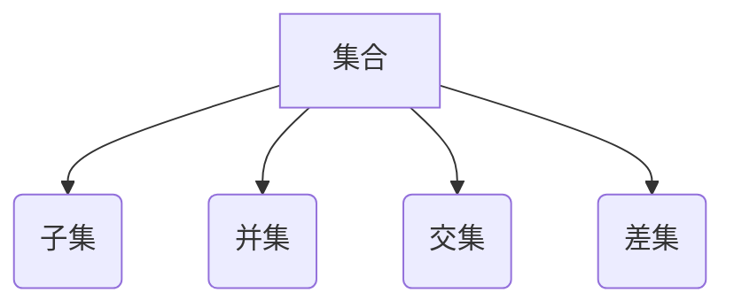

> 集合论，数学基础，逻辑推理，数据结构，算法设计，编程实践，计算机科学

## 1. 背景介绍

在计算机科学的广阔领域中，集合论作为基础理论，扮演着至关重要的角色。它为数据结构、算法设计、程序设计语言等核心概念提供了坚实的数学基础。理解集合论的原理，能够帮助我们更好地理解计算机科学的本质，并提升编程能力。

从古希腊哲学家到现代计算机科学家，人们一直试图用抽象的符号和逻辑规则来描述世界。集合论正是这种探索的结晶，它提供了一种简洁而强大的工具，用来描述和操作各种类型的对象。

## 2. 核心概念与联系

集合论的核心概念是“集合”，它是一个包含特定对象的无序集。我们可以用大括号 {} 来表示集合，并将集合中的元素用逗号隔开。例如，{1, 2, 3} 表示一个包含数字 1、2 和 3 的集合。

集合论中还有一些重要的概念，例如：

* **子集**: 如果一个集合的所有元素都属于另一个集合，则称第一个集合是第二个集合的子集。
* **并集**: 两个集合的并集包含这两个集合的所有元素。
* **交集**: 两个集合的交集包含这两个集合中共同的元素。
* **差集**: 两个集合的差集包含第一个集合中不属于第二个集合的元素。

这些概念之间相互关联，构成了一套完整的逻辑体系。



## 3. 核心算法原理 & 具体操作步骤

### 3.1  算法原理概述

集合论中的算法通常涉及集合的运算，例如查找、插入、删除、合并等操作。这些算法的效率和正确性取决于集合的结构和操作方式。

### 3.2  算法步骤详解

以下是一些常见的集合论算法的步骤详解：

* **查找**: 查找集合中是否存在某个特定元素。
* **插入**: 将一个元素添加到集合中。
* **删除**: 从集合中删除一个特定元素。
* **合并**: 将两个集合合并成一个新的集合。

### 3.3  算法优缺点

不同的集合论算法具有不同的优缺点，需要根据实际应用场景选择合适的算法。

### 3.4  算法应用领域

集合论算法广泛应用于计算机科学各个领域，例如：

* **数据结构**: 构建各种类型的集合数据结构，例如数组、链表、树、图等。
* **算法设计**: 设计和实现各种算法，例如排序算法、搜索算法、图算法等。
* **数据库**: 管理和查询数据库中的数据。
* **人工智能**: 实现机器学习、自然语言处理等任务。

## 4. 数学模型和公式 & 详细讲解 & 举例说明

### 4.1  数学模型构建

集合论的数学模型基于集合、子集、并集、交集、差集等概念。我们可以用符号来表示这些概念，并建立相应的数学关系。

### 4.2  公式推导过程

我们可以利用集合论的数学模型推导各种公式，例如：

* **并集的性质**: A ∪ B = B ∪ A
* **交集的性质**: A ∩ B = B ∩ A
* **差集的性质**: A - B = A ∩ B'

### 4.3  案例分析与讲解

我们可以通过案例分析来理解集合论的数学模型和公式。例如，假设有两个集合 A = {1, 2, 3} 和 B = {2, 3, 4}，我们可以计算它们的并集、交集和差集：

* A ∪ B = {1, 2, 3, 4}
* A ∩ B = {2, 3}
* A - B = {1}

## 5. 项目实践：代码实例和详细解释说明

### 5.1  开发环境搭建

我们可以使用 Python 语言来实现集合论的算法。Python 提供了内置的集合数据类型，可以方便地进行集合操作。

### 5.2  源代码详细实现

```python
# 创建两个集合
set1 = {1, 2, 3}
set2 = {2, 3, 4}

# 计算并集
union_set = set1 | set2
print("并集:", union_set)

# 计算交集
intersection_set = set1 & set2
print("交集:", intersection_set)

# 计算差集
difference_set = set1 - set2
print("差集:", difference_set)
```

### 5.3  代码解读与分析

这段代码首先创建了两个集合 `set1` 和 `set2`，然后使用 Python 的集合运算符 `|`、`&` 和 `-` 来计算它们的并集、交集和差集。最后，代码打印出计算结果。

### 5.4  运行结果展示

```
并集: {1, 2, 3, 4}
交集: {2, 3}
差集: {1}
```

## 6. 实际应用场景

集合论在实际应用场景中有着广泛的应用，例如：

* **数据库管理**: 数据库中使用集合来存储和查询数据。
* **人工智能**: 机器学习算法中使用集合来表示数据特征。
* **网络安全**: 网络安全系统中使用集合来识别恶意流量。

### 6.4  未来应用展望

随着计算机科学的发展，集合论的应用场景将会更加广泛。例如，在量子计算领域，集合论可以用来描述量子态和量子操作。

## 7. 工具和资源推荐

### 7.1  学习资源推荐

* **书籍**: 《集合论导论》
* **在线课程**: Coursera 上的集合论课程

### 7.2  开发工具推荐

* **Python**: Python 语言提供了丰富的集合操作库。
* **Java**: Java 语言也提供了集合数据结构。

### 7.3  相关论文推荐

* **集合论基础**: 《集合论原理》
* **集合论应用**: 《集合论在人工智能中的应用》

## 8. 总结：未来发展趋势与挑战

### 8.1  研究成果总结

集合论作为计算机科学的基础理论，已经取得了丰硕的成果。它为数据结构、算法设计、程序设计语言等领域提供了坚实的数学基础。

### 8.2  未来发展趋势

未来，集合论的研究将更加深入，并与其他学科交叉融合，例如量子计算、人工智能等。

### 8.3  面临的挑战

集合论的研究也面临着一些挑战，例如：

* 如何更好地理解和描述无限集合。
* 如何将集合论应用于更复杂和更抽象的领域。

### 8.4  研究展望

未来，集合论的研究将继续探索新的理论和应用，为计算机科学的发展做出更大的贡献。

## 9. 附录：常见问题与解答

### 9.1  什么是空集？

空集是一个不包含任何元素的集合，用符号 {} 表示。

### 9.2  什么是有限集？

有限集是指包含有限个元素的集合。

### 9.3  什么是无限集？

无限集是指包含无限个元素的集合。


作者：禅与计算机程序设计艺术 / Zen and the Art of Computer Programming 
<end_of_turn>