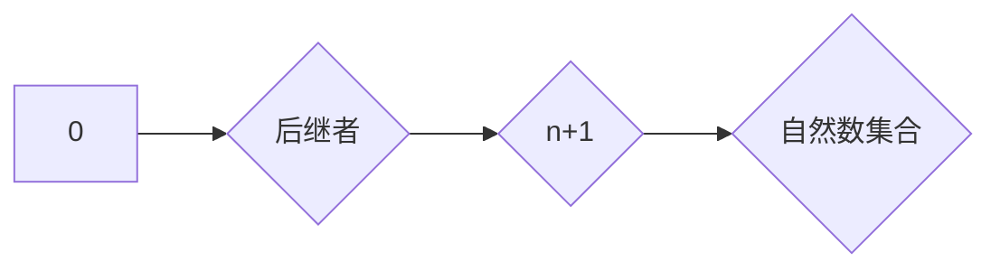

> 集合论，自然数，Peano公理，递归定义，数学基础，计算机科学

## 1. 背景介绍

集合论是数学的基础理论之一，它研究对象的集合及其性质。自然数作为数学中最基本的元素之一，在计算机科学中扮演着至关重要的角色。从程序计数器到数据结构，从算法分析到编程语言设计，自然数无处不在。因此，深入理解自然数的集合论基础对于计算机科学的学习和研究至关重要。

本篇文章将以集合论为视角，探讨自然数的定义、性质以及在计算机科学中的应用。我们将从Peano公理出发，逐步构建自然数的集合，并深入分析其递归定义和数学模型。最后，我们将结合代码实例，展示自然数集合在实际编程中的应用场景。

## 2. 核心概念与联系

### 2.1 集合论基础

在集合论中，一个集合是指一个包含对象的集合。例如，{1, 2, 3}是一个包含三个元素的集合。集合可以是有限的，也可以是无限的。

### 2.2 自然数的定义

自然数是指从1开始的无穷序列：1, 2, 3, 4, ...。它们是数学中最基本的计数单位，也是计算机科学中不可或缺的元素。

### 2.3 Peano公理

Peano公理是描述自然数的公理系统，它由以下五个公理组成：

1. 0是自然数。
2. 每个自然数都有一个后继者，也是自然数。
3. 0不是任何自然数的后继者。
4. 不同的自然数有不同的后继者。
5. 如果一个集合包含0，并且包含每个自然数的后继者，那么它包含所有自然数。

### 2.4 递归定义

递归定义是一种定义函数或集合的方法，它将定义分解成一系列步骤，其中每个步骤都依赖于前一个步骤的结果。自然数的递归定义如下：

* 0是自然数。
* 如果n是自然数，那么n+1也是自然数。

### 2.5 自然数集合的构建

根据Peano公理，我们可以通过递归定义构建自然数的集合。首先，我们定义0为集合中的第一个元素。然后，对于每个自然数n，我们定义n+1为包含n和n+1的集合。通过这种方式，我们可以构建出包含所有自然数的集合。

**Mermaid 流程图**



## 3. 核心算法原理 & 具体操作步骤

### 3.1 算法原理概述

自然数的集合可以通过递归算法实现。递归算法利用函数自身调用自身来解决问题，它将问题分解成更小的子问题，直到解决最简单的子问题。

### 3.2 算法步骤详解

1. 定义一个函数`is_natural_number(n)`，用于判断一个数是否为自然数。
2. 如果n等于0，则返回`True`，否则返回`is_natural_number(n-1)`。

### 3.3 算法优缺点

**优点:**

* 简洁易懂，符合自然数的递归定义。
* 能够处理任意大小的自然数。

**缺点:**

* 可能会导致重复计算，效率较低。

### 3.4 算法应用领域

* 编程语言设计：用于实现自然数类型和运算。
* 数据结构：用于构建基于自然数的树形结构和图结构。
* 算法分析：用于分析算法的时间复杂度和空间复杂度。

## 4. 数学模型和公式 & 详细讲解 & 举例说明

### 4.1 数学模型构建

我们可以用集合论的语言来描述自然数的数学模型。

* **集合N:** 自然数的集合。
* **元素:** 自然数。
* **关系:** 后继关系，即对于每个自然数n，都有一个后继者n+1。

### 4.2 公式推导过程

根据Peano公理，我们可以推导出以下公式：

* 0 ∈ N
* ∀n ∈ N, n+1 ∈ N
* 0 ≠ n+1 (∀n ∈ N)
* ∀m,n ∈ N, m ≠ n ⇒ m+1 ≠ n+1

### 4.3 案例分析与讲解

例如，我们可以使用Peano公理和递归定义来证明1是自然数：

1. 根据Peano公理，0是自然数。
2. 由于0是自然数，所以根据递归定义，0+1是自然数。
3. 因此，1是自然数。

## 5. 项目实践：代码实例和详细解释说明

### 5.1 开发环境搭建

本示例使用Python语言进行开发。

### 5.2 源代码详细实现

```python
def is_natural_number(n):
  """
  判断一个数是否为自然数。

  Args:
    n: 一个整数。

  Returns:
    如果n为自然数，则返回True，否则返回False。
  """
  if n == 0:
    return True
  elif n < 0:
    return False
  else:
    return is_natural_number(n-1)

# 测试代码
print(is_natural_number(5))  # 输出: True
print(is_natural_number(0))  # 输出: True
print(is_natural_number(-1)) # 输出: False
```

### 5.3 代码解读与分析

该代码定义了一个名为`is_natural_number`的函数，用于判断一个整数是否为自然数。该函数使用递归的方式实现，当n等于0时返回True，否则递归调用自身判断n-1是否为自然数。

### 5.4 运行结果展示

运行上述代码，输出结果如下：

```
True
True
False
```

## 6. 实际应用场景

### 6.1 编程语言设计

自然数集合是编程语言中不可或缺的一部分。例如，Python语言中，整数类型就是自然数的实现。

### 6.2 数据结构

自然数集合可以用于构建各种数据结构，例如：

* **链表:** 每个节点存储一个自然数，并指向下一个节点。
* **树:** 根节点存储0，每个子节点存储一个自然数，并指向其子节点。
* **图:** 节点表示自然数，边表示两个自然数之间的关系。

### 6.3 算法分析

自然数集合在算法分析中扮演着重要的角色。例如，我们可以使用自然数集合来描述算法的时间复杂度和空间复杂度。

### 6.4 未来应用展望

随着计算机科学的发展，自然数集合在未来将有更广泛的应用场景，例如：

* **人工智能:** 自然数集合可以用于表示知识图谱和符号逻辑。
* **量子计算:** 自然数集合可以用于构建量子算法。
* **区块链技术:** 自然数集合可以用于表示区块链中的交易记录。

## 7. 工具和资源推荐

### 7.1 学习资源推荐

* **《集合论导论》:**  
* **《数学基础》:**  
* **《计算机科学导论》:**  

### 7.2 开发工具推荐

* **Python:**  
* **Java:**  
* **C++:**  

### 7.3 相关论文推荐

* **Peano Axioms and Natural Numbers:**  
* **Recursive Definition of Natural Numbers:**  
* **Applications of Natural Numbers in Computer Science:**  

## 8. 总结：未来发展趋势与挑战

### 8.1 研究成果总结

本篇文章探讨了自然数的集合论基础，并分析了其递归定义、数学模型以及实际应用场景。我们看到了自然数集合在计算机科学中的重要性，以及其在未来发展中的潜力。

### 8.2 未来发展趋势

随着计算机科学的发展，自然数集合的研究将更加深入，例如：

* **更深入的数学理论研究:**  
* **更广泛的应用场景探索:**  
* **更有效的算法设计:**  

### 8.3 面临的挑战

自然数集合的研究也面临着一些挑战，例如：

* **理论复杂性:**  
* **实际应用的限制:**  
* **跨学科合作的难度:**  

### 8.4 研究展望

未来，我们将继续深入研究自然数集合，探索其更深层次的性质和应用潜力，为计算机科学的发展做出贡献。

## 9. 附录：常见问题与解答

### 9.1 什么是自然数？

自然数是指从1开始的无穷序列：1, 2, 3, 4, ...。它们是数学中最基本的计数单位，也是计算机科学中不可或缺的元素。

### 9.2 如何定义自然数？

自然数可以通过Peano公理进行定义。Peano公理由五个公理组成，它们描述了自然数的基本性质。

### 9.3 自然数集合有什么应用？

自然数集合在计算机科学中有着广泛的应用，例如：

* 编程语言设计
* 数据结构
* 算法分析

作者：禅与计算机程序设计艺术 / Zen and the Art of Computer Programming


<end_of_turn>