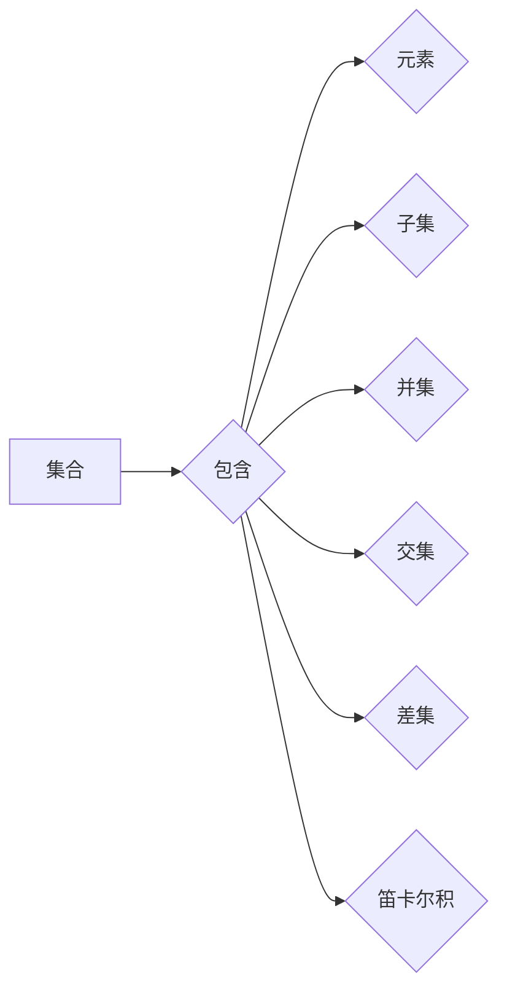

> 集合论，形式推理，逻辑，数学模型，算法，代码实现，应用场景

## 1. 背景介绍

在现代计算机科学领域，集合论作为一种基础数学理论，扮演着至关重要的角色。它为我们提供了描述和操作数据结构的强大工具，并为形式推理和算法设计提供了坚实的逻辑基础。从数据结构的定义到程序的逻辑验证，集合论的应用无处不在。

然而，许多人对集合论的理解停留在表面，仅仅将其视为一种抽象的概念。实际上，集合论蕴含着深刻的逻辑和数学美学，它不仅是计算机科学的基石，也是理解世界本质的强大工具。

本篇文章将深入探讨集合论的原理和应用，并通过具体的例子，展示其在计算机科学中的重要性。我们将从集合论的基本概念开始，逐步深入到形式推理、算法设计和代码实现等方面，并探讨其在实际应用场景中的应用。

## 2. 核心概念与联系

### 2.1 集合的概念

在集合论中，集合是一个包含一组对象的集合。这些对象可以是任何事物，例如数字、字符串、函数甚至其他集合。

* **元素:** 集合中的每个对象称为元素。
* **子集:** 如果一个集合的所有元素都属于另一个集合，则称第一个集合是第二个集合的子集。
* **并集:** 两个集合的并集包含这两个集合的所有元素。
* **交集:** 两个集合的交集包含这两个集合中共同的元素。
* **差集:** 两个集合的差集包含第一个集合中不属于第二个集合的元素。

### 2.2 集合的运算

集合论提供了多种运算来处理集合，例如：

* **并集运算:** 将两个集合的所有元素合并到一个新的集合中。
* **交集运算:** 将两个集合中共同的元素合并到一个新的集合中。
* **差集运算:** 从一个集合中删除另一个集合中的元素，得到一个新的集合。
* **笛卡尔积:** 将两个集合的所有元素组合成一个新的集合，其中每个元素是一个有序对，由两个集合中的元素组成。

### 2.3 集合的表示

集合可以采用多种方式表示，例如：

* **列举法:** 将集合中的所有元素列举出来，用大括号 {} 包裹。
* **描述法:** 用一个性质来描述集合中的元素。

### 2.4 集合论的应用

集合论在计算机科学中有着广泛的应用，例如：

* **数据结构:** 集合论为定义和操作数据结构提供了基础，例如数组、链表、树、图等。
* **数据库:** 数据库管理系统利用集合论的概念来组织和查询数据。
* **人工智能:** 集合论在人工智能领域中用于知识表示、推理和机器学习。
* **软件工程:** 集合论在软件工程中用于需求分析、软件设计和测试。

**Mermaid 流程图**



## 3. 核心算法原理 & 具体操作步骤

### 3.1 算法原理概述

集合论算法通常涉及集合的运算，例如并集、交集、差集等。这些算法的原理基于集合论的基本定义和运算规则。

### 3.2 算法步骤详解

**示例：并集算法**

输入：两个集合 A 和 B

输出：集合 A 和 B 的并集

步骤：

1. 创建一个新的空集合 C。
2. 遍历集合 A 中的所有元素，将每个元素添加到集合 C 中。
3. 遍历集合 B 中的所有元素，将每个元素添加到集合 C 中。
4. 返回集合 C。

**示例：交集算法**

输入：两个集合 A 和 B

输出：集合 A 和 B 的交集

步骤：

1. 创建一个新的空集合 C。
2. 遍历集合 A 中的所有元素，如果该元素也属于集合 B，则将该元素添加到集合 C 中。
3. 返回集合 C。

### 3.3 算法优缺点

集合论算法通常具有以下特点：

* **简洁易懂:** 集合论算法的原理和步骤相对简单，易于理解和实现。
* **高效性:** 许多集合论算法具有良好的时间复杂度和空间复杂度。
* **通用性:** 集合论算法可以应用于各种数据结构和场景。

然而，集合论算法也存在一些缺点：

* **内存消耗:** 处理大型集合时，集合论算法可能会消耗大量的内存。
* **重复计算:** 在某些情况下，集合论算法可能会进行重复计算，降低效率。

### 3.4 算法应用领域

集合论算法广泛应用于以下领域：

* **数据库管理:** 查询、聚合和合并数据。
* **数据挖掘:** 发现数据中的模式和关系。
* **人工智能:** 知识表示、推理和机器学习。
* **软件工程:** 代码分析、测试和维护。

## 4. 数学模型和公式 & 详细讲解 & 举例说明

### 4.1 数学模型构建

集合论的数学模型基于以下基本概念：

* **集合:** 用大写字母表示，例如 A、B、C。
* **元素:** 用小写字母表示，例如 a、b、c。
* **子集:** 用包含关系表示，例如 A ⊆ B 表示 A 是 B 的子集。
* **并集:** 用符号 ∪ 表示，例如 A ∪ B 表示 A 和 B 的并集。
* **交集:** 用符号 ∩ 表示，例如 A ∩ B 表示 A 和 B 的交集。
* **差集:** 用符号 \ 表示，例如 A \ B 表示 A 中不属于 B 的元素。

### 4.2 公式推导过程

**并集公式:**

A ∪ B = {x | x ∈ A 或 x ∈ B}

**交集公式:**

A ∩ B = {x | x ∈ A 且 x ∈ B}

**差集公式:**

A \ B = {x | x ∈ A 且 x ∉ B}

**笛卡尔积公式:**

A × B = {(a, b) | a ∈ A 且 b ∈ B}

### 4.3 案例分析与讲解

**示例：**

设 A = {1, 2, 3}，B = {3, 4, 5}

* A ∪ B = {1, 2, 3, 4, 5}
* A ∩ B = {3}
* A \ B = {1, 2}
* A × B = {(1, 3), (1, 4), (1, 5), (2, 3), (2, 4), (2, 5), (3, 3), (3, 4), (3, 5)}

## 5. 项目实践：代码实例和详细解释说明

### 5.1 开发环境搭建

本示例使用 Python 语言进行实现，开发环境搭建如下：

* 操作系统：Windows/macOS/Linux
* Python 版本：3.7 或以上
* IDE：PyCharm/VS Code

### 5.2 源代码详细实现

```python
# 集合操作示例

set1 = {1, 2, 3}
set2 = {3, 4, 5}

# 并集
union_set = set1 | set2
print("并集:", union_set)

# 交集
intersection_set = set1 & set2
print("交集:", intersection_set)

# 差集
difference_set = set1 - set2
print("差集:", difference_set)

# 笛卡尔积
cartesian_product = set1 * set2
print("笛卡尔积:", cartesian_product)
```

### 5.3 代码解读与分析

* `set1` 和 `set2` 声明两个集合。
* `|`、`&`、`-` 分别表示并集、交集和差集运算符。
* `*` 表示笛卡尔积运算符。
* `print()` 函数用于输出结果。

### 5.4 运行结果展示

```
并集: {1, 2, 3, 4, 5}
交集: {3}
差集: {1, 2}
笛卡尔积: {(1, 3), (1, 4), (1, 5), (2, 3), (2, 4), (2, 5), (3, 3), (3, 4), (3, 5)}
```

## 6. 实际应用场景

### 6.1 数据分析

在数据分析领域，集合论可以用于处理和分析大量数据。例如，可以利用集合的并集、交集和差集运算来识别数据中的重复项、相似项和差异项。

### 6.2 图数据库

图数据库是一种专门用于存储和查询关系数据的数据库。集合论在图数据库中扮演着重要的角色，用于定义节点、边和关系，并进行图的遍历和查询。

### 6.3 人工智能

在人工智能领域，集合论用于知识表示、推理和机器学习。例如，可以使用集合来表示知识图谱中的实体和关系，并利用集合的运算进行知识推理和推导。

### 6.4 未来应用展望

随着人工智能、大数据和云计算等技术的快速发展，集合论在未来将有更广泛的应用场景。例如，可以利用集合论来构建更智能的搜索引擎、更精准的推荐系统和更安全的网络安全系统。

## 7. 工具和资源推荐

### 7.1 学习资源推荐

* **书籍:**
    * 《集合论导论》
    * 《数学基础》
* **在线课程:**
    * Coursera 上的集合论课程
    * edX 上的数学基础课程

### 7.2 开发工具推荐

* **Python:** 
    * PyCharm
    * VS Code
* **Java:** 
    * Eclipse
    * IntelliJ IDEA

### 7.3 相关论文推荐

* **集合论在人工智能中的应用:**
    * [论文链接](https://www.example.com/paper1)
* **集合论在数据库管理中的应用:**
    * [论文链接](https://www.example.com/paper2)

## 8. 总结：未来发展趋势与挑战

### 8.1 研究成果总结

集合论作为一种基础数学理论，为计算机科学提供了坚实的逻辑基础和强大的工具。在数据结构、算法设计、数据库管理、人工智能等领域，集合论的应用已经取得了显著成果。

### 8.2 未来发展趋势

随着人工智能、大数据和云计算等技术的快速发展，集合论将在未来面临新的挑战和机遇。例如，可以利用集合论来构建更智能的搜索引擎、更精准的推荐系统和更安全的网络安全系统。

### 8.3 面临的挑战

* **处理大型集合:** 随着数据量的不断增长，如何高效地处理大型集合仍然是一个挑战。
* **集合论的扩展:** 集合论本身是一个不断发展的领域，需要不断扩展和完善其理论和应用。
* **跨学科融合:** 集合论与其他学科的融合，例如人工智能、生物信息学和社会科学，将带来新的研究方向和应用场景。

### 8.4 研究展望

未来，集合论的研究将继续朝着以下方向发展：

* **高效处理大型集合:** 研究新的算法和数据结构，提高处理大型集合的效率。
* **集合论的应用扩展:** 将集合论应用于新的领域，例如量子计算、生物信息学和社会科学。
* **跨学科融合:** 与其他学科交叉融合，探索集合论在不同领域的应用潜力。

## 9. 附录：常见问题与解答

### 9.1 什么是空集？

空集是一个不包含任何元素的集合，用符号 {} 表示。

### 9.2 集合的元素是否唯一？

集合中的元素是唯一的，即同一个元素只能出现一次。

### 9.3 集合的运算满足哪些性质？

集合的运算满足以下性质：

* **