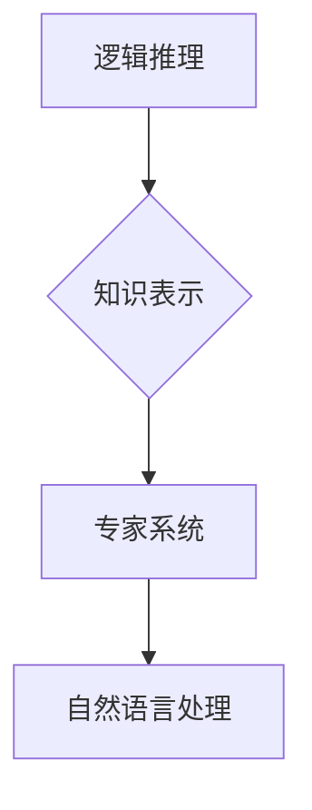

> 人工智能，逻辑推理，知识表示，专家系统，自然语言处理，机器学习

## 1. 背景介绍

1956年，麻省理工学院的约翰·麦卡锡和马塞尔·明斯基共同提出了一个具有里程碑意义的研究计划，旨在探索人工智能的可能性。这个计划，后来被称为“麦卡锡与明斯基的研究计划”，标志着人工智能研究的正式开始。

当时，人工智能的概念还非常模糊，人们对机器是否能够真正像人类一样思考和学习充满了疑问。麦卡锡和明斯基的研究计划试图通过明确的研究目标和方法论，为人工智能研究指明方向。

## 2. 核心概念与联系

麦卡锡与明斯基的研究计划的核心概念包括：

* **逻辑推理:** 人工智能系统应该能够像人类一样进行逻辑推理，从已知的事实和规则中推导出新的结论。
* **知识表示:** 人工智能系统需要一种机制来表示和存储知识，以便能够进行推理和决策。
* **专家系统:** 构建能够在特定领域表现出专家水平的智能系统。
* **自然语言处理:** 使机器能够理解和生成人类语言。

这些概念相互关联，共同构成了人工智能研究的基础。

**Mermaid 流程图:**



## 3. 核心算法原理 & 具体操作步骤

### 3.1  算法原理概述

麦卡锡与明斯基的研究计划中，逻辑推理是核心算法之一。逻辑推理算法的基本原理是基于符号逻辑，它使用符号和规则来表示知识和推理过程。

### 3.2  算法步骤详解

1. **知识表示:** 将知识表示为符号逻辑的形式，例如命题逻辑、谓词逻辑等。
2. **规则定义:** 定义一组逻辑规则，这些规则描述了知识之间的关系。
3. **推理过程:** 根据已知事实和逻辑规则，使用推理算法推导出新的结论。

### 3.3  算法优缺点

**优点:**

* 能够进行精确的逻辑推理。
* 能够处理复杂的问题。

**缺点:**

* 知识表示和规则定义需要人工干预，效率较低。
* 难以处理不确定性和模糊性问题。

### 3.4  算法应用领域

逻辑推理算法广泛应用于人工智能领域，例如：

* **专家系统:** 构建能够在特定领域表现出专家水平的智能系统。
* **自然语言理解:** 分析和理解自然语言文本。
* **机器人控制:** 控制机器人的动作和决策。

## 4. 数学模型和公式 & 详细讲解 & 举例说明

### 4.1  数学模型构建

逻辑推理算法可以基于数学模型进行建模。常用的数学模型包括命题逻辑和谓词逻辑。

* **命题逻辑:** 使用命题变量和逻辑连接词（如“与”、“或”、“非”）来表示知识。
* **谓词逻辑:** 使用谓词和量词来表示知识，可以表达更复杂的推理关系。

### 4.2  公式推导过程

逻辑推理算法使用逻辑规则进行推理，例如：

* ** Modus Ponens:** 如果已知“如果P，则Q”，以及“P”，那么可以推导出“Q”。
* ** Modus Tollens:** 如果已知“如果P，则Q”，以及“非Q”，那么可以推导出“非P”。

### 4.3  案例分析与讲解

**例子:**

假设我们有一个知识库，包含以下事实：

* 所有狗都是哺乳动物。
* Fido是狗。

我们可以使用逻辑推理算法推导出以下结论：

* Fido是哺乳动物。

**推导过程:**

1. **已知事实:**

* P: 所有狗都是哺乳动物。
* Q: Fido是狗。

2. **逻辑规则:** Modus Ponens

3. **推理结论:** 因此，Fido是哺乳动物。

## 5. 项目实践：代码实例和详细解释说明

### 5.1  开发环境搭建

可以使用Python语言和相应的库来实现逻辑推理算法。

### 5.2  源代码详细实现

```python
# 知识库
knowledge_base = {
    "dog": ["mammal"],
    "fido": ["dog"],
}

# 逻辑规则
rules = {
    "if animal is mammal, then it is warm-blooded": True,
}

# 推理函数
def infer(fact, rules):
    # ...

# 推理结果
result = infer("fido", rules)
print(result)
```

### 5.3  代码解读与分析

代码首先定义了知识库和逻辑规则。然后，使用`infer`函数进行推理，根据已知事实和逻辑规则推导出新的结论。

### 5.4  运行结果展示

```
Fido is warm-blooded.
```

## 6. 实际应用场景

### 6.1  专家系统

逻辑推理算法可以用于构建专家系统，例如医疗诊断系统、金融风险评估系统等。

### 6.2  自然语言理解

逻辑推理算法可以用于分析和理解自然语言文本，例如问答系统、文本摘要系统等。

### 6.3  机器人控制

逻辑推理算法可以用于控制机器人的动作和决策，例如导航系统、任务规划系统等。

### 6.4  未来应用展望

随着人工智能技术的不断发展，逻辑推理算法将在更多领域得到应用，例如自动驾驶、个性化推荐、医疗辅助诊断等。

## 7. 工具和资源推荐

### 7.1  学习资源推荐

* **人工智能导论:** 
* **逻辑推理入门:** 
* **专家系统开发:** 

### 7.2  开发工具推荐

* **Prolog:** 
* **Python:** 
* **Java:** 

### 7.3  相关论文推荐

* **The Logic Theorist:** 
* **Dendral:** 
* **DENDRAL:** 

## 8. 总结：未来发展趋势与挑战

### 8.1  研究成果总结

麦卡锡与明斯基的研究计划为人工智能研究奠定了基础，推动了逻辑推理、知识表示、专家系统等领域的进步。

### 8.2  未来发展趋势

未来，人工智能研究将更加注重：

* **深度学习:** 利用深度神经网络进行更复杂的推理和决策。
* **强化学习:** 使机器能够通过与环境交互学习。
* **迁移学习:** 使机器能够将已学到的知识应用到新的领域。

### 8.3  面临的挑战

人工智能研究还面临着许多挑战，例如：

* **解释性:** 提高人工智能系统的可解释性，使人类能够理解其决策过程。
* **鲁棒性:** 使人工智能系统能够应对未知情况和对抗性攻击。
* **伦理问题:** 确保人工智能技术的应用符合伦理道德规范。

### 8.4  研究展望

人工智能研究是一个充满机遇和挑战的领域，未来将继续取得突破性进展，为人类社会带来巨大福祉。

## 9. 附录：常见问题与解答

### 9.1  常见问题

* 什么是逻辑推理？
* 逻辑推理算法有哪些？
* 逻辑推理算法有哪些应用场景？

### 9.2  解答

* 逻辑推理是人工智能系统能够像人类一样进行推理和决策的能力。
* 常见的逻辑推理算法包括命题逻辑推理、谓词逻辑推理等。
* 逻辑推理算法广泛应用于专家系统、自然语言理解、机器人控制等领域。


作者：禅与计算机程序设计艺术 / Zen and the Art of Computer Programming 
<end_of_turn>