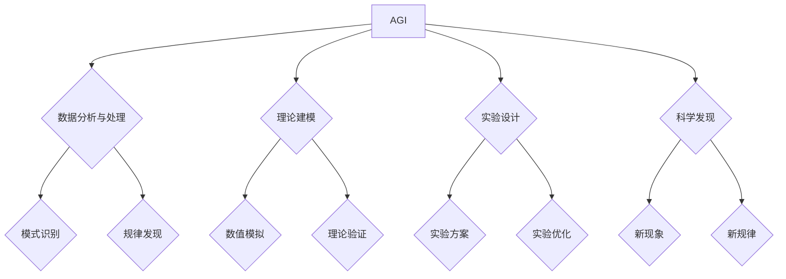

> AGI，通用人工智能，物理学，机器学习，深度学习，模拟，预测，科学发现

## 1. 背景介绍

物理学作为人类探索自然规律的基石，一直以来都依赖于人类的直觉、经验和逻辑推理。然而，随着科学知识的不断积累和复杂性增加，传统的物理学研究方法逐渐面临瓶颈。

近年来，人工智能（AI）技术取得了飞速发展，特别是通用人工智能（AGI）的出现，为物理学研究带来了新的机遇。AGI是指能够像人类一样学习、思考和解决问题的智能系统，它拥有强大的学习能力、推理能力和解决问题的能力，能够处理海量数据并从中发现隐藏的规律。

## 2. 核心概念与联系

**2.1 AGI与物理学的融合**

AGI的强大能力可以应用于物理学研究的各个环节，例如：

* **数据分析与处理:** AGI可以快速处理海量物理实验数据，发现隐藏的模式和规律，并进行数据可视化和分析。
* **理论建模:** AGI可以辅助物理学家构建复杂的理论模型，并进行数值模拟和预测，加速物理理论的验证和发展。
* **实验设计:** AGI可以根据物理学问题和现有知识，设计更有效、更精准的实验方案，提高实验效率和准确性。
* **科学发现:** AGI可以帮助物理学家发现新的物理现象和规律，推动物理学研究的突破性进展。

**2.2 核心概念原理和架构**



## 3. 核心算法原理 & 具体操作步骤

**3.1 算法原理概述**

AGI在物理学中的应用主要依赖于以下核心算法：

* **机器学习:** 训练模型从数据中学习规律，例如预测粒子运动轨迹、识别物质结构等。
* **深度学习:** 使用多层神经网络，学习更复杂的物理规律，例如模拟量子场论、预测宇宙演化等。
* **强化学习:** 通过试错学习，优化物理实验方案，提高实验效率和准确性。

**3.2 算法步骤详解**

以机器学习为例，其在物理学中的应用步骤如下：

1. **数据收集:** 收集大量物理实验数据，例如粒子碰撞数据、天文观测数据等。
2. **数据预处理:** 对数据进行清洗、转换和特征提取，使其适合机器学习模型训练。
3. **模型选择:** 选择合适的机器学习模型，例如线性回归、支持向量机、决策树等。
4. **模型训练:** 使用训练数据训练机器学习模型，使其能够学习数据中的规律。
5. **模型评估:** 使用测试数据评估模型的性能，例如预测精度、召回率等。
6. **模型部署:** 将训练好的模型部署到实际应用场景中，例如预测粒子运动轨迹、识别物质结构等。

**3.3 算法优缺点**

* **优点:** 能够处理海量数据，发现隐藏的规律，提高研究效率。
* **缺点:** 需要大量数据进行训练，模型解释性较差，容易受到数据偏差的影响。

**3.4 算法应用领域**

* **粒子物理学:** 预测粒子运动轨迹、识别新粒子类型。
* **天体物理学:** 模拟星系演化、预测黑洞行为。
* **凝聚态物理学:** 研究材料性质、预测材料性能。

## 4. 数学模型和公式 & 详细讲解 & 举例说明

**4.1 数学模型构建**

在物理学中，数学模型是描述物理现象和规律的工具。AGI可以辅助物理学家构建复杂的数学模型，例如：

* **量子力学模型:** 描述微观粒子的运动和相互作用。
* **相对论模型:** 描述高速运动物体和强引力场下的物理现象。
* **宇宙学模型:** 描述宇宙的起源、演化和结构。

**4.2 公式推导过程**

AGI可以利用数学推理能力，推导物理学公式，例如：

* **牛顿第二定律:** F = ma，描述力、质量和加速度之间的关系。
* **爱因斯坦质能等价公式:** E = mc^2，描述能量和质量之间的关系。
* **薛定谔方程:** 描述量子系统的演化规律。

**4.3 案例分析与讲解**

例如，在粒子物理学中，AGI可以利用机器学习算法，从粒子碰撞实验数据中学习粒子相互作用的规律，并推导新的物理模型，从而预测新的粒子类型或发现新的物理现象。

## 5. 项目实践：代码实例和详细解释说明

**5.1 开发环境搭建**

* 操作系统: Ubuntu 20.04 LTS
* 编程语言: Python 3.8
* 库依赖: TensorFlow, PyTorch, NumPy, Scikit-learn

**5.2 源代码详细实现**

```python
import tensorflow as tf

# 定义神经网络模型
model = tf.keras.models.Sequential([
    tf.keras.layers.Dense(128, activation='relu', input_shape=(10,)),
    tf.keras.layers.Dense(64, activation='relu'),
    tf.keras.layers.Dense(1)
])

# 编译模型
model.compile(optimizer='adam', loss='mse')

# 训练模型
model.fit(X_train, y_train, epochs=10)

# 评估模型
loss = model.evaluate(X_test, y_test)
print('Loss:', loss)
```

**5.3 代码解读与分析**

这段代码定义了一个简单的深度学习模型，用于预测粒子运动轨迹。

* `tf.keras.models.Sequential` 创建一个顺序模型，将神经网络层按顺序连接。
* `tf.keras.layers.Dense` 定义全连接层，每个神经元都连接到上一层的每个神经元。
* `activation='relu'` 使用ReLU激活函数，引入非线性，提高模型表达能力。
* `optimizer='adam'` 使用Adam优化器，更新模型参数。
* `loss='mse'` 使用均方误差作为损失函数，衡量模型预测结果与真实值的差异。
* `model.fit()` 训练模型，使用训练数据更新模型参数。
* `model.evaluate()` 评估模型，使用测试数据计算损失值。

**5.4 运行结果展示**

训练完成后，模型可以用于预测新的粒子运动轨迹。

## 6. 实际应用场景

**6.1 粒子物理学**

* 预测粒子运动轨迹，识别新粒子类型。
* 模拟粒子碰撞实验，验证物理理论。

**6.2 天体物理学**

* 模拟星系演化，预测黑洞行为。
* 分析天文观测数据，发现新的天体现象。

**6.3 凝聚态物理学**

* 研究材料性质，预测材料性能。
* 设计新型材料，实现新功能。

**6.4 未来应用展望**

* 更精确的物理模拟，预测更复杂的物理现象。
* 自动化科学发现，加速物理学研究进展。
* 人机协作，提升物理学研究效率和创新能力。

## 7. 工具和资源推荐

**7.1 学习资源推荐**

* **书籍:**
    * 《深度学习》
    * 《机器学习》
    * 《人工智能：一种现代方法》
* **在线课程:**
    * Coursera: 深度学习
    * edX: 机器学习
    * Udacity: 人工智能工程师

**7.2 开发工具推荐**

* **Python:** 广泛应用于人工智能领域，拥有丰富的库和工具。
* **TensorFlow:** 开源深度学习框架，支持多种硬件平台。
* **PyTorch:** 开源深度学习框架，灵活易用，适合研究和开发。

**7.3 相关论文推荐**

* AlphaFold: Solving the protein folding problem with deep learning
* Generative Adversarial Networks
* Attention Is All You Need

## 8. 总结：未来发展趋势与挑战

**8.1 研究成果总结**

AGI在物理学中的应用取得了初步成果，例如在粒子物理学、天体物理学和凝聚态物理学等领域取得了突破性进展。

**8.2 未来发展趋势**

* 更强大的AGI模型，能够处理更复杂的数据和问题。
* 更有效的算法和方法，提高AGI在物理学中的应用效率。
* 人机协作，将AGI与物理学家的经验和直觉相结合，推动物理学研究的创新发展。

**8.3 面临的挑战**

* 数据获取和处理的挑战，需要收集和处理海量物理数据。
* 模型解释性和可信度的挑战，需要提高AGI模型的透明度和可解释性。
* 伦理和社会影响的挑战，需要关注AGI在物理学中的应用带来的伦理和社会影响。

**8.4 研究展望**

未来，AGI将继续推动物理学研究的进步，帮助人类更深入地理解宇宙的奥秘。


## 9. 附录：常见问题与解答

**9.1 AGI是否会取代物理学家？**

AGI可以辅助物理学家进行研究，但不会取代物理学家。物理学家需要具备创造力、批判性思维和解决问题的能力，这些能力是AGI目前无法替代的。

**9.2 AGI的应用是否会带来伦理风险？**

AGI的应用确实可能带来伦理风险，例如数据隐私、算法偏见等。因此，需要制定相应的伦理规范和监管机制，确保AGI的应用安全、可控和可持续。


作者：禅与计算机程序设计艺术 / Zen and the Art of Computer Programming 
<end_of_turn>