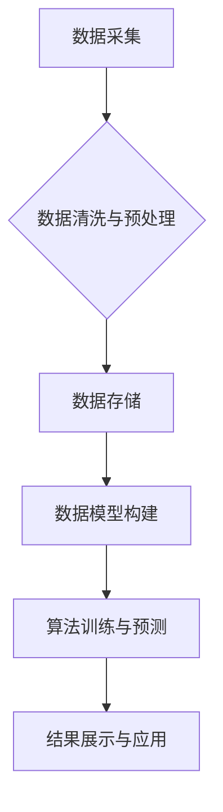

> AI DMP, 数据模型, 算法, 数据基建, 数据驱动, 机器学习, 深度学习, 预测分析

## 1. 背景介绍

在当今数据爆炸的时代，数据已成为企业最重要的资产。企业需要从海量数据中挖掘价值，以做出更明智的决策、提升运营效率和创造新的商业机会。数据管理平台 (DMP) 作为数据驱动的核心引擎，扮演着至关重要的角色。

传统的 DMP 主要侧重于用户数据收集、存储和分析，但随着人工智能 (AI) 技术的快速发展，DMP 也开始向智能化方向演进。AI DMP 融合了 AI 算法和数据分析能力，能够自动学习用户行为模式，进行精准的用户画像、个性化推荐和预测分析，为企业提供更深入的数据洞察和决策支持。

## 2. 核心概念与联系

**2.1 AI DMP 的核心概念**

* **数据模型:** AI DMP 基于用户行为、兴趣、偏好等数据构建数据模型，用于刻画用户画像和行为模式。
* **算法:** AI DMP 采用机器学习、深度学习等算法，对数据进行分析和预测，例如用户行为预测、兴趣推荐、客户价值评估等。
* **数据基建:** AI DMP 需要强大的数据存储、处理和分析能力，包括数据仓库、数据湖、计算集群等基础设施。

**2.2 AI DMP 的架构**



**2.3 核心概念联系**

数据模型是 AI DMP 的基础，算法基于数据模型进行训练和预测，数据基建为算法和数据模型提供支撑。

## 3. 核心算法原理 & 具体操作步骤

**3.1 算法原理概述**

AI DMP 中常用的算法包括：

* **协同过滤:** 基于用户或物品之间的相似性进行推荐。
* **内容过滤:** 基于用户兴趣和物品内容的匹配度进行推荐。
* **深度学习:** 使用神经网络模型学习用户行为模式，进行更精准的预测和推荐。

**3.2 算法步骤详解**

以协同过滤算法为例，其步骤如下：

1. **数据收集:** 收集用户对物品的评分或行为数据。
2. **数据预处理:** 处理缺失值、异常值等问题。
3. **相似度计算:** 计算用户或物品之间的相似度，例如余弦相似度。
4. **推荐生成:** 根据用户相似度或物品相似度，推荐用户可能感兴趣的物品。

**3.3 算法优缺点**

* **协同过滤:** 优点: 可以发现隐性关系，推荐效果较好。缺点: 数据稀疏性问题，冷启动问题。
* **内容过滤:** 优点: 不依赖用户行为数据，可以推荐新物品。缺点: 推荐结果可能过于单一。
* **深度学习:** 优点: 可以学习更复杂的模式，推荐效果更精准。缺点: 需要大量数据训练，计算资源消耗大。

**3.4 算法应用领域**

AI DMP 算法广泛应用于：

* **个性化推荐:** 推荐商品、内容、服务等。
* **用户画像:** 建立用户画像，了解用户兴趣、行为等特征。
* **预测分析:** 预测用户行为、市场趋势等。

## 4. 数学模型和公式 & 详细讲解 & 举例说明

**4.1 数学模型构建**

协同过滤算法可以构建用户-物品评分矩阵，其中每个元素表示用户对物品的评分。

**4.2 公式推导过程**

余弦相似度公式：

$$
\text{相似度} = \frac{\mathbf{u} \cdot \mathbf{v}}{\|\mathbf{u}\| \|\mathbf{v}\|},
$$

其中：

* $\mathbf{u}$ 和 $\mathbf{v}$ 是两个用户的评分向量。
* $\cdot$ 表示向量点积。
* $\|\mathbf{u}\|$ 和 $\|\mathbf{v}\|$ 表示向量的模长。

**4.3 案例分析与讲解**

假设有两个用户 A 和 B，他们的评分向量分别为：

* $\mathbf{u}_A = [1, 2, 3, 4]$
* $\mathbf{u}_B = [2, 3, 4, 5]$

则它们的余弦相似度为：

$$
\text{相似度} = \frac{(1 \times 2) + (2 \times 3) + (3 \times 4) + (4 \times 5)}{\sqrt{1^2 + 2^2 + 3^2 + 4^2} \sqrt{2^2 + 3^2 + 4^2 + 5^2}} = \frac{30}{\sqrt{30} \sqrt{54}} = \frac{30}{3\sqrt{180}} = \frac{10}{\sqrt{180}}
$$

## 5. 项目实践：代码实例和详细解释说明

**5.1 开发环境搭建**

* Python 3.x
* TensorFlow 或 PyTorch
* Jupyter Notebook

**5.2 源代码详细实现**

```python
import numpy as np
from sklearn.metrics.pairwise import cosine_similarity

# 用户-物品评分矩阵
ratings = np.array([
    [1, 2, 3, 4],
    [2, 3, 4, 5],
    [3, 4, 5, 1],
    [4, 5, 1, 2],
])

# 计算用户之间的余弦相似度
similarity = cosine_similarity(ratings)

# 打印相似度矩阵
print(similarity)
```

**5.3 代码解读与分析**

* 使用 NumPy 构建用户-物品评分矩阵。
* 使用 scikit-learn 库的 `cosine_similarity` 函数计算用户之间的余弦相似度。
* 打印相似度矩阵，其中每个元素表示两个用户之间的相似度。

**5.4 运行结果展示**

运行代码后，会输出一个相似度矩阵，例如：

```
[[1.         0.8660254  0.70710678 0.57735027]
 [0.8660254  1.         0.8660254  0.70710678]
 [0.70710678 0.8660254  1.         0.8660254 ]
 [0.57735027 0.70710678 0.8660254  1.        ]]
```

## 6. 实际应用场景

**6.1 个性化推荐**

AI DMP 可以根据用户的历史行为、兴趣偏好等数据，推荐个性化的商品、内容、服务等。例如，电商平台可以根据用户的购买记录和浏览历史，推荐他们可能感兴趣的商品。

**6.2 用户画像**

AI DMP 可以构建用户画像，了解用户的兴趣、行为、价值等特征。例如，金融机构可以利用用户画像，进行精准的客户分层和营销策略制定。

**6.3 预测分析**

AI DMP 可以预测用户的行为、市场趋势等。例如，游戏公司可以利用 AI DMP 预测用户的游戏行为，进行游戏设计和运营优化。

**6.4 未来应用展望**

随着 AI 技术的不断发展，AI DMP 将在更多领域得到应用，例如：

* **医疗健康:** 预测疾病风险、个性化医疗方案。
* **教育:** 个性化学习推荐、学生行为分析。
* **智能家居:** 智能家居设备的个性化配置和控制。

## 7. 工具和资源推荐

**7.1 学习资源推荐**

* **书籍:**
    * 《深度学习》
    * 《机器学习实战》
* **在线课程:**
    * Coursera: 深度学习
    * Udacity: 机器学习工程师

**7.2 开发工具推荐**

* **Python:** 
* **TensorFlow:** 深度学习框架
* **PyTorch:** 深度学习框架
* **scikit-learn:** 机器学习库

**7.3 相关论文推荐**

* **协同过滤算法:**
    * "Collaborative Filtering: A User-Based Approach"
    * "Memory-Based Collaborative Filtering"
* **深度学习推荐系统:**
    * "Deep Learning for Recommender Systems"
    * "Neural Collaborative Filtering"

## 8. 总结：未来发展趋势与挑战

**8.1 研究成果总结**

AI DMP 已经取得了显著的成果，在个性化推荐、用户画像、预测分析等领域发挥着重要作用。

**8.2 未来发展趋势**

* **模型更加智能化:** 利用更先进的 AI 算法，构建更智能的模型，例如强化学习、迁移学习等。
* **数据更加丰富化:** 收集更多类型的用户数据，例如传感器数据、社交数据等，构建更全面的用户画像。
* **应用更加广泛化:** AI DMP 将应用于更多领域，例如医疗健康、教育、智能家居等。

**8.3 面临的挑战**

* **数据隐私保护:** 如何保护用户数据隐私，是 AI DMP 发展面临的重要挑战。
* **算法可解释性:** 如何提高 AI 算法的可解释性，让用户理解算法是如何做出决策的，也是一个重要的研究方向。
* **模型可维护性:** 如何保证 AI 模型的稳定性和可维护性，也是一个需要解决的问题。

**8.4 研究展望**

未来，AI DMP 将继续朝着更智能化、更个性化、更安全的方向发展，为企业和用户提供更优质的服务和体验。

## 9. 附录：常见问题与解答

**9.1 如何解决数据稀疏性问题？**

数据稀疏性问题是协同过滤算法面临的常见挑战。可以采用以下方法解决：

* **混合推荐算法:** 将协同过滤算法与内容过滤算法相结合。
* **矩阵分解:** 使用矩阵分解技术，将用户-物品评分矩阵分解成低维矩阵，降低数据稀疏性。
* **基于知识图谱的推荐:** 利用知识图谱中的语义信息，弥补数据稀疏性。

**9.2 如何解决冷启动问题？**

冷启动问题是指新用户或新物品难以获得推荐结果的问题。可以采用以下方法解决：

* **基于内容的推荐:** 利用新用户的基本信息或新物品的特征进行推荐。
* **基于社会关系的推荐:** 利用用户的社交关系进行推荐。
* **人工标注:** 对新用户或新物品进行人工标注，提供初始的推荐结果。


作者：禅与计算机程序设计艺术 / Zen and the Art of Computer Programming 
<end_of_turn>