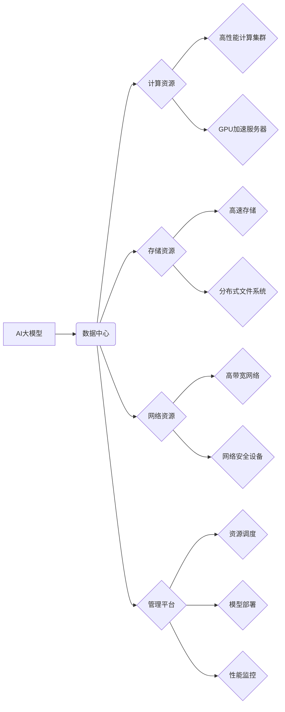

> AI大模型、应用数据中心、市场营销、数据驱动、个性化推荐、智能客服、内容创作、模型训练、数据安全

## 1. 背景介绍

近年来，人工智能（AI）技术取得了飞速发展，特别是大模型的涌现，为各行各业带来了前所未有的机遇。大模型，是指参数规模庞大、训练数据海量的人工智能模型，具备强大的泛化能力和学习能力，能够在自然语言处理、计算机视觉、语音识别等领域取得突破性进展。

然而，大模型的应用并非一蹴而就，需要强大的计算资源、海量数据和专业的技术团队进行支撑。因此，专门用于部署和管理大模型的“AI 应用数据中心”应运而生。

AI 应用数据中心是指专门为大模型应用提供计算、存储、网络等基础设施和服务，并提供模型训练、部署、管理等一站式解决方案的平台。它为企业和开发者提供了一个高效、安全、可扩展的平台，帮助他们快速构建和部署基于大模型的应用。

## 2. 核心概念与联系

**2.1 AI 应用数据中心架构**

AI 应用数据中心通常由以下几个核心组件组成：

* **计算资源:** 包括高性能计算集群、GPU加速服务器等，用于大模型的训练和推理。
* **存储资源:** 包括高速存储、分布式文件系统等，用于存储海量训练数据和模型参数。
* **网络资源:** 包括高带宽网络、网络安全设备等，用于保证数据传输的快速、安全和可靠。
* **管理平台:** 用于监控、管理和优化整个数据中心的运行状态，包括资源调度、模型部署、性能监控等功能。

**2.2 核心概念关系图**



## 3. 核心算法原理 & 具体操作步骤

**3.1 算法原理概述**

AI 应用数据中心的核心算法主要包括：

* **深度学习算法:** 用于训练大模型，例如卷积神经网络（CNN）、循环神经网络（RNN）、Transformer等。
* **模型优化算法:** 用于优化模型参数，例如梯度下降、Adam优化器等。
* **数据处理算法:** 用于处理和预处理训练数据，例如文本清洗、图像增强等。

**3.2 算法步骤详解**

1. **数据收集和预处理:** 收集相关数据，并进行清洗、格式化、特征提取等预处理操作。
2. **模型选择和训练:** 选择合适的深度学习模型，并使用训练数据进行模型训练，优化模型参数。
3. **模型评估和调优:** 使用测试数据评估模型性能，并根据评估结果进行模型调优，例如调整模型结构、学习率等参数。
4. **模型部署和推理:** 将训练好的模型部署到应用数据中心，并使用模型进行数据推理，例如图像识别、文本分类等。

**3.3 算法优缺点**

* **优点:** 能够处理海量数据，学习复杂模式，具有强大的泛化能力。
* **缺点:** 训练成本高，需要大量计算资源和时间，模型解释性较差。

**3.4 算法应用领域**

* **自然语言处理:** 文本分类、情感分析、机器翻译、对话系统等。
* **计算机视觉:** 图像识别、物体检测、图像分割等。
* **语音识别:** 语音转文本、语音合成等。
* **推荐系统:** 商品推荐、内容推荐等。

## 4. 数学模型和公式 & 详细讲解 & 举例说明

**4.1 数学模型构建**

深度学习模型通常使用神经网络结构，其中每个神经元都接收来自其他神经元的输入，并通过激活函数进行处理，输出到下一层神经元。

**4.2 公式推导过程**

神经网络的训练过程是通过反向传播算法来进行的。反向传播算法的核心思想是通过计算误差，并根据误差反向更新神经网络的参数，使得模型的预测结果与真实值之间的误差最小化。

**损失函数:** 用于衡量模型预测结果与真实值的差异，常见的损失函数包括均方误差（MSE）、交叉熵损失（Cross-Entropy Loss）等。

**梯度下降:** 用于更新模型参数，通过计算损失函数对参数的梯度，并沿着梯度方向更新参数，使得损失函数值不断减小。

**4.3 案例分析与讲解**

例如，在图像分类任务中，可以使用卷积神经网络（CNN）作为模型，损失函数可以使用交叉熵损失，梯度下降算法可以使用Adam优化器。

## 5. 项目实践：代码实例和详细解释说明

**5.1 开发环境搭建**

* 操作系统: Ubuntu 20.04
* 编程语言: Python 3.8
* 深度学习框架: TensorFlow 2.0

**5.2 源代码详细实现**

```python
import tensorflow as tf

# 定义模型结构
model = tf.keras.models.Sequential([
    tf.keras.layers.Conv2D(32, (3, 3), activation='relu', input_shape=(28, 28, 1)),
    tf.keras.layers.MaxPooling2D((2, 2)),
    tf.keras.layers.Conv2D(64, (3, 3), activation='relu'),
    tf.keras.layers.MaxPooling2D((2, 2)),
    tf.keras.layers.Flatten(),
    tf.keras.layers.Dense(10, activation='softmax')
])

# 定义损失函数和优化器
model.compile(loss='sparse_categorical_crossentropy',
              optimizer='adam',
              metrics=['accuracy'])

# 加载训练数据
(x_train, y_train), (x_test, y_test) = tf.keras.datasets.mnist.load_data()

# 训练模型
model.fit(x_train, y_train, epochs=5)

# 评估模型
loss, accuracy = model.evaluate(x_test, y_test)
print('Test loss:', loss)
print('Test accuracy:', accuracy)
```

**5.3 代码解读与分析**

这段代码定义了一个简单的卷积神经网络模型，用于手写数字识别任务。

* `tf.keras.models.Sequential` 用于构建一个顺序模型，即层级结构。
* `tf.keras.layers.Conv2D` 用于定义卷积层，用于提取图像特征。
* `tf.keras.layers.MaxPooling2D` 用于定义最大池化层，用于降低特征图尺寸。
* `tf.keras.layers.Flatten` 用于将多维特征图转换为一维向量。
* `tf.keras.layers.Dense` 用于定义全连接层，用于分类。
* `model.compile` 用于配置模型的损失函数、优化器和评价指标。
* `model.fit` 用于训练模型。
* `model.evaluate` 用于评估模型性能。

**5.4 运行结果展示**

训练完成后，模型能够准确识别手写数字。

## 6. 实际应用场景

**6.1 个性化推荐**

AI 应用数据中心可以用于构建个性化推荐系统，根据用户的历史行为、偏好等信息，推荐个性化的商品、内容等。

**6.2 智能客服**

AI 应用数据中心可以用于构建智能客服系统，通过自然语言处理技术，自动回复用户咨询，提高客户服务效率。

**6.3 内容创作**

AI 应用数据中心可以用于辅助内容创作，例如生成新闻稿、撰写广告文案等。

**6.4 未来应用展望**

随着AI技术的不断发展，AI 应用数据中心将在更多领域得到应用，例如医疗诊断、金融风险控制、智能制造等。

## 7. 工具和资源推荐

**7.1 学习资源推荐**

* TensorFlow 官方文档: https://www.tensorflow.org/
* PyTorch 官方文档: https://pytorch.org/
* 深度学习课程: https://www.coursera.org/learn/machine-learning

**7.2 开发工具推荐**

* Jupyter Notebook: https://jupyter.org/
* Google Colab: https://colab.research.google.com/

**7.3 相关论文推荐**

* Attention Is All You Need: https://arxiv.org/abs/1706.03762
* BERT: https://arxiv.org/abs/1810.04805

## 8. 总结：未来发展趋势与挑战

**8.1 研究成果总结**

AI 应用数据中心技术取得了显著进展，为大模型的应用提供了强大的支撑。

**8.2 未来发展趋势**

* **模型规模和性能的提升:** 未来，大模型的规模和性能将继续提升，带来更强大的应用能力。
* **边缘计算的融合:** AI 应用数据中心将与边缘计算相结合，实现更灵活、更低延迟的应用部署。
* **数据安全和隐私保护:** 数据安全和隐私保护将成为AI 应用数据中心发展的重要方向。

**8.3 面临的挑战**

* **计算资源成本:** 大模型的训练和部署需要大量的计算资源，成本较高。
* **数据获取和标注:** 大模型的训练需要海量数据，数据获取和标注成本较高。
* **模型解释性和可信度:** 大模型的决策过程往往难以解释，模型的解释性和可信度需要进一步提升。

**8.4 研究展望**

未来，AI 应用数据中心技术将继续发展，为各行各业带来更多创新应用。


## 9. 附录：常见问题与解答

**9.1 如何选择合适的AI应用数据中心平台？**

选择合适的AI应用数据中心平台需要考虑以下因素：

* 计算资源: 平台提供的计算资源是否满足您的需求？
* 存储资源: 平台提供的存储资源是否足够大，是否支持您的数据格式？
* 网络资源: 平台提供的网络带宽是否足够高，是否支持您的网络协议？
* 管理平台: 平台的管理平台是否易于使用，是否提供您需要的功能？
* 价格: 平台的收费模式是否合理？

**9.2 如何部署我的模型到AI应用数据中心？**

部署模型到AI应用数据中心通常需要以下步骤：

1. 将模型转换为平台支持的格式。
2. 将模型文件上传到平台。
3. 配置模型的输入输出参数。
4. 部署模型到平台的服务器。
5. 测试模型的运行效果。

**9.3 如何保证数据安全？**

AI应用数据中心通常提供多种数据安全措施，例如：

* 数据加密: 数据在传输和存储过程中进行加密。
* 身份验证和授权: 控制用户对数据的访问权限。
* 访问日志记录: 记录用户对数据的访问操作。
* 安全审计: 定期对系统进行安全审计。


作者：禅与计算机程序设计艺术 / Zen and the Art of Computer Programming 
<end_of_turn>