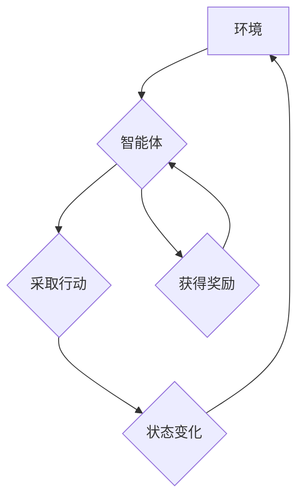

> AI, 人工智能, Agent, Q-learning, 决策优化, 强化学习, 算法原理, 代码实现, 应用场景

## 1. 背景介绍

在当今数据爆炸和智能化浪潮席卷的时代，人工智能（AI）正以惊人的速度发展，并深刻地改变着我们生活的方方面面。其中，强化学习（Reinforcement Learning，RL）作为一种重要的机器学习范式，在解决复杂决策问题方面展现出强大的潜力。

强化学习的核心思想是通过智能体（Agent）与环境的交互，学习最优的策略，以最大化累积的奖励。智能体在环境中采取行动，环境会根据行动产生相应的奖励或惩罚，智能体通过不断学习和调整策略，最终找到最优的行动方案，以获得最大的长期奖励。

Q-learning 作为强化学习中经典的算法之一，在解决各种决策优化问题方面取得了显著的成果。它通过构建一个 Q-表，存储每个状态下采取不同行动的期望回报，并通过迭代更新 Q-表，逐步逼近最优策略。

## 2. 核心概念与联系

**2.1 核心概念**

* **智能体（Agent）：** 决策者和执行者，与环境交互，采取行动以获得奖励。
* **环境（Environment）：** 智能体所处的外部世界，会根据智能体的行动产生相应的状态变化和奖励。
* **状态（State）：** 环境的当前描述，例如游戏中的棋盘状态、机器人的位置等。
* **行动（Action）：** 智能体可以采取的可选动作，例如在游戏中移动棋子、机器人改变方向等。
* **奖励（Reward）：** 环境对智能体行动的反馈，可以是正向奖励或负向惩罚。
* **策略（Policy）：** 智能体在不同状态下采取行动的规则，可以是确定性策略或随机策略。
* **价值函数（Value Function）：** 评估状态或状态-行动对的期望回报，例如 Q-值表示从某个状态采取某个行动后获得的期望回报。

**2.2  Q-learning 架构**



## 3. 核心算法原理 & 具体操作步骤

### 3.1  算法原理概述

Q-learning 是一种基于价值函数的强化学习算法，其目标是学习一个 Q-表，其中 Q(s, a) 表示在状态 s 下采取行动 a 的期望回报。

Q-learning 算法通过迭代更新 Q-表，逐步逼近最优策略。更新规则如下：

```
Q(s, a) = Q(s, a) + α [r + γ max Q(s', a') - Q(s, a)]
```

其中：

* Q(s, a) 是状态 s 下采取行动 a 的当前 Q 值。
* α 是学习率，控制着学习速度。
* r 是从状态 s 到状态 s' 后获得的奖励。
* γ 是折扣因子，控制着未来奖励的权重。
* max Q(s', a') 是从状态 s' 到所有可能的下一个状态 s'' 的最大 Q 值。

### 3.2  算法步骤详解

1. 初始化 Q-表，将所有 Q 值设置为 0。
2. 在环境中与智能体交互，观察环境状态和获得奖励。
3. 根据当前状态和策略选择一个行动。
4. 执行行动，观察环境状态变化和获得奖励。
5. 更新 Q 值：使用 Q-learning 更新规则更新 Q(s, a)。
6. 重复步骤 2-5，直到 Q 值收敛或达到预设的迭代次数。

### 3.3  算法优缺点

**优点：**

* 能够学习最优策略，即使环境是动态变化的。
* 适用于离散状态和行动空间的场景。
* 算法原理简单易懂，易于实现。

**缺点：**

* 对于连续状态和行动空间的场景，需要进行离散化处理，可能会损失部分信息。
* 学习过程可能需要大量的样本数据和时间。
* 容易陷入局部最优解。

### 3.4  算法应用领域

Q-learning 算法在许多领域都有广泛的应用，例如：

* **游戏 AI：** 训练游戏 AI 策略，例如 AlphaGo、AlphaZero 等。
* **机器人控制：** 训练机器人自主导航、抓取等行为。
* **推荐系统：** 预测用户对商品的兴趣，提供个性化推荐。
* **金融交易：** 优化投资策略，提高投资收益。

## 4. 数学模型和公式 & 详细讲解 & 举例说明

### 4.1  数学模型构建

Q-learning 的核心数学模型是 Q-表，它是一个状态-行动对映射的表格，每个单元格存储了在该状态下采取该行动的期望回报。

假设状态空间为 S，行动空间为 A，则 Q-表可以表示为一个二维数组 Q(s, a)，其中 s ∈ S，a ∈ A。

### 4.2  公式推导过程

Q-learning 的更新规则如下：

```
Q(s, a) = Q(s, a) + α [r + γ max Q(s', a') - Q(s, a)]
```

其中：

* Q(s, a) 是状态 s 下采取行动 a 的当前 Q 值。
* α 是学习率，控制着学习速度。
* r 是从状态 s 到状态 s' 后获得的奖励。
* γ 是折扣因子，控制着未来奖励的权重。
* max Q(s', a') 是从状态 s' 到所有可能的下一个状态 s'' 的最大 Q 值。

该公式表示 Q 值的更新是基于当前 Q 值、奖励、折扣因子和未来最大 Q 值的加权平均。

### 4.3  案例分析与讲解

假设我们有一个简单的环境，智能体可以采取两种行动：向上或向下移动。每个状态对应一个位置，奖励为到达目标位置时获得的 100 点奖励，其他情况下奖励为 0。

如果智能体在某个状态下采取向上行动，获得的奖励为 0，并且下一个状态的 Q 值最大为 100，则 Q 值更新公式为：

```
Q(s, up) = Q(s, up) + α [0 + γ * 100 - Q(s, up)]
```

其中 α 和 γ 为预设参数。

## 5. 项目实践：代码实例和详细解释说明

### 5.1  开发环境搭建

* Python 3.x
* TensorFlow 或 PyTorch 等深度学习框架
* NumPy、Pandas 等数据处理库

### 5.2  源代码详细实现

```python
import numpy as np

# 定义环境
class Environment:
    def __init__(self):
        self.state = 0
        self.goal_state = 10

    def step(self, action):
        if action == 0:  # 向上移动
            self.state = max(0, self.state - 1)
        elif action == 1:  # 向下移动
            self.state = min(self.goal_state, self.state + 1)
        reward = 0
        if self.state == self.goal_state:
            reward = 100
        return self.state, reward

# 定义 Q-learning 算法
class QLearningAgent:
    def __init__(self, env, alpha=0.1, gamma=0.9, epsilon=0.1):
        self.env = env
        self.alpha = alpha
        self.gamma = gamma
        self.epsilon = epsilon
        self.q_table = np.zeros((env.goal_state + 1, 2))

    def choose_action(self, state):
        if np.random.uniform(0, 1) < self.epsilon:
            return np.random.choice(2)
        else:
            return np.argmax(self.q_table[state, :])

    def learn(self, state, action, reward, next_state):
        self.q_table[state, action] = (1 - self.alpha) * self.q_table[state, action] + self.alpha * (reward + self.gamma * np.max(self.q_table[next_state, :]))

# 训练 Q-learning 算法
env = Environment()
agent = QLearningAgent(env)
for episode in range(1000):
    state = env.state
    while state != env.goal_state:
        action = agent.choose_action(state)
        next_state, reward = env.step(action)
        agent.learn(state, action, reward, next_state)
        state = next_state

# 测试 Q-learning 算法
state = env.state
while state != env.goal_state:
    action = agent.choose_action(state)
    next_state, reward = env.step(action)
    state = next_state
```

### 5.3  代码解读与分析

* **环境类 (Environment):** 定义了环境的规则，包括状态空间、行动空间、奖励函数等。
* **Q-learning 算法类 (QLearningAgent):** 实现 Q-learning 算法的核心逻辑，包括 Q-表初始化、动作选择、学习更新等。
* **训练过程:** 通过循环迭代，智能体与环境交互，不断更新 Q-表，最终学习到最优策略。
* **测试过程:** 使用训练好的 Q-表，模拟智能体在环境中的行为，观察其决策结果。

### 5.4  运行结果展示

运行代码后，可以观察到智能体在环境中逐渐学习，并最终能够到达目标位置。

## 6. 实际应用场景

### 6.1  游戏 AI

Q-learning 算法广泛应用于游戏 AI 的开发，例如 AlphaGo、AlphaZero 等。这些 AI 系统通过学习大量的游戏数据，训练出强大的策略，能够战胜人类顶尖选手。

### 6.2  机器人控制

Q-learning 算法可以用于训练机器人自主导航、抓取等行为。通过与环境交互，机器人可以学习最优的行动策略，完成复杂的任务。

### 6.3  推荐系统

Q-learning 算法可以用于个性化推荐系统，例如推荐电影、商品等。通过学习用户的历史行为数据，推荐系统可以预测用户的兴趣，并提供更精准的推荐。

### 6.4  未来应用展望

随着人工智能技术的不断发展，Q-learning 算法将在更多领域得到应用，例如自动驾驶、医疗诊断、金融交易等。

## 7. 工具和资源推荐

### 7.1  学习资源推荐

* **书籍:**
    * Reinforcement Learning: An Introduction by Richard S. Sutton and Andrew G. Barto
    * Deep Reinforcement Learning Hands-On by Maxim Lapan
* **在线课程:**
    * Coursera: Reinforcement Learning Specialization
    * Udacity: Deep Reinforcement Learning Nanodegree

### 7.2  开发工具推荐

* **Python:** 作为机器学习和深度学习的常用语言，Python 提供了丰富的库和框架，例如 TensorFlow、PyTorch、OpenAI Gym 等。
* **TensorFlow/PyTorch:** 深度学习框架，用于构建和训练强化学习模型。
* **OpenAI Gym:** 强化学习环境库，提供各种标准的强化学习环境。

### 7.3  相关论文推荐

* **Q-Learning Algorithm** by Watkins, C. J. C. H. (1989)
* **Deep Q-Network** by Mnih, V., Kavukcuoglu, K., Silver, D., Rusu, A. A., Veness, J., Bellemare, M. G., ... & Hassabis, D. (2015)

## 8. 总结：未来发展趋势与挑战

### 8.