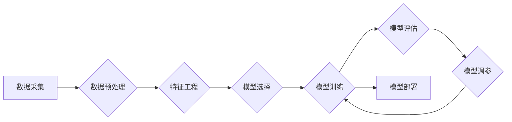

> 机器学习，算法原理，代码实例，机器学习流程，深度学习，监督学习，无监督学习，强化学习

## 1. 背景介绍

人工智能（AI）作为科技发展的重要方向，近年来取得了显著进展。其中，机器学习作为AI的核心技术之一，在图像识别、自然语言处理、推荐系统等领域展现出强大的应用潜力。

机器学习的核心思想是通过算法学习数据中的模式和规律，从而实现对新数据的预测和分类。它无需人工编程，而是通过数据驱动的方式进行学习，具有强大的适应性和泛化能力。

本篇文章将深入讲解机器学习的基本原理、核心算法以及代码实例，帮助读者理解机器学习的运作机制，并掌握基本的机器学习开发技能。

## 2. 核心概念与联系

机器学习可以分为监督学习、无监督学习和强化学习三大类。

**2.1 监督学习**

监督学习是指在训练数据中，每个样本都带有对应的标签，算法的目标是学习出能够将新的样本映射到正确标签的函数。

**2.2 无监督学习**

无监督学习是指在训练数据中，每个样本没有对应的标签，算法的目标是发现数据中的潜在结构和模式。

**2.3 强化学习**

强化学习是指通过与环境交互，学习最优策略以获得最大奖励的算法。

**2.4 机器学习流程**

## 3. 核心算法原理 & 具体操作步骤

### 3.1  算法原理概述

本节将介绍机器学习中常用的算法，包括线性回归、逻辑回归、决策树、支持向量机和k近邻算法。

**3.1.1 线性回归**

线性回归是一种用于预测连续数值的监督学习算法。它假设数据之间存在线性关系，并通过最小化预测值与真实值的误差来学习模型参数。

**3.1.2 逻辑回归**

逻辑回归是一种用于预测分类结果的监督学习算法。它将线性回归的结果映射到0到1之间的概率值，并根据阈值将其分类为不同的类别。

**3.1.3 决策树**

决策树是一种树形结构的分类算法，它通过一系列的决策规则将数据分类到不同的类别。

**3.1.4 支持向量机**

支持向量机是一种用于分类和回归的监督学习算法。它通过寻找数据中最大间隔的超平面来进行分类。

**3.1.5 k近邻算法**

k近邻算法是一种非参数的分类算法，它根据训练数据中与新样本距离最近的k个样本进行分类。

### 3.2  算法步骤详解

每个算法都有其特定的步骤，以下将详细介绍上述算法的步骤：

**3.2.1 线性回归步骤**

1. 数据预处理：对数据进行清洗、转换和特征工程。
2. 模型选择：选择线性回归模型。
3. 模型训练：使用训练数据训练模型，学习模型参数。
4. 模型评估：使用测试数据评估模型性能。
5. 模型调参：根据评估结果调整模型参数，提高模型性能。

**3.2.2 逻辑回归步骤**

1. 数据预处理：对数据进行清洗、转换和特征工程。
2. 模型选择：选择逻辑回归模型。
3. 模型训练：使用训练数据训练模型，学习模型参数。
4. 模型评估：使用测试数据评估模型性能。
5. 模型调参：根据评估结果调整模型参数，提高模型性能。

**3.2.3 决策树步骤**

1. 数据预处理：对数据进行清洗、转换和特征工程。
2. 模型选择：选择决策树模型。
3. 模型训练：使用训练数据训练决策树，构建决策规则。
4. 模型评估：使用测试数据评估模型性能。
5. 模型剪枝：根据评估结果剪枝决策树，避免过拟合。

**3.2.4 支持向量机步骤**

1. 数据预处理：对数据进行清洗、转换和特征工程。
2. 模型选择：选择支持向量机模型。
3. 模型训练：使用训练数据训练支持向量机，寻找最大间隔的超平面。
4. 模型评估：使用测试数据评估模型性能。
5. 模型调参：根据评估结果调整模型参数，提高模型性能。

**3.2.5 k近邻算法步骤**

1. 数据预处理：对数据进行清洗、转换和特征工程。
2. 模型选择：选择k近邻算法模型。
3. 模型训练：将训练数据存储到内存中。
4. 模型预测：对于新的样本，计算其与训练数据中所有样本的距离，选择距离最近的k个样本进行分类。
5. 模型评估：使用测试数据评估模型性能。

### 3.3  算法优缺点

每个算法都有其自身的优缺点，需要根据实际应用场景选择合适的算法。

**3.3.1 线性回归**

优点：易于理解和实现，计算速度快。
缺点：假设数据之间存在线性关系，对非线性关系的处理能力较弱。

**3.3.2 逻辑回归**

优点：易于理解和实现，计算速度快，适用于二分类问题。
缺点：对多分类问题处理能力较弱。

**3.3.3 决策树**

优点：易于理解和解释，可以处理非线性关系，对缺失值处理能力较强。
缺点：容易过拟合，对数据噪声敏感。

**3.3.4 支持向量机**

优点：对高维数据处理能力强，可以处理非线性关系，泛化能力较强。
缺点：训练时间较长，参数选择较复杂。

**3.3.5 k近邻算法**

优点：易于理解和实现，无需训练模型。
缺点：计算速度慢，对数据规模敏感，k值选择较困难。

### 3.4  算法应用领域

机器学习算法广泛应用于各个领域，例如：

* **图像识别:** 人脸识别、物体检测、图像分类
* **自然语言处理:** 文本分类、情感分析、机器翻译
* **推荐系统:** 商品推荐、用户画像
* **医疗诊断:** 疾病预测、影像分析
* **金融风险控制:** 欺诈检测、信用评分

## 4. 数学模型和公式 & 详细讲解 & 举例说明

### 4.1  数学模型构建

机器学习算法通常基于数学模型进行构建，这些模型通过参数学习来拟合数据中的模式。

### 4.2  公式推导过程

每个算法都有其特定的公式推导过程，例如线性回归的损失函数为均方误差，逻辑回归的损失函数为交叉熵。

### 4.3  案例分析与讲解

通过具体的案例分析，可以更深入地理解算法的原理和应用。

## 5. 项目实践：代码实例和详细解释说明

### 5.1  开发环境搭建

使用Python语言和相关的机器学习库，例如scikit-learn，TensorFlow或PyTorch，搭建开发环境。

### 5.2  源代码详细实现

提供具体的代码实例，展示如何使用机器学习算法进行数据分析和预测。

### 5.3  代码解读与分析

对代码进行详细解读，解释每个代码块的功能和作用。

### 5.4  运行结果展示

展示代码运行的结果，例如预测结果、模型评估指标等。

## 6. 实际应用场景

### 6.1  案例分析

介绍机器学习在实际应用场景中的案例，例如电商推荐系统、医疗诊断系统等。

### 6.2  应用展望

展望机器学习在未来发展趋势，例如在自动驾驶、机器人等领域的应用。

## 7. 工具和资源推荐

### 7.1  学习资源推荐

推荐一些机器学习相关的书籍、课程和在线资源。

### 7.2  开发工具推荐

推荐一些机器学习开发工具，例如Jupyter Notebook、TensorBoard等。

### 7.3  相关论文推荐

推荐一些机器学习领域的经典论文。

## 8. 总结：未来发展趋势与挑战

### 8.1  研究成果总结

总结机器学习领域取得的重大研究成果。

### 8.2  未来发展趋势

展望机器学习的未来发展趋势，例如深度学习、迁移学习等。

### 8.3  面临的挑战

分析机器学习领域面临的挑战，例如数据隐私、算法可解释性等。

### 8.4  研究展望

展望机器学习未来的研究方向。

## 9. 附录：常见问题与解答

解答一些机器学习领域常见的疑问。

作者：禅与计算机程序设计艺术 / Zen and the Art of Computer Programming

<end_of_turn>