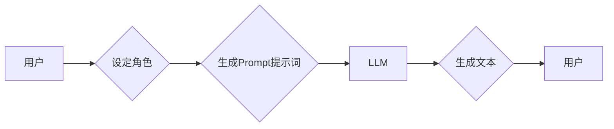

> AI大模型,Prompt提示词,角色扮演,文本生成,对话系统,自然语言处理,最佳实践

## 1. 背景介绍

近年来，大规模语言模型（LLM）的快速发展，如GPT-3、LaMDA、BERT等，为自然语言处理（NLP）领域带来了革命性的变革。这些模型能够理解和生成人类语言，在文本生成、机器翻译、问答系统等领域展现出令人惊叹的性能。然而，LLM的性能很大程度上取决于输入的Prompt提示词。

Prompt提示词是与LLM交互的关键，它引导模型生成特定类型的输出。一个精心设计的Prompt提示词可以显著提升模型的准确性、流畅性和创造力。反之，一个模糊不清或引导性不足的Prompt提示词可能会导致模型生成错误、不相关或缺乏逻辑的输出。

## 2. 核心概念与联系

### 2.1  Prompt提示词

Prompt提示词是指用户向LLM输入的一段文本，它包含了模型需要完成的任务、所需的输入信息以及期望的输出格式。

### 2.2  角色扮演

角色扮演是一种常见的Prompt提示词设计技巧，它通过赋予模型一个特定的角色，引导模型以该角色的视角和语气进行文本生成。

### 2.3  核心概念联系

角色扮演Prompt提示词将LLM与角色扮演的思想结合起来，通过设定角色，可以更有效地引导模型生成符合特定场景和语境的文本。

**Mermaid 流程图**



## 3. 核心算法原理 & 具体操作步骤

### 3.1  算法原理概述

角色扮演Prompt提示词的设计并不依赖于特定的算法，而是基于对语言模型行为的理解和对角色扮演的运用。

### 3.2  算法步骤详解

1. **确定角色:** 首先需要确定模型需要扮演的角色，角色可以是真实人物、虚构角色、动物、物品等，角色的性格、背景、能力等信息都会影响模型的文本生成。
2. **构建角色背景:** 为角色构建一个完整的背景故事，包括其性格特点、经历、目标、价值观等，这些信息将帮助模型更好地理解角色的立场和行为模式。
3. **设计Prompt提示词:** 根据角色的背景和任务需求，设计一个包含角色信息和任务指令的Prompt提示词。Prompt提示词可以包含角色的姓名、身份、性格特点、任务目标等信息。
4. **输入Prompt提示词:** 将设计好的Prompt提示词输入到LLM中，并观察模型生成的文本。
5. **调整Prompt提示词:** 根据模型生成的文本效果，对Prompt提示词进行调整，例如添加更多角色信息、修改任务指令、改变角色的语气等。

### 3.3  算法优缺点

**优点:**

* 可以引导模型生成更符合特定场景和语境的文本。
* 可以增强文本的个性化和创造力。
* 可以提高模型的文本生成质量和流畅度。

**缺点:**

* 需要花费更多时间和精力设计角色和Prompt提示词。
* 角色扮演的成功与否取决于角色设计的质量和Prompt提示词的精准度。

### 3.4  算法应用领域

* 文本创作：小说、剧本、诗歌等。
* 对话系统：聊天机器人、虚拟助手等。
* 游戏开发：NPC对话、剧情设计等。
* 教育培训：角色扮演教学、模拟场景训练等。

## 4. 数学模型和公式 & 详细讲解 & 举例说明

角色扮演Prompt提示词的设计并不依赖于特定的数学模型和公式，而是基于对语言模型行为的理解和对角色扮演的运用。

## 5. 项目实践：代码实例和详细解释说明

### 5.1  开发环境搭建

* Python 3.7+
* Transformers 库
* PyTorch 库

### 5.2  源代码详细实现

```python
from transformers import GPT2LMHeadModel, GPT2Tokenizer

# 加载预训练模型和词典
model_name = "gpt2"
tokenizer = GPT2Tokenizer.from_pretrained(model_name)
model = GPT2LMHeadModel.from_pretrained(model_name)

# 定义角色和Prompt提示词
role = "一位经验丰富的侦探"
prompt = f"你是{role}，正在调查一起神秘的案件。案件发生在一家古老的图书馆，一位学者在深夜被发现死亡。请你根据以下线索，分析案件的经过。"

# 生成文本
input_ids = tokenizer.encode(prompt, return_tensors="pt")
output = model.generate(input_ids, max_length=200, num_beams=5)

# 解码文本
generated_text = tokenizer.decode(output[0], skip_special_tokens=True)
print(generated_text)
```

### 5.3  代码解读与分析

* 代码首先加载预训练的GPT-2模型和词典。
* 然后定义了侦探角色和包含角色信息和任务指令的Prompt提示词。
* 使用模型的`generate`方法生成文本，并设置了最大长度和beam搜索参数。
* 最后解码生成的文本并打印输出。

### 5.4  运行结果展示

运行代码后，模型会根据Prompt提示词和角色信息，生成一段符合侦探角色的文本，例如：

> "我仔细观察了图书馆的场景，发现地上散落着一些书籍碎片，以及一柄锋利的匕首。死者是一位著名的历史学家，他最近在研究一卷古老的卷轴，卷轴上记载着一些神秘的咒语。我怀疑这起案件与卷轴有关，或许有人想要窃取卷轴中的秘密。"

## 6. 实际应用场景

### 6.1  聊天机器人

角色扮演Prompt提示词可以赋予聊天机器人不同的个性和风格，例如一位幽默的机器人、一位严肃的咨询师、一位充满童趣的伙伴等。

### 6.2  游戏开发

在游戏中，角色扮演Prompt提示词可以用于生成NPC的对话，让NPC的行为更加生动和自然，提升玩家的游戏体验。

### 6.3  教育培训

角色扮演Prompt提示词可以用于模拟真实场景，例如模拟商业谈判、模拟 courtroom debate等，帮助学生更好地理解和掌握相关知识和技能。

### 6.4  未来应用展望

随着LLM技术的不断发展，角色扮演Prompt提示词将在更多领域得到应用，例如：

* 个性化教育：根据学生的学习风格和兴趣，定制个性化的学习内容和互动体验。
* 创意写作辅助：帮助作家克服创作瓶颈，生成新的故事创意和人物设定。
* 艺术创作：与艺术家合作，生成新的艺术作品，例如诗歌、音乐、绘画等。

## 7. 工具和资源推荐

### 7.1  学习资源推荐

* **论文:**

    * "Prompt Engineering for Large Language Models"
    * "The Illustrated Transformer"

* **博客:**

    * OpenAI Blog
    * Hugging Face Blog

### 7.2  开发工具推荐

* **Transformers 库:** https://huggingface.co/docs/transformers/index
* **PyTorch 库:** https://pytorch.org/

### 7.3  相关论文推荐

* "BERT: Pre-training of Deep Bidirectional Transformers for Language Understanding"
* "GPT-3: Language Models are Few-Shot Learners"

## 8. 总结：未来发展趋势与挑战

### 8.1  研究成果总结

角色扮演Prompt提示词是一种有效的LLM应用技巧，可以提升模型的文本生成质量和创造力。

### 8.2  未来发展趋势

* 更智能的角色扮演Prompt提示词设计，能够根据不同的场景和任务自动生成合适的Prompt提示词。
* 更强大的LLM模型，能够更好地理解和响应角色扮演Prompt提示词。
* 更广泛的应用场景，角色扮演Prompt提示词将应用于更多领域，例如教育、医疗、娱乐等。

### 8.3  面临的挑战

* 如何设计更复杂、更具深度的人物角色，使其行为更加真实和自然。
* 如何避免模型生成带有偏见或歧视性的文本。
* 如何确保角色扮演Prompt提示词的安全性，防止被用于恶意目的。

### 8.4  研究展望

未来研究将集中在以下几个方面：

* 开发更智能、更灵活的角色扮演Prompt提示词设计方法。
* 研究如何训练更强大的LLM模型，使其能够更好地理解和响应角色扮演Prompt提示词。
* 探索角色扮演Prompt提示词在更多领域应用的可能性。

## 9. 附录：常见问题与解答

### 9.1  如何设计一个好的角色扮演Prompt提示词？

* 确定角色的背景、性格、能力等信息。
* 明确角色的任务目标和期望输出。
* 使用生动形象的语言描述角色和场景。
* 提供足够的上下文信息，帮助模型理解角色的立场和行为模式。

### 9.2  如何评估角色扮演Prompt提示词的效果？

* 观察模型生成的文本是否符合角色的性格和行为模式。
* 评估文本的流畅度、逻辑性和创造力。
* 收集用户反馈，了解用户对角色扮演效果的评价。


作者：禅与计算机程序设计艺术 / Zen and the Art of Computer Programming 
<end_of_turn>