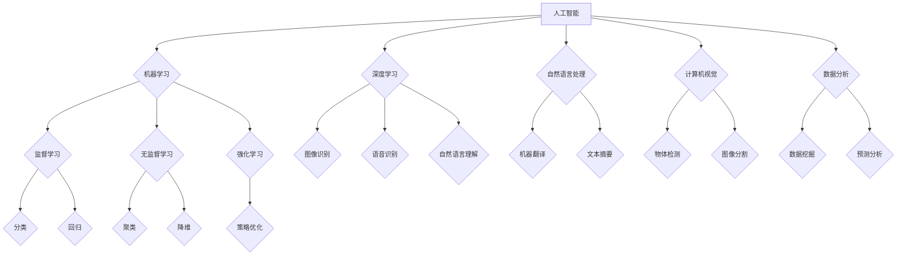

> 人工智能，机器学习，深度学习，自然语言处理，计算机视觉，数据分析，应用场景

## 1. 背景介绍

人工智能（AI）作为一门跨学科领域，近年来发展迅速，并开始深刻地改变着我们的生活。从智能手机的语音助手到自动驾驶汽车，AI技术正在各个领域展现出强大的应用潜力。

随着计算能力的提升和算法的不断进步，AI技术已经从理论研究走向实际应用，并取得了令人瞩目的成就。例如，在医疗领域，AI可以辅助医生诊断疾病、预测患者风险，提高医疗效率和准确性；在金融领域，AI可以用于欺诈检测、风险管理、个性化金融服务等，提升金融安全性和服务水平；在制造业，AI可以实现智能生产、预测性维护，提高生产效率和降低成本。

## 2. 核心概念与联系

**2.1  人工智能（AI）**

人工智能是指模拟人类智能行为的计算机系统。它涵盖了多个子领域，例如机器学习、深度学习、自然语言处理、计算机视觉等。

**2.2  机器学习（ML）**

机器学习是人工智能的一个重要分支，它通过算法训练模型，使模型能够从数据中学习并做出预测或决策。机器学习算法可以分为监督学习、无监督学习和强化学习三大类。

**2.3  深度学习（DL）**

深度学习是机器学习的一个子领域，它使用多层神经网络来模拟人类大脑的学习过程。深度学习算法能够处理复杂的数据，并取得了在图像识别、语音识别、自然语言处理等领域突破性的进展。

**2.4  自然语言处理（NLP）**

自然语言处理是指使计算机能够理解、处理和生成人类语言的技术。NLP应用广泛，例如机器翻译、文本摘要、情感分析等。

**2.5  计算机视觉（CV）**

计算机视觉是指使计算机能够“看”和理解图像的技术。计算机视觉应用广泛，例如图像识别、物体检测、图像分割等。

**2.6  数据分析**

数据分析是指从数据中提取有价值信息的技术。AI技术可以帮助人们更有效地分析数据，发现隐藏的模式和趋势。

**2.7  应用场景**

AI技术在各个领域都有广泛的应用场景，例如：

* **医疗保健:** 疾病诊断、药物研发、个性化医疗
* **金融服务:** 欺诈检测、风险管理、个性化金融服务
* **制造业:** 智能生产、预测性维护、质量控制
* **零售业:** 个性化推荐、库存管理、客户服务
* **交通运输:** 自动驾驶、交通管理、物流优化

**Mermaid 流程图**



## 3. 核心算法原理 & 具体操作步骤

### 3.1  算法原理概述

**3.1.1  监督学习**

监督学习是一种机器学习算法，它通过训练数据中的输入和输出对模型进行训练。训练数据包含了输入特征和对应的输出标签。模型的目标是学习一个映射关系，将输入特征映射到相应的输出标签。

**3.1.2  无监督学习**

无监督学习是一种机器学习算法，它通过未标记的数据进行训练。模型的目标是发现数据中的隐藏模式和结构。

**3.1.3  强化学习**

强化学习是一种机器学习算法，它通过奖励和惩罚机制来训练模型。模型的目标是学习一个策略，在环境中采取最优行动以获得最大的奖励。

### 3.2  算法步骤详解

**3.2.1  监督学习算法步骤**

1.  **数据收集和预处理:** 收集训练数据，并对数据进行清洗、转换和特征工程等预处理操作。
2.  **模型选择:** 选择合适的监督学习算法，例如线性回归、逻辑回归、决策树、支持向量机等。
3.  **模型训练:** 使用训练数据对模型进行训练，调整模型参数以最小化训练误差。
4.  **模型评估:** 使用测试数据评估模型的性能，例如准确率、召回率、F1-score等。
5.  **模型部署:** 将训练好的模型部署到实际应用场景中。

**3.2.2  无监督学习算法步骤**

1.  **数据收集和预处理:** 收集未标记的数据，并对数据进行清洗、转换等预处理操作。
2.  **模型选择:** 选择合适的无监督学习算法，例如k-means聚类、主成分分析等。
3.  **模型训练:** 使用未标记数据对模型进行训练，发现数据中的隐藏模式和结构。
4.  **结果分析:** 分析模型训练的结果，例如聚类结果、降维后的特征等。

**3.2.3  强化学习算法步骤**

1.  **环境定义:** 定义强化学习环境，包括状态空间、动作空间、奖励函数等。
2.  **代理设计:** 设计强化学习代理，它会与环境交互并采取行动。
3.  **策略学习:** 使用强化学习算法，例如Q-learning、SARSA等，训练代理学习最优策略。
4.  **策略评估:** 使用测试环境评估代理的性能，例如奖励总和、成功率等。

### 3.3  算法优缺点

**3.3.1  监督学习算法**

*   **优点:** 准确率高，能够处理各种类型的任务。
*   **缺点:** 需要大量的标记数据，对数据质量要求高。

**3.3.2  无监督学习算法**

*   **优点:** 不需要标记数据，能够发现数据中的隐藏模式。
*   **缺点:** 准确率相对较低，结果解释性较差。

**3.3.3  强化学习算法**

*   **优点:** 可以学习复杂的任务，能够适应动态环境。
*   **缺点:** 训练时间长，需要大量的试错过程。

### 3.4  算法应用领域

**3.4.1  监督学习算法**

*   **图像识别:** 分类、检测、分割
*   **语音识别:** 语音转文本
*   **自然语言处理:** 机器翻译、文本摘要、情感分析
*   **金融预测:** 股票价格预测、信用风险评估

**3.4.2  无监督学习算法**

*   **客户画像:** 发现客户群体的特征
*   **异常检测:** 识别异常数据点
*   **数据聚类:** 将数据分组
*   **降维:** 减少数据维度

**3.4.3  强化学习算法**

*   **游戏AI:** 训练游戏代理
*   **机器人控制:** 控制机器人运动
*   **自动驾驶:** 训练自动驾驶系统
*   **资源管理:** 优化资源分配

## 4. 数学模型和公式 & 详细讲解 & 举例说明

### 4.1  数学模型构建

**4.1.1  线性回归模型**

线性回归模型假设数据之间存在线性关系，可以使用一条直线来拟合数据。模型的数学表达式为：

$$y = w_0 + w_1x$$

其中：

*   $y$ 是预测值
*   $x$ 是输入特征
*   $w_0$ 是截距
*   $w_1$ 是权重

**4.1.2  逻辑回归模型**

逻辑回归模型用于二分类问题，它将线性回归模型的输出映射到0到1之间的概率值。模型的数学表达式为：

$$p(y=1|x) = \frac{1}{1 + e^{-(w_0 + w_1x)}}$$

其中：

*   $p(y=1|x)$ 是预测类别为1的概率
*   $x$ 是输入特征
*   $w_0$ 是截距
*   $w_1$ 是权重

### 4.2  公式推导过程

**4.2.1  梯度下降算法**

梯度下降算法是一种常用的优化算法，它用于训练机器学习模型。算法的基本思想是通过迭代更新模型参数，使模型的损失函数最小化。

梯度下降算法的更新公式为：

$$w = w - \alpha \nabla L(w)$$

其中：

*   $w$ 是模型参数
*   $\alpha$ 是学习率
*   $\nabla L(w)$ 是损失函数对模型参数的梯度

### 4.3  案例分析与讲解

**4.3.1  线性回归模型案例**

假设我们有一个数据集，包含房屋面积和房屋价格的信息。我们可以使用线性回归模型来预测房屋价格。

*   输入特征：房屋面积
*   输出标签：房屋价格

我们可以使用梯度下降算法训练线性回归模型，并得到模型参数 $w_0$ 和 $w_1$。然后，我们可以使用训练好的模型来预测新的房屋价格。

**4.3.2  逻辑回归模型案例**

假设我们有一个数据集，包含客户的特征信息和是否购买产品的标签。我们可以使用逻辑回归模型来预测客户是否购买产品。

*   输入特征：客户的年龄、收入、性别等
*   输出标签：是否购买产品（0或1）

我们可以使用梯度下降算法训练逻辑回归模型，并得到模型参数 $w_0$ 和 $w_1$。然后，我们可以使用训练好的模型来预测新的客户是否购买产品。

## 5. 项目实践：代码实例和详细解释说明

### 5.1  开发环境搭建

*   **操作系统:** Ubuntu 20.04
*   **编程语言:** Python 3.8
*   **深度学习框架:** TensorFlow 2.0
*   **其他工具:** Jupyter Notebook

### 5.2  源代码详细实现

```python
import tensorflow as tf

# 定义模型
model = tf.keras.models.Sequential([
    tf.keras.layers.Dense(128, activation='relu', input_shape=(784,)),
    tf.keras.layers.Dense(10, activation='softmax')
])

# 编译模型
model.compile(optimizer='adam',
              loss='sparse_categorical_crossentropy',
              metrics=['accuracy'])

# 加载数据集
(x_train, y_train), (x_test, y_test) = tf.keras.datasets.mnist.load_data()

# 数据预处理
x_train = x_train.reshape(-1, 784).astype('float32') / 255
x_test = x_test.reshape(-1, 784).astype('float32') / 255

# 训练模型
model.fit(x_train, y_train, epochs=5)

# 评估模型
loss, accuracy = model.evaluate(x_test, y_test)
print('Test loss:', loss)
print('Test accuracy:', accuracy)
```

### 5.3  代码解读与分析

*   **模型定义:** 使用 TensorFlow 的 `Sequential` API 定义一个简单的深度学习模型，包含两层全连接层。
*   **模型编译:** 使用 `adam` 优化器、`sparse_categorical_crossentropy` 损失函数和 `accuracy` 评估指标编译模型。
*   **数据加载:** 使用 TensorFlow 的 `mnist` 数据集加载 MNIST 手写数字数据集。
*   **数据预处理:** 将数据转换为适合模型输入的格式，并进行归一化处理。
*   **模型训练:** 使用 `fit` 方法训练模型，