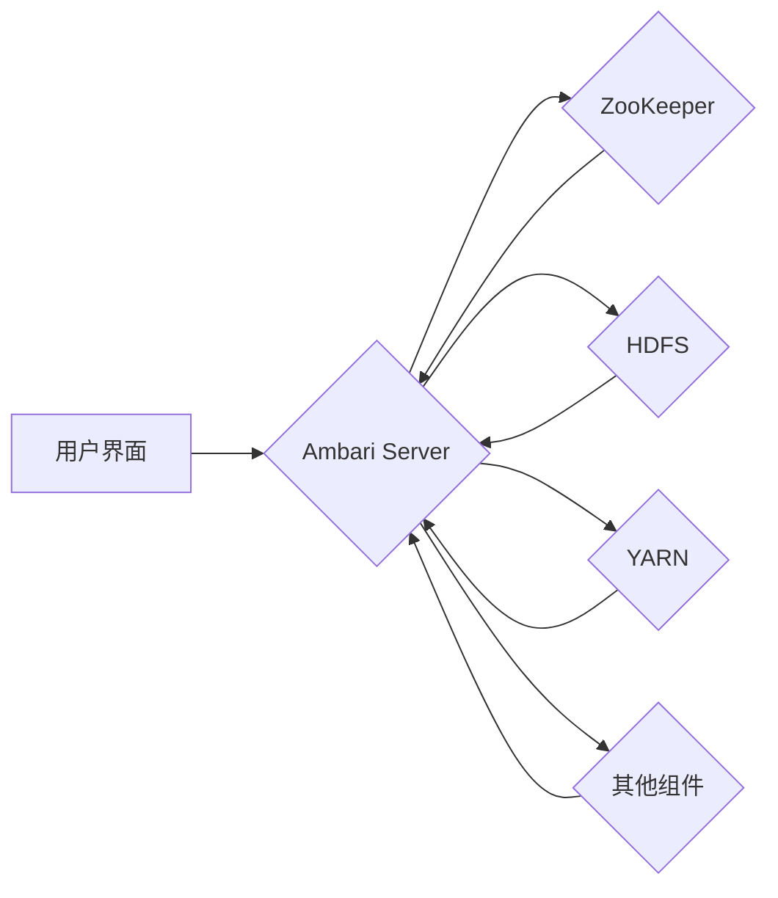

> Ambari, Hadoop, 集群管理, YARN, HDFS, Apache,  分布式系统,  自动化部署

## 1. 背景介绍

在如今数据爆炸的时代，大数据处理技术已成为各行各业的核心竞争力。Hadoop作为开源的大数据处理框架，凭借其分布式存储和处理能力，在海量数据分析领域占据着重要地位。然而，Hadoop集群的部署、管理和维护却是一项复杂且耗时的任务。为了解决这一难题，Apache Ambari应运而生。

Ambari是一个开源的Hadoop集群管理平台，它提供了一个统一的界面，用于管理和监控Hadoop集群的各个组件，简化了Hadari集群的部署、配置、监控和维护工作。Ambari不仅支持Hadoop生态系统中的核心组件，如HDFS、YARN、MapReduce等，还支持其他开源项目，如Spark、Kafka等。

## 2. 核心概念与联系

Ambari的核心功能包括：

* **集群部署和管理:** Ambari提供了一个图形化的界面，用于部署和管理Hadoop集群。用户可以通过该界面选择所需的Hadoop组件，配置集群参数，并一键部署集群。
* **服务监控和告警:** Ambari可以监控Hadoop集群的各个组件，并提供实时状态信息和告警机制。用户可以根据需要设置告警阈值，以便及时发现和解决集群问题。
* **安全管理:** Ambari支持Kerberos身份验证和授权，可以确保Hadoop集群的安全运行。
* **版本管理:** Ambari支持不同版本的Hadoop组件，用户可以根据需要选择合适的版本进行部署。
* **自动化操作:** Ambari支持自动化操作，例如集群升级、服务重启等，可以大大提高集群管理效率。

**Ambari 架构流程图:**



## 3. 核心算法原理 & 具体操作步骤

Ambari的核心算法原理主要集中在集群管理、服务监控和自动化操作等方面。

### 3.1  算法原理概述

* **集群管理算法:** Ambari采用分布式架构，利用ZooKeeper进行集群状态管理和协调。Ambari Server负责接收用户请求，并根据配置信息和集群状态，向各个组件发送指令。
* **服务监控算法:** Ambari通过监控组件的运行状态、资源使用情况和日志信息，实时监测集群健康状况。Ambari Server收集监控数据，并通过告警机制通知管理员。
* **自动化操作算法:** Ambari利用脚本和模板，实现对集群的自动化操作，例如集群升级、服务重启等。

### 3.2  算法步骤详解

* **集群部署:** 用户通过Ambari界面选择所需的Hadoop组件，配置集群参数，Ambari Server根据配置信息，向各个组件发送部署指令。
* **服务监控:** Ambari Server定期收集各个组件的运行状态、资源使用情况和日志信息，并进行分析和处理。
* **自动化操作:** 用户可以通过Ambari界面或API，触发自动化操作，例如集群升级、服务重启等。Ambari Server根据配置信息和脚本，执行相应的操作。

### 3.3  算法优缺点

* **优点:**
    * 简化集群管理工作
    * 提高集群可用性
    * 降低运维成本
* **缺点:**
    * 对Ambari Server的依赖性较高
    * 对于复杂集群的管理，可能需要进行定制化配置

### 3.4  算法应用领域

Ambari广泛应用于各种大数据处理场景，例如：

* **电商平台:** 用于分析用户行为、商品推荐等
* **金融机构:** 用于风险控制、欺诈检测等
* **医疗机构:** 用于疾病诊断、药物研发等
* **科研机构:** 用于数据分析、模型训练等

## 4. 数学模型和公式 & 详细讲解 & 举例说明

Ambari的算法设计涉及到一些数学模型和公式，例如：

### 4.1  数学模型构建

* **集群资源分配模型:** Ambari利用资源分配算法，将集群资源分配给不同的服务和任务，以保证集群的资源利用率和服务质量。
* **服务健康度模型:** Ambari利用监控数据，构建服务健康度模型，评估服务的运行状态和可靠性。

### 4.2  公式推导过程

* **资源分配算法:** Ambari可以采用多种资源分配算法，例如优先级算法、轮询算法等。这些算法通常基于资源需求、服务优先级等因素，将资源分配给不同的服务和任务。
* **服务健康度模型:** Ambari可以利用统计学方法，构建服务健康度模型。例如，可以根据服务的响应时间、错误率等指标，计算服务的健康度得分。

### 4.3  案例分析与讲解

* **资源分配案例:** 假设一个Hadoop集群有10个节点，每个节点有4核CPU和8GB内存。Ambari需要将这些资源分配给HDFS、YARN和MapReduce三个服务。如果HDFS需要8核CPU和16GB内存，YARN需要4核CPU和8GB内存，MapReduce需要4核CPU和8GB内存，那么Ambari可以根据资源需求和服务优先级，将资源分配给各个服务。
* **服务健康度案例:** 假设一个YARN服务，其响应时间为100毫秒，错误率为0.1%。根据Ambari的服务健康度模型，可以计算出该服务的健康度得分，并根据得分进行告警和处理。

## 5. 项目实践：代码实例和详细解释说明

### 5.1  开发环境搭建

* **操作系统:** Linux (Ubuntu, CentOS等)
* **JDK:** Java Development Kit (JDK 8 或以上)
* **Ambari:** 下载Ambari安装包并进行安装

### 5.2  源代码详细实现

Ambari的源代码主要由Java语言编写，涉及到Hadoop、ZooKeeper、RESTful API等技术。由于Ambari的代码量庞大，这里只提供一些关键代码片段的示例。

* **Ambari Server启动脚本:**

```bash
#!/bin/bash
# 启动Ambari Server
java -jar ambari-server.jar
```

* **Ambari RESTful API接口示例:**

```java
// 获取集群状态
String url = "http://localhost:8080/api/clusters/cluster_name/services";
RestTemplate restTemplate = new RestTemplate();
ClusterStatus clusterStatus = restTemplate.getForObject(url, ClusterStatus.class);
```

### 5.3  代码解读与分析

* **Ambari Server启动脚本:** 该脚本启动Ambari Server，并配置必要的环境变量。
* **Ambari RESTful API接口示例:** 该代码示例演示了如何使用RESTful API获取集群状态信息。

### 5.4  运行结果展示

启动Ambari Server后，可以通过浏览器访问Ambari界面，进行集群管理和监控。

## 6. 实际应用场景

Ambari在实际应用场景中，可以简化Hadoop集群的管理工作，提高集群的可用性和可靠性。

### 6.1  电商平台

Ambari可以帮助电商平台管理海量用户数据，分析用户行为，进行商品推荐等。

### 6.2  金融机构

Ambari可以帮助金融机构进行风险控制、欺诈检测等，提高金融服务的安全性。

### 6.3  医疗机构

Ambari可以帮助医疗机构进行疾病诊断、药物研发等，提高医疗服务的质量。

### 6.4  未来应用展望

随着大数据技术的不断发展，Ambari的应用场景将会更加广泛。例如，可以应用于物联网、人工智能等领域。

## 7. 工具和资源推荐

### 7.1  学习资源推荐

* **Ambari官方文档:** https://ambari.apache.org/docs/
* **Hadoop官方文档:** https://hadoop.apache.org/docs/

### 7.2  开发工具推荐

* **Eclipse:** https://www.eclipse.org/
* **IntelliJ IDEA:** https://www.jetbrains.com/idea/

### 7.3  相关论文推荐

* **Ambari: A Unified Management Platform for Hadoop Clusters:** https://www.usenix.org/system/files/conference/osdi13/osdi13-paper-keller.pdf

## 8. 总结：未来发展趋势与挑战

### 8.1  研究成果总结

Ambari作为开源的Hadoop集群管理平台，已经取得了显著的成果，简化了Hadoop集群的管理工作，提高了集群的可用性和可靠性。

### 8.2  未来发展趋势

* **更智能的自动化管理:** 利用人工智能技术，实现更智能的自动化管理，例如自动故障诊断和修复。
* **更完善的监控和告警机制:** 提供更完善的监控和告警机制，及时发现和解决集群问题。
* **更强大的安全防护:** 加强安全防护，保护集群数据安全。

### 8.3  面临的挑战

* **集群规模的不断增长:** 随着集群规模的不断增长，Ambari需要应对更大的数据量和更复杂的管理需求。
* **技术迭代的快速变化:** Hadoop生态系统不断迭代更新，Ambari需要及时跟进并支持最新的技术版本。
* **开源社区的维护:** Ambari是一个开源项目，需要依靠开源社区的维护和贡献。

### 8.4  研究展望

未来，Ambari将继续朝着更智能、更安全、更可靠的方向发展，为大数据处理提供更强大的支持。

## 9. 附录：常见问题与解答

* **Ambari安装失败怎么办？**
* **Ambari集群无法启动怎么办？**
* **Ambari监控数据异常怎么办？**

**作者：禅与计算机程序设计艺术 / Zen and the Art of Computer Programming**


<end_of_turn>