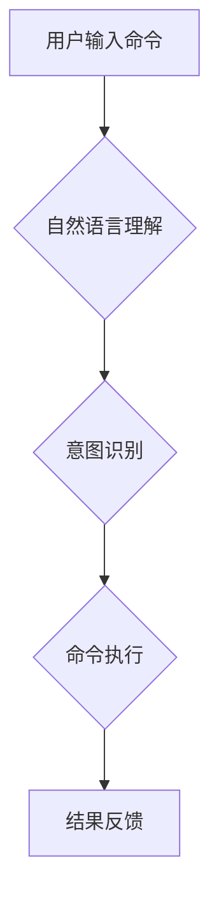

> CUI, 交互设计, 数字产品, 人机交互, 自然语言处理, 语音识别, 图形界面, 用户体验

## 1. 背景介绍

随着科技的飞速发展，数字产品已经渗透到我们生活的方方面面。从智能手机到智能家居，从智能汽车到虚拟现实，数字产品正在以惊人的速度改变着我们的生活方式。然而，传统的图形界面（GUI）已经难以满足用户日益增长的需求。用户渴望更自然、更直观、更便捷的交互方式。

在这种背景下，命令行界面（CLI）和基于自然语言的交互方式（CUI）逐渐受到关注。CUI，即命令行界面，是一种基于文本的交互方式，用户通过输入文本命令来控制应用程序。与传统的GUI相比，CUI具有以下优势：

* **效率更高：** CUI可以更快速地完成任务，因为用户不需要鼠标和键盘的交互，只需要输入简单的命令即可。
* **更灵活：** CUI可以支持更复杂的命令和参数，从而实现更精细的控制。
* **更易于自动化：** CUI的命令可以被脚本化和自动化，从而提高工作效率。

## 2. 核心概念与联系

CUI的核心概念是将用户与应用程序的交互方式转变为一种类似于自然语言的文本对话。用户可以通过输入自然语言的命令来控制应用程序，而应用程序则会理解用户的意图并执行相应的操作。

**Mermaid 流程图：**



## 3. 核心算法原理 & 具体操作步骤

### 3.1  算法原理概述

CUI的核心算法原理包括自然语言处理（NLP）、意图识别和命令执行。

* **自然语言处理（NLP）：** NLP是计算机科学的一个分支，致力于使计算机能够理解和处理人类语言。NLP算法可以将用户的自然语言文本转换为计算机可以理解的格式，例如词向量、语法树等。
* **意图识别：** 意图识别是指识别用户在输入命令时想要达成的目标。例如，用户输入“打开音乐播放器”，其意图是打开音乐播放器。
* **命令执行：** 命令执行是指根据识别的意图执行相应的操作。例如，如果用户意图是打开音乐播放器，则应用程序会执行打开音乐播放器的命令。

### 3.2  算法步骤详解

CUI的具体操作步骤如下：

1. **用户输入命令：** 用户通过文本输入框输入命令。
2. **文本预处理：** 对用户的输入文本进行预处理，例如去除停用词、规范化词形等。
3. **词向量化：** 将预处理后的文本转换为词向量，每个词都对应一个向量。
4. **语法分析：** 对词向量进行语法分析，构建语法树，理解文本的结构和语义。
5. **意图识别：** 根据语法树和词向量，识别用户的意图。
6. **命令生成：** 根据识别的意图，生成相应的命令。
7. **命令执行：** 执行生成的命令，完成用户的请求。
8. **结果反馈：** 将执行结果反馈给用户。

### 3.3  算法优缺点

**优点：**

* **效率高：** CUI可以更快速地完成任务，因为用户不需要鼠标和键盘的交互，只需要输入简单的命令即可。
* **灵活：** CUI可以支持更复杂的命令和参数，从而实现更精细的控制。
* **易于自动化：** CUI的命令可以被脚本化和自动化，从而提高工作效率。

**缺点：**

* **学习成本高：** 对于初学者来说，学习CUI的命令和语法需要一定的时间和精力。
* **用户体验差：** 与GUI相比，CUI的用户体验可能较差，因为用户需要输入文本命令，而不是直接操作图形元素。

### 3.4  算法应用领域

CUI在以下领域有广泛的应用：

* **命令行工具：** 许多系统工具和应用程序都使用CUI进行交互，例如Linux命令行、Git版本控制系统等。
* **自动化脚本：** CUI可以用于编写自动化脚本，例如自动化测试、数据处理等。
* **人工智能聊天机器人：** 一些聊天机器人使用CUI进行交互，例如智能客服、虚拟助手等。

## 4. 数学模型和公式 & 详细讲解 & 举例说明

### 4.1  数学模型构建

CUI的核心算法可以抽象为一个数学模型，其中用户输入的文本命令被视为一个向量，意图识别模型可以看作是一个分类器，将文本向量映射到不同的意图类别。

### 4.2  公式推导过程

假设用户输入的文本命令为**x**，意图类别集合为**C**，则意图识别模型可以表示为一个函数**f(x)**，该函数将文本向量**x**映射到意图类别**c**∈**C**：

**f(x) = argmax<sub>c∈C</sub> P(c|x)**

其中，**P(c|x)**表示给定文本向量**x**，意图类别**c**出现的概率。

### 4.3  案例分析与讲解

例如，用户输入的文本命令为“打开音乐播放器”，意图类别集合为{“打开音乐播放器”，“打开视频播放器”，“打开文本编辑器”}。如果意图识别模型训练得足够好，则**P(打开音乐播放器|打开音乐播放器) >> P(打开视频播放器|打开音乐播放器) >> P(打开文本编辑器|打开音乐播放器)**，因此模型会将用户输入的命令映射到“打开音乐播放器”这个意图类别。

## 5. 项目实践：代码实例和详细解释说明

### 5.1  开发环境搭建

CUI的开发环境搭建相对简单，主要需要准备以下工具：

* **文本编辑器：** 用于编写代码，例如VS Code、Sublime Text等。
* **Python解释器：** 用于运行Python代码，例如Python 3.x。
* **自然语言处理库：** 用于进行自然语言处理，例如NLTK、spaCy等。

### 5.2  源代码详细实现

以下是一个简单的CUI示例代码，用于实现一个简单的命令行计算器：

```python
import re

def calculate(expression):
    """计算表达式"""
    try:
        result = eval(expression)
        return result
    except Exception as e:
        return f"错误：{e}"

while True:
    command = input("请输入命令（例如：'2 + 3'）：")
    if command.lower() == "exit":
        break
    result = calculate(command)
    print(result)
```

### 5.3  代码解读与分析

* **`import re`**: 导入正则表达式库，用于处理用户输入的表达式。
* **`def calculate(expression)`**: 定义一个函数`calculate`，用于计算用户输入的表达式。
* **`try...except`**: 使用`try...except`语句捕获可能出现的计算错误。
* **`eval(expression)`**: 使用`eval`函数执行用户输入的表达式，并返回结果。
* **`while True`**: 创建一个无限循环，直到用户输入“exit”命令退出程序。
* **`input("请输入命令（例如：'2 + 3'）：")`**: 提示用户输入命令，并读取用户输入。
* **`if command.lower() == "exit"`**: 判断用户输入是否为“exit”，如果是则退出程序。
* **`result = calculate(command)`**: 调用`calculate`函数计算用户输入的表达式，并存储结果。
* **`print(result)`**: 打印计算结果。

### 5.4  运行结果展示

当用户运行该程序后，可以输入各种数学表达式进行计算，例如：

```
请输入命令（例如：'2 + 3'）：2 + 3
5
请输入命令（例如：'2 * 3'）：2 * 3
6
请输入命令（例如：'10 / 2'）：10 / 2
5
请输入命令（例如：'exit'）：exit
```

## 6. 实际应用场景

CUI在以下实际应用场景中发挥着重要作用：

### 6.1  系统管理

CUI可以用于管理服务器、网络设备等系统资源，例如配置网络路由、监控系统状态等。

### 6.2  数据分析

CUI可以用于执行数据分析任务，例如查询数据库、统计数据、生成报表等。

### 6.3  自动化测试

CUI可以用于编写自动化测试脚本，例如测试软件功能、性能等。

### 6.4  未来应用展望

随着人工智能技术的不断发展，CUI的应用场景将会更加广泛。例如，未来CUI可以用于：

* **智能家居控制：** 用户可以通过自然语言命令控制智能家居设备，例如“打开客厅灯”，“调节空调温度”等。
* **虚拟助手：** CUI可以用于构建更智能的虚拟助手，例如可以理解更复杂的自然语言命令，并提供更个性化的服务。
* **医疗诊断：** CUI可以用于辅助医生进行诊断，例如医生可以通过CUI输入患者的症状，系统会根据医学知识库进行分析，并给出可能的诊断结果。

## 7. 工具和资源推荐

### 7.1  学习资源推荐

* **自然语言处理入门书籍：**
    * 《自然语言处理》 -  Steven Bird, Ewan Klein, Edward Loper
    * 《Speech and Language Processing》 - Daniel Jurafsky, James H. Martin
* **在线课程：**
    * Coursera: Natural Language Processing Specialization
    * edX: Natural Language Processing with Deep Learning

### 7.2  开发工具推荐

* **Python解释器：** Python 3.x
* **自然语言处理库：** NLTK, spaCy, Gensim
* **文本编辑器：** VS Code, Sublime Text

### 7.3  相关论文推荐

* **BERT: Pre-training of Deep Bidirectional Transformers for Language Understanding**
* **GPT-3: Language Models are Few-Shot Learners**
* **XLNet: Generalized Autoregressive Pretraining for Language Understanding**

## 8. 总结：未来发展趋势与挑战

### 8.1  研究成果总结

CUI技术近年来取得了显著进展，特别是深度学习技术的应用使得CUI的性能得到了大幅提升。

### 8.2  未来发展趋势

未来CUI的发展趋势包括：

* **更自然的人机交互：** CUI将更加接近自然语言的交互方式，用户可以更方便地与系统进行对话。
* **更智能的理解能力：** CUI将能够理解更复杂的语义和上下文信息，从而提供更精准的服务。
* **更广泛的应用场景：** CUI将应用于更多领域，例如医疗、教育、金融等。

### 8.3  面临的挑战

CUI技术还面临一些挑战，例如：

* **语义理解的复杂性：** 自然语言的语义非常复杂，CUI系统需要能够理解各种隐含含义和上下文信息。
* **数据标注的困难：** 训练CUI模型需要大量的标注数据，而标注数据成本高且耗时。
* **个性化定制的难点：** 每个用户的语言习惯和需求都不同，CUI系统需要能够提供个性化的服务。

### 8.4  研究展望

未来CUI的研究方向包括：

* **开发更强大的语义理解模型：** 研究更先进的深度学习算法，提高CUI系统的语义理解能力。
* **探索无监督和半监督学习方法：** 减少对标注数据的依赖，降低训练成本。
* **研究个性化CUI系统：** 开发能够根据用户习惯和需求进行个性化定制的CUI系统。


## 9. 附录：常见问题与解答

**Q1：CUI与GUI相比，哪个更好？**

A1：CUI和GUI各有优缺点，选择哪种交互方式取决于具体的应用场景。CUI更适合需要快速高效操作的场景，例如命令行