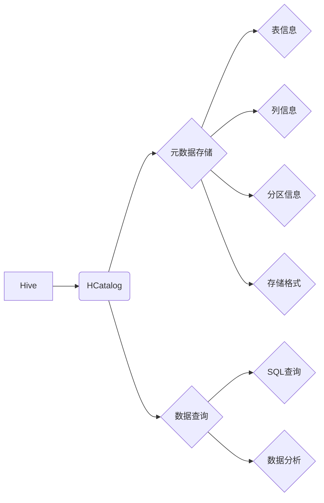

> HCatalog, Hive, Metastore, 数据仓库, 数据管理, 数据元数据, 数据查询, 数据分析

## 1. 背景介绍

在海量数据时代，高效地管理和分析数据至关重要。HCatalog作为Apache Hive的元数据存储系统，为数据仓库提供了强大的数据管理和查询能力。它提供了统一的数据元数据管理平台，支持多种数据源的整合和查询，并提供了丰富的查询功能，满足数据分析的需求。

HCatalog的出现是为了解决Hive元数据存储的局限性。早期Hive依赖于本地文件系统存储元数据，存在以下问题：

* **存储效率低:** 元数据文件分散存储，难以进行高效的查询和管理。
* **数据一致性问题:** 元数据更新不及时，可能导致数据不一致。
* **扩展性差:** 元数据存储在单个节点上，难以扩展到集群环境。

HCatalog通过将元数据存储在分布式数据库中，解决了上述问题，并提供了以下优势：

* **高性能:** 分布式存储和查询，提高元数据访问效率。
* **数据一致性:** 元数据更新实时同步，保证数据一致性。
* **高可用性:** 元数据存储在多个节点上，提高系统可用性。
* **可扩展性:** 随着数据量的增长，可以轻松扩展元数据存储容量。

## 2. 核心概念与联系

HCatalog的核心概念包括：

* **元数据:** 数据的描述信息，例如表名、列名、数据类型、数据格式等。
* **表:** 数据的组织形式，由多个列组成。
* **列:** 数据的单个属性。
* **分区:** 将表按照特定条件进行划分，提高查询效率。
* **存储格式:** 数据在存储系统中的格式，例如ORC、Parquet等。

HCatalog与Hive的关系如下：

## 3. 核心算法原理 & 具体操作步骤

### 3.1  算法原理概述

HCatalog的核心算法是基于分布式数据库的元数据管理算法。它利用分布式存储和查询技术，实现高效的元数据访问和管理。

### 3.2  算法步骤详解

1. **元数据存储:** 将元数据存储在分布式数据库中，每个节点存储一部分元数据。
2. **元数据查询:** 当Hive需要访问元数据时，会向元数据存储节点发送查询请求。
3. **元数据检索:** 元数据存储节点根据查询条件检索相关元数据。
4. **元数据返回:** 元数据存储节点将检索到的元数据返回给Hive。

### 3.3  算法优缺点

**优点:**

* 高性能: 分布式存储和查询，提高元数据访问效率。
* 数据一致性: 元数据更新实时同步，保证数据一致性。
* 高可用性: 元数据存储在多个节点上，提高系统可用性。
* 可扩展性: 随着数据量的增长，可以轻松扩展元数据存储容量。

**缺点:**

* 复杂性: 分布式数据库的管理和维护相对复杂。
* 依赖性: HCatalog依赖于分布式数据库，需要确保数据库的稳定运行。

### 3.4  算法应用领域

HCatalog广泛应用于数据仓库、数据湖、大数据分析等领域。

## 4. 数学模型和公式 & 详细讲解 & 举例说明

### 4.1  数学模型构建

HCatalog的元数据模型可以抽象为一个图结构，其中节点代表元数据对象，例如表、列、分区等，边代表元数据之间的关系。

### 4.2  公式推导过程

HCatalog的查询算法基于图查询算法，例如深度优先搜索、广度优先搜索等。

### 4.3  案例分析与讲解

假设我们有一个包含多个表的元数据仓库，我们需要查询某个表的列名。我们可以使用HCatalog的图查询算法，从表节点出发，沿着关系边查询到列节点，从而获取列名。

## 5. 项目实践：代码实例和详细解释说明

### 5.1  开发环境搭建

HCatalog的开发环境需要包含以下组件:

* Java Development Kit (JDK)
* Apache Hive
* Apache HBase
* Apache ZooKeeper

### 5.2  源代码详细实现

HCatalog的源代码主要位于Apache Hive的代码库中。

### 5.3  代码解读与分析

HCatalog的代码实现包括元数据存储、元数据查询、元数据更新等模块。

### 5.4  运行结果展示

HCatalog的运行结果包括元数据存储、元数据查询等操作的日志和输出。

## 6. 实际应用场景

HCatalog在数据仓库、数据湖、大数据分析等领域有广泛的应用场景。

### 6.4  未来应用展望

HCatalog未来将继续发展，支持更多的数据源和查询功能，并与其他大数据技术进行整合。

## 7. 工具和资源推荐

### 7.1  学习资源推荐

* Apache HCatalog官方文档: https://hadoop.apache.org/docs/current/hadoop-project-dist/hadoop-common/HCatalog/index.html
* Apache Hive官方文档: https://hadoop.apache.org/docs/current/hadoop-project-dist/hadoop-common/Hive/index.html

### 7.2  开发工具推荐

* Apache Hive CLI
* Apache Spark

### 7.3  相关论文推荐

* HCatalog: A Unified Metadata Store for Hadoop
* Hive: A Data Warehouse System on Top of Hadoop

## 8. 总结：未来发展趋势与挑战

### 8.1  研究成果总结

HCatalog为数据仓库提供了强大的元数据管理和查询能力，提高了数据管理和分析效率。

### 8.2  未来发展趋势

HCatalog将继续发展，支持更多的数据源和查询功能，并与其他大数据技术进行整合。

### 8.3  面临的挑战

HCatalog面临的挑战包括:

* 复杂性: 分布式数据库的管理和维护相对复杂。
* 依赖性: HCatalog依赖于分布式数据库，需要确保数据库的稳定运行。

### 8.4  研究展望

未来研究方向包括:

* 提高HCatalog的性能和效率。
* 简化HCatalog的管理和维护。
* 支持更多的数据源和查询功能。

## 9. 附录：常见问题与解答

### 9.1  常见问题

* HCatalog与Hive的关系是什么？
* HCatalog的优势是什么？
* HCatalog的应用场景有哪些？

### 9.2  解答

* HCatalog是Apache Hive的元数据存储系统，为数据仓库提供了统一的数据元数据管理平台。
* HCatalog的优势包括高性能、数据一致性、高可用性和可扩展性。
* HCatalog的应用场景包括数据仓库、数据湖、大数据分析等领域。

作者：禅与计算机程序设计艺术 / Zen and the Art of Computer Programming 
<end_of_turn>