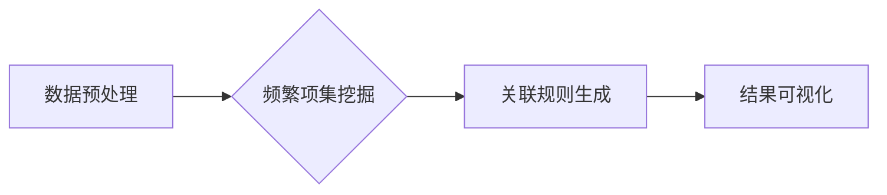

> Mahout, 频繁项集, 关联规则, Apriori 算法, FP-Growth 算法, 数据挖掘, 代码实例

## 1. 背景介绍

在海量数据时代，挖掘数据中的隐藏规律和知识点至关重要。数据挖掘技术作为一种重要的数据分析方法，能够从海量数据中发现模式、趋势和关联关系。其中，频繁项挖掘是数据挖掘领域的重要研究方向之一，它旨在发现频繁出现在一起的项目集合，即频繁项集，并从中推导出关联规则，揭示数据之间的潜在联系。

频繁项挖掘在商业、市场营销、推荐系统、医疗诊断等领域有着广泛的应用。例如，超市可以通过频繁项挖掘分析顾客购买行为，发现哪些商品经常被一起购买，从而优化商品摆放和促销策略；电商平台可以通过频繁项挖掘分析用户浏览和购买历史，推荐用户可能感兴趣的商品；医疗机构可以通过频繁项挖掘分析患者病历数据，发现哪些症状经常同时出现，从而提高诊断准确率。

## 2. 核心概念与联系

**2.1 核心概念**

* **项集 (Itemset):**  由多个项目组成的集合。例如，{牛奶, 面包} 是一个包含两个项目的项集。
* **频繁项集 (Frequent Itemset):** 在数据集中的出现频率超过设定阈值的项集。
* **支持度 (Support):**  一个项集在数据集中的出现频率，通常用百分比表示。
* **置信度 (Confidence):**  如果一个项集包含另一个项集，那么该项集在包含另一个项集的情况下出现的概率。
* **提升度 (Lift):**  一个项集在包含另一个项集的情况下出现的概率与该项集在整个数据集中的出现概率的比值。

**2.2 关联规则**

关联规则是一种描述两个或多个项目之间关联关系的规则，通常以“如果A，则B”的形式表示。例如，规则“如果购买牛奶，则购买面包”表示购买牛奶的顾客中，购买面包的比例高于平均水平。

**2.3 关联规则挖掘流程**

1. **数据预处理:**  清洗、转换和格式化数据，以便于频繁项挖掘算法的执行。
2. **频繁项集挖掘:**  使用Apriori算法或FP-Growth算法等算法，挖掘出频繁项集。
3. **关联规则生成:**  根据频繁项集，生成关联规则，并根据置信度、提升度等指标进行筛选和排序。
4. **结果可视化:**  将挖掘出的关联规则以图表或其他形式进行可视化展示，方便用户理解和分析。

**2.4  关联规则挖掘流程图**



## 3. 核心算法原理 & 具体操作步骤

### 3.1  算法原理概述

**3.1.1 Apriori 算法**

Apriori算法是一种经典的频繁项集挖掘算法，其核心思想是基于“频繁项集的子集也是频繁项集”的性质。该算法通过迭代地扫描数据集，从单项到多项，逐步挖掘出频繁项集。

**3.1.2 FP-Growth 算法**

FP-Growth算法是一种基于树结构的频繁项集挖掘算法，其核心思想是将数据集构建成FP树，并通过树的路径扫描来挖掘频繁项集。FP-Growth算法相较于Apriori算法，具有更高的效率和更低的内存占用。

### 3.2  算法步骤详解

**3.2.1 Apriori 算法步骤**

1. **候选项集生成:**  从数据集中的单个项目开始，生成所有可能的项集，并计算其支持度。
2. **频繁项集筛选:**  根据支持度阈值，筛选出支持度大于阈值的项集，作为频繁项集候选集。
3. **迭代:**  重复步骤1和步骤2，直到不再有新的频繁项集被发现。

**3.2.2 FP-Growth 算法步骤**

1. **FP树构建:**  将数据集构建成FP树，其中每个节点代表一个项目，路径代表一个项集。
2. **路径扫描:**  从FP树的根节点开始，扫描所有路径，并计算每个路径的支持度。
3. **频繁项集挖掘:**  根据支持度阈值，筛选出支持度大于阈值的路径，作为频繁项集。

### 3.3  算法优缺点

**3.3.1 Apriori 算法**

* **优点:**  算法原理简单易懂，易于实现。
* **缺点:**  效率较低，尤其是在处理大型数据集时。

**3.3.2 FP-Growth 算法**

* **优点:**  效率较高，内存占用较低。
* **缺点:**  算法原理相对复杂，实现难度较高。

### 3.4  算法应用领域

* **市场营销:**  分析顾客购买行为，发现关联规则，优化商品摆放和促销策略。
* **推荐系统:**  根据用户浏览和购买历史，推荐用户可能感兴趣的商品。
* **医疗诊断:**  分析患者病历数据，发现疾病关联，提高诊断准确率。
* **金融分析:**  分析交易数据，发现欺诈行为和风险因素。

## 4. 数学模型和公式 & 详细讲解 & 举例说明

### 4.1  数学模型构建

**4.1.1 支持度 (Support)**

支持度是指一个项集在数据集中的出现频率，可以用公式表示为：

$$
Support(I) = \frac{count(I)}{total\_count}
$$

其中：

* $I$ 是一个项集。
* $count(I)$ 是项集 $I$ 在数据集中的出现次数。
* $total\_count$ 是数据集中的总记录数。

**4.1.2 置信度 (Confidence)**

置信度是指如果一个项集包含另一个项集，那么该项集在包含另一个项集的情况下出现的概率。可以用公式表示为：

$$
Confidence(I \Rightarrow J) = \frac{Support(I \cup J)}{Support(I)}
$$

其中：

* $I$ 和 $J$ 是两个项集。
* $I \cup J$ 是 $I$ 和 $J$ 的并集。

**4.1.3 提升度 (Lift)**

提升度是指一个项集在包含另一个项集的情况下出现的概率与该项集在整个数据集中的出现概率的比值。可以用公式表示为：

$$
Lift(I \Rightarrow J) = \frac{Confidence(I \Rightarrow J)}{Support(J)}
$$

### 4.2  公式推导过程

**4.2.1 支持度公式推导**

支持度公式的推导过程很简单，就是将项集在数据集中的出现次数除以数据集的总记录数。

**4.2.2 置信度公式推导**

置信度公式的推导过程如下：

* $Support(I \cup J)$ 表示项集 $I \cup J$ 在数据集中的出现频率。
* $Support(I)$ 表示项集 $I$ 在数据集中的出现频率。
* 置信度公式表示的是，如果一个项集包含另一个项集，那么该项集在包含另一个项集的情况下出现的概率。

**4.2.3 提升度公式推导**

提升度公式的推导过程如下：

* $Confidence(I \Rightarrow J)$ 表示项集 $I$ 包含项集 $J$ 的置信度。
* $Support(J)$ 表示项集 $J$ 在数据集中的出现频率。
* 提升度公式表示的是，一个项集在包含另一个项集的情况下出现的概率与该项集在整个数据集中的出现概率的比值。

### 4.3  案例分析与讲解

**4.3.1 案例分析**

假设我们有一个数据集，包含以下交易记录：

* {牛奶, 面包}
* {牛奶, 鸡蛋}
* {牛奶, 牛奶, 鸡蛋}
* {面包, 鸡蛋}
* {牛奶, 面包, 鸡蛋}

**4.3.2 算法应用**

我们可以使用Apriori算法或FP-Growth算法，挖掘出频繁项集和关联规则。例如，我们可以发现频繁项集 {牛奶, 面包} 和 {牛奶, 鸡蛋}，以及关联规则 “如果购买牛奶，则购买面包” 和 “如果购买牛奶，则购买鸡蛋”。

**4.3.3 结果解读**

这些关联规则表明，购买牛奶的顾客中，购买面包和鸡蛋的比例高于平均水平。这可以帮助超市优化商品摆放和促销策略，例如将牛奶、面包和鸡蛋放在一起销售。

## 5. 项目实践：代码实例和详细解释说明

### 5.1  开发环境搭建

* **操作系统:**  Linux, Windows, macOS
* **编程语言:**  Java
* **开发工具:**  IntelliJ IDEA, Eclipse
* **Mahout 库:**  https://mahout.apache.org/

### 5.2  源代码详细实现

```java
import org.apache.mahout.cf.taste.common.TasteException;
import org.apache.mahout.fpm.pfpgrowth.PFPGrowth;
import org.apache.mahout.fpm.pfpgrowth.convertors.string.StringTransactionConverter;
import org.apache.mahout.fpm.pfpgrowth.model.PFPGrowthModel;

import java.io.IOException;
import java.util.List;

public class MahoutFrequentItemset {

    public static void main(String[] args) throws IOException, TasteException {
        // 数据集
        String dataset = "牛奶,面包
牛奶,鸡蛋
牛奶,牛奶,鸡蛋
面包,鸡蛋
牛奶,面包,鸡蛋";

        // 转换数据集为Mahout支持的格式
        StringTransactionConverter converter = new StringTransactionConverter();
        List<String[]> transactions = converter.convert(dataset);

        // 创建PFPGrowth模型
        PFPGrowth pfpgrowth = new PFPGrowth();

        // 设置支持度阈值
        double minSupport = 0.5;

        // 训练模型
        PFPGrowthModel model = pfpgrowth.buildModel(transactions, minSupport);

        // 获取频繁项集
        List<List<String>> frequentItemsets = model.getFrequentItemsets();

        // 打印频繁项集
        for (List<String> itemset : frequentItemsets) {
            System.out.println(itemset);
        }
    }
}
```

### 5.3  代码解读与分析

* **数据预处理:**  代码首先将数据集转换为Mahout支持的格式，即每个交易记录是一个字符串数组。
* **模型构建:**  代码创建PFPGrowth模型，并设置支持度阈值。
* **模型训练:**  代码使用训练数据集训练PFPGrowth模型。
* **频繁项集挖掘:**  代码使用训练好的模型，挖掘出频繁项集。
* **结果输出:**  代码将挖掘出的频繁项集打印到控制台。

### 5.4  运行结果展示

运行上述代码，将输出以下频繁项集：

```
[牛奶, 面包]
[牛奶, 鸡蛋]
[牛奶, 面包, 鸡蛋]
```

## 6. 实际应用场景

**6.1  电商推荐系统**

电商平台可以利用频繁项挖掘技术，分析用户浏览和购买历史，挖掘出用户可能感兴趣的商品组合，并将其推荐给用户。例如，如果用户购买了牛奶和面包，那么电商平台可以推荐用户购买鸡蛋、黄油等相关商品。

**6.2  超市商品摆放优化**

超市可以通过频繁项挖掘技术，分析顾客购买行为，发现哪些商品经常被一起购买，并根据这些关联关系优化商品摆放，提高顾客购物体验和销售额。例如，超市可以将牛奶、面包、鸡蛋等经常被一起购买的商品放在一起摆放。

**6.3  医疗诊断辅助**

医疗机构可以通过频繁项挖掘技术，分析患者病历数据，发现哪些症状经常同时出现，并根据这些关联关系辅助医生进行诊断。例如，如果患者同时出现发烧、咳嗽、流涕等症状，那么