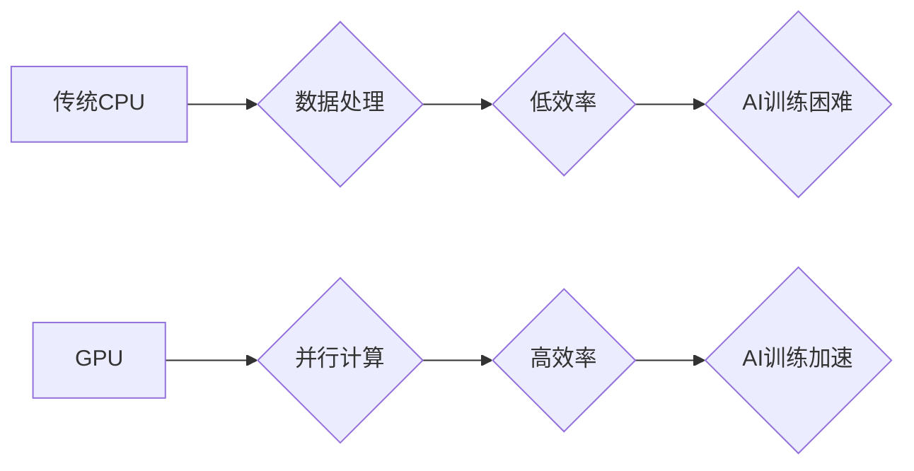

> NVIDIA, AI, 算力, GPU, CUDA, Deep Learning, Tensor Core

## 1. 背景介绍

人工智能（AI）的蓬勃发展，对算力的需求呈指数级增长。训练大型深度学习模型需要海量数据和强大的计算能力，而传统CPU架构难以满足这一需求。NVIDIA作为全球领先的GPU厂商，凭借其强大的GPU架构和软件生态系统，在推动AI算力发展方面发挥了至关重要的作用。

## 2. 核心概念与联系

**2.1 GPU架构与AI计算**

GPU（图形处理单元）最初设计用于处理图形渲染，其并行计算能力远超传统CPU。在AI领域，GPU的并行计算能力可以有效加速深度学习模型的训练和推理。

**2.2 CUDA平台与AI软件生态**

CUDA（Compute Unified Device Architecture）是NVIDIA开发的并行计算平台，为开发者提供了访问GPU计算能力的接口。CUDA平台的广泛应用，促进了AI软件生态的繁荣，形成了丰富的AI库和框架，例如TensorFlow、PyTorch等。

**2.3  NVIDIA AI算力架构**

NVIDIA构建了完整的AI算力架构，包括硬件、软件和生态系统。

* **硬件层:** NVIDIA推出了专门为AI计算设计的GPU，例如Tesla系列和A100等，这些GPU拥有强大的算力、高带宽内存和高效的 interconnect。
* **软件层:** CUDA平台、cuDNN库、TensorRT等软件工具，为开发者提供了高效的AI开发和部署环境。
* **生态系统层:** NVIDIA与众多合作伙伴合作，构建了丰富的AI生态系统，包括云服务提供商、硬件厂商和软件开发商。

**Mermaid 流程图**



## 3. 核心算法原理 & 具体操作步骤

**3.1 算法原理概述**

深度学习算法的核心是神经网络，它由多个层级的神经元组成，通过学习数据中的特征，实现对数据的分类、识别和预测等任务。

**3.2 算法步骤详解**

1. **数据预处理:** 将原始数据转换为深度学习模型可以理解的格式，例如归一化、编码等。
2. **模型构建:** 根据任务需求，选择合适的深度学习模型架构，例如卷积神经网络（CNN）、循环神经网络（RNN）等。
3. **模型训练:** 使用训练数据，通过反向传播算法，调整模型参数，使模型的预测结果与真实值尽可能接近。
4. **模型评估:** 使用测试数据，评估模型的性能，例如准确率、召回率等。
5. **模型部署:** 将训练好的模型部署到实际应用场景中，例如图像识别、语音识别等。

**3.3 算法优缺点**

**优点:**

* 能够学习复杂的数据模式，实现高精度预测。
* 能够处理海量数据，具有强大的泛化能力。

**缺点:**

* 训练过程需要大量计算资源和时间。
* 对训练数据的质量要求较高，数据偏差会影响模型性能。

**3.4 算法应用领域**

深度学习算法广泛应用于各个领域，例如：

* **计算机视觉:** 图像识别、物体检测、图像分割等。
* **自然语言处理:** 文本分类、机器翻译、语音识别等。
* **医疗保健:** 疾病诊断、药物研发、医疗影像分析等。
* **金融科技:** 风险评估、欺诈检测、投资决策等。

## 4. 数学模型和公式 & 详细讲解 & 举例说明

**4.1 数学模型构建**

深度学习模型的核心是神经网络，其数学模型可以表示为多层感知机（MLP）。

**4.2 公式推导过程**

* **激活函数:** 激活函数用于引入非线性，使神经网络能够学习复杂的数据模式。常见的激活函数包括ReLU、Sigmoid、Tanh等。

* **损失函数:** 损失函数用于衡量模型预测结果与真实值的差距。常见的损失函数包括均方误差（MSE）、交叉熵损失等。

* **梯度下降:** 梯度下降算法用于优化模型参数，使其能够最小化损失函数。

**4.3 案例分析与讲解**

以图像分类为例，假设我们有一个包含10个类别的图像数据集。

* **输入层:** 接收图像像素数据。
* **隐藏层:** 多个神经元层，通过激活函数和权重参数进行特征提取。
* **输出层:** 10个神经元，每个神经元对应一个类别，输出概率值。

训练过程中，通过反向传播算法，计算每个参数的梯度，并根据梯度更新参数值，最终使模型能够准确地分类图像。

## 5. 项目实践：代码实例和详细解释说明

**5.1 开发环境搭建**

* 操作系统: Ubuntu 20.04
* CUDA Toolkit: 11.4
* cuDNN: 8.1
* Python: 3.8
* 深度学习框架: TensorFlow 2.4

**5.2 源代码详细实现**

```python
import tensorflow as tf

# 定义模型架构
model = tf.keras.models.Sequential([
    tf.keras.layers.Conv2D(32, (3, 3), activation='relu', input_shape=(28, 28, 1)),
    tf.keras.layers.MaxPooling2D((2, 2)),
    tf.keras.layers.Conv2D(64, (3, 3), activation='relu'),
    tf.keras.layers.MaxPooling2D((2, 2)),
    tf.keras.layers.Flatten(),
    tf.keras.layers.Dense(10, activation='softmax')
])

# 编译模型
model.compile(optimizer='adam',
              loss='sparse_categorical_crossentropy',
              metrics=['accuracy'])

# 训练模型
model.fit(x_train, y_train, epochs=5)

# 评估模型
loss, accuracy = model.evaluate(x_test, y_test)
print('Test loss:', loss)
print('Test accuracy:', accuracy)
```

**5.3 代码解读与分析**

* 代码定义了一个简单的卷积神经网络模型，用于手写数字识别任务。
* 模型包含两个卷积层、两个最大池化层、一个全连接层和一个输出层。
* 使用Adam优化器、交叉熵损失函数和准确率作为评估指标。
* 模型训练了5个epochs，并使用测试数据评估模型性能。

**5.4 运行结果展示**

训练完成后，模型的准确率通常会达到较高的水平，例如98%以上。

## 6. 实际应用场景

**6.1 图像识别**

* **自动驾驶:** 识别道路标志、车辆、行人等。
* **医疗诊断:** 识别病灶、肿瘤等。
* **安防监控:** 人脸识别、物体检测。

**6.2 语音识别**

* **语音助手:** 理解用户的语音指令。
* **语音翻译:** 将语音转换为文本，并翻译成其他语言。
* **语音搜索:** 通过语音进行搜索。

**6.3 自然语言处理**

* **机器翻译:** 将文本从一种语言翻译成另一种语言。
* **文本摘要:** 自动生成文本的摘要。
* **情感分析:** 分析文本的情感倾向。

**6.4 未来应用展望**

* **个性化推荐:** 基于用户的行为数据，推荐个性化的商品、服务等。
* **智能客服:** 使用AI技术，提供更智能、更便捷的客服服务。
* **科学研究:** 加速科学研究，例如药物研发、材料科学等。

## 7. 工具和资源推荐

**7.1 学习资源推荐**

* **课程:** Coursera、edX、Udacity等平台提供丰富的深度学习课程。
* **书籍:** 《深度学习》、《动手学深度学习》等书籍。
* **博客:** TensorFlow博客、PyTorch博客等。

**7.2 开发工具推荐**

* **深度学习框架:** TensorFlow、PyTorch、Keras等。
* **GPU加速库:** cuDNN、OpenCL等。
* **数据处理工具:** Pandas、NumPy等。

**7.3 相关论文推荐**

* **AlexNet:** 《ImageNet Classification with Deep Convolutional Neural Networks》
* **VGGNet:** 《Very Deep Convolutional Networks for Large-Scale Image Recognition》
* **ResNet:** 《Deep Residual Learning for Image Recognition》

## 8. 总结：未来发展趋势与挑战

**8.1 研究成果总结**

近年来，深度学习算法取得了显著的进展，在图像识别、语音识别、自然语言处理等领域取得了突破性成果。

**8.2 未来发展趋势**

* **模型规模和复杂度:** 模型规模和复杂度将继续增加，例如Transformer模型的出现。
* **硬件加速:** GPU算力将继续提升，例如NVIDIA的Ampere架构和Hopper架构。
* **边缘计算:** 将深度学习模型部署到边缘设备，实现更低延迟和更高效率的应用。

**8.3 面临的挑战**

* **数据隐私和安全:** 深度学习模型训练需要大量数据，如何保护数据隐私和安全是一个重要挑战。
* **模型可解释性:** 深度学习模型的决策过程难以解释，如何提高模型的可解释性是一个重要的研究方向。
* **算法效率:** 深度学习模型的训练和推理过程仍然非常耗时，如何提高算法效率是一个重要的挑战。

**8.4 研究展望**

未来，深度学习领域将继续朝着更智能、更安全、更高效的方向发展。

## 9. 附录：常见问题与解答

**9.1 如何选择合适的深度学习模型？**

选择合适的深度学习模型需要根据具体的应用场景和数据特点进行选择。例如，图像识别任务通常使用卷积神经网络，而文本分类任务通常使用循环神经网络。

**9.2 如何训练深度学习模型？**

训练深度学习模型需要准备训练数据、选择模型架构、设置训练参数、训练模型、评估模型性能等步骤。

**9.3 如何部署深度学习模型？**

部署深度学习模型可以部署到云服务器、边缘设备等平台，可以使用容器技术、微服务架构等技术进行部署。


作者：禅与计算机程序设计艺术 / Zen and the Art of Computer Programming 
<end_of_turn>