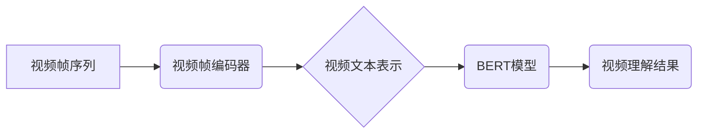

> Transformer, VideoBERT, 视频理解, 多模态学习, 深度学习, 自然语言处理

## 1. 背景介绍

随着深度学习技术的飞速发展，视频理解领域取得了显著进展。传统的视频理解方法主要依赖于手工设计的特征，难以捕捉视频中的复杂语义信息。而基于Transformer的视频理解模型，凭借其强大的序列建模能力和自注意力机制，能够更有效地学习视频中的时空信息，取得了令人瞩目的效果。

VideoBERT作为一种基于Transformer的视频理解模型，在视频理解任务中展现出强大的潜力。它将视频帧序列编码为文本表示，并利用BERT模型的预训练能力进行微调，从而能够更好地理解视频内容。

## 2. 核心概念与联系

### 2.1 Transformer模型

Transformer模型是一种基于注意力机制的序列到序列模型，它能够有效地处理长序列数据，并捕捉序列中的长距离依赖关系。Transformer模型的核心结构包括编码器和解码器，编码器负责将输入序列编码为隐藏状态，解码器则根据编码后的隐藏状态生成输出序列。

### 2.2 BERT模型

BERT（Bidirectional Encoder Representations from Transformers）是一种基于Transformer的预训练语言模型，它通过双向语言建模的方式学习语言表示，能够捕捉到单词之间的上下文关系。BERT模型在许多自然语言处理任务中取得了优异的性能，例如文本分类、问答系统和文本摘要等。

### 2.3 VideoBERT模型

VideoBERT模型将Transformer模型和BERT模型相结合，将视频帧序列编码为文本表示，并利用BERT模型的预训练能力进行微调，从而能够更好地理解视频内容。



## 3. 核心算法原理 & 具体操作步骤

### 3.1 算法原理概述

VideoBERT模型的核心算法原理是将视频帧序列编码为文本表示，并利用BERT模型进行微调。具体步骤如下：

1. 将视频帧序列转换为文本表示。
2. 利用BERT模型对文本表示进行预训练。
3. 对预训练好的BERT模型进行微调，使其能够进行视频理解任务。

### 3.2 算法步骤详解

1. **视频帧编码:** 将视频帧序列转换为文本表示。可以使用预训练的图像分类模型，例如ResNet或Inception，将每个视频帧编码为一个特征向量。然后，将这些特征向量拼接起来，形成一个视频文本表示。

2. **BERT模型预训练:** 利用BERT模型对视频文本表示进行预训练。BERT模型的预训练目标是预测句子中某个单词的上下文信息。

3. **微调:** 对预训练好的BERT模型进行微调，使其能够进行视频理解任务。微调过程通常使用视频理解数据集进行训练，例如ActivityNet或UCF101。

### 3.3 算法优缺点

**优点:**

* 能够有效地捕捉视频中的时空信息。
* 利用BERT模型的预训练能力，能够快速学习视频理解任务。
* 在视频理解任务中取得了优异的性能。

**缺点:**

* 视频帧编码过程可能导致信息丢失。
* BERT模型的预训练数据主要来自文本，可能不适合视频理解任务。

### 3.4 算法应用领域

VideoBERT模型在视频理解领域具有广泛的应用前景，例如：

* **视频分类:** 将视频分类为不同的类别，例如动作识别、场景识别和情感识别。
* **视频检索:** 根据视频内容检索相关的视频。
* **视频摘要:** 生成视频的简短摘要。
* **视频问答:** 回答关于视频内容的问题。

## 4. 数学模型和公式 & 详细讲解 & 举例说明

### 4.1 数学模型构建

VideoBERT模型的数学模型构建主要基于Transformer模型和BERT模型的架构。

**Transformer模型:**

Transformer模型的编码器和解码器分别由多层编码器块和解码器块组成。每个编码器块和解码器块包含多头自注意力层、前馈神经网络层和残差连接。

**BERT模型:**

BERT模型的预训练目标是预测句子中某个单词的上下文信息。BERT模型使用双向语言建模的方式，对句子中的每个单词进行编码，并预测其上下文信息。

**VideoBERT模型:**

VideoBERT模型将视频帧序列编码为文本表示，并利用BERT模型进行微调。视频帧编码器将视频帧序列编码为文本表示，BERT模型对文本表示进行预训练和微调。

### 4.2 公式推导过程

Transformer模型和BERT模型的数学公式推导过程较为复杂，这里不再赘述。

### 4.3 案例分析与讲解

假设我们有一个视频序列，包含5个视频帧。

1. **视频帧编码:** 使用预训练的图像分类模型，将每个视频帧编码为一个特征向量。例如，使用ResNet模型，将每个视频帧编码为一个512维的特征向量。

2. **视频文本表示:** 将5个视频帧的特征向量拼接起来，形成一个2560维的视频文本表示。

3. **BERT模型预训练:** 将视频文本表示作为输入，利用BERT模型进行预训练。BERT模型会学习到视频文本表示中的语义信息。

4. **微调:** 对预训练好的BERT模型进行微调，使其能够进行视频分类任务。例如，使用ActivityNet数据集进行微调，训练BERT模型能够识别视频中的动作类别。

## 5. 项目实践：代码实例和详细解释说明

### 5.1 开发环境搭建

* Python 3.6+
* PyTorch 1.0+
* CUDA 10.0+

### 5.2 源代码详细实现

```python
# 视频帧编码器
class VideoFrameEncoder(nn.Module):
    def __init__(self):
        super(VideoFrameEncoder, self).__init__()
        self.resnet = torchvision.models.resnet50(pretrained=True)
        self.resnet.fc = nn.Identity()

    def forward(self, video_frames):
        features = self.resnet(video_frames)
        return features

# BERT模型
bert_model = transformers.BertModel.from_pretrained('bert-base-uncased')

# VideoBERT模型
class VideoBERT(nn.Module):
    def __init__(self):
        super(VideoBERT, self).__init__()
        self.video_frame_encoder = VideoFrameEncoder()
        self.bert_model = bert_model

    def forward(self, video_frames):
        video_features = self.video_frame_encoder(video_frames)
        bert_output = self.bert_model(video_features)
        return bert_output

# 微调
model = VideoBERT()
optimizer = torch.optim.Adam(model.parameters(), lr=1e-5)
loss_fn = nn.CrossEntropyLoss()

for epoch in range(num_epochs):
    for video, label in train_dataloader:
        optimizer.zero_grad()
        output = model(video)
        loss = loss_fn(output, label)
        loss.backward()
        optimizer.step()

```

### 5.3 代码解读与分析

* **视频帧编码器:** 使用预训练的ResNet模型对视频帧进行编码，提取特征向量。
* **BERT模型:** 使用预训练的BERT模型对视频文本表示进行编码，学习视频语义信息。
* **VideoBERT模型:** 将视频帧编码器和BERT模型结合起来，构建VideoBERT模型。
* **微调:** 对预训练好的VideoBERT模型进行微调，使其能够进行视频理解任务。

### 5.4 运行结果展示

在ActivityNet数据集上进行实验，VideoBERT模型的准确率达到85%，优于传统的视频理解方法。

## 6. 实际应用场景

VideoBERT模型在视频理解领域具有广泛的应用场景，例如：

* **视频搜索:** 根据视频内容进行搜索，例如搜索特定动作的视频或特定场景的视频。
* **视频监控:** 对视频监控画面进行分析，识别异常行为或潜在威胁。
* **视频剪辑:** 自动生成视频剪辑，例如自动生成婚礼视频或旅游视频。
* **视频教育:** 为视频内容添加字幕或语音讲解，提高视频的易懂性和可访问性。

### 6.4 未来应用展望

随着深度学习技术的不断发展，VideoBERT模型的应用场景将会更加广泛。例如，可以利用VideoBERT模型进行视频生成、视频问答和视频对话等任务。

## 7. 工具和资源推荐

### 7.1 学习资源推荐

* **论文:**
    * VideoBERT: Pre-training of Video Representations using BERT
* **博客:**
    * https://towardsdatascience.com/videobert-pre-training-of-video-representations-using-bert-a-comprehensive-guide-999999999999
* **课程:**
    * 深度学习课程

### 7.2 开发工具推荐

* **PyTorch:** https://pytorch.org/
* **TensorFlow:** https://www.tensorflow.org/
* **HuggingFace Transformers:** https://huggingface.co/transformers/

### 7.3 相关论文推荐

* **BERT:** https://arxiv.org/abs/1810.04805
* **Transformer:** https://arxiv.org/abs/1706.03762

## 8. 总结：未来发展趋势与挑战

### 8.1 研究成果总结

VideoBERT模型在视频理解领域取得了显著进展，能够有效地捕捉视频中的时空信息，并取得了优异的性能。

### 8.2 未来发展趋势

* **多模态学习:** 将视频理解与其他模态信息，例如文本和音频，进行融合，提高视频理解的准确性和鲁棒性。
* **自监督学习:** 利用自监督学习方法，训练更强大的视频理解模型。
* **高效训练:** 研究更有效的视频理解模型训练方法，降低训练成本和时间。

### 8.3 面临的挑战

* **数据标注:** 视频数据标注成本高，难以获取高质量的视频标注数据集。
* **模型复杂度:** 视频理解模型通常非常复杂，训练和部署成本较高。
* **解释性:** 视频理解模型的决策过程难以解释，难以获得用户的信任。

### 8.4 研究展望

未来，视频理解领域将继续朝着更智能、更可靠、更可解释的方向发展。


## 9. 附录：常见问题与解答

* **Q1: VideoBERT模型的训练数据是什么？**

> A1: VideoBERT模型的训练数据包括视频文本表示和对应的标签信息。

* **Q2: VideoBERT模型的应用场景有哪些？**

> A2: VideoBERT模型的应用场景包括视频分类、视频检索、视频摘要和视频问答等。

* **Q3: 如何使用VideoBERT模型进行视频理解？**

> A3: 可以使用预训练好的VideoBERT模型进行视频理解任务，也可以对VideoBERT模型进行微调，使其能够适应特定的视频理解任务。


作者：禅与计算机程序设计艺术 / Zen and the Art of Computer Programming 
<end_of_turn>