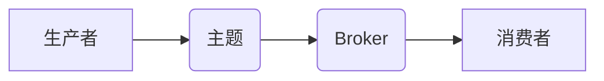

> Kafka, 大数据, 流式处理, 消息队列, 分布式系统, 消费者, 生产者

## 1. 背景介绍

在当今数据爆炸的时代，海量数据实时生成和处理已成为各大企业和机构的核心竞争力。传统的数据库系统难以应对这种高吞吐量、低延迟的数据处理需求。为了解决这一问题，Apache Kafka 应运而生，成为了一种高效、可靠的分布式流式数据处理平台。

Kafka 是一种基于发布/订阅模式的消息队列系统，它能够处理海量数据流，并提供高吞吐量、低延迟、容错等特性。Kafka 的核心设计理念是将数据流存储在分布式日志中，并通过消费者和生产者进行数据处理。

## 2. 核心概念与联系

Kafka 的核心概念包括：

* **主题 (Topic):** 主题是 Kafka 中数据流的分类，类似于数据库中的表。每个主题可以包含多个分区。
* **分区 (Partition):** 分区是主题的数据存储单元，数据会被均匀地分配到不同的分区中。
* **生产者 (Producer):** 生产者负责将数据发送到 Kafka 的主题中。
* **消费者 (Consumer):** 消费者负责从 Kafka 的主题中读取数据并进行处理。
* **Broker:** Broker 是 Kafka 集群中的节点，负责存储和转发数据。

Kafka 的架构可以概括为以下流程：



## 3. 核心算法原理 & 具体操作步骤

### 3.1  算法原理概述

Kafka 的核心算法原理是基于日志的分布式存储和消费机制。

* **日志存储:** Kafka 将数据存储在分布式日志中，每个日志文件对应一个主题的分区。数据会被顺序写入日志文件，并使用 offset 进行标识。
* **消费机制:** 消费者从主题的分区中读取数据，并根据 offset 进行数据消费。消费者可以订阅多个主题，并并行消费数据。

### 3.2  算法步骤详解

1. **生产者发送数据:** 生产者将数据发送到 Kafka 的主题中，数据会被 Broker 接收并写入对应的分区日志文件。
2. **Broker 存储数据:** Broker 将数据写入日志文件，并维护 offset 信息。
3. **消费者订阅主题:** 消费者订阅指定的主题，并指定消费组。
4. **消费者拉取数据:** 消费者从 Broker 拉取数据，并根据 offset 进行消费。
5. **数据处理:** 消费者处理拉取到的数据，并进行相应的业务逻辑处理。

### 3.3  算法优缺点

**优点:**

* 高吞吐量: Kafka 可以处理海量数据流，并提供高吞吐量的数据处理能力。
* 低延迟: Kafka 的数据处理延迟低，能够满足实时数据处理的需求。
* 容错性: Kafka 的分布式架构提供高容错性，即使 Broker 节点出现故障，数据也不会丢失。
* 可扩展性: Kafka 可以轻松扩展，以满足不断增长的数据处理需求。

**缺点:**

* 学习曲线: Kafka 的架构和功能比较复杂，需要一定的学习成本。
* 维护成本: Kafka 的分布式架构需要一定的维护成本，例如 Broker 节点的管理和数据备份。

### 3.4  算法应用领域

Kafka 的应用领域非常广泛，包括：

* **实时数据分析:** Kafka 可以用于收集和处理实时数据，并进行实时分析。
* **日志收集和分析:** Kafka 可以用于收集和分析应用程序的日志数据，帮助发现问题和提高系统性能。
* **消息队列:** Kafka 可以作为消息队列，用于不同系统之间的数据交换。
* **流式计算:** Kafka 可以与流式计算引擎集成，用于进行实时数据处理和分析。

## 4. 数学模型和公式 & 详细讲解 & 举例说明

### 4.1  数学模型构建

Kafka 的数据存储和消费机制可以抽象为以下数学模型：

* **数据流:**  D = {d1, d2, ..., dn}，其中 di 表示数据项。
* **主题:** T = {t1, t2, ..., tm}，其中 ti 表示主题。
* **分区:** P = {p1, p2, ..., pn}，其中 pi 表示分区。
* **offset:** O = {o1, o2, ..., on}，其中 oi 表示数据项的偏移量。

### 4.2  公式推导过程

Kafka 的数据存储和消费机制可以概括为以下公式：

* **数据写入:**  D(t, p) = D(t, p) ∪ {di}，其中 D(t, p) 表示主题 t 分区 p 中的数据集合。
* **数据读取:**  D'(t, p, oi) = D(t, p)[oi]，其中 D'(t, p, oi) 表示从主题 t 分区 p 读取偏移量为 oi 的数据项。

### 4.3  案例分析与讲解

假设有一个主题名为 "user_log"，包含两个分区。生产者将用户登录日志数据写入该主题。消费者订阅该主题，并从每个分区中读取数据进行分析。

当生产者将一条用户登录日志数据写入 "user_log" 主题的第一个分区时，该数据会被写入该分区的日志文件，并分配一个新的 offset 值。消费者订阅该主题，并从第一个分区中读取数据，从 offset 0 开始消费数据。

## 5. 项目实践：代码实例和详细解释说明

### 5.1  开发环境搭建

* Java Development Kit (JDK) 8 或更高版本
* Apache Kafka 
* Maven 或 Gradle

### 5.2  源代码详细实现

```java
import org.apache.kafka.clients.consumer.ConsumerConfig;
import org.apache.kafka.clients.consumer.ConsumerRecord;
import org.apache.kafka.clients.consumer.ConsumerRecords;
import org.apache.kafka.clients.consumer.KafkaConsumer;
import org.apache.kafka.common.serialization.StringDeserializer;

import java.time.Duration;
import java.util.Collections;
import java.util.Properties;

public class KafkaConsumerExample {

    public static void main(String[] args) {
        // Kafka 消费者配置
        Properties props = new Properties();
        props.put(ConsumerConfig.BOOTSTRAP_SERVERS_CONFIG, "localhost:9092");
        props.put(ConsumerConfig.GROUP_ID_CONFIG, "my-group");
        props.put(ConsumerConfig.KEY_DESERIALIZER_CLASS_CONFIG, StringDeserializer.class.getName());
        props.put(ConsumerConfig.VALUE_DESERIALIZER_CLASS_CONFIG, StringDeserializer.class.getName());

        // 创建 Kafka 消费者
        KafkaConsumer<String, String> consumer = new KafkaConsumer<>(props);

        // 订阅主题
        consumer.subscribe(Collections.singletonList("my-topic"));

        // 循环消费数据
        while (true) {
            ConsumerRecords<String, String> records = consumer.poll(Duration.ofMillis(100));
            for (ConsumerRecord<String, String> record : records) {
                System.out.println("Topic: " + record.topic());
                System.out.println("Partition: " + record.partition());
                System.out.println("Offset: " + record.offset());
                System.out.println("Key: " + record.key());
                System.out.println("Value: " + record.value());
            }
        }
    }
}
```

### 5.3  代码解读与分析

* **配置 Kafka 消费者:** 首先，需要配置 Kafka 消费者的属性，包括 Bootstrap 服务地址、消费者组 ID、键和值反序列化器等。
* **创建 Kafka 消费者:** 使用配置属性创建 Kafka 消费者实例。
* **订阅主题:** 消费者订阅指定的主题，以便接收该主题的数据。
* **循环消费数据:** 消费者使用 poll() 方法从 Kafka 集群中拉取数据。poll() 方法会阻塞一段时间，直到有新的数据可用。
* **处理数据:** 消费者处理拉取到的数据，并进行相应的业务逻辑处理。

### 5.4  运行结果展示

当运行代码时，消费者会从 "my-topic" 主题中读取数据，并打印到控制台。

## 6. 实际应用场景

Kafka 在各种实际应用场景中发挥着重要作用，例如：

* **实时数据分析:** Kafka 可以用于收集和处理实时数据，并进行实时分析。例如，电商平台可以使用 Kafka 收集用户行为数据，并进行实时分析，以优化商品推荐和营销策略。
* **日志收集和分析:** Kafka 可以用于收集和分析应用程序的日志数据，帮助发现问题和提高系统性能。例如，网站运营人员可以使用 Kafka 收集网站访问日志，并进行分析，以了解用户访问行为和网站性能。
* **消息队列:** Kafka 可以作为消息队列，用于不同系统之间的数据交换。例如，电商平台可以使用 Kafka 将订单信息发送到支付系统，并接收支付结果。
* **流式计算:** Kafka 可以与流式计算引擎集成，用于进行实时数据处理和分析。例如，金融机构可以使用 Kafka 和 Spark Streaming 进行实时交易数据分析。

### 6.4  未来应用展望

随着数据量的不断增长和实时数据处理需求的增加，Kafka 的应用场景将会更加广泛。未来，Kafka 可能在以下领域得到更广泛的应用：

* **物联网:** Kafka 可以用于处理物联网设备产生的海量数据，并进行实时分析和控制。
* **人工智能:** Kafka 可以用于收集和处理人工智能训练数据，并提高人工智能模型的训练效率。
* **边缘计算:** Kafka 可以部署在边缘设备上，用于处理边缘计算数据，并降低数据传输成本。

## 7. 工具和资源推荐

### 7.1  学习资源推荐

* **Apache Kafka 官方文档:** https://kafka.apache.org/documentation/
* **Kafka 入门教程:** https://www.tutorialspoint.com/kafka/index.htm
* **Kafka 中文社区:** https://www.cnblogs.com/kafka/

### 7.2  开发工具推荐

* **Kafka Manager:** https://kafka-manager.github.io/
* **Confluent Control Center:** https://www.confluent.io/products/control-center/

### 7.3  相关论文推荐

* **Kafka: A Distributed Streaming Platform:** https://static.confluent.io/downloads/whitepapers/Kafka-Whitepaper.pdf

## 8. 总结：未来发展趋势与挑战

### 8.1  研究成果总结

Kafka 作为一种高效、可靠的分布式流式数据处理平台，在数据处理领域取得了显著的成果。其高吞吐量、低延迟、容错性等特性使其成为各种应用场景的首选。

### 8.2  未来发展趋势

未来，Kafka 将继续朝着以下方向发展：

* **更强大的数据处理能力:** Kafka 将继续提升数据处理能力，以应对海量数据流的处理需求。
* **更完善的生态系统:** Kafka 的生态系统将不断完善，提供更多工具和服务，方便用户使用和管理 Kafka。
* **更广泛的应用场景:** Kafka 将应用于更多领域，例如物联网、人工智能等。

### 8.3  面临的挑战

Kafka 也面临一些挑战，例如：

* **复杂性:** Kafka 的架构和功能比较复杂，需要一定的学习成本。
* **维护成本:** Kafka 的分布式架构需要一定的维护成本，例如 Broker 节点的管理和数据备份。
* **安全问题:** Kafka 需要考虑数据安全问题，例如数据加密和访问控制。

### 8.4  研究展望

未来，研究者将继续探索 Kafka 的新应用场景，并解决其面临的挑战，使其成为更强大、更可靠的分布式流式数据处理平台。

## 9. 附录：常见问题与解答

* **Kafka 的数据存储方式是什么？**

Kafka 使用日志存储数据，每个日志文件对应一个主题的分区。

* **Kafka 的消费者如何消费数据？**

消费者订阅主题，并从主题的分区中拉取数据进行消费。

* **Kafka 的数据可靠性如何保证？**

Kafka