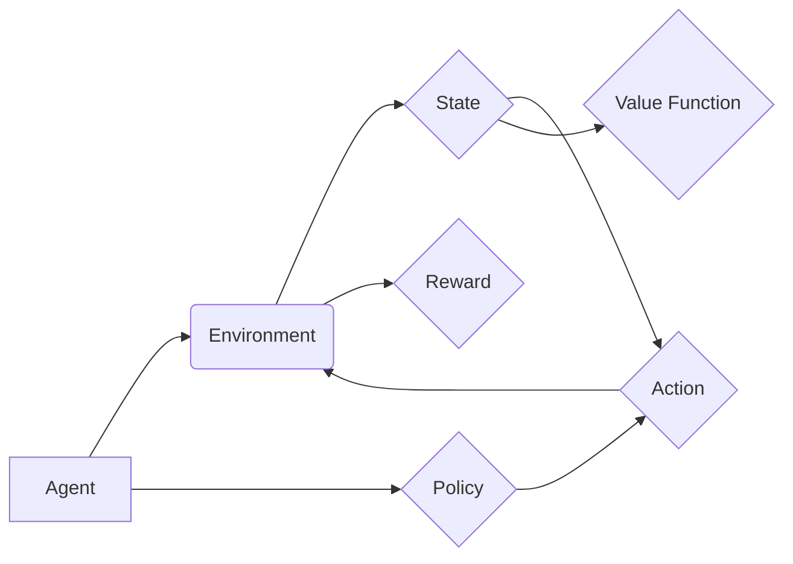

> 强化学习，RL，深度强化学习，Q学习，SARSA，Bellman方程，价值函数，策略梯度

## 1. 背景介绍

在人工智能领域，强化学习 (Reinforcement Learning, RL) 作为一种学习方式，近年来备受关注。它与监督学习和无监督学习不同，强化学习算法通过与环境的交互，学习最优的策略来最大化累积的奖励。

想象一下，一个机器人需要学习如何玩一个游戏。它不会被直接告知如何玩，而是通过与游戏环境的交互，尝试不同的动作，并根据游戏给予的奖励或惩罚来调整自己的策略。最终，它会学习到一个能够获得最高奖励的策略。这就是强化学习的基本原理。

强化学习在许多领域都有广泛的应用，例如：

* **游戏 AI:** 训练游戏中的 AI 玩家，使其能够与人类玩家进行竞争。
* **机器人控制:** 训练机器人完成各种任务，例如导航、抓取和操作。
* **推荐系统:** 建立个性化的推荐系统，推荐用户感兴趣的内容。
* **金融交易:** 开发自动交易策略，进行股票、期货等金融资产的交易。

## 2. 核心概念与联系

强化学习的核心概念包括：

* **Agent (智能体):** 与环境交互的实体，例如机器人、游戏玩家或算法模型。
* **Environment (环境):** 智能体所处的外部世界，它会根据智能体的动作做出相应的反应。
* **State (状态):** 环境在某个时刻的描述，例如游戏中的棋盘状态或机器人的位置。
* **Action (动作):** 智能体可以采取的行动，例如移动、攻击或选择一个选项。
* **Reward (奖励):** 环境对智能体动作的反馈，可以是正向奖励或负向惩罚。
* **Policy (策略):** 智能体在不同状态下采取动作的规则，它决定了智能体在每个状态下应该采取什么动作。
* **Value Function (价值函数):** 评估智能体在某个状态下采取某个动作的长期价值。

**核心概念关系图:**



## 3. 核心算法原理 & 具体操作步骤

### 3.1  算法原理概述

强化学习算法的核心是通过不断与环境交互，学习最优的策略。常见的强化学习算法包括 Q 学习和 SARSA。

* **Q 学习:** 是一种基于价值函数的强化学习算法，它通过学习状态-动作对的价值函数来决定最优的策略。
* **SARSA:** 是一种基于策略的强化学习算法，它通过学习策略本身来决定最优的行动。

### 3.2  算法步骤详解

**Q 学习算法步骤:**

1. 初始化 Q 函数，将所有状态-动作对的价值函数设置为 0。
2. 在环境中进行交互，观察状态、采取动作、获得奖励和进入下一个状态。
3. 更新 Q 函数，使用 Bellman 方程：

 $$Q(s,a) \leftarrow Q(s,a) + \alpha [r + \gamma \max_{a'} Q(s',a') - Q(s,a)]$$

其中：

* $Q(s,a)$ 是状态 $s$ 下采取动作 $a$ 的价值函数。
* $\alpha$ 是学习率，控制着学习速度。
* $r$ 是获得的奖励。
* $\gamma$ 是折扣因子，控制着未来奖励的权重。
* $s'$ 是下一个状态。
* $a'$ 是在下一个状态 $s'$ 下采取的动作。

4. 重复步骤 2 和 3，直到 Q 函数收敛。

**SARSA 算法步骤:**

1. 初始化 Q 函数，将所有状态-动作对的价值函数设置为 0。
2. 在环境中进行交互，观察状态、采取动作、获得奖励和进入下一个状态。
3. 更新 Q 函数，使用 Bellman 方程：

 $$Q(s,a) \leftarrow Q(s,a) + \alpha [r + \gamma Q(s',a') - Q(s,a)]$$

其中：

* $Q(s,a)$ 是状态 $s$ 下采取动作 $a$ 的价值函数。
* $\alpha$ 是学习率，控制着学习速度。
* $r$ 是获得的奖励。
* $\gamma$ 是折扣因子，控制着未来奖励的权重。
* $s'$ 是下一个状态。
* $a'$ 是在下一个状态 $s'$ 下采取的动作。

4. 重复步骤 2 和 3，直到 Q 函数收敛。

### 3.3  算法优缺点

**Q 学习:**

* **优点:** 能够学习最优策略，收敛速度快。
* **缺点:** 需要探索所有状态-动作对，容易陷入局部最优。

**SARSA:**

* **优点:** 能够在线学习，不会陷入局部最优。
* **缺点:** 收敛速度慢，可能无法学习到最优策略。

### 3.4  算法应用领域

* **游戏 AI:** 训练游戏中的 AI 玩家，使其能够与人类玩家进行竞争。
* **机器人控制:** 训练机器人完成各种任务，例如导航、抓取和操作。
* **推荐系统:** 建立个性化的推荐系统，推荐用户感兴趣的内容。
* **金融交易:** 开发自动交易策略，进行股票、期货等金融资产的交易。

## 4. 数学模型和公式 & 详细讲解 & 举例说明

### 4.1  数学模型构建

强化学习的核心数学模型是价值函数和策略函数。

* **价值函数:** 评估智能体在某个状态下采取某个动作的长期价值。

$$V(s) = E[\sum_{t=0}^{\infty} \gamma^t r_{t+1} | s_t = s]$$

其中：

* $V(s)$ 是状态 $s$ 的价值函数。
* $E$ 表示期望值。
* $r_{t+1}$ 是在时间步 $t+1$ 获得的奖励。
* $\gamma$ 是折扣因子，控制着未来奖励的权重。

* **策略函数:** 决定智能体在每个状态下应该采取什么动作。

$$\pi(a|s) = P(a|s)$$

其中：

* $\pi(a|s)$ 是在状态 $s$ 下采取动作 $a$ 的概率。

### 4.2  公式推导过程

Bellman 方程是强化学习算法的核心公式，它描述了价值函数的更新规则。

$$V(s) = \max_a \sum_{s'} P(s'|s,a) [r(s,a,s') + \gamma V(s')]$$

其中：

* $V(s)$ 是状态 $s$ 的价值函数。
* $a$ 是智能体可以采取的动作。
* $s'$ 是下一个状态。
* $P(s'|s,a)$ 是从状态 $s$ 采取动作 $a$ 进入状态 $s'$ 的概率。
* $r(s,a,s')$ 是在状态 $s$ 采取动作 $a$ 进入状态 $s'$ 获得的奖励。
* $\gamma$ 是折扣因子。

### 4.3  案例分析与讲解

假设一个机器人需要学习如何从起点走到终点。环境可以被表示为一个网格，机器人可以采取向上、向下、向左、向右四个动作。每个格子都有一个奖励值，到达终点获得最大奖励。

使用 Q 学习算法，我们可以学习机器人最优的策略。

1. 初始化 Q 函数，将所有状态-动作对的价值函数设置为 0。
2. 机器人从起点开始，随机采取动作，观察奖励和下一个状态。
3. 使用 Bellman 方程更新 Q 函数，根据获得的奖励和下一个状态的价值函数来调整当前状态-动作对的价值函数。
4. 重复步骤 2 和 3，直到 Q 函数收敛。

最终，机器人会学习到一个能够从起点走到终点并获得最大奖励的策略。

## 5. 项目实践：代码实例和详细解释说明

### 5.1  开发环境搭建

* Python 3.x
* TensorFlow 或 PyTorch

### 5.2  源代码详细实现

```python
import numpy as np

# 定义环境
class Environment:
    def __init__(self):
        self.state = (0, 0)  # 初始状态
        self.goal = (4, 4)  # 目标状态
        self.rewards = np.zeros((5, 5))  # 奖励矩阵
        self.rewards[4, 4] = 10  # 目标状态奖励

    def step(self, action):
        # 根据动作更新状态
        if action == 0:  # 上
            self.state = (self.state[0] - 1, self.state[1])
        elif action == 1:  # 下
            self.state = (self.state[0] + 1, self.state[1])
        elif action == 2:  # 左
            self.state = (self.state[0], self.state[1] - 1)
        elif action == 3:  # 右
            self.state = (self.state[0], self.state[1] + 1)

        # 检查是否到达目标状态
        if self.state == self.goal:
            return self.state, 10, True
        else:
            return self.state, self.rewards[self.state[0], self.state[1]], False

# 定义 Q 学习算法
class QLearning:
    def __init__(self, env, alpha=0.1, gamma=0.9, epsilon=0.1):
        self.env = env
        self.alpha = alpha  # 学习率
        self.gamma = gamma  # 折扣因子
        self.epsilon = epsilon  # 探索率
        self.q_table = np.zeros((5, 5, 4))  # Q 表

    def choose_action(self, state):
        # 根据 epsilon-greedy 策略选择动作
        if np.random.uniform(0, 1) < self.epsilon:
            return np.random.choice(4)
        else:
            return np.argmax(self.q_table[state[0], state[1]])

    def update_q_table(self, state, action, reward, next_state):
        # 更新 Q 表
        self.q_table[state[0], state[1], action] += self.alpha * (
            reward + self.gamma * np.max(self.q_table[next_state[0], next_state[1]]) - self.q_table[state[0], state[1], action]
        )

    def train(self, episodes=1000):
        for episode in range(episodes):
            state = self.env.state
            done = False
            while not done:
                action = self.choose_action(state)
                next_state, reward, done = self.env.step(action)
                self.update_q_table(state, action, reward, next_state)
                state = next_state

# 创建环境和 Q 学习算法
env = Environment()
agent = QLearning(env)
agent.train()

# 测试策略
state = env.state
while state != env.goal:
    action = agent.choose_action(state)
    next_state, reward, done = env.step(action)
    state = next_state
```

### 5.3  代码解读与分析

* **环境类:** 定义了环境的结构和行为，包括状态、动作、奖励和转移概率。
* **Q 学习类:** 实现 Q 学习算法的核心逻辑，包括选择动作、更新 Q 表和训练过程。
* **训练过程:** 通过循环