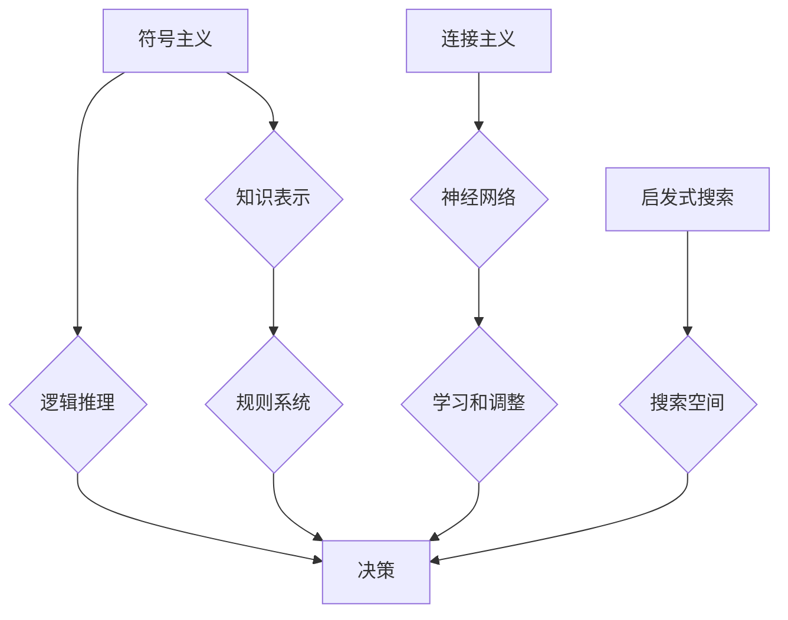

> 人工智能、早期方向、机器学习、专家系统、自然语言处理、计算机视觉、逻辑推理

## 1. 背景介绍

人工智能（Artificial Intelligence，简称AI）作为一门跨学科领域，旨在创建能够像人类一样思考、学习和解决问题智能机器。自20世纪50年代诞生以来，AI研究经历了多次兴衰，但始终是科技发展前沿的热点领域。

早期的人工智能研究主要集中在模拟人类智能的特定能力，例如：

* **逻辑推理**:  利用符号逻辑和规则系统进行推理和决策。
* **自然语言处理**:  使计算机能够理解和生成人类语言。
* **计算机视觉**:  使计算机能够“看”图像并从中提取信息。
* **游戏人工智能**:  开发能够与人类进行游戏并胜出的智能体。

这些早期研究成果为现代人工智能的发展奠定了基础，但也面临着诸多挑战，例如：

* **知识表示**: 如何有效地表示和存储人类知识，使其可供计算机理解和利用。
* **学习能力**: 如何使计算机能够从数据中学习和改进，而不是仅仅依赖预先编程的规则。
* **通用智能**: 如何开发能够像人类一样具备多种智能能力的通用人工智能系统。

## 2. 核心概念与联系

早期人工智能研究的核心概念包括：

* **符号主义**:  认为智能可以被表示为符号和规则的组合，并通过逻辑推理进行操作。
* **连接主义**:  认为智能源于神经网络的结构和连接，通过学习和调整连接权重来实现。
* **启发式搜索**:  利用启发式策略来加速搜索空间的探索，找到最优或近似最优的解决方案。

这些概念相互关联，共同构成了早期人工智能研究的理论基础。

**Mermaid 流程图**



## 3. 核心算法原理 & 具体操作步骤

### 3.1  算法原理概述

早期人工智能研究中，许多核心算法都基于符号主义和逻辑推理的原理。例如，**专家系统**是一种基于规则和知识库的推理系统，能够模拟人类专家在特定领域的决策能力。

### 3.2  算法步骤详解

**专家系统开发步骤：**

1. **知识获取**: 从专家那里收集和整理相关领域知识，并将其转化为可供计算机理解的规则和事实。
2. **知识表示**: 使用符号逻辑或其他知识表示语言，将知识表示为计算机可处理的形式。
3. **推理引擎**: 开发一个推理引擎，能够根据知识库中的规则和事实进行逻辑推理，并得出结论。
4. **用户界面**: 设计一个用户友好的界面，方便用户与专家系统进行交互。

### 3.3  算法优缺点

**专家系统优点：**

* 可以模拟人类专家的决策能力。
* 可以处理复杂的问题，并提供详细的推理过程。
* 可以提高决策的效率和准确性。

**专家系统缺点：**

* 知识获取和表示过程复杂，需要大量的人工投入。
* 难以处理不确定性和模糊性问题。
* 知识库的更新和维护需要持续的努力。

### 3.4  算法应用领域

专家系统广泛应用于医疗诊断、金融分析、法律咨询、工业控制等领域。

## 4. 数学模型和公式 & 详细讲解 & 举例说明

### 4.1  数学模型构建

早期人工智能研究中，许多算法都基于数学模型和公式进行实现。例如，**逻辑推理**可以使用命题逻辑、谓词逻辑等数学工具进行建模和推理。

### 4.2  公式推导过程

**命题逻辑的蕴涵规则**:

如果 A 和 B 是命题，则如果 A 为真，那么 B 也为真，则称 A 蕴涵 B，记为 A ⇒ B。

**推导过程**:

1. 假设 A 为真。
2. 根据 A ⇒ B，则 B 也为真。

### 4.3  案例分析与讲解

**案例**:

* A: “今天是星期天”
* B: “我今天可以休息”

**推理**:

* 如果 A 为真（今天是星期天），则 B 也为真（我可以休息）。

**公式**:

A ⇒ B

**解释**:

这个例子说明了命题逻辑中的蕴涵规则，即如果 A 为真，那么 B 也为真。

## 5. 项目实践：代码实例和详细解释说明

### 5.1  开发环境搭建

可以使用 Python 语言和相关库（例如：Pygame、OpenCV）进行人工智能项目开发。

### 5.2  源代码详细实现

以下是一个简单的基于符号主义的逻辑推理程序的代码示例：

```python
# 知识库
knowledge_base = {
    "星期天": ["休息"],
    "星期一": ["工作"],
    "今天": "星期天"
}

# 推理引擎
def infer(query):
    for fact in knowledge_base:
        if fact in query:
            return knowledge_base[fact]
    return None

# 查询
query = "今天"
result = infer(query)

# 输出结果
if result:
    print(f"根据知识库，{query} 的结论是：{result}")
else:
    print(f"无法根据知识库推断出{query} 的结论")
```

### 5.3  代码解读与分析

这个程序首先定义了一个知识库，其中包含了一些关于星期几和活动的关系。然后，它定义了一个推理引擎，可以根据查询语句从知识库中查找相关信息并返回结论。最后，它演示了如何使用这个程序进行查询和输出结果。

### 5.4  运行结果展示

```
根据知识库，今天的结论是：休息
```

## 6. 实际应用场景

早期人工智能研究的成果在许多实际应用场景中发挥了重要作用，例如：

* **专家系统**: 在医疗诊断、金融分析、法律咨询等领域，专家系统能够帮助专家做出更准确的决策。
* **自然语言处理**: 自然语言处理技术被应用于机器翻译、文本摘要、聊天机器人等领域。
* **计算机视觉**: 计算机视觉技术被应用于图像识别、目标检测、人脸识别等领域。

## 7. 工具和资源推荐

### 7.1  学习资源推荐

* **书籍**:
    * 《人工智能：现代方法》
    * 《人工智能导论》
    * 《深度学习》
* **在线课程**:
    * Coursera 上的《人工智能》课程
    * edX 上的《机器学习》课程

### 7.2  开发工具推荐

* **Python**: 广泛用于人工智能开发，拥有丰富的库和工具。
* **TensorFlow**: 深度学习框架，用于构建和训练神经网络模型。
* **PyTorch**: 深度学习框架，以其灵活性和易用性而闻名。

### 7.3  相关论文推荐

* **《人工智能的逻辑基础》**: 奠定了人工智能研究的逻辑基础。
* **《感知机》**: 提出了第一个神经网络模型。
* **《深度学习》**: 介绍了深度学习的原理和应用。

## 8. 总结：未来发展趋势与挑战

早期人工智能研究取得了显著成果，但也面临着诸多挑战。未来人工智能的发展趋势包括：

* **更强大的计算能力**: 更强大的计算能力将推动更复杂和更智能的人工智能模型的开发。
* **更丰富的训练数据**: 更丰富的训练数据将使人工智能模型能够学习更复杂的知识和技能。
* **更有效的算法**: 更有效的算法将提高人工智能模型的效率和准确性。

然而，人工智能的发展也面临着一些挑战，例如：

* **伦理问题**: 人工智能的应用可能会带来一些伦理问题，例如算法偏见、隐私泄露等。
* **安全问题**: 人工智能系统可能被恶意攻击，导致安全风险。
* **可解释性问题**: 许多人工智能模型是黑箱模型，难以解释其决策过程。

## 9. 附录：常见问题与解答

**常见问题**:

* 人工智能与机器学习有什么区别？
* 深度学习是什么？
* 人工智能的未来发展趋势是什么？

**解答**:

* 人工智能是一个广义的概念，而机器学习是人工智能的一种具体实现方式。
* 深度学习是一种基于多层神经网络的机器学习方法。
* 人工智能的未来发展趋势包括更强大的计算能力、更丰富的训练数据、更有效的算法等。


作者：禅与计算机程序设计艺术 / Zen and the Art of Computer Programming 
<end_of_turn>