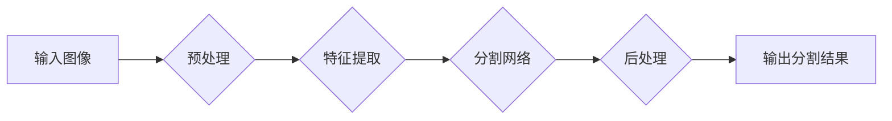

> 图像分割、卷积神经网络、U-Net、语义分割、实例分割、深度学习、计算机视觉

## 1. 背景介绍

图像分割是计算机视觉领域的核心任务之一，它旨在将图像划分为多个相互独立的区域，每个区域代表着图像中不同的物体或场景。图像分割技术在许多领域都有广泛的应用，例如：

* **医学图像分析:** 用于识别和分割人体器官、肿瘤等，辅助医生进行诊断和治疗。
* **自动驾驶:** 用于识别道路、行人、车辆等，帮助车辆进行安全驾驶。
* **遥感图像分析:** 用于识别和分割土地覆盖类型、植被类型等，辅助农业生产和环境监测。
* **图像编辑:** 用于抠图、背景替换等，提高图像的编辑效果。

随着深度学习技术的快速发展，基于卷积神经网络的图像分割算法取得了显著的进展，在精度、速度和鲁棒性方面都取得了突破。

## 2. 核心概念与联系

图像分割可以分为两种主要类型：

* **语义分割:** 将图像中的每个像素都分配到一个预定义的类别，例如“天空”、“道路”、“人”等。
* **实例分割:** 将图像中的每个实例都分割出来，并为每个实例分配一个唯一的标签。

**Mermaid 流程图:**



## 3. 核心算法原理 & 具体操作步骤

### 3.1  算法原理概述

U-Net 是一种专门用于图像分割的卷积神经网络架构，它由一个编码器和一个解码器组成。编码器负责提取图像的特征，解码器负责将提取的特征进行上采样和融合，最终生成分割结果。

U-Net 的特点是：

* **跳跃连接:** 在解码器中，每个层都与编码器中对应的层进行连接，这样可以保留图像的语义信息和细节信息。
* **全卷积网络:** U-Net 使用全卷积网络结构，可以对图像进行任意大小的分割。
* **数据增强:** U-Net 可以通过数据增强技术，例如旋转、翻转、缩放等，来提高模型的泛化能力。

### 3.2  算法步骤详解

1. **输入图像预处理:** 将输入图像进行尺寸调整、归一化等预处理操作。
2. **特征提取:** 将预处理后的图像输入到编码器中，编码器通过多个卷积层和池化层提取图像的特征。
3. **跳跃连接:** 将编码器中每个层的特征与解码器中对应的层进行连接，保留图像的语义信息和细节信息。
4. **上采样和融合:** 解码器通过上采样层和卷积层将提取的特征进行上采样和融合，最终生成分割结果。
5. **后处理:** 对分割结果进行一些后处理操作，例如去除噪声、填充边界等。

### 3.3  算法优缺点

**优点:**

* 精度高: U-Net 在图像分割任务中取得了很好的效果。
* 训练效率高: U-Net 的训练速度相对较快。
* 可扩展性强: U-Net 可以很容易地扩展到其他图像分割任务中。

**缺点:**

* 参数量大: U-Net 的参数量相对较大，需要较大的计算资源进行训练。
* 对于小目标分割效果较差: U-Net 在分割小目标时效果可能不如其他算法。

### 3.4  算法应用领域

U-Net 广泛应用于以下领域:

* 医学图像分割: 识别肿瘤、器官、血管等。
* 自动驾驶: 分割道路、行人、车辆等。
* 遥感图像分析: 分割土地覆盖类型、植被类型等。
* 其他领域: 文本识别、目标检测等。

## 4. 数学模型和公式 & 详细讲解 & 举例说明

### 4.1  数学模型构建

U-Net 的数学模型可以概括为以下公式:

$$
y = f(x; \theta)
$$

其中:

* $y$ 是分割结果，是一个包含每个像素类别概率的向量。
* $x$ 是输入图像。
* $f$ 是 U-Net 网络的函数，由多个卷积层、池化层和上采样层组成。
* $\theta$ 是网络的参数。

### 4.2  公式推导过程

U-Net 的具体公式推导过程比较复杂，涉及到卷积、池化、激活函数等多个数学概念。这里不再详细推导，可以参考相关文献进行学习。

### 4.3  案例分析与讲解

假设我们有一个输入图像，包含一个红色的苹果和一个绿色的香蕉。U-Net 将会将每个像素都分配到一个类别，例如“苹果”或“香蕉”。

对于每个像素，U-Net 会计算出它属于每个类别的概率。例如，对于一个红色的像素，它的“苹果”类别概率会比较高，而“香蕉”类别概率会比较低。

最终，U-Net 会根据每个像素的类别概率，生成一个分割结果，将图像分割成两个区域，分别代表苹果和香蕉。

## 5. 项目实践：代码实例和详细解释说明

### 5.1  开发环境搭建

* Python 3.6+
* TensorFlow 2.0+
* Keras 2.0+
* OpenCV 4.0+

### 5.2  源代码详细实现

```python
import tensorflow as tf
from tensorflow.keras.layers import Input, Conv2D, MaxPooling2D, UpSampling2D, concatenate
from tensorflow.keras.models import Model

def unet(input_shape=(256, 256, 3), num_classes=1):
    inputs = Input(input_shape)

    # Encoder
    conv1 = Conv2D(64, 3, activation='relu', padding='same')(inputs)
    conv1 = Conv2D(64, 3, activation='relu', padding='same')(conv1)
    pool1 = MaxPooling2D(pool_size=(2, 2))(conv1)

    conv2 = Conv2D(128, 3, activation='relu', padding='same')(pool1)
    conv2 = Conv2D(128, 3, activation='relu', padding='same')(conv2)
    pool2 = MaxPooling2D(pool_size=(2, 2))(conv2)

    conv3 = Conv2D(256, 3, activation='relu', padding='same')(pool2)
    conv3 = Conv2D(256, 3, activation='relu', padding='same')(conv3)
    pool3 = MaxPooling2D(pool_size=(2, 2))(conv3)

    conv4 = Conv2D(512, 3, activation='relu', padding='same')(pool3)
    conv4 = Conv2D(512, 3, activation='relu', padding='same')(conv4)
    pool4 = MaxPooling2D(pool_size=(2, 2))(conv4)

    # Bottleneck
    conv5 = Conv2D(1024, 3, activation='relu', padding='same')(pool4)
    conv5 = Conv2D(1024, 3, activation='relu', padding='same')(conv5)

    # Decoder
    up6 = UpSampling2D(size=(2, 2))(conv5)
    merge6 = concatenate([up6, conv4], axis=3)
    conv6 = Conv2D(512, 3, activation='relu', padding='same')(merge6)
    conv6 = Conv2D(512, 3, activation='relu', padding='same')(conv6)

    up7 = UpSampling2D(size=(2, 2))(conv6)
    merge7 = concatenate([up7, conv3], axis=3)
    conv7 = Conv2D(256, 3, activation='relu', padding='same')(merge7)
    conv7 = Conv2D(256, 3, activation='relu', padding='same')(conv7)

    up8 = UpSampling2D(size=(2, 2))(conv7)
    merge8 = concatenate([up8, conv2], axis=3)
    conv8 = Conv2D(128, 3, activation='relu', padding='same')(merge8)
    conv8 = Conv2D(128, 3, activation='relu', padding='same')(conv8)

    up9 = UpSampling2D(size=(2, 2))(conv8)
    merge9 = concatenate([up9, conv1], axis=3)
    conv9 = Conv2D(64, 3, activation='relu', padding='same')(merge9)
    conv9 = Conv2D(64, 3, activation='relu', padding='same')(conv9)

    outputs = Conv2D(num_classes, 1, activation='softmax')(conv9)

    model = Model(inputs=inputs, outputs=outputs)
    return model

# 实例化模型
model = unet(input_shape=(256, 256, 3), num_classes=2)

# 打印模型结构
model.summary()
```

### 5.3  代码解读与分析

* **unet 函数:** 定义了 U-Net 模型的结构。
* **Encoder:** 负责提取图像的特征，由多个卷积层和池化层组成。
* **Bottleneck:** 负责连接编码器和解码器，是一个全连接层。
* **Decoder:** 负责将提取的特征进行上采样和融合，最终生成分割结果。
* **concatenate 函数:** 将两个张量沿着指定轴进行拼接。
* **UpSampling2D 函数:** 将输入张量进行上采样。
* **Conv2D 函数:** 定义了一个二维卷积层。
* **MaxPooling2D 函数:** 定义了一个最大池化层。
* **softmax 函数:** 将输出张量转换为概率分布。

### 5.4  运行结果展示

运行代码后，可以得到 U-Net 模型的分割结果。分割结果是一个包含每个像素类别概率的图像。

## 6. 实际应用场景

### 6.1  医学图像分析

U-Net 在医学图像分析中应用广泛，例如：

* **肿瘤分割:** 识别和分割肿瘤区域，辅助医生进行诊断和治疗。
* **器官分割:** 识别和分割人体器官，例如心脏、肺、肝脏等，用于医学研究和临床诊断。
* **血管分割:** 识别和分割血管，用于诊断血管疾病和规划手术。

### 6.2  自动驾驶

U-Net 在自动驾驶中用于分割道路、行人、车辆等，帮助车辆进行安全驾驶。

### 6.3  遥感图像分析

U-Net 在遥感图像分析中用于分割土地覆盖类型、植被类型等，用于农业生产和环境监测。

### 6.4  未来应用展望

U-Net 的应用前景非常广阔，未来可能会应用于更多领域，例如：

* **机器人视觉:** 用于帮助机器人识别和理解周围环境。
* **视频分析:** 用于分割视频中的物体和场景。
* **增强现实:** 用于将虚拟物体叠加到现实世界中。

## 7. 工具和资源推荐

### 7.1  学习资源推荐

* **论文:** U-Net: Convolutional Networks for Biomedical Image Segmentation
* **博客:** https://blog.keras.io/building-autoencoders-in-keras/
* **教程:** https://www.tensorflow.org/tutorials/images/segmentation

### 7.2  开发工具推荐

* **TensorFlow:** https://www.tensorflow.org/
