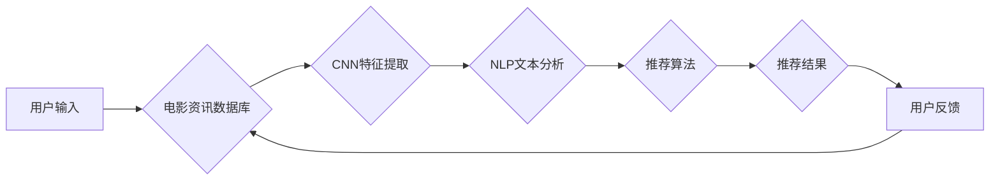

> CNN, 电影推荐, 资讯App, 深度学习, 自然语言处理

## 1. 背景介绍

随着互联网和移动技术的快速发展，人们获取信息的方式发生了巨大变化。电影资讯作为一种重要的文化娱乐信息，也逐渐向移动端转移。传统的电影资讯App主要依靠人工编辑和关键词搜索，难以满足用户个性化需求和快速获取信息的需求。

深度学习技术近年来取得了突破性进展，特别是卷积神经网络（CNN）在图像识别、自然语言处理等领域取得了优异的性能。CNN能够自动学习特征，并对复杂数据进行高效处理，为电影资讯推荐提供了新的思路。

基于CNN的电影资讯推荐App能够根据用户的观看历史、评分、评论等信息，自动学习用户的兴趣偏好，并推荐符合用户需求的电影资讯。

## 2. 核心概念与联系

### 2.1  电影资讯推荐系统

电影资讯推荐系统旨在根据用户的兴趣和偏好，推荐相关的电影资讯，例如电影预告片、影评、幕后花絮等。

### 2.2  CNN（卷积神经网络）

CNN是一种专门用于处理图像数据的深度学习网络结构。它通过卷积层、池化层和全连接层等结构，能够自动学习图像特征，并进行分类、识别等任务。

### 2.3  自然语言处理（NLP）

NLP是计算机科学的一个分支，旨在使计算机能够理解和处理人类语言。在电影资讯推荐系统中，NLP技术可以用于分析用户评论、影评等文本数据，提取用户兴趣和偏好信息。

**核心架构流程图**



## 3. 核心算法原理 & 具体操作步骤

### 3.1  算法原理概述

基于CNN的电影资讯推荐算法主要包括以下步骤：

1. **数据预处理:** 对电影资讯数据进行清洗、格式化和特征提取。
2. **CNN特征提取:** 使用CNN模型提取电影资讯的视觉特征，例如电影海报、剧照等。
3. **NLP文本分析:** 使用NLP技术分析电影评论、影评等文本数据，提取用户兴趣和偏好信息。
4. **特征融合:** 将CNN提取的视觉特征和NLP分析的文本特征进行融合，形成综合特征向量。
5. **推荐算法:** 使用协同过滤、矩阵分解等推荐算法，根据用户的兴趣偏好和电影资讯的特征向量，推荐符合用户需求的电影资讯。

### 3.2  算法步骤详解

1. **数据预处理:**

   - 清洗数据：去除重复数据、无效数据和噪声数据。
   - 格式化数据：将数据转换为统一的格式，方便后续处理。
   - 特征提取：提取电影资讯的特征，例如电影标题、导演、演员、类型、评分等。

2. **CNN特征提取:**

   - 选择合适的CNN模型，例如VGG、ResNet等。
   - 对电影海报、剧照等图像数据进行预处理，例如调整尺寸、归一化等。
   - 将预处理后的图像数据输入CNN模型，提取图像特征。

3. **NLP文本分析:**

   - 使用词向量模型，例如Word2Vec、GloVe等，将文本数据转换为向量表示。
   - 使用文本分类模型，例如BERT、LSTM等，分析电影评论、影评等文本数据，提取用户兴趣和偏好信息。

4. **特征融合:**

   - 将CNN提取的视觉特征和NLP分析的文本特征进行融合，形成综合特征向量。
   - 可以使用加权平均、拼接等方法进行特征融合。

5. **推荐算法:**

   - 使用协同过滤算法，根据用户的观看历史和电影的相似度进行推荐。
   - 使用矩阵分解算法，将用户和电影的评分矩阵进行分解，预测用户对电影的评分。
   - 使用深度学习算法，例如深度协同过滤、深度矩阵分解等，进行更精准的推荐。

### 3.3  算法优缺点

**优点:**

- 能够自动学习用户兴趣和偏好，提供个性化推荐。
- 能够处理海量数据，提高推荐效率。
- 能够融合多种数据类型，例如视觉特征和文本特征，提高推荐准确率。

**缺点:**

- 需要大量的训练数据，训练成本较高。
- 对数据质量要求较高，数据不纯净会导致推荐效果下降。
- 算法复杂度较高，需要专业的技术人员进行开发和维护。

### 3.4  算法应用领域

基于CNN的电影资讯推荐算法广泛应用于以下领域：

- 电影资讯App
- 流媒体平台
- 电影院线
- 电影制作公司

## 4. 数学模型和公式 & 详细讲解 & 举例说明

### 4.1  数学模型构建

**用户-电影评分矩阵:**

设用户集合为U，电影集合为M，用户-电影评分矩阵为R，其中R(u,m)表示用户u对电影m的评分。

**协同过滤模型:**

协同过滤模型假设用户对相似电影的评分也相似。

**矩阵分解模型:**

矩阵分解模型将用户-电影评分矩阵分解成两个低维矩阵，分别表示用户特征和电影特征。

### 4.2  公式推导过程

**协同过滤模型:**

用户u对电影m的评分预测为：

```
R̂(u,m) = Σ_{v∈N(u)} (R(u,v) * S(u,v,m)) / Σ_{v∈N(u)} S(u,v,m)
```

其中：

- R̂(u,m) 是用户u对电影m的评分预测。
- R(u,v) 是用户u对电影v的评分。
- N(u) 是用户u的邻居用户集合。
- S(u,v,m) 是用户u和用户v对电影m的相似度。

**矩阵分解模型:**

用户-电影评分矩阵R可以分解成两个低维矩阵：

```
R ≈ U * V^T
```

其中：

- U 是用户特征矩阵。
- V^T 是电影特征矩阵的转置。

### 4.3  案例分析与讲解

**案例:**

假设有一个用户-电影评分矩阵，其中用户集合为{u1, u2, u3}, 电影集合为{m1, m2, m3}, 评分矩阵为：

```
R = [
    [5, 4, 3],
    [3, 5, 4],
    [4, 3, 5]
]
```

**协同过滤模型:**

可以使用用户的评分历史和电影之间的相似度来预测用户对未观看电影的评分。

**矩阵分解模型:**

可以使用矩阵分解算法将评分矩阵分解成用户特征矩阵和电影特征矩阵，从而预测用户对未观看电影的评分。

## 5. 项目实践：代码实例和详细解释说明

### 5.1  开发环境搭建

- 操作系统：Windows/macOS/Linux
- Python版本：3.6+
- 必要的库：TensorFlow/PyTorch、Scikit-learn、Numpy、Pandas等

### 5.2  源代码详细实现

```python
# 导入必要的库
import tensorflow as tf
from tensorflow.keras.models import Sequential
from tensorflow.keras.layers import Conv2D, MaxPooling2D, Flatten, Dense

# 定义CNN模型
model = Sequential()
model.add(Conv2D(32, (3, 3), activation='relu', input_shape=(128, 128, 3)))
model.add(MaxPooling2D((2, 2)))
model.add(Conv2D(64, (3, 3), activation='relu'))
model.add(MaxPooling2D((2, 2)))
model.add(Flatten())
model.add(Dense(10, activation='softmax'))

# 编译模型
model.compile(optimizer='adam', loss='categorical_crossentropy', metrics=['accuracy'])

# 训练模型
model.fit(x_train, y_train, epochs=10, batch_size=32)

# 评估模型
loss, accuracy = model.evaluate(x_test, y_test)
print('Loss:', loss)
print('Accuracy:', accuracy)
```

### 5.3  代码解读与分析

- 代码首先导入必要的库。
- 然后定义一个CNN模型，包括卷积层、池化层、全连接层等。
- 接着编译模型，指定优化器、损失函数和评价指标。
- 然后训练模型，使用训练数据进行模型训练。
- 最后评估模型，使用测试数据评估模型的性能。

### 5.4  运行结果展示

训练完成后，可以查看模型的训练损失和准确率，以及测试集上的损失和准确率。

## 6. 实际应用场景

### 6.1  电影资讯App

基于CNN的电影资讯推荐App能够根据用户的观看历史、评分、评论等信息，推荐符合用户需求的电影资讯，例如电影预告片、影评、幕后花絮等。

### 6.2  流媒体平台

流媒体平台可以利用CNN算法推荐用户感兴趣的电影和电视剧，提高用户粘性和观看时长。

### 6.3  电影院线

电影院线可以利用CNN算法推荐院线上映的电影，提高票房收入。

### 6.4  未来应用展望

随着深度学习技术的不断发展，基于CNN的电影资讯推荐算法将更加精准、个性化。未来，该算法还可应用于以下领域：

- 电影制作：根据用户偏好推荐电影题材、演员、导演等。
- 电影营销：根据用户画像精准投放电影广告。
- 电影评论分析：自动分析用户评论，提取电影的优缺点。

## 7. 工具和资源推荐

### 7.1  学习资源推荐

- 深度学习入门书籍：
    - 《深度学习》
    - 《动手学深度学习》
- 在线课程：
    - Coursera深度学习课程
    - Udacity深度学习课程

### 7.2  开发工具推荐

- Python编程语言
- TensorFlow/PyTorch深度学习框架
- Jupyter Notebook交互式开发环境

### 7.3  相关论文推荐

- 《Convolutional Neural Networks for Visual Recognition》
- 《Deep Learning for Recommender Systems》

## 8. 总结：未来发展趋势与挑战

### 8.1  研究成果总结

基于CNN的电影资讯推荐算法取得了显著的成果，能够有效地提高推荐准确率和用户体验。

### 8.2  未来发展趋势

- 算法模型更加复杂，能够更好地学习用户兴趣和偏好。
- 数据融合更加广泛，能够利用更多类型的数据进行推荐。
- 推荐个性化程度更高，能够提供更加精准的推荐结果。

### 8.3  面临的挑战

- 数据质量问题：数据不纯净会导致推荐效果下降。
- 计算资源需求高：训练大型模型需要大量的计算资源。
- 算法解释性问题：深度学习模型的决策过程难以解释。

### 8.4  研究展望

未来，将继续研究更先进的深度学习算法，提高推荐准确率和个性化程度。同时，也将关注数据质量问题和算法解释性问题，使推荐系统更加可靠和透明。

## 9. 附录：常见问题与解答

**常见问题:**

- 如何选择合适的CNN模型？
- 如何处理数据不纯净问题？
- 如何评估推荐算法的性能？

**解答:**

- 选择合适的CNN模型需要根据具体任务和数据特点进行选择。
- 处理数据不纯净问题可以通过数据清洗、特征工程等方法进行解决。
- 推荐算法的性能可以通过准确率、召回率、F1-score等指标进行评估。


作者：禅与计算机程序设计艺术 / Zen and the Art of Computer Programming 
<end_of_turn>