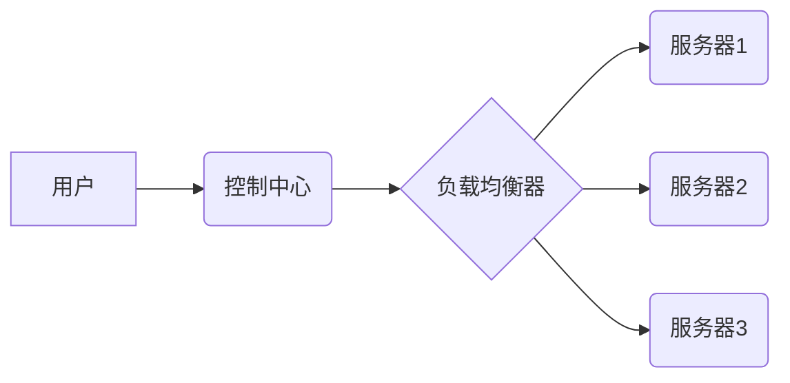

> Java, 智能家居, 负载均衡,  分布式系统,  微服务架构,  Spring Cloud

## 1. 背景介绍

随着物联网技术的快速发展，智能家居已成为现代生活的重要组成部分。智能家居系统通常由众多传感器、执行器、控制中心等设备组成，这些设备需要协同工作才能实现智能化控制和服务。然而，随着智能家居设备数量的增加，系统性能和可靠性面临着新的挑战。

负载均衡是分布式系统中一个重要的技术，它可以将请求分配到多个服务器上，从而提高系统的吞吐量、可用性和稳定性。在智能家居系统中，负载均衡可以用于分配控制请求、数据处理请求等，从而提高系统的整体性能和可靠性。

## 2. 核心概念与联系

### 2.1 智能家居系统架构

智能家居系统通常采用分布式架构，由多个独立的模块组成，每个模块负责特定的功能，例如：

* **传感器模块:** 收集环境数据，如温度、湿度、光照等。
* **执行器模块:** 控制家居设备，如灯光、空调、窗帘等。
* **控制中心模块:** 处理用户指令，协调各个模块的协作。
* **云平台模块:** 提供数据存储、分析和远程控制功能。

### 2.2 负载均衡的概念

负载均衡是指将请求分配到多个服务器上，以提高系统的吞吐量、可用性和稳定性。负载均衡算法根据不同的策略，将请求分配到不同的服务器，例如：

* **轮询算法:** 轮流将请求分配到不同的服务器。
* **加权轮询算法:** 根据服务器的性能或负载，分配不同的权重，从而将请求分配到更合适的服务器。
* **最小连接数算法:** 将请求分配到连接数最少的服务器。

### 2.3 负载均衡与智能家居的联系

在智能家居系统中，负载均衡可以用于分配控制请求、数据处理请求等，从而提高系统的整体性能和可靠性。例如：

* **控制请求负载均衡:** 当多个用户同时控制智能家居设备时，负载均衡可以将请求分配到不同的控制中心，避免单个控制中心被 overwhelmed。
* **数据处理请求负载均衡:** 当智能家居设备收集大量数据时，负载均衡可以将数据处理请求分配到不同的服务器，提高数据处理效率。

### 2.4  负载均衡架构图



## 3. 核心算法原理 & 具体操作步骤

### 3.1  算法原理概述

本节将介绍一种常用的负载均衡算法——**加权轮询算法**。

加权轮询算法根据服务器的性能或负载，分配不同的权重，从而将请求分配到更合适的服务器。权重越高，服务器越容易被选中。

### 3.2  算法步骤详解

1. **初始化:** 为每个服务器分配一个权重值。
2. **请求到达:** 当一个请求到达时，算法会遍历所有服务器，并根据每个服务器的权重值，计算一个概率值。
3. **服务器选择:** 算法会根据概率值，随机选择一个服务器，并将请求发送到该服务器。
4. **权重更新:** 服务器处理请求后，算法会根据服务器的负载情况，更新服务器的权重值。负载越高的服务器，权重值越低；负载越低的服务器，权重值越高。

### 3.3  算法优缺点

**优点:**

* 能够根据服务器的性能或负载，动态分配请求，提高系统的整体性能。
* 相对简单易实现。

**缺点:**

* 需要定期更新服务器的权重值，否则可能会导致请求分配不均衡。
* 对于服务器性能差异较大的情况，可能无法有效地均衡负载。

### 3.4  算法应用领域

加权轮询算法广泛应用于各种负载均衡场景，例如：

* Web服务器负载均衡
* 数据库负载均衡
* 应用服务器负载均衡

## 4. 数学模型和公式 & 详细讲解 & 举例说明

### 4.1  数学模型构建

假设有N个服务器，每个服务器的权重值分别为w1, w2, ..., wN。

请求分配概率：

*  P(i) = wi / Σ(wj) (i = 1, 2, ..., N)

其中：

* P(i) 表示服务器i被选中的概率。
* wi 表示服务器i的权重值。
* Σ(wj) 表示所有服务器权重值的总和。

### 4.2  公式推导过程

加权轮询算法的请求分配概率公式可以根据以下推导过程得到：

1. 每个服务器的权重值代表其处理请求的能力。
2. 权重值越大，服务器处理请求的能力越强，被选中的概率越高。
3. 所有服务器的权重值之和代表总处理请求的能力。
4. 因此，每个服务器被选中的概率应该与其权重值成正比，与总权重值成反比。

### 4.3  案例分析与讲解

假设有3个服务器，其权重值分别为2, 3, 1。

则每个服务器被选中的概率为：

* P(1) = 2 / (2 + 3 + 1) = 2/6 = 1/3
* P(2) = 3 / (2 + 3 + 1) = 3/6 = 1/2
* P(3) = 1 / (2 + 3 + 1) = 1/6

可见，服务器2的权重值最大，因此被选中的概率最大。

## 5. 项目实践：代码实例和详细解释说明

### 5.1  开发环境搭建

* JDK 11 或以上版本
* Maven 或 Gradle 构建工具
* IntelliJ IDEA 或 Eclipse IDE

### 5.2  源代码详细实现

```java
import org.springframework.cloud.client.loadbalancer.LoadBalanced;
import org.springframework.cloud.netflix.ribbon.RibbonClient;
import org.springframework.context.annotation.Bean;
import org.springframework.web.client.RestTemplate;

@RibbonClient(name = "service-provider", configuration = MyRibbonConfiguration.class)
public class MyApplication {

    @Bean
    @LoadBalanced
    public RestTemplate restTemplate() {
        return new RestTemplate();
    }
}
```

### 5.3  代码解读与分析

* `@RibbonClient`: 注解用于配置Ribbon客户端，指定服务名称为"service-provider"，并使用自定义配置类`MyRibbonConfiguration`。
* `@LoadBalanced`: 注解用于将RestTemplate标记为负载均衡客户端，Spring Cloud Ribbon会自动将请求转发到注册中心中配置的服务实例。
* `MyRibbonConfiguration`: 自定义Ribbon配置类，可以配置Ribbon的负载均衡算法、健康检查策略等。

### 5.4  运行结果展示

当启动多个服务实例时，`MyApplication`中的`restTemplate()`方法会自动使用Ribbon负载均衡算法，将请求分配到不同的服务实例。

## 6. 实际应用场景

### 6.1 智能家居设备控制

在智能家居系统中，多个控制中心可以负责控制不同的设备类型，例如灯光、空调、窗帘等。使用负载均衡可以将控制请求分配到不同的控制中心，避免单个控制中心被 overwhelmed，提高系统的可靠性和可用性。

### 6.2 智能家居数据处理

智能家居设备会收集大量数据，例如温度、湿度、光照等。使用负载均衡可以将数据处理请求分配到不同的服务器，提高数据处理效率，并降低单个服务器的负载。

### 6.3 智能家居远程控制

用户可以通过手机、平板电脑等设备远程控制智能家居设备。使用负载均衡可以将远程控制请求分配到不同的服务器，提高系统的响应速度和稳定性。

### 6.4  未来应用展望

随着智能家居技术的不断发展，负载均衡在智能家居系统中的应用场景将会更加广泛。例如：

* **个性化服务:** 根据用户的喜好和需求，动态分配请求到不同的服务实例，提供个性化的智能家居服务。
* **边缘计算:** 将负载均衡算法部署到智能家居设备的边缘节点，实现更快速的响应和更低的延迟。
* **安全防护:** 使用负载均衡技术，提高智能家居系统的安全防护能力，防止攻击者对单个设备进行攻击。

## 7. 工具和资源推荐

### 7.1  学习资源推荐

* **Spring Cloud官方文档:** https://spring.io/projects/spring-cloud
* **Netflix Ribbon官方文档:** https://netflix.github.io/ribbon/
* **Kubernetes官方文档:** https://kubernetes.io/docs/home/

### 7.2  开发工具推荐

* **IntelliJ IDEA:** https://www.jetbrains.com/idea/
* **Eclipse:** https://www.eclipse.org/

### 7.3  相关论文推荐

* **Load Balancing in Distributed Systems:** https://dl.acm.org/doi/10.1145/1044622.1044633
* **A Survey of Load Balancing Techniques:** https://ieeexplore.ieee.org/document/6747708

## 8. 总结：未来发展趋势与挑战

### 8.1  研究成果总结

本文介绍了负载均衡在智能家居系统中的应用，并详细讲解了加权轮询算法的原理和实现。通过使用负载均衡技术，可以提高智能家居系统的性能、可靠性和可用性。

### 8.2  未来发展趋势

* **更智能的负载均衡算法:** 未来将会有更智能的负载均衡算法，能够根据实时情况动态调整请求分配策略，提高系统的效率和鲁棒性。
* **边缘计算与负载均衡:** 将负载均衡算法部署到智能家居设备的边缘节点，实现更快速的响应和更低的延迟。
* **安全与隐私保护:** 在负载均衡算法中加入安全和隐私保护机制，确保智能家居系统的安全性和用户隐私。

### 8.3  面临的挑战

* **复杂性:** 智能家居系统通常非常复杂，包含众多设备和服务，负载均衡算法需要能够应对这种复杂性。
* **动态性:** 智能家居系统是动态变化的，设备数量、性能和负载情况都会不断变化，负载均衡算法需要能够适应这种动态变化。
* **安全与隐私:** 智能家居系统涉及到用户的隐私信息，负载均衡算法需要能够保证用户的隐私安全。

### 8.4  研究展望

未来，我们将继续研究更智能、更安全、更可靠的负载均衡算法，为智能家居系统的发展提供技术支持。


## 9. 附录：常见问题与解答

### 9.1  Q1: 为什么需要使用负载均衡？

**A1:** 负载均衡可以提高系统的性能、可靠性和可用性。

### 9.2  Q2: 负载均衡有哪些常见的算法？

**A2:** 常见的负载均衡算法包括轮询算法、加权轮询算法、最小连接数算法等。

### 9.3  Q3: 如何选择合适的负载均衡算法？

**A3:** 选择合适的负载均衡算法需要根据具体的应用场景和系统需求进行考虑。

### 9.4  Q4: 负载均衡如何与云平台集成？

**A4:** 许多云平台提供负载均衡服务，可以方便地将负载均衡功能集成到云平台中。


作者：禅与计算机程序设计艺术 / Zen and the Art of Computer Programming 
<end_of_turn>