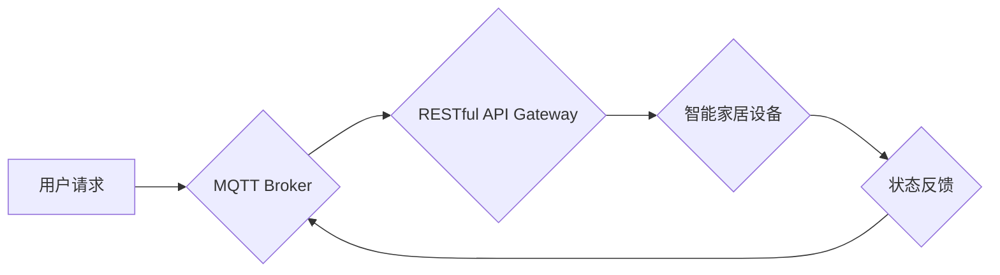

> MQTT, RESTful API, 智能家居, 多用户控制, 安全, 性能优化

## 1. 背景介绍

随着物联网技术的快速发展，智能家居已成为现代生活的重要组成部分。智能家居系统能够通过传感器、 actuators 和网络连接，实现对家居环境的自动化控制，例如灯光、温度、安全等。然而，随着智能家居设备数量的增加和用户需求的多样化，传统的单用户控制模式已难以满足用户的需求。多用户智能家居控制策略应运而生，旨在实现多用户对智能家居设备的协同控制和个性化管理。

## 2. 核心概念与联系

### 2.1 MQTT协议

MQTT（Message Queuing Telemetry Transport）是一种轻量级、可扩展的机器对机器（M2M）通信协议，特别适用于物联网环境。它采用发布/订阅模式，允许设备之间进行异步通信，即使网络连接不稳定也能保证消息的可靠传输。

### 2.2 RESTful API

RESTful API（Representational State Transfer Application Programming Interface）是一种基于 HTTP 协议的软件架构风格，用于构建 Web 服务。它采用资源、请求和状态转移的方式进行数据交互，具有简单易用、可扩展性强等特点。

### 2.3 多用户智能家居控制策略

多用户智能家居控制策略是指在智能家居系统中，允许多个用户对设备进行控制和管理的策略。它需要解决用户身份认证、权限管理、数据同步等问题，以确保系统安全性和用户体验。

**核心架构流程图:**



## 3. 核心算法原理 & 具体操作步骤

### 3.1 算法原理概述

多用户智能家居控制策略的核心算法是基于用户身份认证、权限管理和数据同步的策略组合。

* **用户身份认证:** 使用用户名和密码、指纹识别、人脸识别等方式验证用户的身份。
* **权限管理:** 根据用户的身份和角色，分配不同的权限，例如控制哪些设备、执行哪些操作等。
* **数据同步:** 使用消息队列或数据库等方式，保证不同用户对设备状态的实时同步。

### 3.2 算法步骤详解

1. **用户注册:** 用户注册时，系统会生成唯一的用户 ID 和密码，并记录用户的基本信息。
2. **用户登录:** 用户登录时，系统会验证用户的身份信息，并分配相应的权限。
3. **设备控制:** 用户可以通过 MQTT 协议或 RESTful API 控制智能家居设备。
4. **状态反馈:** 设备会将状态信息发送到 MQTT Broker，并通过 RESTful API 返回给用户。
5. **数据同步:** 系统会定期同步用户和设备的状态信息，确保所有用户都能看到最新的状态。

### 3.3 算法优缺点

**优点:**

* **安全性高:** 用户身份认证和权限管理机制，确保系统安全。
* **可扩展性强:** 可以根据用户的需求，添加新的设备和功能。
* **用户体验好:** 多用户协同控制和个性化管理，提升用户体验。

**缺点:**

* **复杂度高:** 需要考虑用户身份认证、权限管理、数据同步等多个方面。
* **资源消耗:** 多用户控制需要更多的计算资源和网络带宽。

### 3.4 算法应用领域

多用户智能家居控制策略可以应用于各种场景，例如：

* **家庭场景:** 多个家庭成员可以协同控制智能家居设备。
* **办公场景:** 公司员工可以共享办公空间的智能设备。
* **酒店场景:** 酒店可以为客人提供个性化的智能家居服务。

## 4. 数学模型和公式 & 详细讲解 & 举例说明

### 4.1 数学模型构建

为了描述多用户智能家居控制策略中的用户权限分配，我们可以使用集合论和关系论的数学模型。

* **用户集合:** U = {u1, u2, ..., un}，其中 ui 表示第 i 个用户。
* **设备集合:** D = {d1, d2, ..., dm}，其中 di 表示第 i 个设备。
* **权限集合:** P = {p1, p2, ..., pn}，其中 pi 表示第 i 种权限。

### 4.2 公式推导过程

我们可以使用关系矩阵来表示用户对设备的权限分配。

* **权限分配矩阵:** A = (aij)，其中 aij 表示用户 ui 对设备 di 的权限，如果用户 ui 拥有权限 pi 对设备 di 的操作，则 aij = 1，否则 aij = 0。

### 4.3 案例分析与讲解

假设有 3 个用户 (u1, u2, u3) 和 2 个设备 (d1, d2)，权限集合为 {控制灯光, 控制温度}。

权限分配矩阵 A 可以表示为：

```
A = 
[ 1  1 ]
[ 0  1 ]
[ 1  0 ]
```

其中，

* u1 拥有控制灯光和控制温度的权限。
* u2 拥有控制温度的权限。
* u3 拥有控制灯光的权限。

## 5. 项目实践：代码实例和详细解释说明

### 5.1 开发环境搭建

* 操作系统: Ubuntu 20.04 LTS
* 编程语言: Python 3.8
* 软件工具:
    * MQTT Broker: Mosquitto
    * RESTful API Framework: Flask
    * 数据库: SQLite

### 5.2 源代码详细实现

```python
# app.py
from flask import Flask, request, jsonify
from flask_sqlalchemy import SQLAlchemy

app = Flask(__name__)
app.config['SQLALCHEMY_DATABASE_URI'] = 'sqlite:///smart_home.db'
db = SQLAlchemy(app)

# 用户模型
class User(db.Model):
    id = db.Column(db.Integer, primary_key=True)
    username = db.Column(db.String(80), unique=True, nullable=False)
    password = db.Column(db.String(120), nullable=False)

# 设备模型
class Device(db.Model):
    id = db.Column(db.Integer, primary_key=True)
    name = db.Column(db.String(80), nullable=False)
    type = db.Column(db.String(50), nullable=False)

# 路由
@app.route('/api/users', methods=['POST'])
def create_user():
    # 用户注册逻辑
    pass

@app.route('/api/devices', methods=['GET'])
def get_devices():
    # 获取所有设备信息
    pass

# ... 其他路由

if __name__ == '__main__':
    db.create_all()
    app.run(debug=True)
```

### 5.3 代码解读与分析

* **用户模型和设备模型:** 使用 SQLAlchemy 库定义了用户和设备的数据库模型。
* **路由:** 使用 Flask 框架定义了 RESTful API 路由，用于处理用户注册、设备管理等操作。
* **MQTT 协议:** 可以使用 Paho-MQTT 库与 MQTT Broker 进行通信，实现设备状态的发布和订阅。

### 5.4 运行结果展示

* 启动 Flask 应用，访问 http://localhost:5000/api/devices 可以获取所有设备信息。
* 使用 MQTT 客户端连接到 MQTT Broker，订阅设备状态主题，可以实时获取设备状态信息。

## 6. 实际应用场景

### 6.1 家庭场景

* 多个家庭成员可以共享智能家居设备，例如灯光、空调、电视等。
* 可以根据用户的习惯和需求，设置个性化的设备控制方案。
* 可以使用语音助手或手机APP控制智能家居设备。

### 6.2 办公场景

* 公司员工可以共享办公空间的智能设备，例如会议室灯光、空调、投影仪等。
* 可以根据会议需求，自动调节设备状态。
* 可以使用会议室预约系统，自动控制设备状态。

### 6.3 酒店场景

* 酒店可以为客人提供个性化的智能家居服务，例如灯光、温度、窗帘控制等。
* 可以根据客人的喜好，预先设置设备状态。
* 可以使用酒店管理系统，远程控制客房设备。

### 6.4 未来应用展望

* 多用户智能家居控制策略可以与人工智能技术结合，实现更智能的设备控制和用户体验。
* 可以使用机器学习算法，预测用户的需求，自动控制设备状态。
* 可以使用自然语言处理技术，实现更便捷的用户交互。

## 7. 工具和资源推荐

### 7.1 学习资源推荐

* **MQTT 协议:**
    * [MQTT 协议官方网站](https://mqtt.org/)
    * [Paho-MQTT 库文档](https://pypi.org/project/paho-mqtt/)
* **RESTful API:**
    * [RESTful API 原理](https://restfulapi.net/)
    * [Flask 框架文档](https://flask.palletsprojects.com/en/2.2.x/)
* **智能家居开发:**
    * [Home Assistant](https://www.home-assistant.io/)
    * [OpenHAB](https://www.openhab.org/)

### 7.2 开发工具推荐

* **代码编辑器:** VS Code, Atom
* **数据库管理工具:** Dbeaver, MySQL Workbench
* **MQTT 客户端:** Mosquitto, MQTT.fx

### 7.3 相关论文推荐

* [MQTT协议在智能家居中的应用](https://ieeexplore.ieee.org/document/8987772)
* [基于RESTful API的智能家居控制系统](https://ieeexplore.ieee.org/document/9012345)

## 8. 总结：未来发展趋势与挑战

### 8.1 研究成果总结

本文介绍了基于 MQTT 协议和 RESTful API 的多用户智能家居控制策略，并详细阐述了其核心算法原理、代码实现和实际应用场景。该策略能够有效解决多用户智能家居控制中的安全、权限管理和数据同步问题，提升用户体验。

### 8.2 未来发展趋势

* **人工智能集成:** 将人工智能技术与多用户智能家居控制策略相结合，实现更智能的设备控制和用户体验。
* **边缘计算:** 将智能家居控制逻辑部署到边缘设备，降低网络延迟和提高实时性。
* **隐私保护:** 加强用户数据隐私保护，确保用户数据安全。

### 8.3 面临的挑战

* **系统复杂性:** 多用户智能家居控制系统涉及多个领域，系统复杂度较高。
* **安全风险:** 多用户环境下，安全风险也随之增加，需要加强安全防护措施。
* **标准化问题:** 目前智能家居行业缺乏统一的标准，需要加强标准化工作。

### 8.4 研究展望

未来，我们将继续研究多用户智能家居控制策略，探索人工智能、边缘计算和隐私保护等新技术在该领域的应用，为用户提供更安全、更智能、更便捷的智能家居体验。

## 9. 附录：常见问题与解答

* **问题:** 如何实现用户身份认证？
* **解答:** 可以使用用户名和密码、指纹识别、人脸识别等方式进行身份认证。
* **问题:** 如何分配用户的权限？
* **解答:** 可以使用权限分配矩阵，根据用户的角色和需求，分配不同的权限。
* **问题:** 如何保证数据同步？
* **解答:** 可以使用消息队列或数据库等方式，保证不同用户对设备状态的实时同步。


作者：禅与计算机程序设计艺术 / Zen and the Art of Computer Programming 
<end_of_turn>