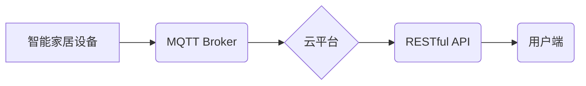

> 智能家居, MQTT协议, RESTful API, 云服务, 架构设计, 物联网

## 1. 背景介绍

随着物联网技术的快速发展，智能家居已成为现代生活的重要组成部分。智能家居系统能够通过传感器、 actuators 和网络连接，实现对家居环境的智能控制和管理，为用户提供更加舒适、便捷、安全的居住体验。

然而，传统的智能家居系统往往存在以下问题：

* **设备互联性差:** 不同品牌、不同协议的智能家居设备难以互联互通，导致用户体验受限。
* **数据孤岛:** 智能家居设备产生的数据分散存储，难以进行统一管理和分析，无法充分发挥数据价值。
* **安全性问题:** 智能家居系统涉及到用户的隐私和安全，需要采取有效的安全措施来保障数据安全和设备安全。

为了解决这些问题，基于云服务的智能家居架构应运而生。云服务能够提供强大的计算、存储和网络资源，为智能家居系统提供更灵活、更可靠、更安全的解决方案。

## 2. 核心概念与联系

### 2.1 MQTT协议

MQTT（Message Queuing Telemetry Transport）是一种轻量级的消息传输协议，专门设计用于物联网应用场景。它具有以下特点：

* **轻量级:** MQTT协议本身非常小巧，占用资源少，适合资源受限的设备使用。
* **可靠性:** MQTT协议提供消息确认机制，确保消息可靠传输。
* **可扩展性:** MQTT协议支持多种主题订阅和发布机制，可以灵活地管理消息路由。

### 2.2 RESTful API

RESTful API（Representational State Transfer Application Programming Interface）是一种基于 HTTP 协议的软件架构风格，用于构建 Web 服务。它具有以下特点：

* **资源导向:** RESTful API 将数据和功能抽象为资源，通过 URL 进行访问和操作。
* **状态转移:** RESTful API 使用 HTTP 动词（如 GET、POST、PUT、DELETE）来描述对资源的操作。
* **缓存机制:** RESTful API 支持缓存机制，提高服务性能。

### 2.3 云服务

云服务是指通过互联网提供计算、存储、网络等 IT 资源的商业模式。云服务提供商（如 AWS、Azure、阿里云）拥有庞大的数据中心和先进的 IT 基础设施，能够为用户提供弹性、可扩展、高可靠的 IT 服务。

### 2.4 架构图



## 3. 核心算法原理 & 具体操作步骤

### 3.1 算法原理概述

本架构设计主要基于 MQTT 协议和 RESTful API 的特点，实现智能家居设备与云平台的连接和数据交互。

* **MQTT 协议:** 智能家居设备通过 MQTT 协议与 MQTT Broker 进行连接，发布和订阅消息。
* **RESTful API:** 云平台提供 RESTful API 接口，用于用户端访问和控制智能家居设备。

### 3.2 算法步骤详解

1. **设备注册:** 智能家居设备需要先向 MQTT Broker 注册，并获取唯一的设备标识。
2. **主题订阅:** 智能家居设备订阅相关的主题，以便接收来自云平台或其他设备的消息。
3. **消息发布:** 智能家居设备根据需要发布消息到指定的主题，例如设备状态、控制指令等。
4. **云平台处理:** 云平台接收设备发布的消息，并根据消息内容进行处理，例如存储数据、执行控制指令等。
5. **RESTful API 调用:** 用户端通过 RESTful API 接口调用云平台，获取设备状态信息或发送控制指令。
6. **消息转发:** 云平台根据用户请求，将指令转发到相应的设备。

### 3.3 算法优缺点

**优点:**

* **轻量级:** MQTT 协议和 RESTful API 都是轻量级的协议和架构风格，适合资源受限的设备和环境。
* **可靠性:** MQTT 协议提供消息确认机制，确保消息可靠传输。
* **可扩展性:** MQTT 协议支持多种主题订阅和发布机制，可以灵活地管理消息路由。
* **安全性:** RESTful API 支持多种安全机制，例如 HTTPS、OAuth 等，可以保障数据安全。

**缺点:**

* **复杂性:** 构建完整的智能家居云服务架构需要考虑多个方面，例如设备接入、数据存储、安全管理等，有一定的复杂度。
* **网络依赖:** 智能家居云服务依赖于网络连接，网络中断会导致服务不可用。

### 3.4 算法应用领域

* 智能家居
* 工业自动化
* 物联网传感器网络
* 可穿戴设备

## 4. 数学模型和公式 & 详细讲解 & 举例说明

### 4.1 数学模型构建

本架构设计中，可以利用图论模型来表示智能家居设备之间的连接关系和数据流向。

* **节点:** 智能家居设备、MQTT Broker、云平台、用户端等。
* **边:** 设备之间的连接关系、消息传输路径等。

### 4.2 公式推导过程

可以利用图论中的度数、路径长度等指标来衡量智能家居系统的性能和可靠性。

* **度数:** 节点的连接数，表示设备的连接能力。
* **路径长度:** 从一个节点到另一个节点的消息传输路径长度，表示消息传输延迟。

### 4.3 案例分析与讲解

假设一个智能家居系统中，有 5 个智能设备，它们分别连接到 MQTT Broker，并通过 RESTful API 接口与用户端进行交互。

* **度数:** 每个设备的度数为 1，表示它们只连接到 MQTT Broker。
* **路径长度:** 从用户端到设备的路径长度为 2，表示消息需要经过 MQTT Broker 和设备才能到达。

## 5. 项目实践：代码实例和详细解释说明

### 5.1 开发环境搭建

* 操作系统: Ubuntu 20.04 LTS
* 编程语言: Python 3.8
* 开发工具: VS Code

### 5.2 源代码详细实现

```python
# mqtt_client.py
import paho.mqtt.client as mqtt

# MQTT Broker 地址
MQTT_BROKER_ADDRESS = "mqtt.example.com"

# 设备标识
DEVICE_ID = "my_device"

# 连接 MQTT Broker
def on_connect(client, userdata, flags, rc):
    if rc == 0:
        print("Connected to MQTT Broker!")
        client.subscribe("home/status")
    else:
        print("Connection failed!")

client = mqtt.Client(DEVICE_ID)
client.on_connect = on_connect
client.connect(MQTT_BROKER_ADDRESS)
client.loop_forever()

# rest_api.py
from flask import Flask, request, jsonify

app = Flask(__name__)

# 设备状态字典
device_status = {
    "light": "off",
    "temperature": 25
}

# 获取设备状态
@app.route("/status", methods=["GET"])
def get_status():
    return jsonify(device_status)

# 控制设备
@app.route("/control", methods=["POST"])
def control_device():
    data = request.get_json()
    device = data.get("device")
    action = data.get("action")

    if device in device_status:
        if action == "on":
            device_status[device] = "on"
        elif action == "off":
            device_status[device] = "off"
        else:
            return jsonify({"error": "Invalid action"}), 400
    else:
        return jsonify({"error": "Invalid device"}), 400

    return jsonify({"message": "Device controlled successfully"})

if __name__ == "__main__":
    app.run(debug=True)
```

### 5.3 代码解读与分析

* `mqtt_client.py`: 该文件实现了一个 MQTT 客户端，用于连接 MQTT Broker 并订阅主题。
* `rest_api.py`: 该文件实现了一个 RESTful API 服务，用于处理用户端对智能家居设备的控制请求。

### 5.4 运行结果展示

* 启动 MQTT Broker 和 RESTful API 服务。
* 使用 MQTT 客户端连接 MQTT Broker 并订阅主题 `home/status`。
* 使用浏览器访问 RESTful API 接口 `http://localhost:5000/status` 获取设备状态。
* 使用浏览器访问 RESTful API 接口 `http://localhost:5000/control` 发送控制指令，例如 `{"device": "light", "action": "on"}`。

## 6. 实际应用场景

### 6.1 智能家居控制

用户可以通过手机 App 或语音助手控制智能家居设备，例如开关灯、调节温度、控制窗帘等。

### 6.2 家庭安全监控

智能家居系统可以集成摄像头、传感器等设备，实现家庭安全监控，例如报警、远程查看等。

### 6.3 能耗管理

智能家居系统可以收集设备的能耗数据，并提供智能控制建议，帮助用户降低能耗。

### 6.4 未来应用展望

* **人工智能:** 将人工智能技术融入智能家居系统，实现更智能的设备控制和场景化服务。
* **边缘计算:** 将计算能力部署到智能家居设备本身，提高系统响应速度和数据处理效率。
* **区块链:** 利用区块链技术保障智能家居系统的安全性和数据隐私。

## 7. 工具和资源推荐

### 7.1 学习资源推荐

* **MQTT 协议:** https://mqtt.org/
* **RESTful API:** https://restfulapi.net/
* **云平台:** AWS、Azure、阿里云

### 7.2 开发工具推荐

* **MQTT Broker:** Mosquitto、HiveMQ
* **Python 框架:** Flask、Django
* **数据库:** MySQL、MongoDB

### 7.3 相关论文推荐

* **MQTT 协议:**
    * MQTT Protocol Specification
* **RESTful API:**
    * RESTful Web Services
* **智能家居:**
    * A Survey on Smart Home Technologies and Applications

## 8. 总结：未来发展趋势与挑战

### 8.1 研究成果总结

本文章介绍了基于 MQTT 协议和 RESTful API 的智能家居云服务架构设计，并分析了其核心概念、算法原理、代码实现以及实际应用场景。

### 8.2 未来发展趋势

智能家居云服务将朝着以下方向发展：

* **更智能化:** 利用人工智能技术，实现更智能的设备控制和场景化服务。
* **更安全可靠:** 加强数据安全和设备安全防护措施，提高系统可靠性。
* **更开放生态:** 构建开放的智能家居生态系统，鼓励第三方开发者参与。

### 8.3 面临的挑战

智能家居云服务面临以下挑战：

* **数据安全:** 如何保障用户隐私和数据安全。
* **设备互联互通:** 如何实现不同品牌、不同协议的设备互联互通。
* **系统可靠性:** 如何提高系统的可靠性和稳定性。

### 8.4 研究展望

未来，我们将继续研究智能家居云服务领域的最新技术和趋势，致力于构建更智能、更安全、更可靠的智能家居生态系统。

## 9. 附录：常见问题与解答

### 9.1 如何选择合适的 MQTT Broker?

选择 MQTT Broker 需要考虑以下因素：

* **性能:** 能够满足系统需求的连接数和消息处理能力。
* **安全性:** 提供有效的身份验证和授权机制。
* **功能:** 支持所需的主题订阅、消息发布等功能。
* **成本:** 考虑服务费用和部署成本。

### 9.2 如何实现设备安全认证?

设备安全认证可以使用多种方式实现，例如：

* **证书认证:** 设备使用数字证书进行身份验证。
* **API 密钥:** 设备使用唯一的 API 密钥进行身份验证。
* **生物识别:** 使用指纹、面部识别等生物识别技术进行身份验证。

### 9.3 如何解决设备互联互通问题?

设备互联互通