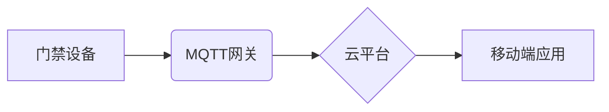

> MQTT, RESTful API, 智能门禁, 访客管理, 物联网, 安全, 云平台

## 1. 背景介绍

随着物联网技术的快速发展，智能门禁系统已成为现代建筑安全管理的重要组成部分。传统的门禁系统存在着诸多局限性，例如：

* **安全性低:**  传统的门禁系统往往依赖于物理钥匙或磁卡，容易被复制或盗用。
* **管理不便:**  传统的门禁系统管理复杂，需要人工记录和维护访客信息。
* **功能单一:**  传统的门禁系统功能单一，无法实现远程控制、数据统计等高级功能。

基于MQTT协议和RESTful API的智能门禁与访客管理系统，能够有效解决上述问题，提供更加安全、便捷、智能的门禁管理解决方案。

## 2. 核心概念与联系

### 2.1 MQTT协议

MQTT（Message Queuing Telemetry Transport）是一种轻量级的消息传输协议，专门设计用于物联网应用场景。其特点如下：

* **轻量级:**  MQTT协议本身非常轻量级，占用资源少，适合资源受限的设备。
* **可靠性高:**  MQTT协议支持消息确认机制，确保消息可靠传输。
* **低功耗:**  MQTT协议采用断线重连机制，能够有效降低设备功耗。

### 2.2 RESTful API

RESTful API（Representational State Transfer Application Programming Interface）是一种基于HTTP协议的软件架构风格，用于构建Web服务。其特点如下：

* **简单易用:**  RESTful API采用简单易懂的HTTP方法（GET、POST、PUT、DELETE）进行数据交互。
* **可扩展性强:**  RESTful API可以轻松扩展，支持多种数据格式和协议。
* **平台无关:**  RESTful API可以跨平台运行，不受特定操作系统或编程语言的限制。

### 2.3 系统架构

基于MQTT协议和RESTful API的智能门禁与访客管理系统，其架构主要包括以下几个部分：

* **门禁设备:**  负责识别访客身份，控制门禁开关。
* **MQTT网关:**  负责将门禁设备发送的消息转发到云平台。
* **云平台:**  负责存储访客信息、管理门禁权限、提供远程控制和数据分析等功能。
* **移动端应用:**  用于远程控制门禁、查看访客记录等。

**系统架构流程图:**



## 3. 核心算法原理 & 具体操作步骤

### 3.1  算法原理概述

智能门禁系统的核心算法主要包括访客身份识别算法、门禁权限管理算法和数据安全算法。

* **访客身份识别算法:**  利用生物识别技术（如指纹识别、人脸识别）或其他身份验证方式，识别访客身份。
* **门禁权限管理算法:**  根据访客身份和门禁权限规则，控制门禁开关。
* **数据安全算法:**  对访客信息和门禁操作记录进行加密和保护，确保数据安全。

### 3.2  算法步骤详解

**访客身份识别算法步骤:**

1. 采集访客身份信息（指纹、人脸等）。
2. 将采集到的信息进行预处理，去除噪声和干扰。
3. 将预处理后的信息与数据库中的身份信息进行比对。
4. 根据比对结果，判断访客身份是否合法。

**门禁权限管理算法步骤:**

1. 获取访客身份信息。
2. 查询数据库中访客的权限信息。
3. 根据访客身份和权限规则，判断是否允许访客进入。
4. 控制门禁开关。

**数据安全算法步骤:**

1. 对访客信息和门禁操作记录进行加密。
2. 将加密后的数据存储在安全数据库中。
3. 对数据库进行访问控制，防止未授权用户访问。

### 3.3  算法优缺点

**优点:**

* 安全性高：利用生物识别技术和加密算法，有效防止非法进入。
* 管理便捷：通过云平台管理访客信息和门禁权限，方便快捷。
* 功能丰富：支持远程控制、数据统计等高级功能。

**缺点:**

* 成本较高：生物识别设备和云平台服务成本较高。
* 技术复杂：需要专业的技术人员进行开发和维护。

### 3.4  算法应用领域

* **智能建筑:**  用于控制办公楼、写字楼、住宅小区等建筑的门禁安全。
* **工业园区:**  用于控制工厂、仓库、物流中心等工业园区的安全管理。
* **公共场所:**  用于控制博物馆、图书馆、机场等公共场所的门禁安全。

## 4. 数学模型和公式 & 详细讲解 & 举例说明

### 4.1  数学模型构建

智能门禁系统的核心算法可以抽象为一个状态机模型，其中每个状态代表门禁系统的一个状态，例如：

* **关闭状态:**  门禁处于关闭状态，不允许任何人进入。
* **打开状态:**  门禁处于打开状态，允许访客进入。
* **验证状态:**  访客身份正在被验证。

状态机模型的转移规则可以根据门禁权限规则和访客身份验证结果进行定义。

### 4.2  公式推导过程

假设门禁系统有以下权限规则：

* 访客A拥有进入办公区的权限。
* 访客B拥有进入会议室的权限。

根据访客身份和权限规则，可以推导出以下公式：

* 如果访客身份为A，则门禁状态转移到打开状态。
* 如果访客身份为B，则门禁状态转移到打开状态。
* 如果访客身份不为A或B，则门禁状态保持关闭状态。

### 4.3  案例分析与讲解

**案例:**

访客C试图进入办公区，但其身份信息与数据库中记录的访客A不匹配。

**分析:**

根据公式推导过程，访客C的身份不符合权限规则，因此门禁状态保持关闭状态，访客C无法进入办公区。

## 5. 项目实践：代码实例和详细解释说明

### 5.1  开发环境搭建

* 操作系统：Linux
* 编程语言：Python
* 开发工具：Eclipse、PyCharm
* 软件库：MQTT、RESTful API框架

### 5.2  源代码详细实现

```python
# MQTT连接
client = mqtt.Client()
client.connect("mqtt_broker_address", 1883, 60)

# RESTful API接口
from flask import Flask, request, jsonify

app = Flask(__name__)

@app.route('/api/v1/door', methods=['POST'])
def control_door():
    data = request.get_json()
    door_id = data.get('door_id')
    action = data.get('action')

    # 根据门禁ID和操作类型，控制门禁开关
    # ...

    return jsonify({'status': 'success'})

# 运行代码
if __name__ == '__main__':
    app.run(debug=True)
```

### 5.3  代码解读与分析

* **MQTT连接:**  代码首先连接到MQTT消息总线，用于接收门禁设备发送的消息。
* **RESTful API接口:**  代码定义了一个RESTful API接口，用于接收来自移动端应用的控制门禁指令。
* **门禁控制逻辑:**  根据接收到的指令，代码控制门禁开关。

### 5.4  运行结果展示

* 当门禁设备检测到访客身份时，会发送消息到MQTT消息总线。
* 云平台接收消息后，会根据访客身份和权限规则，控制门禁开关。
* 移动端应用可以远程控制门禁，查看访客记录等。

## 6. 实际应用场景

### 6.1  智能办公楼

* 利用智能门禁系统，可以实现访客预约、身份验证、门禁记录等功能，提高办公楼的安全性和管理效率。
* 可以根据员工身份和权限，控制不同区域的门禁开关，保障办公楼的安全。

### 6.2  智慧社区

* 利用智能门禁系统，可以实现小区门禁控制、访客管理、人员出入记录等功能，提高小区的安全性和管理水平。
* 可以根据居民身份和权限，控制不同区域的门禁开关，保障小区的安全。

### 6.3  工业园区

* 利用智能门禁系统，可以实现工厂、仓库、物流中心等工业园区的安全管理，防止非法进入和物品丢失。
* 可以根据员工身份和权限，控制不同区域的门禁开关，保障工业园区的安全。

### 6.4  未来应用展望

随着物联网技术的不断发展，智能门禁与访客管理系统将更加智能化、便捷化和安全化。未来，智能门禁系统将具备以下特点：

* **更精准的身份识别:**  利用人工智能技术，实现更精准的生物识别和人脸识别。
* **更智能的权限管理:**  根据访客身份、时间、地点等因素，动态调整门禁权限。
* **更安全的防范措施:**  利用传感器、视频监控等技术，实现更全面的安全防范。
* **更便捷的交互方式:**  利用语音识别、人机交互等技术，实现更便捷的交互方式。

## 7. 工具和资源推荐

### 7.1  学习资源推荐

* **MQTT协议:**  https://mqtt.org/
* **RESTful API:**  https://restfulapi.net/
* **物联网开发平台:**  阿里云物联网平台、腾讯云物联网平台、华为云物联网平台

### 7.2  开发工具推荐

* **Eclipse:**  https://www.eclipse.org/
* **PyCharm:**  https://www.jetbrains.com/pycharm/
* **MQTT Broker:**  Mosquitto、HiveMQ

### 7.3  相关论文推荐

* **MQTT协议的应用研究**
* **基于RESTful API的物联网服务架构设计**
* **智能门禁系统的设计与实现**

## 8. 总结：未来发展趋势与挑战

### 8.1  研究成果总结

基于MQTT协议和RESTful API的智能门禁与访客管理系统，能够有效解决传统门禁系统的安全、管理和功能等方面的不足，为现代建筑安全管理提供了一种更加智能、便捷、安全的解决方案。

### 8.2  未来发展趋势

未来，智能门禁系统将朝着更加智能化、便捷化和安全化的方向发展，主要趋势包括：

* **人工智能技术应用:**  利用人工智能技术，实现更精准的身份识别、更智能的权限管理和更全面的安全防范。
* **云平台化发展:**  将智能门禁系统与云平台相结合，实现数据共享、远程控制和智能分析。
* **边缘计算应用:**  将部分智能门禁系统功能部署到边缘设备上，降低网络延迟和提高实时性。

### 8.3  面临的挑战

智能门禁系统的开发和应用也面临着一些挑战，例如：

* **数据安全:**  智能门禁系统需要处理大量敏感数据，需要采取有效的措施保障数据安全。
* **技术复杂性:**  智能门禁系统的开发和维护需要专业的技术人员，技术门槛较高。
* **成本问题:**  智能门禁系统的成本相对较高，需要降低成本才能推广应用。

### 8.4  研究展望

未来，我们将继续深入研究智能门禁系统的技术，探索新的应用场景，并致力于降低成本、提高安全性，推动智能门禁系统的普及应用。

## 9. 附录：常见问题与解答

**常见问题:**

* **智能门禁系统如何保证数据安全？**

**解答:**

智能门禁系统采用多种安全措施保障数据安全，例如：

* 数据加密：访客信息和门禁操作记录进行加密存储和传输。
* 访问控制：对数据库