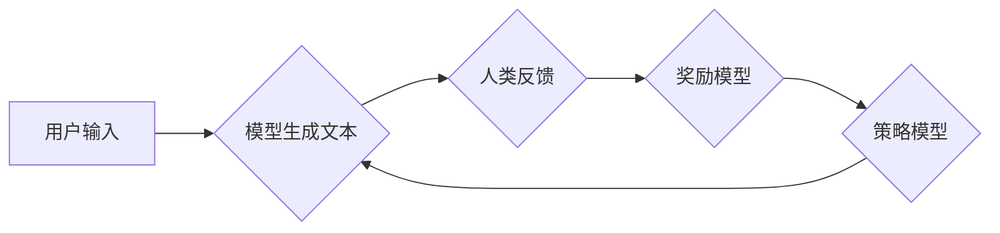

> 大语言模型、RLHF、强化学习、文本生成、自然语言处理、深度学习

## 1. 背景介绍

近年来，大语言模型（Large Language Models，LLMs）在自然语言处理（NLP）领域取得了显著进展，展现出强大的文本生成、翻译、问答和代码生成能力。这些模型通常基于Transformer架构，通过训练海量文本数据，学习语言的复杂模式和结构。然而，传统的监督学习方法在训练LLMs时存在一些局限性，例如需要大量标注数据、难以捕捉长距离依赖关系等。

强化学习从行为决策的角度出发，通过奖励机制引导模型学习最优策略。将强化学习与大语言模型相结合，即RLHF（Reinforcement Learning from Human Feedback），成为训练更安全、更符合人类期望的LLMs的一种有效方法。RLHF通过人类反馈来调整模型的输出，使其更加符合人类的偏好和价值观。

## 2. 核心概念与联系

RLHF的核心思想是利用人类反馈来训练模型，使其能够生成更符合人类期望的文本。

**流程图：**



**核心概念：**

* **模型生成文本:** LLMs根据输入文本生成文本作为输出。
* **人类反馈:** 人类对模型生成的文本进行评价，提供反馈信息，例如“好”、“不好”、“需要修改”等。
* **奖励模型:** 基于人类反馈训练的模型，用于评估模型生成的文本质量。
* **策略模型:** 通过学习奖励模型的输出，调整模型的输出，使其更加符合人类期望。

## 3. 核心算法原理 & 具体操作步骤

### 3.1  算法原理概述

RLHF的核心算法是基于强化学习的策略梯度算法。策略梯度算法通过最大化奖励函数的期望值来更新模型参数。

在RLHF中，策略模型的参数更新如下：

```
θ = θ + α∇θJ(θ)
```

其中：

* θ：策略模型的参数
* α：学习率
* ∇θJ(θ)：策略模型参数对奖励函数J的梯度

### 3.2  算法步骤详解

1. **预训练模型:** 使用监督学习方法预训练一个LLM，例如BERT或GPT。
2. **奖励模型训练:** 使用人类反馈数据训练一个奖励模型，例如一个分类模型或回归模型，用于评估模型生成的文本质量。
3. **策略模型训练:** 使用策略梯度算法训练策略模型，目标是最大化奖励模型的输出。
4. **迭代训练:** 重复步骤2和3，直到策略模型达到预期的性能。

### 3.3  算法优缺点

**优点:**

* 可以训练出更符合人类期望的LLMs。
* 不需要大量标注数据。
* 可以捕捉长距离依赖关系。

**缺点:**

* 训练过程复杂，需要大量的计算资源。
* 人类反馈数据可能存在偏差。

### 3.4  算法应用领域

RLHF在以下领域具有广泛的应用前景：

* **聊天机器人:** 训练更自然、更流畅的聊天机器人。
* **文本生成:** 生成更符合人类语义和风格的文本，例如新闻报道、小说、诗歌等。
* **代码生成:** 帮助程序员生成代码，提高开发效率。
* **机器翻译:** 提高机器翻译的准确性和流畅度。

## 4. 数学模型和公式 & 详细讲解 & 举例说明

### 4.1  数学模型构建

在RLHF中，策略模型通常是一个神经网络，其输出是文本的概率分布。奖励模型则是一个评估文本质量的函数，可以是分类模型或回归模型。

**策略模型:**

```
p(x|s) = softmax(f(s, θ))
```

其中：

* p(x|s)：给定输入序列s，生成输出序列x的概率分布。
* f(s, θ)：策略模型的输出函数，θ是策略模型的参数。
* softmax()：softmax函数将输出向量转换为概率分布。

**奖励模型:**

```
r(x, s) = g(x, s, ω)
```

其中：

* r(x, s)：给定输入序列s和输出序列x，奖励模型的输出。
* g(x, s, ω)：奖励模型的输出函数，ω是奖励模型的参数。

### 4.2  公式推导过程

策略梯度算法的目标是最大化奖励函数的期望值：

```
J(θ) = E[r(x, s)]
```

其中：

* E[]：期望值。

策略梯度算法的更新公式如下：

```
θ = θ + α∇θJ(θ)
```

其中：

* α：学习率。
* ∇θJ(θ)：策略模型参数对奖励函数J的梯度。

### 4.3  案例分析与讲解

假设我们训练一个聊天机器人，其目标是生成自然流畅的对话。我们可以使用RLHF来训练这个聊天机器人。

1. **预训练模型:** 使用监督学习方法预训练一个LLM，例如GPT。
2. **奖励模型训练:** 使用人类反馈数据训练一个奖励模型，例如一个分类模型，用于评估聊天机器人的对话质量。
3. **策略模型训练:** 使用策略梯度算法训练策略模型，目标是最大化奖励模型的输出。

在训练过程中，我们可以使用人类反馈来调整模型的输出，使其更加符合人类的期望。例如，如果人类认为模型生成的对话过于机械，我们可以降低模型生成机械对话的概率。

## 5. 项目实践：代码实例和详细解释说明

### 5.1  开发环境搭建

* Python 3.7+
* PyTorch 1.7+
* Transformers 4.10+

### 5.2  源代码详细实现

```python
# 策略模型
class PolicyModel(nn.Module):
    def __init__(self, vocab_size, embedding_dim, hidden_dim):
        super(PolicyModel, self).__init__()
        self.embedding = nn.Embedding(vocab_size, embedding_dim)
        self.transformer = Transformer(embedding_dim, hidden_dim)
        self.linear = nn.Linear(hidden_dim, vocab_size)

    def forward(self, input_ids):
        embeddings = self.embedding(input_ids)
        outputs = self.transformer(embeddings)
        logits = self.linear(outputs)
        return logits

# 奖励模型
class RewardModel(nn.Module):
    def __init__(self, vocab_size, embedding_dim, hidden_dim):
        super(RewardModel, self).__init__()
        self.embedding = nn.Embedding(vocab_size, embedding_dim)
        self.transformer = Transformer(embedding_dim, hidden_dim)
        self.linear = nn.Linear(hidden_dim, 1)

    def forward(self, input_ids):
        embeddings = self.embedding(input_ids)
        outputs = self.transformer(embeddings)
        rewards = self.linear(outputs)
        return rewards

# RLHF训练
def train_rlhf(policy_model, reward_model, dataset, epochs, learning_rate):
    optimizer = torch.optim.Adam(policy_model.parameters(), lr=learning_rate)
    for epoch in range(epochs):
        for batch in dataset:
            input_ids = batch['input_ids']
            target_ids = batch['target_ids']
            rewards = reward_model(input_ids)
            loss = -torch.mean(rewards * torch.log(policy_model(input_ids)[torch.arange(len(input_ids)), target_ids]))
            optimizer.zero_grad()
            loss.backward()
            optimizer.step()
```

### 5.3  代码解读与分析

* 策略模型和奖励模型分别使用Transformer架构，并根据任务需求进行调整。
* 训练过程使用策略梯度算法，目标是最大化奖励模型的输出。
* 代码中使用PyTorch框架实现模型训练和优化。

### 5.4  运行结果展示

训练完成后，可以评估模型的性能，例如使用BLEU分数评估机器翻译模型的性能，或者使用困惑度评估文本生成模型的性能。

## 6. 实际应用场景

RLHF在以下实际应用场景中取得了显著成果：

* **ChatGPT:** OpenAI的ChatGPT聊天机器人就是使用RLHF训练的，它能够生成更自然、更流畅的对话。
* **InstructGPT:** OpenAI的InstructGPT模型也是使用RLHF训练的，它能够更好地理解人类指令，并执行相应的任务。
* **文本摘要:** RLHF可以用于训练文本摘要模型，生成更准确、更简洁的文本摘要。

### 6.4  未来应用展望

RLHF在未来将有更广泛的应用前景，例如：

* **个性化教育:** 根据学生的学习情况，生成个性化的学习内容。
* **医疗诊断:** 辅助医生进行疾病诊断，提高诊断准确率。
* **法律文本分析:** 分析法律文本，提供法律建议。

## 7. 工具和资源推荐

### 7.1  学习资源推荐

* **论文:**
    * "Language Models are Few-Shot Learners" (Brown et al., 2020)
    * "Reinforcement Learning from Human Feedback" (Amodei et al., 2020)
* **博客:**
    * OpenAI Blog: https://openai.com/blog/
    * Hugging Face Blog: https://huggingface.co/blog/

### 7.2  开发工具推荐

* **PyTorch:** https://pytorch.org/
* **Transformers:** https://huggingface.co/docs/transformers/index

### 7.3  相关论文推荐

* "Training Language Models to Follow Instructions with Human Feedback" (Kojima et al., 2021)
* "Scaling Laws for Neural Language Models" (Kaplan et al., 2020)

## 8. 总结：未来发展趋势与挑战

### 8.1  研究成果总结

RLHF在训练更安全、更符合人类期望的LLMs方面取得了显著进展。它能够利用人类反馈来调整模型的输出，使其更加符合人类的偏好和价值观。

### 8.2  未来发展趋势

* **更有效的奖励模型设计:** 探索更有效的奖励模型设计方法，例如使用多模态反馈、强化学习算法的改进等。
* **可解释性增强:** 研究RLHF模型的决策过程，提高模型的可解释性。
* **安全性和公平性:** 确保RLHF训练的模型安全可靠，并避免产生偏见和歧视。

### 8.3  面临的挑战

* **数据标注成本:** 人类反馈数据标注成本高昂。
* **奖励信号设计:** 设计有效的奖励信号仍然是一个挑战。
* **模型规模和效率:** RLHF训练的模型通常规模较大，训练效率较低。

### 8.4  研究展望

未来，RLHF将继续是LLMs研究的重要方向。随着算法和技术的进步，RLHF将能够训练出更强大、更安全、更符合人类期望的LLMs，为人类社会带来更多福祉。

## 9. 附录：常见问题与解答

**Q1: RLHF与监督学习相比有什么优势？**

**A1:** RLHF能够利用人类反馈来调整模型的输出，使其更加符合人类的期望，而监督学习则需要大量标注数据，难以捕捉长距离依赖关系。

**Q2: RLHF训练的模型是否会产生偏见？**

**A2:** RLHF训练的模型可能会产生偏见，因为人类反馈数据本身可能存在偏见。因此，需要采取措施来缓解模型的偏见，例如使用多样化的训练数据、进行公平性评估等。

**Q3: RLHF的应用场景有哪些？**

**A3:** RLHF的应用场景非常广泛，例如聊天机器人、文本生成、代码生成、机器翻译等。