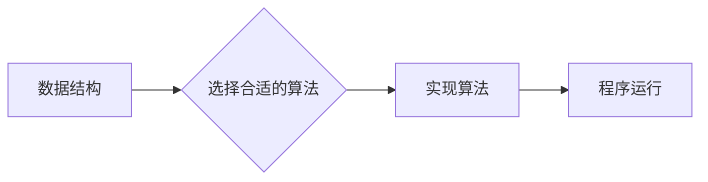

> 计算机原理、数据结构、算法、编程、计算机科学、软件工程、效率、复杂度

## 1. 背景介绍

在当今以数字化为核心的时代，计算机技术已渗透到生活的方方面面。从智能手机到云计算，从人工智能到物联网，计算机技术正在不断推动着社会的发展和进步。然而，想要真正理解和驾驭计算机技术，就必须深入了解其底层原理，掌握数据结构和算法的精髓。

数据结构和算法是计算机科学的基石，它们决定了程序的效率、性能和可扩展性。良好的数据结构和算法可以使程序运行更快、更流畅，并能够处理更复杂的数据。反之，如果数据结构和算法设计不当，程序可能会变得缓慢、臃肿，甚至无法正常运行。

## 2. 核心概念与联系

### 2.1 数据结构

数据结构是指用于组织和存储数据的特定方式。不同的数据结构具有不同的特点和适用场景。常见的几种数据结构包括：

* **数组:** 连续存储的元素集合，访问元素速度快，但插入和删除元素操作效率较低。
* **链表:** 元素通过指针链接，插入和删除元素操作效率高，但访问元素速度较慢。
* **栈:** 后进先出的数据结构，常用于函数调用和表达式求值。
* **队列:** 先进先出的数据结构，常用于任务调度和消息处理。
* **树:** 以节点和分支结构组织数据的层次结构，常用于文件系统和数据库索引。
* **图:** 用节点和边表示关系的数据结构，常用于社交网络和地图导航。

### 2.2 算法

算法是指解决特定问题的步骤序列。算法的效率和正确性至关重要。常见的算法分析方法包括时间复杂度和空间复杂度。

* **时间复杂度:** 指算法执行所需的时间与输入数据大小的关系。
* **空间复杂度:** 指算法执行所需内存空间与输入数据大小的关系。

### 2.3 核心概念联系

数据结构和算法相互关联，它们共同构成了计算机程序的运行机制。不同的数据结构适合不同的算法，而算法的效率也取决于所使用的数据结构。

**Mermaid 流程图:**



## 3. 核心算法原理 & 具体操作步骤

### 3.1 算法原理概述

**排序算法**是将一组数据按照特定顺序排列的算法。常见的排序算法包括：

* **冒泡排序:** 比较相邻元素，如果顺序错误则交换位置，重复该过程直到整个序列排序完成。
* **插入排序:** 将一个元素插入到已排序的序列中，使其保持排序。
* **选择排序:** 每次选择未排序序列中的最小元素，将其放到已排序序列的末尾。
* **归并排序:** 将序列分成两半，递归地对两半进行排序，然后将两半合并成一个排序序列。
* **快速排序:** 选择一个元素作为基准，将小于基准的元素放在左边，大于基准的元素放在右边，递归地对左右两部分进行排序。

### 3.2 算法步骤详解

以冒泡排序为例，详细说明其步骤：

1. 从序列的第一个元素开始比较相邻元素。
2. 如果相邻元素的顺序错误，则交换它们的顺序。
3. 重复步骤1和2，直到整个序列排序完成。

### 3.3 算法优缺点

**冒泡排序:**

* **优点:** 算法简单易懂，实现代码简洁。
* **缺点:** 时间复杂度较高，尤其对于大规模数据，效率较低。

### 3.4 算法应用领域

排序算法广泛应用于各种领域，例如：

* **数据库管理:** 对数据进行排序，以便快速查找和检索。
* **搜索引擎:** 对网页进行排序，以便根据用户查询结果进行排名。
* **图像处理:** 对图像像素进行排序，以便进行图像压缩和增强。

## 4. 数学模型和公式 & 详细讲解 & 举例说明

### 4.1 数学模型构建

**时间复杂度**通常用大O符号表示，例如O(n)，O(n^2)，O(log n)。

* **O(n):** 线性时间复杂度，算法执行时间与输入数据大小成正比。
* **O(n^2):** 平方时间复杂度，算法执行时间与输入数据大小的平方成正比。
* **O(log n):** 对数时间复杂度，算法执行时间与输入数据大小的对数成正比。

### 4.2 公式推导过程

**冒泡排序的时间复杂度分析:**

* 最坏情况和平均情况的时间复杂度都是O(n^2)。
* 最好情况的时间复杂度是O(n)，当序列已经排序时，只需要进行一次比较即可。

### 4.3 案例分析与讲解

**举例说明:**

假设有一个包含100个元素的序列，需要进行排序。

* 冒泡排序的时间复杂度为O(n^2)，因此执行时间大约为100^2 = 10000次比较。
* 快速排序的时间复杂度为O(n log n)，因此执行时间大约为100 * log(100) = 693次比较。

从以上例子可以看出，对于大规模数据，快速排序的效率明显高于冒泡排序。

## 5. 项目实践：代码实例和详细解释说明

### 5.1 开发环境搭建

* 操作系统: Ubuntu 20.04 LTS
* 编程语言: Python 3.8
* 开发工具: VS Code

### 5.2 源代码详细实现

```python
def bubble_sort(arr):
    n = len(arr)
    for i in range(n):
        for j in range(0, n-i-1):
            if arr[j] > arr[j+1]:
                arr[j], arr[j+1] = arr[j+1], arr[j]
    return arr

# 测试代码
arr = [64, 34, 25, 12, 22, 11, 90]
sorted_arr = bubble_sort(arr)
print("排序后的数组:", sorted_arr)
```

### 5.3 代码解读与分析

* `bubble_sort(arr)` 函数接收一个数组 `arr` 作为输入参数。
* 外层循环 `for i in range(n)` 控制排序的轮数，每次循环将最大的元素“冒泡”到数组末尾。
* 内层循环 `for j in range(0, n-i-1)` 比较相邻元素，如果顺序错误则交换位置。
* `arr[j], arr[j+1] = arr[j+1], arr[j]` 使用 Python 的元组解包语法进行元素交换。
* 最后返回排序后的数组 `sorted_arr`。

### 5.4 运行结果展示

```
排序后的数组: [11, 12, 22, 25, 34, 64, 90]
```

## 6. 实际应用场景

### 6.1 数据排序

* **电子商务平台:** 对商品进行价格排序，方便用户查找和比较。
* **搜索引擎:** 对网页进行排名，以便根据用户查询结果进行排序。
* **社交媒体:** 对用户好友列表进行排序，以便用户快速找到好友。

### 6.2 数据分析

* **数据挖掘:** 对大量数据进行排序，以便发现隐藏的模式和趋势。
* **机器学习:** 对训练数据进行排序，以便提高模型的训练效率和准确性。

### 6.3 其他应用场景

* **游戏开发:** 对游戏角色、物品等进行排序，以便进行游戏逻辑的处理。
* **图形图像处理:** 对图像像素进行排序，以便进行图像压缩和增强。

### 6.4 未来应用展望

随着人工智能和大数据的快速发展，数据结构和算法将发挥更加重要的作用。未来，我们将看到更多基于数据结构和算法的创新应用，例如：

* **个性化推荐:** 基于用户行为数据进行排序，提供个性化的商品推荐和内容推荐。
* **自动驾驶:** 基于传感器数据进行排序，帮助车辆做出更精准的决策。
* **医疗诊断:** 基于患者病历数据进行排序，辅助医生进行诊断和治疗。

## 7. 工具和资源推荐

### 7.1 学习资源推荐

* **书籍:**
    * 《算法导论》
    * 《数据结构与算法分析》
    * 《编程珠玑》
* **在线课程:**
    * Coursera: 数据结构与算法
    * edX: 算法导论
    * Udemy: 数据结构与算法

### 7.2 开发工具推荐

* **Python:** 广泛应用于数据科学、机器学习和软件开发。
* **Java:** 适用于企业级应用和大型系统开发。
* **C++:** 性能优异，适用于游戏开发和高性能计算。

### 7.3 相关论文推荐

* **《The Art of Computer Programming》** by Donald Knuth
* **《Introduction to Algorithms》** by Thomas H. Cormen, Charles E. Leiserson, Ronald L. Rivest, and Clifford Stein

## 8. 总结：未来发展趋势与挑战

### 8.1 研究成果总结

数据结构和算法研究取得了长足的进步，涌现出许多高效的算法和数据结构。这些成果推动了计算机科学的发展，并广泛应用于各个领域。

### 8.2 未来发展趋势

* **人工智能:** 人工智能的发展需要更加高效的数据结构和算法，例如用于深度学习的张量运算和图神经网络。
* **大数据:** 大数据时代需要处理海量数据，因此需要开发更加高效的算法和数据结构，例如分布式数据存储和处理技术。
* **云计算:** 云计算需要支持大规模并发访问，因此需要开发更加可靠和可扩展的数据结构和算法。

### 8.3 面临的挑战

* **算法复杂度:** 随着数据规模的不断增长，算法的复杂度问题日益突出。
* **算法可解释性:** 许多深度学习算法难以解释其决策过程，这限制了其在安全和可靠性要求高的领域中的应用。
* **算法公平性:** 算法可能存在偏见，导致不公平的结果。

### 8.4 研究展望

未来，数据结构和算法研究将继续朝着更加高效、可解释和公平的方向发展。

## 9. 附录：常见问题与解答

### 9.1 什么是时间复杂度？

时间复杂度是指算法执行时间与输入数据大小的关系。

### 9.2 什么是空间复杂度？

空间复杂度是指算法执行所需内存空间与输入数据大小的关系。

### 9.3 如何选择合适的算法？

选择合适的算法需要考虑算法的时间复杂度、空间复杂度、易实现性以及特定应用场景的需求。

### 9.4 如何提高算法效率？

提高算法效率的方法包括：

* 使用更优的算法
* 优化算法的代码实现
* 减少算法的重复计算
* 使用并行计算技术

### 9.5 如何学习数据结构和算法？

学习数据结构和算法需要系统地学习相关理论知识，并通过编程实践来巩固理解。

作者：禅与计算机程序设计艺术 / Zen and the Art of Computer Programming


<end_of_turn>