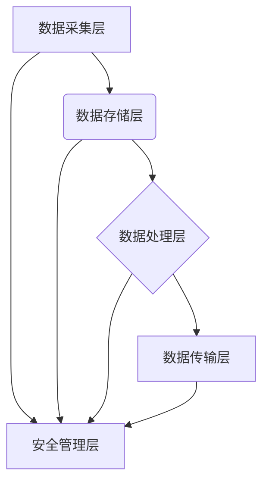

> 平台经济、数据安全、安全技术、隐私保护、数据加密、身份认证、安全审计、风险管理、应用场景

## 1. 背景介绍

平台经济作为一种以平台为核心、连接用户和提供商的商业模式，其发展迅速，深刻地改变了人们的生活方式和商业模式。然而，平台经济的蓬勃发展也带来了新的数据安全挑战。平台收集和处理海量用户数据，这些数据包含个人隐私信息、交易记录、行为轨迹等敏感信息，一旦泄露或被恶意利用，将造成严重后果。因此，保障平台经济数据安全至关重要。

近年来，随着人工智能、云计算等技术的快速发展，数据安全技术也取得了长足进步。各种安全技术成果，如数据加密、身份认证、安全审计等，为平台经济数据安全提供了有效保障。

## 2. 核心概念与联系

**2.1 平台经济数据安全核心概念**

* **数据安全：** 指平台经济中收集、存储、处理、传输的数据不被未经授权的访问、使用、修改或销毁，确保数据完整性、可用性和机密性。
* **隐私保护：** 指保护用户个人信息不被非法收集、使用、披露或利用，保障用户个人信息安全和合法权益。
* **数据治理：** 指建立和实施一套规范、有效的管理机制，确保数据安全、合规和可信。

**2.2 平台经济数据安全技术架构**

平台经济数据安全技术架构通常包括以下几个关键层级：

* **数据采集层：** 确保数据采集合法合规，并对敏感数据进行脱敏处理。
* **数据存储层：** 使用加密技术保护数据在存储过程中的安全，并采用多层安全防护机制防止数据泄露。
* **数据处理层：** 对数据进行安全处理，例如数据加密、访问控制、审计记录等。
* **数据传输层：** 使用安全协议和加密技术保护数据在传输过程中的安全。
* **安全管理层：** 建立安全策略、进行安全评估、监控安全事件、响应安全威胁等。



## 3. 核心算法原理 & 具体操作步骤

**3.1 算法原理概述**

数据加密算法是平台经济数据安全的重要技术手段之一。它通过将明文数据转换为不可读的密文，防止未经授权的访问和使用。常见的加密算法包括：

* **对称加密算法：** 使用相同的密钥进行加密和解密，例如AES、DES等。
* **非对称加密算法：** 使用一对密钥进行加密和解密，公钥用于加密，私钥用于解密，例如RSA、ECC等。

**3.2 算法步骤详解**

以AES算法为例，其加密步骤如下：

1. 选择一个密钥，密钥长度通常为128、192或256位。
2. 将明文数据分组，每个分组长度为128位。
3. 使用密钥和分组数据进行加密运算，得到密文分组。
4. 将密文分组拼接在一起，得到最终的密文。

解密步骤与加密步骤类似，只是使用相同的密钥进行解密运算。

**3.3 算法优缺点**

* **优点：**
    * 加密速度快，效率高。
    * 密钥管理相对简单。
* **缺点：**
    * 密钥安全至关重要，如果密钥泄露，数据将无法保护。

**3.4 算法应用领域**

* 数据存储加密
* 数据传输加密
* 身份认证
* 数字签名

## 4. 数学模型和公式 & 详细讲解 & 举例说明

**4.1 数学模型构建**

AES算法的加密过程可以抽象为一个置换网络，该网络由多个轮子组成，每个轮子包含一系列的置换、混淆和线性变换操作。

**4.2 公式推导过程**

AES算法的具体加密公式比较复杂，涉及到大量的线性变换、非线性变换和循环移位操作。

**4.3 案例分析与讲解**

可以以一个简单的例子来说明AES算法的加密过程，例如加密一个8位明文数据。

## 5. 项目实践：代码实例和详细解释说明

**5.1 开发环境搭建**

可以使用Python语言和相应的加密库实现AES算法的加密和解密功能。

**5.2 源代码详细实现**

```python
from Crypto.Cipher import AES

# 密钥
key = b'mysecretkey'

# 明文数据
plaintext = b'Hello, world!'

# 加密
cipher = AES.new(key, AES.MODE_ECB)
ciphertext = cipher.encrypt(plaintext)

# 解密
cipher = AES.new(key, AES.MODE_ECB)
plaintext = cipher.decrypt(ciphertext)

# 打印结果
print('明文数据:', plaintext)
print('密文数据:', ciphertext)
```

**5.3 代码解读与分析**

* `from Crypto.Cipher import AES`: 导入AES加密库。
* `key = b'mysecretkey'`: 设置加密密钥。
* `plaintext = b'Hello, world!'`: 设置明文数据。
* `cipher = AES.new(key, AES.MODE_ECB)`: 创建AES加密对象，使用ECB模式加密。
* `ciphertext = cipher.encrypt(plaintext)`: 对明文数据进行加密，得到密文数据。
* `cipher = AES.new(key, AES.MODE_ECB)`: 创建AES解密对象，使用ECB模式解密。
* `plaintext = cipher.decrypt(ciphertext)`: 对密文数据进行解密，得到明文数据。

**5.4 运行结果展示**

运行代码后，将输出明文数据和密文数据。

## 6. 实际应用场景

**6.1 数据存储安全**

平台可以对用户数据进行加密存储，防止未经授权的访问和使用。

**6.2 数据传输安全**

平台可以对用户数据进行加密传输，防止数据在传输过程中被窃取。

**6.3 身份认证安全**

平台可以利用非对称加密算法进行身份认证，确保用户身份的真实性和安全性。

**6.4 未来应用展望**

随着人工智能、云计算等技术的不断发展，数据安全技术将更加智能化、自动化和安全可靠。

## 7. 工具和资源推荐

**7.1 学习资源推荐**

* 《密码学原理与实践》
* 《数据安全技术》
* 《网络安全》

**7.2 开发工具推荐**

* OpenSSL
* Cryptography
* PyCryptodome

**7.3 相关论文推荐**

* AES算法的安全性分析
* 数据加密技术在平台经济中的应用

## 8. 总结：未来发展趋势与挑战

**8.1 研究成果总结**

平台经济数据安全技术取得了长足进步，各种安全技术成果为平台经济数据安全提供了有效保障。

**8.2 未来发展趋势**

* 数据安全技术将更加智能化、自动化和安全可靠。
* 数据安全技术将更加注重隐私保护和用户体验。
* 数据安全技术将更加注重跨平台和跨域的安全协作。

**8.3 面临的挑战**

* 数据安全技术面临着不断变化的攻击手段和技术挑战。
* 数据安全技术需要与平台经济的快速发展相适应。
* 数据安全技术需要兼顾安全性和用户体验。

**8.4 研究展望**

未来，数据安全技术将继续朝着更加智能化、自动化和安全可靠的方向发展，为平台经济的健康发展提供坚实的保障。

## 9. 附录：常见问题与解答

**9.1 如何选择合适的加密算法？**

选择合适的加密算法需要根据具体的应用场景和需求进行考虑。

**9.2 如何管理加密密钥？**

加密密钥的安全管理至关重要，需要采用安全的密钥管理机制，例如硬件安全模块、密钥库等。

**9.3 如何应对数据泄露事件？**

一旦发生数据泄露事件，需要及时采取措施进行应急处理，例如封锁漏洞、修复系统、通知用户等。


作者：禅与计算机程序设计艺术 / Zen and the Art of Computer Programming 
<end_of_turn>