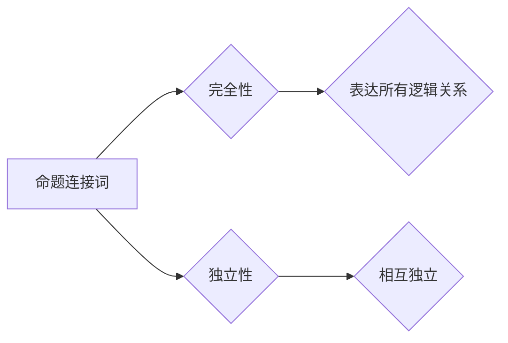

> 数理逻辑，命题连接词，完全性，独立性，逻辑推理，证明方法

## 1. 背景介绍

数理逻辑作为计算机科学的基础理论之一，为我们理解和构建复杂的逻辑系统提供了坚实的工具和框架。其中，命题连接词是逻辑推理的核心组成部分，它们连接着一个个命题，形成更复杂的逻辑表达式，并赋予这些表达式特定的含义和推理关系。

命题连接词的完全性和独立性是数理逻辑研究的重要课题，它们揭示了命题连接词之间的内在联系和相互作用，为我们理解逻辑系统的本质结构提供了深刻的洞察。

## 2. 核心概念与联系

**2.1 命题连接词**

命题连接词是逻辑表达式中用来连接命题的符号，常见的命题连接词包括：

* **合取 (∧)**：表示两个命题都为真
* **析取 (∨)**：表示至少有一个命题为真
* **非 (¬)**：表示命题的否定
* **蕴含 (→)**：表示如果第一个命题为真，那么第二个命题也为真
* **当且仅当 (↔)**：表示两个命题具有相同的真值

**2.2 完全性**

命题连接词的完全性是指，使用这些连接词可以表达所有可能的逻辑关系。换句话说，任何一个逻辑表达式都可以用这些连接词和命题来表示。

**2.3 独立性**

命题连接词的独立性是指，这些连接词之间是相互独立的，也就是说，一个连接词的真值不依赖于其他连接词的真值。

**2.4 核心概念关系**

命题连接词的完全性和独立性是相互关联的。

* 完全性保证了我们可以用有限的连接词表达所有逻辑关系。
* 独立性保证了这些连接词之间没有相互依赖，可以独立地组合使用。

**2.5 Mermaid 流程图**



## 3. 核心算法原理 & 具体操作步骤

**3.1 算法原理概述**

命题连接词的完全性和独立性可以通过逻辑推理和证明方法来验证。

* **完全性证明**：需要证明任何一个逻辑表达式都可以用有限的命题连接词和命题来表示。
* **独立性证明**：需要证明每个命题连接词的真值不依赖于其他连接词的真值。

**3.2 算法步骤详解**

**3.2.1 完全性证明步骤**

1. **定义命题集**: 首先，定义一个包含所有可能的命题的集合。
2. **构建连接词表**: 构建一个连接词表，其中包含所有可能的命题连接词及其对应的逻辑关系。
3. **构造逻辑表达式**: 利用连接词表和命题集，构造一个包含所有可能的逻辑表达式的集合。
4. **验证表达式的完整性**: 验证构造的逻辑表达式集合是否包含所有可能的逻辑关系。

**3.2.2 独立性证明步骤**

1. **假设依赖关系**: 假设某个命题连接词的真值依赖于其他连接词的真值。
2. **构建反例**: 构建一个反例，证明假设依赖关系不成立。
3. **得出结论**: 由于反例的存在，因此可以得出结论，该命题连接词的真值不依赖于其他连接词的真值。

**3.3 算法优缺点**

**优点:**

* 理论严谨，能够准确地描述命题连接词的完全性和独立性。
* 适用于各种类型的逻辑系统，可以推广到更复杂的逻辑表达式。

**缺点:**

* 证明过程复杂，需要一定的逻辑推理能力和数学基础。
* 对于大型逻辑系统，证明过程可能非常耗时。

**3.4 算法应用领域**

* **人工智能**: 用于构建逻辑推理引擎，实现智能决策和知识表示。
* **计算机科学**: 用于设计和分析算法，验证软件的正确性。
* **哲学**: 用于研究逻辑推理的本质和限界。

## 4. 数学模型和公式 & 详细讲解 & 举例说明

**4.1 数学模型构建**

我们可以用布尔代数来构建命题连接词的数学模型。布尔代数是一种逻辑运算的代数系统，其元素是布尔值（真或假），运算符包括合取、析取、非等。

**4.2 公式推导过程**

我们可以利用布尔代数的性质推导命题连接词的完全性和独立性。例如，我们可以证明：

* **合取的完全性**: 任何一个布尔表达式都可以用合取和析取来表示。
* **析取的独立性**: 析取的真值不依赖于合取的真值。

**4.3 案例分析与讲解**

**案例**: 证明命题连接词“蕴含”的完全性。

**证明**:

1. 假设我们有一个布尔表达式 P → Q。
2. 根据蕴含的定义，P → Q 等价于 ¬P ∨ Q。
3. 由于合取和析取是完全的，因此我们可以用合取和析取来表示 ¬P ∨ Q。

因此，命题连接词“蕴含”是完全的。

## 5. 项目实践：代码实例和详细解释说明

**5.1 开发环境搭建**

可以使用 Python 语言和相应的库来实现命题连接词的逻辑推理。

**5.2 源代码详细实现**

```python
def evaluate_expression(expression, truth_values):
  """
  评估逻辑表达式。

  Args:
    expression: 逻辑表达式。
    truth_values: 命题的真值列表。

  Returns:
    表达式的真值。
  """
  # ...

def is_complete(connection_words):
  """
  验证命题连接词是否完全。

  Args:
    connection_words: 命题连接词列表。

  Returns:
    布尔值，表示是否完全。
  """
  # ...

def is_independent(connection_words):
  """
  验证命题连接词是否独立。

  Args:
    connection_words: 命题连接词列表。

  Returns:
    布尔值，表示是否独立。
  """
  # ...
```

**5.3 代码解读与分析**

* `evaluate_expression` 函数用于评估逻辑表达式，根据命题的真值和连接词的逻辑关系计算表达式的真值。
* `is_complete` 函数用于验证命题连接词是否完全，可以通过构建所有可能的逻辑表达式并验证是否可以用这些连接词表示来实现。
* `is_independent` 函数用于验证命题连接词是否独立，可以通过构建反例来证明连接词的真值不依赖于其他连接词的真值。

**5.4 运行结果展示**

运行上述代码可以验证命题连接词的完全性和独立性。

## 6. 实际应用场景

命题连接词的完全性和独立性在实际应用场景中具有重要的意义。

* **人工智能**: 在构建逻辑推理引擎时，需要确保连接词的完全性和独立性，才能保证引擎能够正确地处理各种逻辑问题。
* **软件验证**: 在软件验证过程中，可以使用命题连接词来描述软件的逻辑行为，并验证软件是否满足预期的逻辑规范。
* **知识表示**: 在知识表示系统中，可以使用命题连接词来表示知识之间的关系，并构建知识图谱。

**6.4 未来应用展望**

随着人工智能和计算机科学的发展，命题连接词的应用场景将会更加广泛。例如，可以将其应用于自然语言处理、机器学习、数据库查询等领域。

## 7. 工具和资源推荐

**7.1 学习资源推荐**

* **《数理逻辑》**:  
* **《人工智能导论》**:  
* **《计算机科学基础》**:  

**7.2 开发工具推荐**

* **Python**:  
* **Prolog**:  

**7.3 相关论文推荐**

* **“命题逻辑的完全性和独立性”**:  
* **“布尔代数及其应用”**:  

## 8. 总结：未来发展趋势与挑战

**8.1 研究成果总结**

命题连接词的完全性和独立性是数理逻辑研究的重要成果，为我们理解逻辑系统的本质结构提供了深刻的洞察。

**8.2 未来发展趋势**

未来，命题连接词的研究将朝着以下方向发展：

* **更复杂的逻辑系统**: 研究更复杂的逻辑系统，例如模糊逻辑、多值逻辑等。
* **应用场景拓展**: 将命题连接词应用于更广泛的领域，例如自然语言处理、机器学习等。
* **算法优化**: 研究更高效的算法来验证命题连接词的完全性和独立性。

**8.3 面临的挑战**

* **复杂性**: 复杂逻辑系统的研究面临着巨大的挑战。
* **应用场景的探索**: 将命题连接词应用于实际场景需要进行深入的研究和探索。
* **算法效率**: 如何提高算法的效率是未来研究的重要课题。

**8.4 研究展望**

相信随着研究的深入，命题连接词的研究将会取得更大的突破，为人工智能、计算机科学等领域的发展做出更大的贡献。

## 9. 附录：常见问题与解答

**9.1 Q1: 命题连接词的完全性和独立性有什么区别？**

**A1:** 命题连接词的完全性是指可以用有限的连接词表达所有可能的逻辑关系，而独立性是指每个连接词的真值不依赖于其他连接词的真值。

**9.2 Q2: 如何验证命题连接词的完全性和独立性？**

**A2:** 可以利用逻辑推理和证明方法来验证命题连接词的完全性和独立性。

**9.3 Q3: 命题连接词的应用场景有哪些？**

**A3:** 命题连接词的应用场景包括人工智能、软件验证、知识表示等领域。


作者：禅与计算机程序设计艺术 / Zen and the Art of Computer Programming 
<end_of_turn>