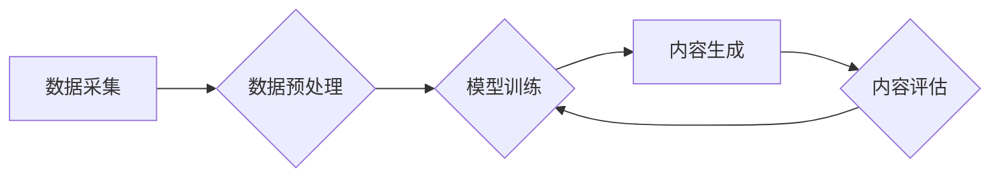

> AIGC, 文本生成, 图像生成, 多模态, 伦理, 安全, 监管

## 1. 背景介绍

人工智能生成内容（AIGC）作为人工智能领域的新兴分支，近年来发展迅速，取得了令人瞩目的成就。从文本生成、图像生成到视频生成，AIGC技术正在深刻地改变着我们创作、消费和交互的方式。

AIGC技术的核心在于利用机器学习算法，训练模型能够理解和生成人类语言、图像、音频等各种形式的内容。这些模型通常基于深度学习架构，例如Transformer、GAN等，并通过海量数据进行训练，从而学习到人类创作内容的规律和模式。

AIGC技术的应用场景日益广泛，涵盖了写作、绘画、音乐创作、视频制作、游戏开发等多个领域。它为人们提供了更便捷、高效、个性化的内容创作工具，同时也为创意产业带来了新的机遇和挑战。

## 2. 核心概念与联系

**2.1  AIGC的核心概念**

AIGC是指利用人工智能技术自动生成各种类型的内容，包括但不限于文本、图像、音频、视频等。

**2.2  AIGC与其他技术的联系**

AIGC技术与其他人工智能技术密切相关，例如：

* **自然语言处理（NLP）：** AIGC中用于文本生成、理解和翻译的模型通常基于NLP技术。
* **计算机视觉（CV）：** AIGC中用于图像生成、识别和分析的模型通常基于CV技术。
* **深度学习（DL）：** AIGC模型通常基于深度学习架构，例如Transformer、GAN等。

**2.3  AIGC的架构**

AIGC系统的架构通常包括以下几个模块：

* **数据采集和预处理模块：** 收集和预处理用于训练模型的数据。
* **模型训练模块：** 利用深度学习算法训练AIGC模型。
* **内容生成模块：** 根据用户需求生成各种类型的内容。
* **内容评估和反馈模块：** 对生成的内容进行评估和反馈，用于模型优化。

**2.4  AIGC流程图**



## 3. 核心算法原理 & 具体操作步骤

**3.1  算法原理概述**

AIGC的核心算法主要包括：

* **生成对抗网络（GAN）：** GAN由两个网络组成：生成器和鉴别器。生成器试图生成逼真的内容，而鉴别器试图区分真实内容和生成内容。两者相互竞争，最终使得生成器能够生成高质量的伪造内容。
* **Transformer：** Transformer是一种基于注意力机制的深度学习模型，能够有效地处理序列数据，例如文本。它在自然语言处理领域取得了突破性的进展，也为AIGC文本生成提供了强大的工具。

**3.2  算法步骤详解**

**3.2.1  GAN算法步骤**

1. 初始化生成器和鉴别器网络。
2. 生成器生成伪造数据。
3. 鉴别器对真实数据和伪造数据进行分类。
4. 根据鉴别器的反馈，更新生成器和鉴别器的参数。
5. 重复步骤2-4，直到生成器能够生成逼真的伪造数据。

**3.2.2  Transformer算法步骤**

1. 将输入文本序列编码成向量表示。
2. 利用多头注意力机制，学习文本序列之间的关系。
3. 通过前馈神经网络，进一步处理编码后的向量表示。
4. 将处理后的向量表示解码成输出文本序列。

**3.3  算法优缺点**

**3.3.1  GAN算法**

* **优点：** 可以生成逼真的图像、音频等内容。
* **缺点：** 训练过程复杂，容易出现模式崩溃等问题。

**3.3.2  Transformer算法**

* **优点：** 可以处理长文本序列，并学习文本之间的复杂关系。
* **缺点：** 计算量大，训练成本高。

**3.4  算法应用领域**

* **GAN算法：** 图像生成、视频生成、音频合成、数据增强等。
* **Transformer算法：** 文本生成、机器翻译、文本摘要、对话系统等。

## 4. 数学模型和公式 & 详细讲解 & 举例说明

**4.1  数学模型构建**

AIGC模型通常基于深度学习架构，例如GAN和Transformer。这些模型的数学模型构建基于神经网络，包括多个层级的神经元，每个神经元都具有权重和偏置。

**4.2  公式推导过程**

AIGC模型的训练过程涉及到优化模型参数的过程，通常使用梯度下降算法。梯度下降算法的目标是找到使损失函数最小的模型参数。损失函数衡量模型预测结果与真实结果之间的差异。

**4.3  案例分析与讲解**

例如，在文本生成任务中，可以使用Transformer模型生成文本。Transformer模型的输出是一个概率分布，表示每个词在该位置出现的概率。通过采样这个概率分布，可以生成一个新的文本序列。

**4.3.1  概率分布采样**

假设模型预测某个词在该位置出现的概率分布为：

```
P(word1) = 0.2
P(word2) = 0.3
P(word3) = 0.5
```

我们可以通过随机采样来选择一个词作为该位置的输出。例如，我们可以使用均匀分布进行采样，则每个词被选中的概率都是相等的。

**4.3.2  文本生成示例**

假设模型已经训练完成，并且我们想要生成一个关于“猫”的文本。我们可以输入“猫”作为初始词，然后让模型根据概率分布生成下一个词，以此类推，直到生成一个完整的句子。

## 5. 项目实践：代码实例和详细解释说明

**5.1  开发环境搭建**

AIGC项目开发通常需要以下环境：

* **操作系统：** Linux、macOS或Windows
* **编程语言：** Python
* **深度学习框架：** TensorFlow、PyTorch
* **GPU：** 用于加速模型训练

**5.2  源代码详细实现**

以下是一个使用PyTorch实现文本生成的简单代码示例：

```python
import torch
import torch.nn as nn

class TextGenerator(nn.Module):
    def __init__(self, vocab_size, embedding_dim, hidden_dim):
        super(TextGenerator, self).__init__()
        self.embedding = nn.Embedding(vocab_size, embedding_dim)
        self.lstm = nn.LSTM(embedding_dim, hidden_dim)
        self.fc = nn.Linear(hidden_dim, vocab_size)

    def forward(self, x):
        embedded = self.embedding(x)
        output, (hidden, cell) = self.lstm(embedded)
        output = self.fc(output[:, -1, :])
        return output

# ... 模型训练和使用代码 ...
```

**5.3  代码解读与分析**

该代码定义了一个简单的文本生成模型，它使用LSTM网络来学习文本序列的上下文关系。模型的输入是一个词的索引，输出是一个词的概率分布。

**5.4  运行结果展示**

训练完成后，我们可以使用模型生成新的文本序列。例如，我们可以输入“猫”作为初始词，然后让模型根据概率分布生成下一个词，以此类推，直到生成一个完整的句子。

## 6. 实际应用场景

**6.1  内容创作**

* **写作辅助工具：** AIGC可以帮助作家克服写作瓶颈，生成故事、文章、诗歌等内容。
* **营销文案生成：** AIGC可以自动生成广告文案、产品描述等营销内容。
* **游戏剧本创作：** AIGC可以帮助游戏开发者生成游戏剧情、对话等内容。

**6.2  教育培训**

* **个性化学习内容：** AIGC可以根据学生的学习进度和需求生成个性化的学习内容。
* **智能辅导系统：** AIGC可以帮助学生解答问题、提供学习建议。
* **虚拟教师：** AIGC可以模拟真人教师，为学生提供在线教学服务。

**6.3  娱乐休闲**

* **AI绘画工具：** AIGC可以根据用户的文字描述生成图像。
* **音乐创作工具：** AIGC可以生成新的音乐旋律、歌词等。
* **虚拟偶像：** AIGC可以创建虚拟偶像，为用户提供互动娱乐体验。

**6.4  未来应用展望**

AIGC技术的发展将进一步拓展其应用场景，例如：

* **虚拟现实（VR）和增强现实（AR）内容生成：** AIGC可以为VR和AR应用生成逼真的虚拟环境和交互内容。
* **个性化医疗服务：** AIGC可以帮助医生生成个性化的治疗方案，并为患者提供个性化的健康建议。
* **自动驾驶技术：** AIGC可以帮助自动驾驶系统理解周围环境，并做出更智能的决策。

## 7. 工具和资源推荐

**7.1  学习资源推荐**

* **书籍：**
    * 《深度学习》
    * 《自然语言处理》
    * 《生成对抗网络》
* **在线课程：**
    * Coursera
    * edX
    * Udacity

**7.2  开发工具推荐**

* **深度学习框架：** TensorFlow、PyTorch
* **文本处理工具：** NLTK、spaCy
* **图像处理工具：** OpenCV

**7.3  相关论文推荐**

* 《Attention Is All You Need》
* 《Generative Adversarial Networks》
* 《BERT: Pre-training of Deep Bidirectional Transformers for Language Understanding》

## 8. 总结：未来发展趋势与挑战

**8.1  研究成果总结**

近年来，AIGC技术取得了显著进展，在文本生成、图像生成、视频生成等领域取得了突破性的成果。

**8.2  未来发展趋势**

* **多模态AIGC：** 将文本、图像、音频等多种模态信息融合在一起，生成更丰富、更具创意的内容。
* **个性化AIGC：** 根据用户的喜好、需求和背景生成个性化的内容。
* **伦理与安全：** 关注AIGC技术的伦理问题和安全风险，确保其安全、可控地发展。

**8.3  面临的挑战**

* **数据获取和质量：** AIGC模型需要海量高质量的数据进行训练，而获取和清洗高质量数据仍然是一个挑战。
* **模型复杂度和训练成本：** AIGC模型通常非常复杂，训练成本也很高。
* **伦理和安全问题：** AIGC技术可能被用于生成虚假信息、侵犯隐私等恶意目的，需要加强伦理和安全方面的研究和监管。

**8.4  研究展望**

未来，AIGC技术将继续朝着更智能、更安全、更可控的方向发展。研究者们将继续探索新的算法、模型和应用场景，推动AIGC技术更好地服务于人类社会。

## 9. 附录：常见问题与解答

**9.1  AIGC技术是否会取代人类创造者？**

AIGC技术可以帮助人类提高创作效率和创造力，但它并不会完全取代人类创造者。人类的创造力来自于对世界的理解、情感和体验，这些是AIGC技术目前无法替代的。

**9.2  AIGC技术有哪些伦理风险？**

AIGC技术可能被用于生成虚假信息、侵犯隐私、制造深度伪造等恶意目的。因此，需要加强伦理和安全方面的研究和监管，确保AIGC技术安全、可控地发展。

**9.3  如何学习AIGC技术？**

学习AIGC技术需要掌握深度学习、自然语言处理、计算机视觉等相关知识。可以参考相关书籍、在线课程和开源项目进行学习。


作者：禅与计算机程序设计艺术 / Zen and the Art of Computer Programming 
<end_of_turn>