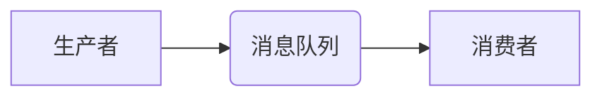

> 消息队列,异步通信,消息传递,生产者消费者模式,RabbitMQ,Kafka,性能优化

## 1. 背景介绍

在现代软件架构中，系统之间需要进行高效、可靠的通信。传统的同步通信方式存在性能瓶颈和复杂性问题。消息队列作为一种异步通信机制，逐渐成为解决这些问题的关键技术。

消息队列是一种用于实现异步通信的软件组件，它提供了一种可靠、高效、可扩展的方式来传递消息。消息队列将消息发送者（生产者）和消息接收者（消费者）解耦，允许它们在不同的时间和地点进行通信。

## 2. 核心概念与联系

**2.1 消息队列的核心概念**

* **消息：**消息队列中的基本单位，包含数据和元数据（例如消息ID、优先级等）。
* **生产者：**向消息队列发送消息的应用程序或进程。
* **消费者：**从消息队列接收并处理消息的应用程序或进程。
* **消息队列：**存储消息的中间件，负责消息的持久化、路由和分发。

**2.2 消息队列的架构**



**2.3 消息队列的优势**

* **异步通信：**生产者和消费者之间解耦，可以独立运行，提高系统吞吐量和响应速度。
* **可靠性：**消息队列提供消息持久化和重试机制，确保消息可靠地传递。
* **可扩展性：**消息队列可以水平扩展，以满足不断增长的消息处理需求。
* **灵活性：**消息队列支持多种消息格式和路由策略，可以满足不同的应用场景。

## 3. 核心算法原理 & 具体操作步骤

**3.1 算法原理概述**

消息队列的核心算法是生产者-消费者模式，它通过以下步骤实现消息的传递：

1. 生产者将消息发送到消息队列。
2. 消息队列将消息存储并进行路由。
3. 消费者从消息队列接收消息并进行处理。

**3.2 算法步骤详解**

1. **生产者发送消息：**生产者将消息封装成消息对象，并调用消息队列的发送方法将消息发送到消息队列。
2. **消息队列存储消息：**消息队列将接收到的消息存储在内存或磁盘中，并根据路由策略进行分发。
3. **消费者接收消息：**消费者订阅消息队列的特定主题或队列，并调用消息队列的接收方法从消息队列中获取消息。
4. **消息处理：**消费者接收到的消息会被进行处理，例如数据解析、业务逻辑执行等。
5. **消息确认：**消费者处理完消息后，需要向消息队列发送确认消息，告知消息队列消息已被成功处理。

**3.3 算法优缺点**

* **优点：**
    * 解耦生产者和消费者，提高系统灵活性和可扩展性。
    * 异步通信，提高系统吞吐量和响应速度。
    * 消息持久化，确保消息可靠传递。
* **缺点：**
    * 增加系统复杂度，需要管理消息队列和消费者。
    * 消息丢失风险，需要采取措施保证消息可靠性。

**3.4 算法应用领域**

* **电商平台：**订单处理、商品推荐、用户行为分析等。
* **金融系统：**交易处理、风险控制、数据分析等。
* **社交网络：**消息推送、用户互动、内容推荐等。
* **物联网：**设备数据采集、数据分析、设备控制等。

## 4. 数学模型和公式 & 详细讲解 & 举例说明

**4.1 数学模型构建**

消息队列的性能可以由以下数学模型表示：

* **吞吐量：**每秒钟处理的消息数量，单位为消息/秒。
* **延迟：**消息从生产者发送到消费者接收的时间，单位为毫秒。
* **丢包率：**消息丢失的比例，单位为%。

**4.2 公式推导过程**

吞吐量、延迟和丢包率之间的关系可以由以下公式表示：

* 吞吐量 = 消息数量 / 时间
* 延迟 = 接收时间 - 发送时间
* 丢包率 = 丢失消息数量 / 总消息数量

**4.3 案例分析与讲解**

假设一个消息队列系统每秒钟可以处理1000条消息，消息发送到接收的时间平均为50毫秒，消息丢失率为0.1%。

* 吞吐量 = 1000消息/秒
* 延迟 = 50毫秒
* 丢包率 = 0.1%

## 5. 项目实践：代码实例和详细解释说明

**5.1 开发环境搭建**

* 操作系统：Linux
* Java版本：JDK 11
* 消息队列：RabbitMQ

**5.2 源代码详细实现**

```java
import com.rabbitmq.client.Channel;
import com.rabbitmq.client.Connection;
import com.rabbitmq.client.ConnectionFactory;

public class MessageProducer {

    public static void main(String[] args) throws Exception {
        // 创建连接工厂
        ConnectionFactory factory = new ConnectionFactory();
        factory.setHost("localhost");

        // 创建连接
        Connection connection = factory.newConnection();

        // 创建通道
        Channel channel = connection.createChannel();

        // 声明队列
        String queueName = "hello";
        channel.queueDeclare(queueName, false, false, false, null);

        // 发送消息
        String message = "Hello, RabbitMQ!";
        channel.basicPublish("", queueName, null, message.getBytes());

        System.out.println(" [x] Sent '" + message + "'");

        // 关闭通道和连接
        channel.close();
        connection.close();
    }
}
```

**5.3 代码解读与分析**

* 代码首先创建连接工厂和连接，然后创建通道。
* 声明队列，如果队列不存在，则会自动创建。
* 发送消息，指定队列名称和消息内容。
* 关闭通道和连接。

**5.4 运行结果展示**

运行代码后，消息将被发送到名为“hello”的队列中。

## 6. 实际应用场景

**6.1 电商平台订单处理**

在电商平台中，订单处理是一个复杂的业务流程，涉及多个系统和环节。消息队列可以用于解耦订单处理各个环节，提高系统的可靠性和性能。例如，当用户提交订单时，系统可以将订单信息发送到消息队列，然后由不同的消费者处理订单支付、库存扣减、物流配送等环节。

**6.2 金融系统交易处理**

金融系统需要处理大量的交易数据，并保证交易的可靠性和安全性。消息队列可以用于实现交易的异步处理，提高系统的吞吐量和响应速度。例如，当用户进行转账操作时，系统可以将交易信息发送到消息队列，然后由不同的消费者处理交易确认、资金划转等环节。

**6.3 社交网络消息推送**

社交网络平台需要实时推送消息给用户，例如新消息、点赞、评论等。消息队列可以用于实现消息的异步推送，提高系统的可靠性和性能。例如，当用户发布新消息时，系统可以将消息发送到消息队列，然后由不同的消费者将消息推送给相关用户。

**6.4 物联网设备数据采集**

物联网设备会产生大量的实时数据，需要进行采集、处理和分析。消息队列可以用于实现设备数据的异步采集，提高系统的吞吐量和可靠性。例如，传感器可以将数据发送到消息队列，然后由不同的消费者进行数据分析、报警等处理。

**6.5 未来应用展望**

随着云计算、大数据、人工智能等技术的快速发展，消息队列将在未来应用场景中发挥更加重要的作用。例如，消息队列可以用于实现微服务架构、事件驱动架构、实时数据分析等。

## 7. 工具和资源推荐

**7.1 学习资源推荐**

* **RabbitMQ 官方文档：**https://www.rabbitmq.com/documentation.html
* **Kafka 官方文档：**https://kafka.apache.org/documentation/
* **消息队列设计模式：**https://www.oreilly.com/library/view/message-queues-design/9781492070377/

**7.2 开发工具推荐**

* **RabbitMQ 管理工具：**https://www.rabbitmq.com/management.html
* **Kafka 管理工具：**https://kafka.apache.org/documentation/#kafka_manager

**7.3 相关论文推荐**

* **Kafka: A Distributed Streaming Platform:** https://static.googleusercontent.com/media/research.google.com/en//pubs/archive/43211.pdf
* **RabbitMQ: A Message Broker for High-Performance Distributed Systems:** https://www.rabbitmq.com/whitepapers/rabbitmq-architecture.pdf

## 8. 总结：未来发展趋势与挑战

**8.1 研究成果总结**

消息队列技术已经发展成熟，并广泛应用于各种领域。

**8.2 未来发展趋势**

* **云原生消息队列：**消息队列将更加集成到云平台，提供更便捷的部署和管理方式。
* **Serverless 消息队列：**消息队列将更加轻量化，支持无服务器部署，降低运营成本。
* **AI 驱动的消息队列：**消息队列将集成人工智能技术，实现消息路由优化、异常检测等功能。

**8.3 面临的挑战**

* **消息可靠性：**确保消息在高并发、高可用场景下可靠传递仍然是一个挑战。
* **消息安全：**保护消息内容和传输安全也是一个重要问题。
* **消息治理：**随着消息队列规模的扩大，消息治理和管理也变得更加复杂。

**8.4 研究展望**

未来，消息队列技术将继续朝着更可靠、更安全、更智能的方向发展。

## 9. 附录：常见问题与解答

**9.1 消息丢失怎么办？**

消息队列通常提供消息确认机制，可以确保消息被成功处理。如果消息丢失，可以重试发送消息或使用消息重播机制。

**9.2 如何保证消息的安全性？**

消息队列可以采用加密、身份验证等机制来保证消息的安全性。

**9.3 如何管理消息队列的规模？**

可以使用消息队列管理工具来监控和管理消息队列的规模，并进行水平扩展。


作者：禅与计算机程序设计艺术 / Zen and the Art of Computer Programming 
<end_of_turn>