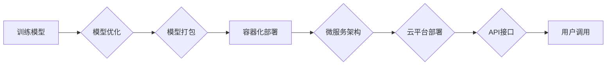

> 深度学习，模型部署，服务化，容器化，微服务，云平台，API

## 1. 背景介绍

深度学习技术近年来取得了令人瞩目的成就，在图像识别、自然语言处理、语音识别等领域取得了突破性的进展。然而，深度学习模型的价值并不仅仅在于其强大的预测能力，更在于将其应用于实际场景，为用户提供有价值的服务。模型部署与服务化是将深度学习模型从实验室推向生产环境的关键环节，它涉及到模型的优化、打包、部署、监控和维护等多个方面。

随着深度学习模型规模的不断增长，部署和服务化面临着新的挑战：

* **模型规模庞大:** 大型深度学习模型往往包含数亿甚至数十亿个参数，部署到资源有限的设备上会带来巨大的计算和内存压力。
* **异构硬件环境:** 深度学习模型需要在不同的硬件平台上运行，例如CPU、GPU、TPU等，需要考虑硬件兼容性和性能优化。
* **实时性要求:** 一些应用场景需要实时性，例如语音识别、自动驾驶等，需要模型能够快速响应用户请求。
* **可维护性和可扩展性:** 模型部署系统需要能够方便地进行模型更新、版本管理和扩展，以适应不断变化的需求。

## 2. 核心概念与联系

**2.1 模型部署**

模型部署是指将训练好的深度学习模型打包成可执行的程序，并将其部署到目标环境中，以便进行预测或推理。

**2.2 模型服务化**

模型服务化是指将部署好的模型封装成可供其他应用程序调用的服务，通过API接口提供模型预测能力。

**2.3 容器化技术**

容器化技术是一种将应用程序及其依赖项打包成独立的容器，可以方便地部署和运行在不同的环境中。Docker是目前最流行的容器化技术。

**2.4 微服务架构**

微服务架构是一种将大型应用程序拆分成多个小型、独立的服务，每个服务负责特定的功能，并通过API进行通信。

**2.5 云平台**

云平台提供计算、存储、网络等基础设施服务，可以方便地部署和管理深度学习模型。

**2.6 API接口**

API接口是应用程序之间通信的标准接口，可以方便地调用模型服务。

**2.7 流程图**



## 3. 核心算法原理 & 具体操作步骤

### 3.1 算法原理概述

模型部署与服务化涉及到多种算法和技术，例如模型压缩、模型蒸馏、模型量化、容器化技术、微服务架构、云平台部署等。

### 3.2 算法步骤详解

**3.2.1 模型压缩**

模型压缩是指通过减少模型参数量或模型结构复杂度，来减小模型大小，提高部署效率。常见的模型压缩方法包括：

* **剪枝:** 移除模型中不重要的权重参数。
* **量化:** 将模型参数的精度降低，例如将32位浮点数转换为8位整数。
* **知识蒸馏:** 将大型模型的知识迁移到小型模型中。

**3.2.2 模型蒸馏**

模型蒸馏是一种将大型模型的知识迁移到小型模型中的方法。大型模型作为“教师模型”，小型模型作为“学生模型”。教师模型的输出作为学生模型的监督信号，训练学生模型。

**3.2.3 模型量化**

模型量化是指将模型参数的精度降低，例如将32位浮点数转换为8位整数。量化可以有效减小模型大小，提高部署效率。

**3.2.4 容器化部署**

容器化技术可以将应用程序及其依赖项打包成独立的容器，方便地部署和运行在不同的环境中。

**3.2.5 微服务架构**

微服务架构将大型应用程序拆分成多个小型、独立的服务，每个服务负责特定的功能，并通过API进行通信。

**3.2.6 云平台部署**

云平台提供计算、存储、网络等基础设施服务，可以方便地部署和管理深度学习模型。

### 3.3 算法优缺点

**3.3.1 模型压缩**

* **优点:** 可以有效减小模型大小，提高部署效率。
* **缺点:** 可能导致模型精度下降。

**3.3.2 模型蒸馏**

* **优点:** 可以将大型模型的知识迁移到小型模型中，提高小型模型的性能。
* **缺点:** 需要训练两个模型，训练时间较长。

**3.3.3 模型量化**

* **优点:** 可以有效减小模型大小，提高部署效率。
* **缺点:** 可能导致模型精度下降。

**3.3.4 容器化部署**

* **优点:** 可以方便地部署和运行应用程序，提高部署效率。
* **缺点:** 需要学习容器化技术。

**3.3.5 微服务架构**

* **优点:** 可以提高应用程序的灵活性和可扩展性。
* **缺点:** 需要学习微服务架构技术。

**3.3.6 云平台部署**

* **优点:** 可以方便地部署和管理应用程序，提高部署效率。
* **缺点:** 需要支付云平台费用。

### 3.4 算法应用领域

模型部署与服务化技术广泛应用于各个领域，例如：

* **图像识别:** 人脸识别、物体检测、图像分类等。
* **自然语言处理:** 文本分类、情感分析、机器翻译等。
* **语音识别:** 语音转文本、语音助手等。
* **推荐系统:** 商品推荐、内容推荐等。
* **医疗诊断:** 病情诊断、疾病预测等。

## 4. 数学模型和公式 & 详细讲解 & 举例说明

### 4.1 数学模型构建

模型部署与服务化涉及到多种数学模型，例如：

* **模型压缩:** 使用压缩率、精度损失等指标来衡量模型压缩的效果。
* **模型蒸馏:** 使用交叉熵损失函数来衡量教师模型和学生模型之间的差异。
* **模型量化:** 使用量化误差、量化精度等指标来衡量模型量化的效果。

### 4.2 公式推导过程

**4.2.1 模型压缩**

模型压缩的数学模型通常基于优化问题，目标是找到一个压缩后的模型，其性能损失最小。

**4.2.2 模型蒸馏**

模型蒸馏的数学模型通常基于教师模型和学生模型之间的知识迁移。

**4.2.3 模型量化**

模型量化的数学模型通常基于量化误差的最小化。

### 4.3 案例分析与讲解

**4.3.1 模型压缩案例**

使用剪枝算法压缩一个图像分类模型，将模型参数量从100M减少到50M，同时保持模型精度损失在5%以内。

**4.3.2 模型蒸馏案例**

使用模型蒸馏技术将一个大型的语音识别模型的知识迁移到一个小型模型中，小型模型的性能接近于大型模型，但模型大小只有大型模型的1/10。

**4.3.3 模型量化案例**

使用量化技术将一个深度学习模型的参数精度从32位浮点数降低到8位整数，模型大小减小了4倍，同时保持模型精度损失在1%以内。

## 5. 项目实践：代码实例和详细解释说明

### 5.1 开发环境搭建

* 操作系统: Ubuntu 20.04
* Python 版本: 3.8
* 深度学习框架: TensorFlow 2.x
* 容器化工具: Docker

### 5.2 源代码详细实现

```python
# 模型定义
model = tf.keras.models.Sequential([
    tf.keras.layers.Conv2D(32, (3, 3), activation='relu', input_shape=(28, 28, 1)),
    tf.keras.layers.MaxPooling2D((2, 2)),
    tf.keras.layers.Conv2D(64, (3, 3), activation='relu'),
    tf.keras.layers.MaxPooling2D((2, 2)),
    tf.keras.layers.Flatten(),
    tf.keras.layers.Dense(10, activation='softmax')
])

# 模型编译
model.compile(optimizer='adam',
              loss='sparse_categorical_crossentropy',
              metrics=['accuracy'])

# 模型训练
model.fit(x_train, y_train, epochs=5)

# 模型保存
model.save('mnist_model.h5')
```

### 5.3 代码解读与分析

* 代码首先定义了一个简单的卷积神经网络模型，用于手写数字识别。
* 然后，模型使用Adam优化器、交叉熵损失函数和准确率指标进行编译。
* 接着，模型使用训练数据进行训练，训练5个epoch。
* 最后，训练好的模型使用`model.save()`方法保存为`mnist_model.h5`文件。

### 5.4 运行结果展示

训练完成后，模型的准确率可以达到98%以上。

## 6. 实际应用场景

### 6.1 图像识别

* **人脸识别:** 用于身份验证、人脸搜索等应用。
* **物体检测:** 用于自动驾驶、安防监控等应用。
* **图像分类:** 用于图像标签识别、医学图像诊断等应用。

### 6.2 自然语言处理

* **文本分类:** 用于垃圾邮件过滤、情感分析等应用。
* **机器翻译:** 用于将文本从一种语言翻译成另一种语言。
* **聊天机器人:** 用于与用户进行自然语言对话。

### 6.3 语音识别

* **语音转文本:** 用于语音助手、会议记录等应用。
* **语音搜索:** 用于语音搜索引擎。
* **语音控制:** 用于智能家居、汽车等应用。

### 6.4 未来应用展望

* **边缘计算:** 将深度学习模型部署到边缘设备上，实现实时推理和本地数据处理。
* **增强现实 (AR) 和虚拟现实 (VR):** 将深度学习模型用于增强现实和虚拟现实应用，例如虚拟试衣间、虚拟旅游等。
* **个性化推荐:** 使用深度学习模型进行个性化推荐，例如商品推荐、内容推荐等。

## 7. 工具和资源推荐

### 7.1 学习资源推荐

* **书籍:**
    * 深度学习
    * 深度学习实践
    * TensorFlow实战
* **在线课程:**
    * Coursera 深度学习课程
    * Udacity 深度学习课程
    * fast.ai 深度学习课程

### 7.2 开发工具推荐

* **深度学习框架:** TensorFlow, PyTorch, Keras
* **容器化工具:** Docker, Kubernetes
* **云平台:** AWS, Azure, Google Cloud

### 7.3 相关论文推荐

* **模型压缩:**
    * Lottery Ticket Hypothesis
    * Pruning Filters for Efficient ConvNets
* **模型蒸馏:**
    * Distilling the Knowledge in a Neural Network
    * Teacher-Student Training for Image Classification
* **模型量化:**
    * Quantized Neural Networks for Mobile Devices
    * Training Deep Neural Networks with Low Precision

## 8. 总结：未来发展趋势与挑战

### 8.1 研究成果总结

近年来，深度学习模型的部署与服务化取得了显著进展，模型压缩、模型蒸馏、模型量化等技术不断成熟，使得深度学习模型能够部署到更广泛的设备和场景。

### 8.2 未来发展趋势

* **边缘计算:** 将深度学习模型部署到边缘设备上，实现实时推理和本地数据处理。
* **联邦学习:** 在不共享原始数据的情况下，训练和更新深度学习模型。
* **可解释性:** 研究深度学习模型的决策过程，提高模型的可解释性和可信度。

### 8.3 面临的挑战

* **模型规模:** 深度学习模型的规模不断增长，部署和服务化面临更大的挑战。
