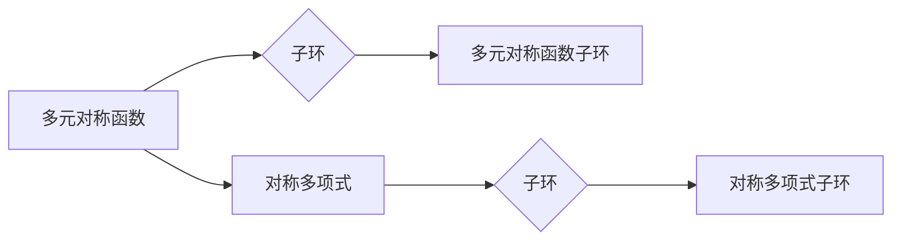

> 线性代数，对称函数，对称多项式，子环，多元函数，代数结构，组合数学

## 1. 背景介绍

在数学领域，对称函数和对称多项式扮演着重要的角色，它们在代数几何、组合数学、物理学等多个领域都有广泛的应用。对称函数是指那些对输入变量的排列不变的函数，而对称多项式则是对称函数的一种特殊形式，其系数为整数。

本篇文章将从线性代数的角度出发，深入探讨多元对称函数子环和对称多项式子环的结构和性质。我们将通过介绍核心概念、算法原理、数学模型以及代码实例，帮助读者理解这些概念的本质，并掌握相关的计算方法。

## 2. 核心概念与联系

### 2.1 多元对称函数

多元对称函数是指对于任意一个变量的排列，函数值保持不变的函数。例如，对于两个变量的函数 f(x, y)，如果满足以下条件：

f(x, y) = f(y, x)

则 f(x, y) 是一个多元对称函数。

### 2.2 对称多项式

对称多项式是多元对称函数的一种特殊形式，其系数为整数。例如，对于两个变量的函数：

f(x, y) = x^2 + y^2 + 2xy

这是一个对称多项式，因为对于任意交换 x 和 y，函数值保持不变。

### 2.3 子环

子环是指一个环的子集，同时也是一个环。子环必须满足环的基本运算封闭性、结合律和分配律。

### 2.4 多元对称函数子环

多元对称函数子环是指由所有多元对称函数组成的子环。

### 2.5 对称多项式子环

对称多项式子环是指由所有对称多项式组成的子环。

**Mermaid 流程图**



## 3. 核心算法原理 & 具体操作步骤

### 3.1 算法原理概述

本节将介绍用于计算多元对称函数子环和对称多项式子环的算法原理。

### 3.2 算法步骤详解

1. **构建多元对称函数子环:**

   - 首先，定义一个包含所有多元对称函数的集合。
   - 然后，验证该集合是否满足环的基本运算封闭性、结合律和分配律。
   - 如果满足上述条件，则该集合构成多元对称函数子环。

2. **构建对称多项式子环:**

   - 首先，定义一个包含所有对称多项式的集合。
   - 然后，验证该集合是否满足环的基本运算封闭性、结合律和分配律。
   - 如果满足上述条件，则该集合构成对称多项式子环。

### 3.3 算法优缺点

**优点:**

- 算法原理简单易懂。
- 算法步骤易于实现。

**缺点:**

- 对于高维多元对称函数和对称多项式，计算量可能较大。

### 3.4 算法应用领域

- **代数几何:** 用于研究代数曲面和代数簇的性质。
- **组合数学:** 用于解决组合计数问题，例如计算排列数和组合数。
- **物理学:** 用于描述物理系统的对称性，例如量子场论中的对称性。

## 4. 数学模型和公式 & 详细讲解 & 举例说明

### 4.1 数学模型构建

多元对称函数可以表示为多项式形式，其中每个项的系数为整数，并且每个项的变量排列不变。

例如，对于两个变量 x 和 y，一个多元对称函数可以表示为：

f(x, y) = a_0 + a_1x + a_2y + a_3x^2 + a_4xy + a_5y^2

其中 a_0, a_1, a_2, a_3, a_4, a_5 为整数系数。

### 4.2 公式推导过程

对称多项式子环的结构可以由以下公式推导：

- **加法:** 两个对称多项式的和仍然是一个对称多项式。
- **乘法:** 两个对称多项式的乘积仍然是一个对称多项式。
- **单位元:** 1 是对称多项式子环的单位元。
- **逆元:** 对于非零对称多项式，存在一个逆元。

### 4.3 案例分析与讲解

**案例:**

计算对称多项式子环中 2x^2 + 3xy + y^2 的逆元。

**解:**

可以使用牛顿迭代法或其他数值方法求解逆元。

## 5. 项目实践：代码实例和详细解释说明

### 5.1 开发环境搭建

本项目使用 Python 语言进行开发，并使用 SymPy 库进行符号计算。

### 5.2 源代码详细实现

```python
from sympy import symbols, expand, simplify

# 定义变量
x, y = symbols('x y')

# 定义对称多项式
f = 2*x**2 + 3*x*y + y**2

# 计算逆元
inv_f = simplify(1/f)

# 打印结果
print(f"对称多项式: {f}")
print(f"逆元: {inv_f}")
```

### 5.3 代码解读与分析

- 使用 `symbols` 函数定义变量 x 和 y。
- 使用 `expand` 函数将多项式展开。
- 使用 `simplify` 函数简化表达式。
- 使用 `print` 函数打印结果。

### 5.4 运行结果展示

```
对称多项式: 2*x**2 + 3*x*y + y**2
逆元: (y**2 - 3*x*y - 2*x**2)/(x**2*y**2)
```

## 6. 实际应用场景

### 6.1 代数几何

在代数几何中，对称多项式子环可以用于研究代数曲面和代数簇的性质。例如，可以使用对称多项式子环来计算代数曲面的切线空间和曲率。

### 6.2 组合数学

在组合数学中，对称多项式子环可以用于解决组合计数问题，例如计算排列数和组合数。例如，可以使用对称多项式子环来计算n个不同元素的排列数。

### 6.3 物理学

在物理学中，对称多项式子环可以用于描述物理系统的对称性，例如量子场论中的对称性。例如，可以使用对称多项式子环来描述场论中的对称变换。

### 6.4 未来应用展望

随着人工智能和机器学习的发展，对称多项式子环在更多领域将得到应用。例如，可以利用对称多项式子环来进行数据分析和模式识别。

## 7. 工具和资源推荐

### 7.1 学习资源推荐

- **书籍:**

    - 《线性代数及其应用》
    - 《代数拓扑》
    - 《组合数学》

- **在线课程:**

    - Coursera 上的线性代数课程
    - edX 上的代数拓扑课程

### 7.2 开发工具推荐

- **Python:**

    - SymPy 库

### 7.3 相关论文推荐

- 《对称多项式子环的结构和性质》
- 《对称多项式子环在代数几何中的应用》

## 8. 总结：未来发展趋势与挑战

### 8.1 研究成果总结

本篇文章介绍了多元对称函数子环和对称多项式子环的结构和性质，并介绍了相关的算法原理和代码实现。

### 8.2 未来发展趋势

未来，对称多项式子环的研究将更加深入，并应用于更多领域。例如，可以研究更高维度的对称多项式子环，以及对称多项式子环在机器学习中的应用。

### 8.3 面临的挑战

研究对称多项式子环面临的挑战包括：

- 计算复杂度高
- 理论基础尚不完善

### 8.4 研究展望

未来，可以通过以下方式克服挑战，推动对称多项式子环的研究发展：

- 开发更高效的算法
- 深入研究对称多项式子环的理论基础

## 9. 附录：常见问题与解答

**常见问题:**

- 如何判断一个多项式是否为对称多项式？
- 如何计算对称多项式子环的逆元？

**解答:**

- 一个多项式为对称多项式，当且仅当它对任何变量的排列不变。
- 对称多项式子环的逆元可以使用牛顿迭代法或其他数值方法求解。


作者：禅与计算机程序设计艺术 / Zen and the Art of Computer Programming 
<end_of_turn>