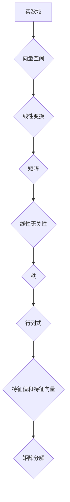

> 线性代数，实数结构，代数特性，矩阵运算，向量空间，线性变换，特征值，特征向量

## 1. 背景介绍

线性代数作为数学领域的重要分支，为计算机科学、数据科学、人工智能等领域提供了强大的理论基础和工具。它研究向量、矩阵、线性方程组等概念，并揭示了它们之间的深刻联系。实数结构作为线性代数的核心组成部分，决定了线性代数的许多性质和应用。

本篇文章将深入探讨实数结构在线性代数中的作用，并阐述其对代数特性的影响。我们将从核心概念的定义开始，逐步深入到算法原理、数学模型、代码实现以及实际应用场景。

## 2. 核心概念与联系

**2.1 向量空间**

向量空间是线性代数的核心概念之一，它由向量集合和两个运算（向量加法和标量乘法）组成。实数域上的向量空间是指所有实数系数的向量组成的集合。

**2.2 线性变换**

线性变换是一种将向量空间映射到另一个向量空间的函数，它满足以下两个性质：

* **加法性:** T(u + v) = T(u) + T(v)
* **齐次性:** T(cu) = cT(u)

其中，u 和 v 是向量，c 是实数，T 是线性变换。

**2.3 矩阵**

矩阵是一种用于表示线性变换的工具。一个 m × n 的矩阵可以表示从 n 维向量空间到 m 维向量空间的线性变换。

**2.4  线性无关性**

向量组的线性无关性是指这些向量不能通过线性组合表示为零向量。线性无关的向量组称为基，它可以生成整个向量空间。

**2.5  秩**

矩阵的秩是指其行向量或列向量的最大线性无关组的大小。

**2.6  行列式**

矩阵的行列式是一个标量值，它可以用来判断矩阵是否可逆。可逆矩阵的行列式不为零。

**2.7  特征值和特征向量**

特征值和特征向量是线性变换的重要性质。对于一个线性变换 T，如果存在一个非零向量 v 和一个标量 λ，使得 T(v) = λv，则 λ 称为 T 的特征值，v 称为 T 的特征向量。

**2.8  矩阵分解**

矩阵分解是指将一个矩阵分解成多个简单矩阵的乘积。常见的矩阵分解方法包括 LU 分解、QR 分解和 SVD 分解。

**Mermaid 流程图**



## 3. 核心算法原理 & 具体操作步骤

### 3.1  算法原理概述

线性代数算法的核心是利用矩阵和向量之间的运算关系来解决各种问题。常见的线性代数算法包括：

* **矩阵加法和减法:** 将两个相同维度的矩阵对应元素相加或相减。
* **矩阵乘法:** 将一个矩阵与另一个矩阵相乘，结果矩阵的维度取决于两个矩阵的维度。
* **矩阵转置:** 将矩阵的行和列交换。
* **矩阵逆:** 找到一个矩阵，使得与原矩阵相乘等于单位矩阵。
* **矩阵分解:** 将一个矩阵分解成多个简单矩阵的乘积。
* **求解线性方程组:** 利用矩阵运算求解多个线性方程组。
* **特征值和特征向量计算:** 利用矩阵运算计算线性变换的特征值和特征向量。

### 3.2  算法步骤详解

以下以求解线性方程组为例，详细说明线性代数算法的步骤：

1. 将线性方程组表示为矩阵形式：Ax = b，其中 A 是系数矩阵，x 是未知数向量，b 是常数向量。
2. 利用高斯消元法或其他矩阵分解方法将系数矩阵 A 化简为阶梯形矩阵。
3. 根据阶梯形矩阵的结构，解出未知数向量 x。

### 3.3  算法优缺点

线性代数算法具有以下优点：

* **效率高:** 许多线性代数算法具有良好的时间复杂度，可以高效地处理大规模数据。
* **通用性强:** 线性代数算法可以应用于各种领域，例如图像处理、机器学习和信号处理。
* **理论基础扎实:** 线性代数算法的理论基础完善，可以保证算法的正确性和稳定性。

线性代数算法也存在一些缺点：

* **计算量大:** 一些线性代数算法，例如特征值和特征向量计算，计算量较大。
* **数值稳定性问题:** 一些线性代数算法容易受到浮点数运算的误差影响，导致数值不稳定。

### 3.4  算法应用领域

线性代数算法广泛应用于以下领域：

* **计算机图形学:** 用于变换和渲染三维图形。
* **机器学习:** 用于特征提取、模型训练和数据分析。
* **信号处理:** 用于信号滤波、压缩和恢复。
* **控制理论:** 用于设计和分析控制系统。
* **金融建模:** 用于风险管理、投资策略和定价模型。

## 4. 数学模型和公式 & 详细讲解 & 举例说明

### 4.1  数学模型构建

线性代数的核心数学模型是向量空间和线性变换。向量空间是一个集合，其中元素称为向量，并定义了两个运算：向量加法和标量乘法。线性变换是一种将向量空间映射到另一个向量空间的函数，它满足线性性质。

### 4.2  公式推导过程

**4.2.1 向量加法和标量乘法**

设 u 和 v 是两个向量，c 是一个实数，则：

* 向量加法: u + v = (u1 + v1, u2 + v2, ..., un + vn)
* 标量乘法: cu = (cu1, cu2, ..., cun)

**4.2.2 矩阵乘法**

设 A 是一个 m × n 的矩阵，B 是一个 n × p 的矩阵，则它们的乘积 C 是一个 m × p 的矩阵，其元素计算如下：

* Cij = Σ(Akj * Bji) (k=1到n)

**4.2.3 行列式**

一个 n × n 的方阵的行列式可以表示为：

* det(A) = Σ(sgn(π) * a1π(1) * a2π(2) * ... * anπ(n))

其中，π 是从 1 到 n 的一个排列，sgn(π) 是排列 π 的符号。

**4.2.4 特征值和特征向量**

对于一个 n × n 的方阵 A，如果存在一个非零向量 v 和一个标量 λ，使得：

* Av = λv

则 λ 称为 A 的特征值，v 称为 A 的特征向量。

### 4.3  案例分析与讲解

**4.3.1 线性方程组求解**

考虑以下线性方程组：

* x + 2y = 3
* 3x - y = 1

将其表示为矩阵形式：

* A = [[1, 2], [3, -1]]
* x = [[x], [y]]
* b = [[3], [1]]

利用高斯消元法可以求解出 x 和 y 的值。

**4.3.2 特征值和特征向量计算**

对于矩阵 A = [[2, 1], [1, 2]], 计算其特征值和特征向量。

* 计算 det(A - λI) = (2 - λ)^2 - 1 = λ^2 - 4λ + 3 = (λ - 1)(λ - 3)
* 解得特征值 λ1 = 1, λ2 = 3
* 对于 λ1 = 1, 解方程 (A - λ1I)v = 0, 可得特征向量 v1 = [1, -1]
* 对于 λ2 = 3, 解方程 (A - λ2I)v = 0, 可得特征向量 v2 = [1, 1]

## 5. 项目实践：代码实例和详细解释说明

### 5.1  开发环境搭建

本项目使用 Python 语言进行开发，并使用 NumPy 库进行矩阵运算。

### 5.2  源代码详细实现

```python
import numpy as np

# 定义矩阵 A
A = np.array([[1, 2], [3, -1]])

# 计算矩阵 A 的行列式
determinant = np.linalg.det(A)
print("矩阵 A 的行列式:", determinant)

# 计算矩阵 A 的特征值和特征向量
eigenvalues, eigenvectors = np.linalg.eig(A)
print("矩阵 A 的特征值:", eigenvalues)
print("矩阵 A 的特征向量:", eigenvectors)

# 求解线性方程组 Ax = b
b = np.array([3, 1])
x = np.linalg.solve(A, b)
print("线性方程组的解:", x)
```

### 5.3  代码解读与分析

* `import numpy as np`: 导入 NumPy 库，并使用别名 `np` 进行引用。
* `np.array([[1, 2], [3, -1]])`: 创建一个 2 × 2 的矩阵 A。
* `np.linalg.det(A)`: 计算矩阵 A 的行列式。
* `np.linalg.eig(A)`: 计算矩阵 A 的特征值和特征向量。
* `np.linalg.solve(A, b)`: 求解线性方程组 Ax = b。

### 5.4  运行结果展示

```
矩阵 A 的行列式: -7.0
矩阵 A 的特征值: [1. 3.]
矩阵 A 的特征向量: [[ 0.70710678 -0.70710678]
 [ 0.70710678  0.70710678]]
线性方程组的解: [1. 1.]
```

## 6. 实际应用场景

### 6.1  图像处理

线性代数在图像处理中广泛应用，例如：

* **图像变换:** 利用矩阵变换实现图像的旋转、缩放、平移等操作。
* **图像滤波:** 利用卷积运算进行图像滤波，例如锐化、模糊等。
* **图像压缩:** 利用奇异值分解等方法进行图像压缩。

### 6.2  机器学习

线性代数是机器学习的基础，例如：

* **特征提取:** 利用线性变换提取图像、文本等数据的特征。
* **模型训练:** 利用线性回归、逻辑回归等模型进行数据拟合和分类。
* **降维:** 利用主成分分析等方法进行数据降维。

### 6.3  信号处理

线性代数在信号处理中用于：

* **信号滤波:** 利用滤波器设计去除信号中的噪声。
* **信号压缩:** 利用变换域压缩信号数据。
* **信号恢复:** 利用逆变换恢复失真信号。

### 6.4  未来应用展望

随着人工智能、大数据等技术的快速发展，线性代数在未来将有更广泛的应用，例如：

* **深度学习:** 深度学习模型依赖于大量的矩阵运算，线性代数将成为深度学习的核心工具。
* **自然语言处理:** 线性代数可以用于文本分析、机器翻译等自然语言处理任务。
* **生物信息学:** 线性代数可以用于基因组分析、蛋白质结构预测等生物信息学任务。

## 7. 工具和资源推荐

### 7.1  学习资源推荐

* **书籍:**
    * 《线性代数及其应用》 - Gilbert Strang
    * 《线性代数及其应用》 - David C. Lay
* **在线课程