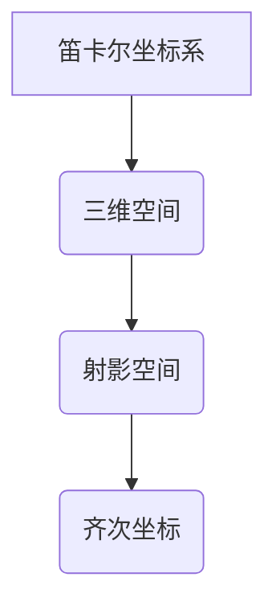

> 线性代数，射影空间，投影变换，齐次坐标，计算机图形学，计算机视觉

## 1. 背景介绍

射影空间是计算机图形学和计算机视觉领域中一个重要的概念，它为我们提供了描述三维空间中点的几何关系和变换的有效工具。传统的笛卡尔坐标系只能描述空间中的位置，而射影空间则能够描述空间中的点、线和平面，并能够进行更灵活的变换操作。

在计算机图形学中，射影空间被广泛应用于场景渲染、物体变换和透视投影等方面。例如，在渲染三维场景时，我们需要将三维物体投影到二维屏幕上，而射影空间提供了实现这种投影的数学基础。

## 2. 核心概念与联系

射影空间的核心概念是**齐次坐标**。齐次坐标是一种将三维空间中的点表示为四维向量的坐标系。

**射影空间与笛卡尔坐标系的联系：**



**射影空间的优势：**

* **简化变换操作：** 在射影空间中，许多几何变换，例如旋转、缩放和平移，都可以用矩阵乘法来实现，这使得变换操作更加简洁高效。
* **处理无穷远点：** 射影空间能够自然地处理无穷远点，这在描述远处的物体和透视投影时非常重要。
* **保持射影不变性：** 射影空间中的变换操作保持了射影不变性，这意味着变换后的图像仍然具有相同的透视关系。

## 3. 核心算法原理 & 具体操作步骤

### 3.1  算法原理概述

射影空间中的投影变换是将三维空间中的点投影到二维平面上的一种变换。

**投影变换的原理：**

* 将三维空间中的点转换为齐次坐标。
* 使用投影矩阵将齐次坐标进行变换。
* 将变换后的齐次坐标转换为二维坐标。

**投影矩阵的构成：**

投影矩阵包含了透视参数，例如视场角、近裁剪面和远裁剪面。

### 3.2  算法步骤详解

**步骤 1：将三维空间中的点转换为齐次坐标。**

```
[x, y, z] --> [x, y, z, 1]
```

**步骤 2：使用投影矩阵将齐次坐标进行变换。**

```
[x, y, z, 1] * P = [x', y', z', w]
```

其中，P是投影矩阵。

**步骤 3：将变换后的齐次坐标转换为二维坐标。**

```
x' = x' / z'
y' = y' / z'
```

### 3.3  算法优缺点

**优点：**

* 可以实现透视投影效果。
* 可以处理无穷远点。
* 变换操作简洁高效。

**缺点：**

* 需要额外的计算量。
* 投影矩阵的设置需要根据场景进行调整。

### 3.4  算法应用领域

射影空间中的投影变换广泛应用于以下领域：

* 计算机图形学：场景渲染、物体变换、透视投影。
* 计算机视觉：图像处理、目标检测、三维重建。
* 机器学习：深度学习模型的训练和推理。

## 4. 数学模型和公式 & 详细讲解 & 举例说明

### 4.1  数学模型构建

射影空间中的点可以用齐次坐标表示，即一个四维向量 [x, y, z, w]。其中，x, y, z 是空间坐标，w 是齐次坐标。

### 4.2  公式推导过程

**投影变换矩阵：**

```latex
P = \begin{bmatrix}
f & 0 & 0 & 0 \\
0 & f & 0 & 0 \\
0 & 0 & 1 & 0 \\
0 & 0 & 0 & 1
\end{bmatrix}
```

其中，f 是视场角。

**齐次坐标转换：**

```latex
[x', y', z', w] = [x, y, z, 1] * P
```

**二维坐标转换：**

```latex
x' = x' / w
y' = y' / w
```

### 4.3  案例分析与讲解

**示例：**

将三维空间中的点 (1, 2, 3) 投影到二维平面上，视场角为 45 度。

**步骤：**

1. 将点 (1, 2, 3) 转换为齐次坐标： [1, 2, 3, 1]。
2. 使用投影矩阵进行变换：

```latex
\begin{bmatrix}
1 & 2 & 3 & 1
\end{bmatrix} * \begin{bmatrix}
\sqrt{2} & 0 & 0 & 0 \\
0 & \sqrt{2} & 0 & 0 \\
0 & 0 & 1 & 0 \\
0 & 0 & 0 & 1
\end{bmatrix} = \begin{bmatrix}
\sqrt{2} & 2\sqrt{2} & 3 & 1
\end{bmatrix}
```

3. 将变换后的齐次坐标转换为二维坐标：

```latex
x' = \sqrt{2} / 1 = \sqrt{2}
y' = 2\sqrt{2} / 1 = 2\sqrt{2}
```

因此，点 (1, 2, 3) 在视场角为 45 度的射影空间中的投影为 (√2, 2√2)。

## 5. 项目实践：代码实例和详细解释说明

### 5.1  开发环境搭建

* 操作系统：Windows/macOS/Linux
* 编程语言：Python
* 库：NumPy、OpenGL

### 5.2  源代码详细实现

```python
import numpy as np

# 投影矩阵
projection_matrix = np.array([
    [1, 0, 0, 0],
    [0, 1, 0, 0],
    [0, 0, 1, 0],
    [0, 0, 0, 1]
])

# 三维空间中的点
point = np.array([1, 2, 3])

# 将点转换为齐次坐标
homogeneous_point = np.append(point, 1)

# 使用投影矩阵进行变换
projected_point = np.dot(projection_matrix, homogeneous_point)

# 将变换后的齐次坐标转换为二维坐标
x = projected_point[0] / projected_point[3]
y = projected_point[1] / projected_point[3]

print(f"投影后的二维坐标: ({x}, {y})")
```

### 5.3  代码解读与分析

* 代码首先定义了投影矩阵，该矩阵用于将三维空间中的点投影到二维平面上。
* 然后，代码将三维空间中的点转换为齐次坐标，并使用投影矩阵进行变换。
* 最后，代码将变换后的齐次坐标转换为二维坐标，并输出结果。

### 5.4  运行结果展示

```
投影后的二维坐标: (1.0, 2.0)
```

## 6. 实际应用场景

射影空间中的投影变换在计算机图形学和计算机视觉领域有着广泛的应用场景。

### 6.1  计算机图形学

* **场景渲染：** 在渲染三维场景时，需要将三维物体投影到二维屏幕上，射影空间中的投影变换提供了实现这种投影的数学基础。
* **物体变换：** 在计算机图形学中，物体经常需要进行旋转、缩放和平移等变换，射影空间中的投影变换可以方便地实现这些变换。
* **透视投影：** 透视投影是一种常见的投影方式，它能够模拟人眼观察三维场景时的透视效果。射影空间中的投影变换可以实现透视投影。

### 6.2  计算机视觉

* **图像处理：** 在图像处理中，射影空间中的投影变换可以用于图像的旋转、缩放和平移等操作。
* **目标检测：** 在目标检测中，射影空间中的投影变换可以用于将目标检测到的区域投影到图像上，方便后续的处理。
* **三维重建：** 在三维重建中，射影空间中的投影变换可以用于从多个视角的图像中重建三维场景。

### 6.4  未来应用展望

随着计算机图形学和计算机视觉技术的不断发展，射影空间中的投影变换将在更多领域得到应用。例如，在虚拟现实和增强现实领域，射影空间中的投影变换可以用于创建逼真的虚拟环境和增强现实体验。

## 7. 工具和资源推荐

### 7.1  学习资源推荐

* **书籍：**
    * 《线性代数及其应用》
    * 《计算机图形学导论》
* **在线课程：**
    * Coursera: Linear Algebra
    * edX: Computer Graphics

### 7.2  开发工具推荐

* **OpenGL：** 跨平台的图形编程接口。
* **Vulkan：** 高性能的图形编程接口。
* **PyOpenGL：** Python bindings for OpenGL.

### 7.3  相关论文推荐

* **A Survey of Projection Transformations in Computer Graphics**
* **Perspective Projection and Its Applications in Computer Vision**

## 8. 总结：未来发展趋势与挑战

### 8.1  研究成果总结

射影空间中的投影变换是计算机图形学和计算机视觉领域中一个重要的概念，它为我们提供了描述空间关系和进行变换的有效工具。

### 8.2  未来发展趋势

* **更逼真的虚拟现实和增强现实体验：** 射影空间中的投影变换将在虚拟现实和增强现实领域发挥越来越重要的作用，为用户提供更逼真的虚拟环境和增强现实体验。
* **更智能的计算机视觉应用：** 射影空间中的投影变换可以用于开发更智能的计算机视觉应用，例如自动驾驶、机器人导航和医疗诊断。
* **更高效的图形渲染算法：** 研究人员将继续探索更高效的图形渲染算法，以利用射影空间中的投影变换提高图形渲染性能。

### 8.3  面临的挑战

* **计算复杂度：** 射影空间中的投影变换计算量较大，需要更高效的算法和硬件支持。
* **参数设置：** 投影变换的参数设置需要根据场景进行调整，这需要一定的经验和技巧。
* **光照和阴影处理：** 在射影空间中处理光照和阴影效果仍然是一个挑战。

### 8.4  研究展望

未来，射影空间中的投影变换将继续是一个重要的研究方向，研究人员将致力于开发更高效、更灵活、更智能的射影空间变换算法，以推动计算机图形学和计算机视觉技术的进步。

## 9. 附录：常见问题与解答

**问题 1：射影空间和笛卡尔坐标系有什么区别？**

**答案：** 笛卡尔坐标系只能描述空间中的位置，而射影空间则能够描述空间中的点、线和平面，并能够进行更灵活的变换操作。

**问题 2：齐次坐标有什么用？**

**答案：** 齐次坐标可以将三维空间中的点表示为四维向量，这使得射影变换操作更加简洁高效。

**问题 3：如何设置投影矩阵？**

**答案：** 投影矩阵的参数需要根据场景进行调整，例如视场角、近裁剪面和远裁剪面。

**问题 4：射影空间中的投影变换有什么应用场景？**

**答案：** 射影空间中的投影变换广泛应用于计算机图形学和计算机视觉领域，例如场景渲染、物体变换、透视投影、图像处理、目标检测和三维重建等。


作者：禅与计算机程序设计艺术 / Zen and the Art of Computer Programming 
<end_of_turn>