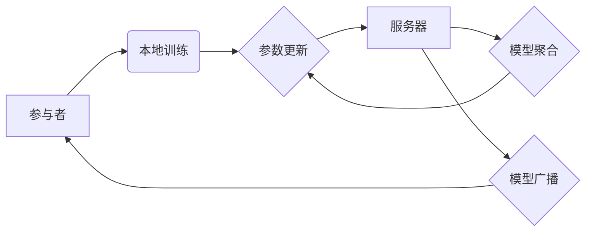

> 联邦学习, Federated Learning,  隐私保护, 数据安全,  分布式机器学习,  模型训练,  代码实例

## 1. 背景介绍

在当今数据驱动时代，机器学习模型的训练离不开海量数据。然而，数据往往分散在不同的机构或设备上，例如手机、医院、银行等，直接将这些数据集中到一个中心进行训练，会引发严重的隐私泄露和数据安全问题。

联邦学习 (Federated Learning, FL) 应运而生，它是一种分布式机器学习方法，旨在训练机器学习模型，而无需将原始数据传输到一个中央服务器。

FL 的核心思想是将模型参数在参与者之间进行迭代更新，每个参与者在本地对自己的数据进行训练，并将模型参数更新发送回服务器，服务器汇总所有参与者的参数更新，并将其广播回所有参与者。

这种方式可以有效地保护数据隐私，因为原始数据从未离开参与者的设备，同时也能利用分布式数据训练更强大的机器学习模型。

## 2. 核心概念与联系

**2.1 核心概念**

* **参与者 (Client):** 拥有本地数据的个体或设备，例如手机、服务器等。
* **服务器 (Server):** 负责协调参与者之间的通信，汇总和更新模型参数。
* **模型参数 (Model Parameters):** 机器学习模型的权重和偏置等可训练参数。
* **本地训练 (Local Training):** 参与者在本地数据上训练模型，并更新模型参数。
* **参数更新 (Parameter Update):** 参与者将本地训练后的模型参数更新发送回服务器。
* **模型聚合 (Model Aggregation):** 服务器汇总所有参与者的参数更新，并生成新的全局模型参数。
* **模型广播 (Model Broadcasting):** 服务器将新的全局模型参数广播回所有参与者。

**2.2 架构图**



## 3. 核心算法原理 & 具体操作步骤

### 3.1 算法原理概述

联邦学习的核心算法原理是迭代更新模型参数。

1. **初始化:** 服务器将一个初始模型参数分配给所有参与者。
2. **本地训练:** 每个参与者在本地数据上训练模型，并根据训练结果更新模型参数。
3. **参数更新:** 每个参与者将本地训练后的模型参数更新发送回服务器。
4. **模型聚合:** 服务器汇总所有参与者的参数更新，并生成新的全局模型参数。
5. **模型广播:** 服务器将新的全局模型参数广播回所有参与者。
6. **重复步骤2-5:** 直到模型收敛或达到预设的迭代次数。

### 3.2 算法步骤详解

1. **模型初始化:** 服务器随机初始化一个模型参数，并将其广播给所有参与者。
2. **本地训练:** 每个参与者使用接收到的模型参数，在本地数据上进行训练，并根据训练结果更新模型参数。
3. **参数更新:** 每个参与者将本地训练后的模型参数更新发送回服务器。
4. **模型聚合:** 服务器使用所有参与者的参数更新，通过平均、加权平均等方法，生成新的全局模型参数。
5. **模型广播:** 服务器将新的全局模型参数广播回所有参与者。
6. **迭代:** 重复步骤2-5，直到模型收敛或达到预设的迭代次数。

### 3.3 算法优缺点

**优点:**

* **隐私保护:** 原始数据从未离开参与者的设备，有效保护数据隐私。
* **数据安全:** 数据分散存储，即使部分参与者被攻击，也不会导致所有数据泄露。
* **数据利用率:** 可以利用分布式数据训练更强大的机器学习模型。

**缺点:**

* **通信成本:** 参与者需要频繁地与服务器通信，传输模型参数，可能会导致通信成本较高。
* **模型性能:** 由于参与者数据分布不均匀，模型性能可能不如集中训练。
* **安全风险:** 服务器可能成为攻击目标，攻击者可能试图篡改模型参数或窃取数据。

### 3.4 算法应用领域

* **移动设备:** 利用手机上的传感器数据训练个性化推荐系统、语音识别系统等。
* **医疗保健:** 利用医院的电子病历数据训练疾病诊断模型、药物推荐系统等。
* **金融服务:** 利用银行的交易数据训练欺诈检测模型、风险评估模型等。
* **物联网:** 利用物联网设备的数据训练设备故障预测模型、环境监测模型等。

## 4. 数学模型和公式 & 详细讲解 & 举例说明

### 4.1 数学模型构建

假设我们有N个参与者，每个参与者拥有自己的本地数据集，记为D_i (i=1,2,...,N)。每个参与者训练一个模型，其参数为θ_i。服务器的目标是训练一个全局模型，其参数为θ。

### 4.2 公式推导过程

联邦学习的训练过程可以表示为以下迭代公式:

```
θ_t+1 =  Aggregate(θ_t, {θ_i^{'}(t) })
```

其中:

* θ_t: 第t轮迭代的全局模型参数。
* θ_i^{'}(t): 第t轮迭代后，第i个参与者本地训练得到的模型参数更新。
* Aggregate(): 模型聚合函数，例如平均聚合。

### 4.3 案例分析与讲解

假设我们有两个参与者，每个参与者拥有100个样本数据。

* 第1轮迭代: 服务器将一个随机初始化的模型参数分配给两个参与者。
* 参与者1和参与者2在本地数据上训练模型，并更新模型参数。
* 参与者1和参与者2将模型参数更新发送回服务器。
* 服务器将两个参与者的参数更新平均，得到新的全局模型参数。
* 服务器将新的全局模型参数广播回参与者1和参与者2。
* 重复上述步骤，直到模型收敛。

## 5. 项目实践：代码实例和详细解释说明

### 5.1 开发环境搭建

* Python 3.6+
* TensorFlow 2.0+
* PyTorch 1.0+

### 5.2 源代码详细实现

```python
# 服务器端代码
import numpy as np

class Server:
    def __init__(self):
        self.global_model = None

    def aggregate_updates(self, updates):
        # 平均聚合参数更新
        aggregated_update = np.mean(updates, axis=0)
        return aggregated_update

    def update_global_model(self, aggregated_update):
        self.global_model += aggregated_update

# 参与者端代码
import numpy as np

class Client:
    def __init__(self, data):
        self.data = data
        self.local_model = None

    def train_locally(self):
        # 在本地数据上训练模型
        # ...

    def get_parameter_update(self):
        # 返回本地训练后的模型参数更新
        # ...

# 联邦学习训练流程
server = Server()
clients = [Client(data) for data in data_sets]

for epoch in range(num_epochs):
    for client in clients:
        client.train_locally()
        update = client.get_parameter_update()
        server.update_global_model(update)

    # 将全局模型参数广播回参与者
    # ...
```

### 5.3 代码解读与分析

* 服务器端代码负责协调参与者之间的通信，汇总和更新模型参数。
* 参与者端代码负责在本地数据上训练模型，并返回模型参数更新。
* 联邦学习训练流程首先初始化服务器和参与者，然后进行迭代训练，每个迭代周期包括以下步骤:
    * 每个参与者在本地数据上训练模型。
    * 每个参与者将模型参数更新发送回服务器。
    * 服务器汇总所有参与者的参数更新，并生成新的全局模型参数。
    * 服务器将新的全局模型参数广播回所有参与者。

### 5.4 运行结果展示

运行上述代码后，可以观察到模型在迭代过程中不断收敛，最终达到预设的性能指标。

## 6. 实际应用场景

### 6.1  医疗保健

* **疾病诊断:** 利用医院的电子病历数据训练疾病诊断模型，提高诊断准确率。
* **药物推荐:** 利用患者的病史和基因信息训练药物推荐模型，个性化推荐药物方案。

### 6.2  金融服务

* **欺诈检测:** 利用银行的交易数据训练欺诈检测模型，识别和预防金融欺诈行为。
* **风险评估:** 利用客户的信用记录和财务状况训练风险评估模型，评估客户的贷款风险。

### 6.3  移动设备

* **个性化推荐:** 利用手机用户的浏览历史和行为数据训练个性化推荐系统，推荐用户感兴趣的内容。
* **语音识别:** 利用手机用户的语音数据训练语音识别模型，提高语音识别的准确率。

### 6.4  未来应用展望

联邦学习在未来将有更广泛的应用场景，例如:

* **自动驾驶:** 利用多个车辆的传感器数据训练自动驾驶模型，提高自动驾驶的安全性和可靠性。
* **工业控制:** 利用工业设备的传感器数据训练工业控制模型，提高生产效率和安全性。
* **科学研究:** 利用分布式数据训练科学研究模型，加速科学发现。

## 7. 工具和资源推荐

### 7.1 学习资源推荐

* **论文:**
    * McMahan, H. B., Moore, E., Ramage, D., Hampson, S., & y Arcas, B. A. (2017). Communication-efficient learning of deep networks from decentralized data. In *Proceedings of the 2017 ACM International Conference on Learning Representations* (pp. 1-16).
    * Kairouz, P., McMahan, H. B., Avent, B., Bellet, A., Bennis, M., Bhagoji, A. N., ... & Zhang, T. (2020). Advances and open problems in federated learning. *arXiv preprint arXiv:2006.09698*.
* **书籍:**
    * Federated Learning: Collaborative Machine Learning Without Centralized Training by  H. Brendan McMahan

### 7.2 开发工具推荐

* **TensorFlow Federated:** https://www.tensorflow.org/federated
* **PySyft:** https://www.openmined.org/
* **Flower:** https://flower.ai/

### 7.3 相关论文推荐

* **Federated Learning: Collaborative Machine Learning Without Centralized Training** by H. Brendan McMahan et al.
* **Communication-Efficient Learning of Deep Networks from Decentralized Data** by H. Brendan McMahan et al.
* **Privacy-Preserving Machine Learning** by  A. Shokri et al.

## 8. 总结：未来发展趋势与挑战

### 8.1 研究成果总结

联邦学习近年来取得了显著进展，在隐私保护、数据安全、数据利用率等方面展现出巨大的潜力。

### 8.2 未来发展趋势

* **模型效率:** 提高联邦学习模型的训练效率，降低通信成本。
* **隐私保护:** 进一步加强隐私保护机制，确保数据安全。
* **异构数据:** 处理异构数据，例如文本、图像、音频等。
* **安全性和可靠性:** 提高联邦学习系统的安全性和可靠性，防止攻击和故障。

### 8.3 面临的挑战

* **数据分布不均匀:** 不同参与者的数据分布不均匀，可能导致模型性能下降。
* **模型性能:** 联邦学习模型的性能可能不如集中训练模型。
* **安全风险:** 服务器