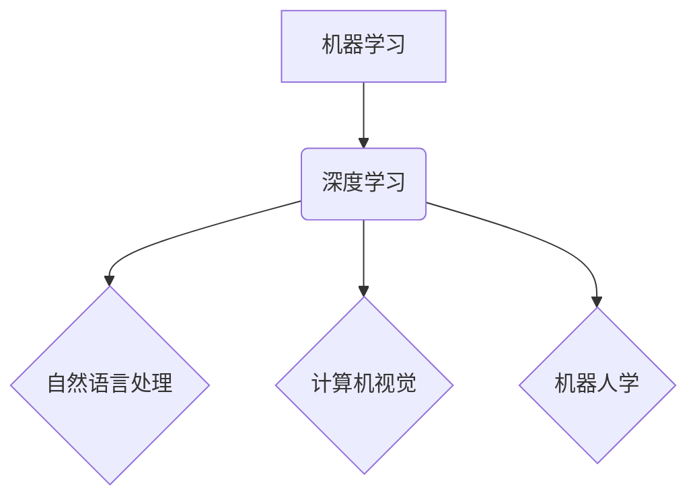

> 机器智能、人工智能、计算模型、算法原理、数学建模、代码实现、应用场景、未来趋势

## 1. 背景介绍

在信息爆炸的时代，人类对智能的渴望日益强烈。从简单的自动化任务到复杂的决策推理，智能化正在深刻地改变着我们的生活。机器智能，作为人工智能的核心领域之一，致力于构建能够像人类一样思考、学习和解决问题的机器系统。

近年来，机器智能取得了令人瞩目的进展。深度学习算法的突破性发展，使得机器能够在图像识别、自然语言处理、语音识别等领域展现出惊人的能力。然而，机器智能的发展仍然面临着诸多挑战，例如数据获取、算法解释、伦理道德等。

## 2. 核心概念与联系

机器智能的核心概念包括：

* **机器学习:**  使机器从数据中学习，并根据学习到的知识进行预测或决策。
* **深度学习:**  一种基于多层神经网络的机器学习方法，能够学习更复杂的特征表示。
* **自然语言处理:**  使机器能够理解和生成人类语言。
* **计算机视觉:**  使机器能够“看”图像和视频，并从中提取信息。
* **机器人学:**  使机器能够感知环境、做出决策并执行动作。

这些概念相互关联，共同构成了机器智能的框架。



## 3. 核心算法原理 & 具体操作步骤

### 3.1  算法原理概述

深度学习算法的核心是多层神经网络。神经网络由许多相互连接的神经元组成，每个神经元接收输入信号，对其进行处理，并输出信号。通过多层神经网络的叠加，可以学习到越来越复杂的特征表示。

### 3.2  算法步骤详解

1. **数据预处理:**  收集和清洗数据，将其转换为深度学习算法可以理解的格式。
2. **网络结构设计:**  根据任务需求设计神经网络的结构，包括层数、神经元数量、激活函数等。
3. **参数初始化:**  为神经网络中的参数赋予初始值。
4. **前向传播:**  将输入数据通过神经网络进行传递，得到输出结果。
5. **反向传播:**  计算输出结果与真实值的误差，并根据误差调整神经网络的参数。
6. **迭代训练:**  重复前向传播和反向传播的过程，直到模型达到预期的性能。

### 3.3  算法优缺点

**优点:**

* 能够学习到复杂的特征表示。
* 性能优于传统机器学习算法。
* 在图像识别、自然语言处理等领域取得了突破性进展。

**缺点:**

* 需要大量的训练数据。
* 训练过程耗时且耗能。
* 模型解释性差，难以理解模型的决策过程。

### 3.4  算法应用领域

深度学习算法广泛应用于以下领域:

* **图像识别:**  人脸识别、物体检测、图像分类。
* **自然语言处理:**  机器翻译、文本摘要、情感分析。
* **语音识别:**  语音转文本、语音助手。
* **推荐系统:**  商品推荐、内容推荐。
* **医疗诊断:**  疾病预测、影像分析。

## 4. 数学模型和公式 & 详细讲解 & 举例说明

### 4.1  数学模型构建

深度学习算法的核心是神经网络，其数学模型可以表示为多层感知机（MLP）。

MLP由输入层、隐藏层和输出层组成。每个层的神经元之间通过权重连接，权重决定了神经元之间的影响力。

### 4.2  公式推导过程

假设一个 MLP 有 L 层，第 l 层有 N_l 个神经元。输入数据为 x，输出为 y。

* **激活函数:**  每个神经元使用激活函数 f 将输入信号转换为输出信号。常见的激活函数包括 sigmoid 函数、ReLU 函数等。

* **权重更新:**  使用梯度下降算法更新权重，以最小化模型的损失函数。

损失函数通常是预测值与真实值之间的差值，例如均方误差 (MSE)。

### 4.3  案例分析与讲解

**举例说明:**

假设一个简单的 MLP 用于二分类问题，输入数据为图像特征，输出为类别标签 (0 或 1)。

* **输入层:**  N_1 个神经元，对应图像特征的维度。
* **隐藏层:**  N_2 个神经元，使用 ReLU 激活函数。
* **输出层:**  N_3 = 1 个神经元，使用 sigmoid 激活函数。

训练过程中，通过调整权重，使模型能够将图像特征映射到相应的类别标签。

## 5. 项目实践：代码实例和详细解释说明

### 5.1  开发环境搭建

使用 Python 语言和 TensorFlow 或 PyTorch 深度学习框架进行开发。

### 5.2  源代码详细实现

```python
import tensorflow as tf

# 定义模型结构
model = tf.keras.models.Sequential([
    tf.keras.layers.Dense(128, activation='relu', input_shape=(784,)),
    tf.keras.layers.Dense(10, activation='softmax')
])

# 编译模型
model.compile(optimizer='adam',
              loss='sparse_categorical_crossentropy',
              metrics=['accuracy'])

# 训练模型
model.fit(x_train, y_train, epochs=10)

# 评估模型
loss, accuracy = model.evaluate(x_test, y_test)
print('Test loss:', loss)
print('Test accuracy:', accuracy)
```

### 5.3  代码解读与分析

* **模型结构:**  定义了一个简单的 MLP 模型，包含两层全连接层。
* **激活函数:**  隐藏层使用 ReLU 激活函数，输出层使用 softmax 激活函数。
* **优化器:**  使用 Adam 优化器更新模型参数。
* **损失函数:**  使用 sparse_categorical_crossentropy 损失函数，用于分类任务。
* **评估指标:**  使用准确率 (accuracy) 评估模型性能。

### 5.4  运行结果展示

训练完成后，模型可以用于预测新的数据类别。

## 6. 实际应用场景

### 6.1  图像识别

* **人脸识别:**  用于身份验证、安全监控等场景。
* **物体检测:**  用于自动驾驶、安防监控等场景。
* **图像分类:**  用于医疗诊断、产品分类等场景。

### 6.2  自然语言处理

* **机器翻译:**  将文本从一种语言翻译成另一种语言。
* **文本摘要:**  自动生成文本的简短摘要。
* **情感分析:**  分析文本的情感倾向，例如正面、负面或中性。

### 6.3  语音识别

* **语音转文本:**  将语音转换为文本。
* **语音助手:**  例如 Siri、Alexa 等，可以理解用户的语音指令并执行相应的操作。

### 6.4  未来应用展望

机器智能将在未来广泛应用于各个领域，例如：

* **医疗保健:**  辅助医生诊断疾病、预测患者风险。
* **教育:**  个性化学习、智能辅导。
* **金融:**  欺诈检测、风险管理。
* **制造业:**  智能制造、预测性维护。

## 7. 工具和资源推荐

### 7.1  学习资源推荐

* **书籍:**  
    * 《深度学习》
    * 《机器学习》
* **在线课程:**  
    * Coursera
    * edX
    * Udacity

### 7.2  开发工具推荐

* **Python:**  编程语言
* **TensorFlow:**  深度学习框架
* **PyTorch:**  深度学习框架
* **Keras:**  深度学习 API

### 7.3  相关论文推荐

* **《ImageNet Classification with Deep Convolutional Neural Networks》**
* **《Attention Is All You Need》**
* **《BERT: Pre-training of Deep Bidirectional Transformers for Language Understanding》**

## 8. 总结：未来发展趋势与挑战

### 8.1  研究成果总结

机器智能取得了显著进展，在图像识别、自然语言处理等领域取得了突破性成果。

### 8.2  未来发展趋势

* **模型规模和复杂度提升:**  训练更大规模、更复杂的神经网络模型。
* **算法效率和可解释性提升:**  开发更有效的训练算法和提高模型可解释性。
* **跨模态学习:**  使机器能够理解和处理多种模态数据，例如文本、图像、音频等。
* **边缘计算:**  将机器智能模型部署到边缘设备，实现实时推理。

### 8.3  面临的挑战

* **数据获取和隐私保护:**  收集高质量的训练数据并保护用户隐私。
* **算法解释性和可信任性:**  提高模型的解释性和可信任性，使其能够被人类理解和接受。
* **伦理道德问题:**  确保机器智能的应用符合伦理道德规范。

### 8.4  研究展望

未来，机器智能将继续朝着更智能、更安全、更可解释的方向发展。

## 9. 附录：常见问题与解答

**常见问题:**

* **什么是机器学习？**
* **深度学习与机器学习有什么区别？**
* **如何选择合适的深度学习框架？**
* **如何评估深度学习模型的性能？**

**解答:**

* **什么是机器学习？**  机器学习是一种人工智能技术，使机器能够从数据中学习，并根据学习到的知识进行预测或决策。
* **深度学习与机器学习有什么区别？**  深度学习是一种基于多层神经网络的机器学习方法，能够学习到更复杂的特征表示。
* **如何选择合适的深度学习框架？**  选择深度学习框架需要考虑项目需求、开发经验、社区支持等因素。
* **如何评估深度学习模型的性能？**  可以使用准确率、召回率、F1-score 等指标评估深度学习模型的性能。


作者：禅与计算机程序设计艺术 / Zen and the Art of Computer Programming 
<end_of_turn>