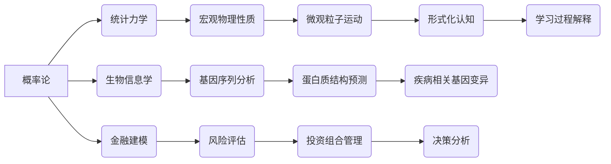

> 概率论，统计力学，生物信息学，金融建模，贝叶斯推理，马尔可夫链，蒙特卡罗模拟

## 1. 背景介绍

认知科学的本质在于理解智能行为的机制，而形式化认知则试图用数学和逻辑语言来描述和建模这些机制。概率论作为一种强大的工具，为形式化认知提供了坚实的基础。它能够有效地处理不确定性和随机性，并为我们提供了一种量化和分析认知过程的框架。

近年来，概率论在统计力学、生物学和金融等领域取得了显著的成果，为我们理解复杂系统提供了新的视角。本文将探讨概率论在这些领域的应用，并阐述其在形式化认知研究中的重要意义。

## 2. 核心概念与联系

**2.1 概率论的基本概念**

概率论的核心概念包括事件、样本空间、概率分布、条件概率和贝叶斯定理等。

* **事件:**  一个随机现象的结果集合。
* **样本空间:** 所有可能结果的集合。
* **概率分布:** 描述事件发生的概率的函数。
* **条件概率:** 在已知某个事件发生的条件下，另一个事件发生的概率。
* **贝叶斯定理:** 描述条件概率如何更新已知新信息。

**2.2 概率论在不同领域的应用**

* **统计力学:** 概率论用于描述宏观物理性质与微观粒子运动之间的关系。例如，通过概率分布可以描述气体分子的速度、位置和能量。
* **生物信息学:** 概率论用于分析基因序列、蛋白质结构和生物网络等生物数据。例如，可以使用概率模型来预测蛋白质的功能或识别疾病相关的基因变异。
* **金融建模:** 概率论用于建模金融市场中的风险和收益。例如，可以使用概率模型来估算股票价格的波动性或预测投资组合的回报率。

**2.3 概率论与形式化认知的联系**

概率论为形式化认知提供了以下关键工具：

* **处理不确定性:** 认知过程充满了不确定性，概率论提供了一种量化和分析不确定性的方法。
* **建模决策:** 概率论可以用于建模决策过程，例如，在面对多个选择时，如何根据概率信息做出最优决策。
* **解释学习:** 概率论可以解释学习过程，例如，如何根据经验更新知识和信念。

**2.4  核心概念与联系流程图**



## 3. 核心算法原理 & 具体操作步骤

### 3.1  算法原理概述

在概率论中，许多算法用于处理概率分布、条件概率和贝叶斯推理等问题。一些常见的算法包括：

* **贝叶斯网络:** 用于表示概率关系的图模型，可以用于推理和预测。
* **马尔可夫链蒙特卡罗 (MCMC) 方法:** 用于从概率分布中抽取样本，可以用于估计概率分布的参数和进行模拟。
* **粒子滤波:** 用于估计动态系统的状态，可以用于跟踪目标或预测时间序列。

### 3.2  算法步骤详解

**3.2.1 贝叶斯网络算法步骤**

1. **构建贝叶斯网络:** 根据领域知识构建一个包含节点和边的图模型，其中节点表示随机变量，边表示变量之间的依赖关系。
2. **定义概率分布:** 为每个节点定义其条件概率分布，即给定父节点的值，该节点取不同值的概率。
3. **进行推理:** 使用贝叶斯规则和网络结构进行推理，例如，计算给定证据的某个变量的条件概率。

**3.2.2 马尔可夫链蒙特卡罗 (MCMC) 方法算法步骤**

1. **定义目标分布:** 确定需要从其抽取样本的概率分布。
2. **构建马尔可夫链:** 设计一个马尔可夫链，其平稳分布为目标分布。
3. **进行采样:** 从马尔可夫链中进行采样，直到获得足够数量的样本。

**3.2.3 粒子滤波算法步骤**

1. **初始化粒子:** 生成一组粒子，每个粒子代表系统状态的一个可能值。
2. **预测:** 根据系统动力学模型预测每个粒子的状态转移。
3. **权重更新:** 根据观测数据更新每个粒子的权重，权重高的粒子代表更可能的系统状态。
4. **粒子重采样:** 根据权重进行粒子重采样，保留权重高的粒子，丢弃权重低的粒子。
5. **重复步骤2-4:** 重复上述步骤，直到获得对系统状态的估计。

### 3.3  算法优缺点

**3.3.1 贝叶斯网络算法**

* **优点:** 可以表示复杂的概率关系，并进行高效的推理。
* **缺点:** 构建贝叶斯网络需要大量的领域知识，并且网络结构的复杂性会影响推理效率。

**3.3.2 马尔可夫链蒙特卡罗 (MCMC) 方法**

* **优点:** 可以从任意概率分布中抽取样本，并且可以处理高维数据。
* **缺点:** 采样过程可能很慢，并且需要仔细设计马尔可夫链以确保收敛到目标分布。

**3.3.3 粒子滤波算法**

* **优点:** 可以处理非线性系统和高维数据，并且可以进行实时估计。
* **缺点:** 需要大量的粒子进行采样，并且粒子数量过多会增加计算成本。

### 3.4  算法应用领域

* **贝叶斯网络:** 医学诊断、金融风险评估、自然语言处理等。
* **马尔可夫链蒙特卡罗 (MCMC) 方法:** 统计模型估计、机器学习、物理模拟等。
* **粒子滤波:** 机器人导航、目标跟踪、天气预报等。

## 4. 数学模型和公式 & 详细讲解 & 举例说明

### 4.1  数学模型构建

**4.1.1 贝叶斯网络模型**

贝叶斯网络可以用一个有向无环图 (DAG) 来表示，其中节点表示随机变量，边表示变量之间的依赖关系。每个节点的条件概率分布可以表示为：

$$P(X_i | Pa(X_i))$$

其中，$X_i$ 是节点 $i$ 表示的随机变量，$Pa(X_i)$ 是 $X_i$ 的父节点集合。

**4.1.2 马尔可夫链模型**

马尔可夫链是一个随机过程，其状态转移概率只依赖于当前状态，与过去状态无关。马尔可夫链的状态转移概率矩阵可以表示为：

$$P(X_{t+1} = j | X_t = i)$$

其中，$X_t$ 是在时间 $t$ 的状态，$X_{t+1}$ 是在时间 $t+1$ 的状态。

**4.1.3 粒子滤波模型**

粒子滤波模型可以表示为以下状态转移方程和观测方程：

$$X_t = f(X_{t-1}, u_t, w_t)$$

$$Y_t = h(X_t, v_t)$$

其中，$X_t$ 是系统状态，$Y_t$ 是观测数据，$u_t$ 是控制输入，$w_t$ 和 $v_t$ 是过程噪声和观测噪声。

### 4.2  公式推导过程

**4.2.1 贝叶斯定理**

贝叶斯定理描述了条件概率如何更新已知新信息：

$$P(A|B) = \frac{P(B|A)P(A)}{P(B)}$$

其中，$P(A|B)$ 是事件 $A$ 在事件 $B$ 发生的条件概率，$P(B|A)$ 是事件 $B$ 在事件 $A$ 发生的条件概率，$P(A)$ 是事件 $A$ 的概率，$P(B)$ 是事件 $B$ 的概率。

**4.2.2 马尔可夫链平稳分布**

马尔可夫链平稳分布是指一个概率分布，当马尔可夫链运行足够长时间后，其状态分布会收敛到该分布。平稳分布的条件是：

$$\pi P = \pi$$

其中，$\pi$ 是平稳分布，$P$ 是马尔可夫链的状态转移概率矩阵。

### 4.3  案例分析与讲解

**4.3.1 贝叶斯网络案例**

假设我们有一个贝叶斯网络用于诊断疾病，其中节点包括症状、病因和疾病。我们可以使用贝叶斯规则来计算给定症状的疾病发生的概率。

**4.3.2 马尔可夫链案例**

我们可以使用马尔可夫链来模拟股票价格的波动。每个状态代表股票价格的某个水平，状态转移概率可以根据历史数据进行估计。

**4.3.3 粒子滤波案例**

我们可以使用粒子滤波来跟踪目标的运动轨迹。每个粒子代表目标的可能位置，根据观测数据和运动模型更新粒子的权重和位置。

## 5. 项目实践：代码实例和详细解释说明

### 5.1  开发环境搭建

* **编程语言:** Python
* **库:** NumPy, SciPy, Matplotlib, PyMC3

### 5.2  源代码详细实现

```python
# 贝叶斯网络示例代码

import pymc3 as pm

# 定义贝叶斯网络模型
with pm.Model() as model:
    # 定义随机变量
    symptoms = pm.Bernoulli('symptoms', p=0.8)
    cause = pm.Bernoulli('cause', p=0.7)
    disease = pm.Bernoulli('disease', p=0.9)

    # 定义条件概率分布
    pm.Deterministic('disease_given_symptoms', disease * symptoms)

# 采样
trace = pm.sample(2000, tune=1000)

# 分析结果
pm.summary(trace)

# 绘制结果
pm.traceplot(trace)
```

### 5.3  代码解读与分析

* **贝叶斯网络模型:** 代码定义了一个贝叶斯网络模型，包含三个随机变量：症状、病因和疾病。
* **条件概率分布:** 代码定义了三个随机变量之间的条件概率分布。
* **采样:** 代码使用 PyMC3 库进行采样，从贝叶斯网络模型中抽取样本。
* **分析结果:** 代码使用 `pm.summary()` 函数分析采样结果，并使用 `pm.traceplot()` 函数绘制结果。

### 5.4  运行结果展示

运行代码后，会输出贝叶斯网络模型的采样结果，包括每个变量的概率分布和相关参数。

## 6. 实际应用场景

### 6.1  统计力学

* **分子动力学模拟:** 使用概率论来模拟分子运动，预测物质的性质。
* **统计场论:** 描述量子场和粒子相互作用的理论框架。

### 6.2  生物信息学

* **基因组学:** 分析基因序列，预测基因功能和进化关系。
* **蛋白质结构预测:** 使用概率模型预测蛋白质的三维结构。
* **药物发现:** 预测药物与靶点的结合概率，加速药物研发。

### 6.3  金融建模

* **风险管理:** 评估金融投资的风险和收益。
* **定