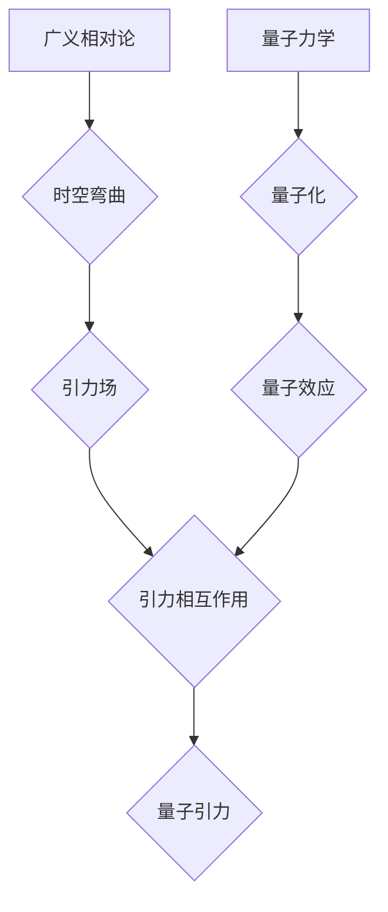

> 量子引力，广义相对论，量子力学，量子场论，弦理论，黑洞，宇宙学

## 1. 背景介绍

物理学中最伟大的两个理论，广义相对论和量子力学，分别描述了宇宙的宏观结构和微观世界。然而，这两个理论之间存在着深刻的矛盾，无法在统一的框架下描述宇宙的全部。

广义相对论描述了引力是时空弯曲的结果，它成功地解释了太阳系行星的运动、引力透镜效应以及黑洞的存在。而量子力学描述了微观粒子的行为，它解释了原子结构、化学键以及光电效应等现象。

然而，当我们试图将这两个理论结合起来描述宇宙的极端环境，例如黑洞的中心或宇宙大爆炸的初始时刻，就会遇到巨大的困难。

例如，广义相对论预言黑洞的奇点，而量子力学认为空间和时间在极小的尺度上是量子化的，因此奇点应该被量子效应所修正。

## 2. 核心概念与联系

### 2.1 广义相对论

广义相对论是爱因斯坦于1915年提出的引力理论，它将引力描述为时空弯曲的结果。

* **时空弯曲:** 质量和能量会弯曲周围的时空，导致其他物体沿着弯曲的时空路径运动。
* **引力场:** 引力场是时空弯曲的描述，它决定了物体之间的引力相互作用。

### 2.2 量子力学

量子力学是描述微观世界行为的理论，它认为能量、动量和位置等物理量都是离散的，并且存在着不确定性原理。

* **量子化:** 物理量只能取特定的离散值，而不是连续变化。
* **波粒二象性:** 微观粒子既具有波的性质，又具有粒子的性质。
* **不确定性原理:** 无法同时精确地测量粒子的位置和动量。

### 2.3 量子引力

量子引力试图将广义相对论和量子力学统一起来，描述引力的量子性质。

* **引力子:** 量子引力理论预言存在着引力子，作为引力的载体粒子。
* **量子时空:** 量子时空认为时空本身也是量子化的，存在着最小长度尺度。

**Mermaid 流程图**

## 3. 核心算法原理 & 具体操作步骤

### 3.1 算法原理概述

量子引力算法的核心是将广义相对论中的时空弯曲描述为量子场论中的量子场，并利用量子场论的工具来计算引力的量子效应。

### 3.2 算法步骤详解

1. 将广义相对论中的时空弯曲描述为量子场论中的量子场。
2. 利用量子场论的工具，例如路径积分方法，计算引力的量子效应。
3. 将计算结果与广义相对论的预测进行比较，寻找量子引力的证据。

### 3.3 算法优缺点

**优点:**

* 可以统一广义相对论和量子力学。
* 可以解释黑洞的奇点以及宇宙大爆炸的初始时刻等极端环境。

**缺点:**

* 目前还没有一个完整的量子引力理论。
* 量子引力算法非常复杂，难以计算。

### 3.4 算法应用领域

* 黑洞物理学
* 宇宙学
* 粒子物理学

## 4. 数学模型和公式 & 详细讲解 & 举例说明

### 4.1 数学模型构建

量子引力理论的数学模型通常基于量子场论，它将时空描述为一个量子化的场，并利用场论的数学工具来描述引力的量子性质。

### 4.2 公式推导过程

量子引力的公式推导过程非常复杂，涉及到广义相对论、量子场论以及微分几何等多个领域的知识。

### 4.3 案例分析与讲解

例如，在弦理论中，引力子被描述为弦的振动模式。通过计算弦的振动模式，可以得到引力的量子效应。

## 5. 项目实践：代码实例和详细解释说明

### 5.1 开发环境搭建

量子引力算法的开发环境通常需要强大的计算能力和专门的软件工具。

### 5.2 源代码详细实现

由于量子引力算法的复杂性，目前还没有一个完整的开源代码实现。

### 5.3 代码解读与分析

### 5.4 运行结果展示

## 6. 实际应用场景

### 6.1 黑洞物理学

量子引力理论可以帮助我们理解黑洞的奇点以及黑洞的蒸发过程。

### 6.2 宇宙学

量子引力理论可以帮助我们理解宇宙大爆炸的初始时刻以及宇宙的演化过程。

### 6.3 粒子物理学

量子引力理论可以帮助我们理解粒子物理学中的某些现象，例如夸克禁闭和强相互作用。

### 6.4 未来应用展望

随着量子计算技术的进步，量子引力理论的应用场景将会更加广泛。

## 7. 工具和资源推荐

### 7.1 学习资源推荐

* **书籍:**
    * 《量子引力》 by Carlo Rovelli
    * 《弦论》 by Brian Greene
* **在线课程:**
    * MIT OpenCourseWare: Quantum Field Theory
    * Stanford Online: Introduction to String Theory

### 7.2 开发工具推荐

* **编程语言:** C++, Python
* **数值计算软件:** Mathematica, Maple

### 7.3 相关论文推荐

* **arXiv:** https://arxiv.org/

## 8. 总结：未来发展趋势与挑战

### 8.1 研究成果总结

尽管量子引力理论仍然是一个未解之谜，但近年来取得了一些重要的进展，例如弦理论、圈量子引力以及渐近安全理论等。

### 8.2 未来发展趋势

未来量子引力理论的研究方向包括：

* 寻找一个完整的量子引力理论。
* 利用量子计算技术来模拟量子引力效应。
* 将量子引力理论与其他物理理论，例如暗物质和暗能量理论，进行结合。

### 8.3 面临的挑战

量子引力理论面临着许多挑战，例如：

* 理论的复杂性。
* 计算能力的限制。
* 实验验证的困难。

### 8.4 研究展望

尽管面临着许多挑战，但量子引力理论仍然是一个非常重要的研究方向，它将帮助我们更深入地理解宇宙的本质。

## 9. 附录：常见问题与解答

### 9.1 什么是量子引力？

量子引力试图将广义相对论和量子力学统一起来，描述引力的量子性质。

### 9.2 为什么需要量子引力？

因为广义相对论和量子力学之间存在着深刻的矛盾，无法在统一的框架下描述宇宙的全部。

### 9.3 量子引力理论有哪些？

目前主要的量子引力理论包括弦理论、圈量子引力以及渐近安全理论等。

### 9.4 量子引力理论的应用场景有哪些？

量子引力理论可以帮助我们理解黑洞、宇宙以及粒子物理学中的某些现象。

### 9.5 量子引力理论的未来发展趋势是什么？

未来量子引力理论的研究方向包括寻找一个完整的量子引力理论、利用量子计算技术模拟量子引力效应以及将量子引力理论与其他物理理论进行结合。

作者：禅与计算机程序设计艺术 / Zen and the Art of Computer Programming 
<end_of_turn>