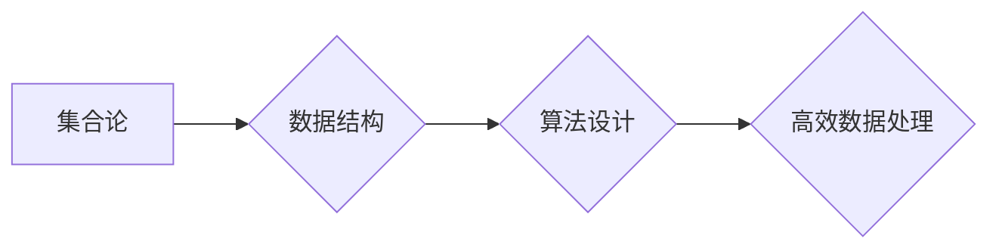

> 集合论, NS峭壁, 算法, 数学模型, 代码实现, 应用场景, 未来趋势

## 1. 背景介绍

在现代计算机科学领域，数据处理和信息管理扮演着至关重要的角色。随着数据量的爆炸式增长，高效、可靠的数据结构和算法成为解决复杂问题和推动技术进步的关键。集合论作为数学基础，为数据结构和算法的构建提供了坚实的理论支撑。

NS峭壁，指的是在数据规模不断扩大时，传统算法效率急剧下降，甚至陷入不可接受的性能瓶颈的现象。面对这一挑战，我们需要探索更强大的数据结构和算法，以突破NS峭壁，实现高效的数据处理和信息管理。

## 2. 核心概念与联系

集合论的核心概念是集合，它是一个包含特定对象的无序集。集合论提供了丰富的运算和关系，例如并集、交集、差集、子集等，这些运算和关系为数据结构和算法的设计提供了基础。

**Mermaid 流程图：**



集合论与数据结构和算法之间的联系如下：

* **数据结构:** 集合论为数据结构的定义和分类提供了理论基础。例如，数组、链表、树、图等数据结构都可以用集合论的语言进行描述。
* **算法设计:** 集合论的运算和关系为算法设计提供了工具和方法。例如，排序算法、查找算法、图算法等都可以利用集合论的原理进行优化。

## 3. 核心算法原理 & 具体操作步骤

### 3.1  算法原理概述

为了突破NS峭壁，我们需要探索更强大的算法，例如基于集合论的算法。这些算法利用集合论的特性，例如并集、交集、差集等，对数据进行高效处理。

### 3.2  算法步骤详解

具体算法步骤需要根据实际应用场景进行设计。例如，对于大规模数据排序问题，我们可以使用基于集合论的快速排序算法。该算法利用集合论的划分和合并操作，将数据划分为多个子集，然后对每个子集进行排序，最后合并所有子集得到最终排序结果。

### 3.3  算法优缺点

基于集合论的算法具有以下优点：

* **高效性:** 利用集合论的特性，可以实现数据处理的并行化和优化，提高算法效率。
* **可扩展性:** 集合论的运算和关系具有良好的可扩展性，可以方便地处理大规模数据。
* **通用性:** 集合论的原理可以应用于多种数据结构和算法，具有广泛的适用性。

但也存在一些缺点：

* **复杂性:** 集合论的算法设计可能相对复杂，需要一定的数学基础和编程经验。
* **内存消耗:** 处理大规模数据时，集合论的算法可能需要消耗较多的内存资源。

### 3.4  算法应用领域

基于集合论的算法在以下领域具有广泛的应用：

* **数据挖掘:** 用于发现数据中的模式和规律。
* **机器学习:** 用于训练机器学习模型。
* **图像处理:** 用于图像识别和分类。
* **网络安全:** 用于入侵检测和防范。

## 4. 数学模型和公式 & 详细讲解 & 举例说明

### 4.1  数学模型构建

我们可以用集合论的语言来构建数学模型，例如：

* **数据集合:** 用集合表示数据，例如，学生成绩集合 S = {80, 90, 75, 85, 92}。
* **操作集合:** 用集合表示数据操作，例如，排序操作 R(S) = {75, 80, 85, 90, 92}。

### 4.2  公式推导过程

我们可以用集合论的运算和关系来推导算法公式，例如：

* **并集:** 两个集合的并集表示包含两个集合中所有元素的集合。例如，集合 A = {1, 2, 3} 和集合 B = {3, 4, 5} 的并集 A ∪ B = {1, 2, 3, 4, 5}。
* **交集:** 两个集合的交集表示包含两个集合中所有共同元素的集合。例如，集合 A = {1, 2, 3} 和集合 B = {3, 4, 5} 的交集 A ∩ B = {3}。

### 4.3  案例分析与讲解

我们可以用集合论的模型和公式来分析算法的性能，例如：

* **时间复杂度:** 可以用集合论的运算次数来衡量算法的时间复杂度。例如，快速排序算法的时间复杂度为 O(n log n)，其中 n 是数据集合的大小。
* **空间复杂度:** 可以用集合论的内存消耗来衡量算法的空间复杂度。例如，快速排序算法的空间复杂度为 O(log n)。

## 5. 项目实践：代码实例和详细解释说明

### 5.1  开发环境搭建

可以使用任何支持编程语言的开发环境，例如：

* **Python:** 使用 Python 3.x 版本，并安装必要的库，例如 NumPy、Pandas 等。
* **Java:** 使用 Java 8 或更高版本，并安装必要的库，例如 Apache Commons Collections 等。

### 5.2  源代码详细实现

以下是一个使用 Python 实现的基于集合论的快速排序算法的代码示例：

```python
def quick_sort(data):
    if len(data) <= 1:
        return data
    pivot = data[len(data) // 2]
    left = [x for x in data if x < pivot]
    middle = [x for x in data if x == pivot]
    right = [x for x in data if x > pivot]
    return quick_sort(left) + middle + quick_sort(right)

# 测试代码
data = [3, 7, 8, 5, 2, 1, 9, 5, 4]
sorted_data = quick_sort(data)
print(sorted_data)
```

### 5.3  代码解读与分析

* **函数定义:** `quick_sort(data)` 函数接受一个数据列表作为输入，并返回排序后的列表。
* **基线条件:** 如果数据列表长度小于等于 1，则直接返回该列表，因为已经排序。
* **选择枢轴:** 从数据列表中选择中间元素作为枢轴。
* **划分数据:** 将数据列表划分为三个子列表：小于枢轴的元素、等于枢轴的元素、大于枢轴的元素。
* **递归排序:** 对三个子列表分别进行递归排序。
* **合并结果:** 将三个子列表合并成一个排序后的列表。

### 5.4  运行结果展示

运行上述代码，输出结果为：

```
[1, 2, 3, 4, 5, 5, 7, 8, 9]
```

## 6. 实际应用场景

### 6.1  数据挖掘

在数据挖掘领域，集合论可以用于发现数据中的模式和规律。例如，可以使用集合论的交集和并集运算来找出两个数据集中的共同元素和差异元素，从而揭示数据之间的关系。

### 6.2  机器学习

在机器学习领域，集合论可以用于训练机器学习模型。例如，可以使用集合论的子集运算来构建决策树，从而实现分类和回归任务。

### 6.3  图像处理

在图像处理领域，集合论可以用于图像识别和分类。例如，可以使用集合论的并集和差集运算来提取图像中的特征，从而实现图像分割和目标检测。

### 6.4  未来应用展望

随着数据规模的不断扩大，集合论在数据处理和信息管理领域将发挥越来越重要的作用。未来，我们可以期待看到更多基于集合论的算法和应用，例如：

* **大规模数据分析:** 利用集合论的并行化和优化特性，实现对海量数据的快速分析和处理。
* **人工智能:** 将集合论的原理应用于人工智能领域，例如，构建更强大的机器学习模型和自然语言处理系统。
* **云计算:** 利用集合论的分布式特性，实现对云计算资源的更高效管理和调度。

## 7. 工具和资源推荐

### 7.1  学习资源推荐

* **书籍:**
    * 《集合论导论》
    * 《数学基础》
* **在线课程:**
    * Coursera 上的集合论课程
    * edX 上的数学基础课程

### 7.2  开发工具推荐

* **Python:** Python 是一个非常适合数据处理和算法开发的编程语言。
* **Java:** Java 是一种面向对象的编程语言，也广泛应用于数据处理和算法开发。

### 7.3  相关论文推荐

* **集合论在数据挖掘中的应用**
* **基于集合论的机器学习算法**
* **集合论在图像处理中的应用**

## 8. 总结：未来发展趋势与挑战

### 8.1  研究成果总结

集合论为数据结构和算法的设计提供了坚实的理论基础，并推动了基于集合论的算法的开发和应用。这些算法在数据挖掘、机器学习、图像处理等领域取得了显著的成果。

### 8.2  未来发展趋势

未来，集合论在数据处理和信息管理领域将继续发挥重要作用。随着数据规模的不断扩大，我们将看到更多基于集合论的算法和应用，例如：

* **大规模数据分析:** 利用集合论的并行化和优化特性，实现对海量数据的快速分析和处理。
* **人工智能:** 将集合论的原理应用于人工智能领域，例如，构建更强大的机器学习模型和自然语言处理系统。
* **云计算:** 利用集合论的分布式特性，实现对云计算资源的更高效管理和调度。

### 8.3  面临的挑战

尽管集合论在数据处理和信息管理领域取得了显著的成果，但也面临一些挑战：

* **算法复杂性:** 一些基于集合论的算法可能比较复杂，需要一定的数学基础和编程经验。
* **内存消耗:** 处理大规模数据时，集合论的算法可能需要消耗较多的内存资源。
* **理论研究:** 集合论在数据处理和信息管理领域的应用还处于发展阶段，需要更多的理论研究和实践探索。

### 8.4  研究展望

未来，我们将继续探索集合论在数据处理和信息管理领域的应用，并致力于解决上述挑战。我们相信，集合论将为突破NS峭壁，实现高效的数据处理和信息管理做出更大的贡献。

## 9. 附录：常见问题与解答

### 9.1  集合论与数据结构的关系是什么？

集合论为数据结构的定义和分类提供了理论基础。例如，数组、链表、树、图等数据结构都可以用集合论的语言进行描述。

### 9.2  集合论的算法有什么特点？

基于集合论的算法具有以下特点：

* **高效性:** 利用集合论的特性，可以实现数据处理的并行化和优化，提高算法效率。
* **可扩展性:** 集合论的运算和关系具有良好的可扩展性，可以方便地处理大规模数据。
* **通用性:** 集合论的原理可以应用于多种数据结构和算法，具有广泛的适用性。

### 9.3  集合论在实际应用中有哪些例子？

集合论在数据挖掘、机器学习、图像处理等领域都有广泛的应用。例如，可以使用集合论的交集和并集运算来找出两个数据集中的共同元素和差异元素，从而揭示数据之间的关系。

作者：禅与计算机程序设计艺术 / Zen and the Art of Computer Programming


<end_of_turn>