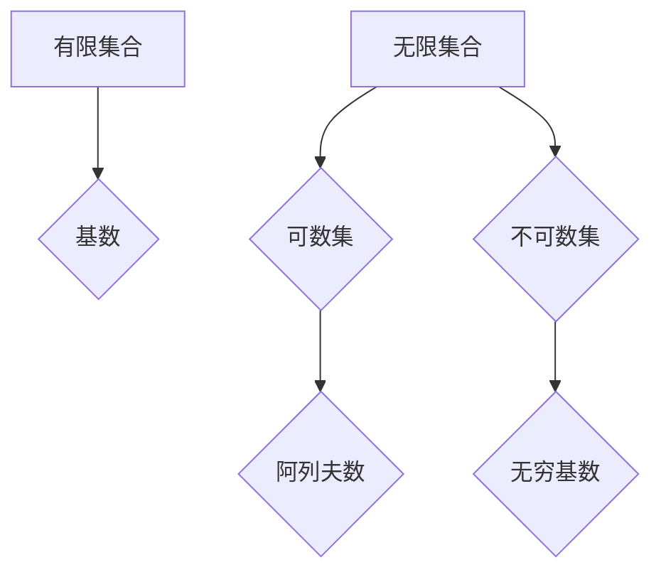

> 集合论, 基数, 无穷, 卡塔兰数, 算法复杂度, 数据结构

## 1. 背景介绍

在计算机科学领域，我们经常会遇到处理大量数据的场景。为了更好地理解和分析这些数据，我们需要掌握一些数学工具，其中集合论和无穷的概念就显得尤为重要。

集合论是数学的一个分支，它研究集合的概念和性质。集合是一个包含特定对象的集合，这些对象可以是数字、字符串、函数等等。无穷是指无限大的概念，在集合论中，我们研究无限集合的性质，例如它们的基数。

基数是指集合中元素的个数。对于有限集合，基数很容易计算，例如，集合{1, 2, 3}的基数是3。但是对于无限集合，基数的概念就更加复杂。

## 2. 核心概念与联系

### 2.1 集合论基础

* **集合:**  一个包含特定对象的集合，例如{1, 2, 3}是一个包含三个整数的集合。
* **子集:**  如果一个集合的所有元素都属于另一个集合，则称第一个集合是第二个集合的子集。例如，{1, 2}是{1, 2, 3}的子集。
* **并集:**  两个集合的所有元素组成的集合称为它们的并集。例如，{1, 2}和{2, 3}的并集是{1, 2, 3}。
* **交集:**  两个集合中共同存在的元素组成的集合称为它们的交集。例如，{1, 2}和{2, 3}的交集是{2}。

### 2.2 无穷集合

* **无限集合:**  一个集合中元素个数无限多的集合称为无限集合。例如，自然数集{1, 2, 3, ...}是一个无限集合。
* **可数集:**  一个无限集合，如果它的元素可以一一对应于自然数集，则称为可数集。例如，整数集和有理数集都是可数集。
* **不可数集:**  一个无限集合，如果它不是可数集，则称为不可数集。例如，实数集是一个不可数集。

### 2.3 基数

* **基数:**  一个集合中元素的个数，对于有限集合，基数很容易计算，例如，集合{1, 2, 3}的基数是3。对于无限集合，基数的概念就更加复杂。
* **阿列夫数:**  用于表示无限集合基数的符号，例如，自然数集的基数是ℵ₀（阿列夫零）。

### 2.4  Mermaid 流程图



## 3. 核心算法原理 & 具体操作步骤

### 3.1  算法原理概述

在集合论中，我们经常需要计算集合的基数，或者判断两个集合是否具有相同的基数。一些常见的算法包括：

* **一一对应:**  如果两个集合之间存在一个一一对应的映射，则这两个集合具有相同的基数。
* **康托尔对角线法:**  用于证明实数集不可数。

### 3.2  算法步骤详解

* **一一对应算法:**
    1. 确定两个集合。
    2. 寻找一个将两个集合中的元素一一映射的函数。
    3. 如果存在这样的函数，则两个集合具有相同的基数。

* **康托尔对角线法:**
    1. 假设实数集是可数的，则可以将其列成一个列表。
    2. 构造一个与列表中所有实数不同的实数。
    3. 由于存在与列表中所有实数不同的实数，因此实数集不可数。

### 3.3  算法优缺点

* **一一对应算法:**
    * 优点: 算法简单易懂，易于实现。
    * 缺点: 对于无限集合，寻找一一对应的映射可能非常困难。

* **康托尔对角线法:**
    * 优点: 可以证明实数集不可数。
    * 缺点: 算法比较抽象，难以理解。

### 3.4  算法应用领域

* **数据结构:**  用于分析和比较不同数据结构的复杂度。
* **算法分析:**  用于分析算法的时间复杂度和空间复杂度。
* **数学证明:**  用于证明一些数学定理，例如实数集不可数。

## 4. 数学模型和公式 & 详细讲解 & 举例说明

### 4.1  数学模型构建

* **集合:**  用大括号{}表示，例如A = {1, 2, 3}。
* **基数:**  用|A|表示集合A的基数，例如|A| = 3。
* **可数集:**  一个集合A是可数集，如果存在一个从自然数集N到A的双射函数f，即对于每个元素a∈A，存在唯一的自然数n∈N，使得f(n) = a。
* **不可数集:**  一个集合A是不可数集，如果它不是可数集。

### 4.2  公式推导过程

* **阿列夫数:**  阿列夫数是用于表示无限集合基数的符号，例如，自然数集的基数是ℵ₀（阿列夫零）。
* **康托尔对角线法:**  用于证明实数集不可数。

### 4.3  案例分析与讲解

* **自然数集:**  自然数集{1, 2, 3, ...}是一个可数集，因为我们可以将其一一对应于自然数集本身。
* **实数集:**  实数集是不可数集，这是通过康托尔对角线法证明的。

## 5. 项目实践：代码实例和详细解释说明

### 5.1  开发环境搭建

* **编程语言:**  Python
* **IDE:**  VS Code

### 5.2  源代码详细实现

```python
# 计算集合的基数
def calculate_cardinality(collection):
  """
  计算集合的基数。

  Args:
    collection: 一个集合。

  Returns:
    集合的基数。
  """
  return len(collection)

# 判断两个集合是否具有相同的基数
def are_sets_equal(set1, set2):
  """
  判断两个集合是否具有相同的基数。

  Args:
    set1: 第一个集合。
    set2: 第二个集合。

  Returns:
    如果两个集合具有相同的基数，则返回True，否则返回False。
  """
  return len(set1) == len(set2)

# 示例代码
set1 = {1, 2, 3}
set2 = {3, 2, 1}
set3 = {1, 2, 3, 4}

print(f"集合 {set1} 的基数为: {calculate_cardinality(set1)}")
print(f"集合 {set2} 的基数为: {calculate_cardinality(set2)}")
print(f"集合 {set1} 和集合 {set2} 是否具有相同的基数: {are_sets_equal(set1, set2)}")
print(f"集合 {set1} 和集合 {set3} 是否具有相同的基数: {are_sets_equal(set1, set3)}")
```

### 5.3  代码解读与分析

* `calculate_cardinality()` 函数计算集合的基数，使用 Python 的 `len()` 函数获取集合的长度。
* `are_sets_equal()` 函数判断两个集合是否具有相同的基数，比较两个集合的长度。
* 示例代码演示了如何使用这两个函数计算集合的基数和比较两个集合的基数。

### 5.4  运行结果展示

```
集合 {1, 2, 3} 的基数为: 3
集合 {3, 2, 1} 的基数为: 3
集合 {1, 2, 3} 和集合 {3, 2, 1} 是否具有相同的基数: True
集合 {1, 2, 3} 和集合 {1, 2, 3, 4} 是否具有相同的基数: False
```

## 6. 实际应用场景

### 6.1 数据分析

在数据分析中，我们需要对大量数据进行处理和分析。集合论和基数的概念可以帮助我们理解数据的结构和性质，例如，我们可以使用集合来表示不同的数据类别，并计算每个类别的数量。

### 6.2 数据库设计

在数据库设计中，集合论和基数的概念可以帮助我们设计高效的数据结构和查询算法。例如，我们可以使用集合来表示数据库中的关系，并使用基数来计算关系之间的连接数量。

### 6.3 算法复杂度分析

在算法复杂度分析中，集合论和基数的概念可以帮助我们理解算法的时间复杂度和空间复杂度。例如，我们可以使用集合来表示算法的输入和输出，并使用基数来计算算法的执行时间和内存使用量。

### 6.4 未来应用展望

随着数据量的不断增长，集合论和基数的概念将在未来发挥更加重要的作用。例如，我们可以使用集合论来构建更强大的数据分析工具，并使用基数来优化数据库查询算法。

## 7. 工具和资源推荐

### 7.1 学习资源推荐

* **书籍:**
    * 《集合论导论》 by Jech, Thomas
    * 《数学基础》 by Enderton, Herbert
* **在线课程:**
    * Coursera: Introduction to Set Theory
    * edX: Discrete Mathematics

### 7.2 开发工具推荐

* **Python:**  一个用于数据分析和算法开发的通用编程语言。
* **NumPy:**  一个用于数值计算的 Python 库。
* **Pandas:**  一个用于数据分析和处理的 Python 库。

### 7.3 相关论文推荐

* **Cantor's diagonal argument:**  https://en.wikipedia.org/wiki/Cantor%27s_diagonal_argument
* **Cardinality of sets:**  https://en.wikipedia.org/wiki/Cardinality_(set_theory)

## 8. 总结：未来发展趋势与挑战

### 8.1 研究成果总结

集合论和基数的概念在计算机科学领域有着广泛的应用，例如数据分析、数据库设计和算法复杂度分析。

### 8.2 未来发展趋势

随着数据量的不断增长，集合论和基数的概念将在未来发挥更加重要的作用。例如，我们可以使用集合论来构建更强大的数据分析工具，并使用基数来优化数据库查询算法。

### 8.3 面临的挑战

* **处理无限集合:**  无限集合的性质更加复杂，需要开发新的算法和工具来处理它们。
* **跨学科应用:**  集合论和基数的概念可以应用于其他学科，例如逻辑学、哲学和物理学，需要加强跨学科的合作和交流。

### 8.4 研究展望

未来研究方向包括：

* 开发新的算法和工具来处理无限集合。
* 探索集合论和基数的概念在其他学科中的应用。
* 研究集合论和基数的概念与人工智能的关系。

## 9. 附录：常见问题与解答

* **什么是集合？**
    * 集合是一个包含特定对象的集合，例如{1, 2, 3}是一个包含三个整数的集合。
* **什么是基数？**
    * 基数是指集合中元素的个数，例如，集合{1, 2, 3}的基数是3。
* **什么是可数集？**
    * 一个集合A是可数集，如果存在一个从自然数集N到A的双射函数。
* **什么是不可数集？**
    * 一个集合A是不可数集，如果它不是可数集。


作者：禅与计算机程序设计艺术 / Zen and the Art of Computer Programming 
<end_of_turn>