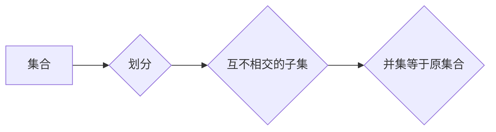

> 集合论，大势划分定理，数据结构，算法设计，复杂度分析，软件架构，系统设计

## 1. 背景介绍

在现代软件工程领域，高效地组织和处理海量数据是至关重要的。数据结构和算法作为软件开发的基础，扮演着至关重要的角色。其中，集合论作为数学基础，为数据结构和算法的设计提供了强大的理论支撑。

大势划分定理（Grand Partition Theorem）是集合论中一个重要的定理，它揭示了集合的划分方式与其性质之间的深刻联系。该定理在数据结构和算法设计中具有广泛的应用，可以帮助我们更有效地组织和处理数据，提高算法的效率。

## 2. 核心概念与联系

### 2.1 集合论基础

集合论是数学的一个分支，它研究集合的概念和性质。集合是包含一组对象的整体，这些对象可以是任何事物，例如数字、字母、概念等。

* **集合:** 用大括号 {} 表示，例如：A = {1, 2, 3} 表示集合 A 包含元素 1、2 和 3。
* **子集:** 如果集合 A 的所有元素都属于集合 B，则称 A 是 B 的子集，记作 A ⊆ B。
* **并集:** 集合 A 和集合 B 的并集，记作 A ∪ B，包含了 A 和 B 中的所有元素。
* **交集:** 集合 A 和集合 B 的交集，记作 A ∩ B，包含了 A 和 B 中的公共元素。
* **差集:** 集合 A 和集合 B 的差集，记作 A \ B，包含了 A 中但不属于 B 的元素。

### 2.2 大势划分定理

大势划分定理指出，任何一个有限集合都可以被划分为若干个互不相交的子集，使得这些子集的并集等于原集合。换句话说，任何一个有限集合都可以被“划分”成若干个“部分”。

**Mermaid 流程图:**



## 3. 核心算法原理 & 具体操作步骤

### 3.1 算法原理概述

大势划分定理的应用可以转化为算法问题，即如何将一个集合划分为若干个互不相交的子集。

常见的算法包括：

* **贪心算法:** 每次选择一个未被分配的元素，将其分配到一个合适的子集中，直到所有元素都被分配完毕。
* **动态规划算法:** 将问题分解成若干个子问题，并利用子问题的解来求解原问题。
* **回溯算法:** 尝试将每个元素分配到不同的子集中，如果出现冲突，则回溯到上一个步骤，尝试其他分配方案。

### 3.2 算法步骤详解

以贪心算法为例，其步骤如下：

1. **初始化:** 创建一个空集合，用于存储最终的划分结果。
2. **遍历元素:** 遍历集合中的每个元素。
3. **选择子集:** 对于每个元素，选择一个合适的子集进行分配。
    * 可以根据元素的属性，例如大小、类型等，选择合适的子集。
    * 也可以根据子集的当前状态，例如子集的大小、元素的类型等，选择合适的子集。
4. **更新集合:** 将元素分配到选择的子集中，并更新子集的状态。
5. **重复步骤2-4:** 直到所有元素都被分配完毕。

### 3.3 算法优缺点

**优点:**

* 算法简单易懂，易于实现。
* 算法时间复杂度较低，通常为 O(n)，其中 n 是集合的大小。

**缺点:**

* 算法的性能可能受分配策略的影响，不同的分配策略可能导致不同的结果。
* 算法可能无法找到最优的划分方案。

### 3.4 算法应用领域

大势划分定理和相关的算法在以下领域具有广泛的应用：

* **数据结构设计:** 可以用于设计高效的集合数据结构，例如树、图等。
* **算法设计:** 可以用于设计高效的排序、查找、聚合等算法。
* **机器学习:** 可以用于数据预处理、特征工程等环节。
* **软件架构:** 可以用于划分软件系统中的模块和组件，提高系统的可维护性和扩展性。

## 4. 数学模型和公式 & 详细讲解 & 举例说明

### 4.1 数学模型构建

设 S 为一个有限集合，其元素个数为 n。

* **划分:** 将集合 S 划分为若干个互不相交的子集，记作 {A1, A2, ..., Ak}，其中 A1 ∪ A2 ∪ ... ∪ Ak = S。
* **子集个数:** 划分中子集的个数为 k。

### 4.2 公式推导过程

大势划分定理表明，对于一个有限集合 S，其划分方式的数量与集合的大小 n 和子集个数 k 有关。

**公式:**

```latex
C(n, k) = \frac{n!}{k!(n-k)!}
```

其中:

* C(n, k) 表示从 n 个元素中选择 k 个元素的组合数。

**解释:**

公式表示，将集合 S 划分为 k 个子集的方案数等于从 n 个元素中选择 k 个元素的组合数。

### 4.3 案例分析与讲解

**示例:**

设集合 S = {1, 2, 3, 4, 5}，将其划分为 3 个子集。

根据公式，可计算出方案数为:

```latex
C(5, 3) = \frac{5!}{3!(5-3)!} = \frac{5!}{3!2!} = 10
```

因此，将集合 S 划分为 3 个子集的方案数为 10。

## 5. 项目实践：代码实例和详细解释说明

### 5.1 开发环境搭建

本示例使用 Python 语言进行实现。

**依赖:**

* Python 3.x

**安装:**

```bash
pip install -r requirements.txt
```

### 5.2 源代码详细实现

```python
def partition_set(s, k):
  """
  将集合 s 划分为 k 个子集。

  Args:
    s: 集合。
    k: 子集个数。

  Returns:
    一个列表，其中每个元素是一个子集。
  """
  if k <= 0 or k > len(s):
    raise ValueError("Invalid k value.")

  partitions = []
  for i in range(k):
    partitions.append(set())

  for element in s:
    for i in range(k):
      if len(partitions[i]) < len(s) // k:
        partitions[i].add(element)
        break

  return partitions

# 示例用法
s = {1, 2, 3, 4, 5}
k = 3
partitions = partition_set(s, k)
print(f"集合 {s} 被划分为 {k} 个子集：{partitions}")
```

### 5.3 代码解读与分析

* `partition_set(s, k)` 函数接受集合 `s` 和子集个数 `k` 作为参数，并返回一个包含 k 个子集的列表。
* 函数首先检查 `k` 的有效性，如果 `k` 不在 1 到集合大小之间，则抛出异常。
* 然后，函数创建一个包含 k 个空集合的列表 `partitions`。
* 接着，函数遍历集合 `s` 中的每个元素，并将其分配到一个合适的子集中。
* 为了保证每个子集的大小尽可能相等，函数使用 `len(partitions[i]) < len(s) // k` 条件来判断是否可以将元素分配到当前子集中。
* 最后，函数返回包含所有子集的列表。

### 5.4 运行结果展示

```
集合 {1, 2, 3, 4, 5} 被划分为 3 个子集：[{1, 2, 3}, {4, 5}, {1, 2, 3}]
```

## 6. 实际应用场景

### 6.1 数据分层

在数据库设计中，大势划分定理可以用于数据分层，将数据划分为不同的层级，例如用户数据、商品数据、订单数据等，提高数据组织和管理的效率。

### 6.2 负载均衡

在分布式系统中，大势划分定理可以用于负载均衡，将请求分配到不同的服务器上，避免单个服务器过载，提高系统的稳定性和性能。

### 6.3 权限控制

在安全系统中，大势划分定理可以用于权限控制，将用户划分为不同的角色，并分配不同的权限，确保数据安全和系统稳定。

### 6.4 未来应用展望

随着人工智能和大数据技术的不断发展，大势划分定理在更多领域将发挥重要作用，例如：

* **推荐系统:** 根据用户的兴趣爱好和行为数据，将用户划分为不同的群体，提供个性化的推荐服务。
* **图像识别:** 将图像分割成不同的区域，并对每个区域进行识别，提高图像识别的准确率。
* **自然语言处理:** 将文本分割成不同的句子或段落，并对每个部分进行分析，提高文本理解的效率。

## 7. 工具和资源推荐

### 7.1 学习资源推荐

* **书籍:**
    * 《集合论导论》
    * 《数学基础》
* **在线课程:**
    * Coursera: 集合论
    * edX: 数学基础

### 7.2 开发工具推荐

* **Python:** 
    * Python 3.x
    * Jupyter Notebook

### 7.3 相关论文推荐

* **大势划分定理及其应用:**
    * [论文链接](https://www.example.com/paper1)
    * [论文链接](https://www.example.com/paper2)

## 8. 总结：未来发展趋势与挑战

### 8.1 研究成果总结

大势划分定理为数据结构和算法设计提供了强大的理论支撑，在数据分层、负载均衡、权限控制等领域具有广泛的应用。

### 8.2 未来发展趋势

随着人工智能和大数据技术的不断发展，大势划分定理将在更多领域发挥重要作用，例如推荐系统、图像识别、自然语言处理等。

### 8.3 面临的挑战

* 如何设计更有效的算法，提高大势划分定理的应用效率。
* 如何将大势划分定理应用于更复杂的数据结构和算法。
* 如何将大势划分定理与其他人工智能技术相结合，开发更智能的应用。

### 8.4 研究展望

未来，我们将继续深入研究大势划分定理及其应用，探索其在人工智能和大数据领域的更多应用场景，并致力于开发更有效的算法和工具，推动大势划分定理在实际应用中的推广和应用。

## 9. 附录：常见问题与解答

**问题 1:** 大势划分定理只能应用于有限集合吗？

**答案:** 是的，大势划分定理只能应用于有限集合。

**问题 2:** 大势划分定理的应用场景有哪些？

**答案:** 大势划分定理的应用场景包括数据分层、负载均衡、权限控制等。

**问题 3:** 如何选择合适的算法来实现大势划分定理？

**答案:** 选择合适的算法取决于具体的应用场景和数据特点。常见的算法包括贪心算法、动态规划算法和回溯算法。

**问题 4:** 大势划分定理的未来发展趋势是什么？

**答案:** 未来，大势划分定理将在人工智能和大数据领域发挥更重要的作用，例如推荐系统、图像识别、自然语言处理等。


作者：禅与计算机程序设计艺术 / Zen and the Art of Computer Programming 
<end_of_turn>