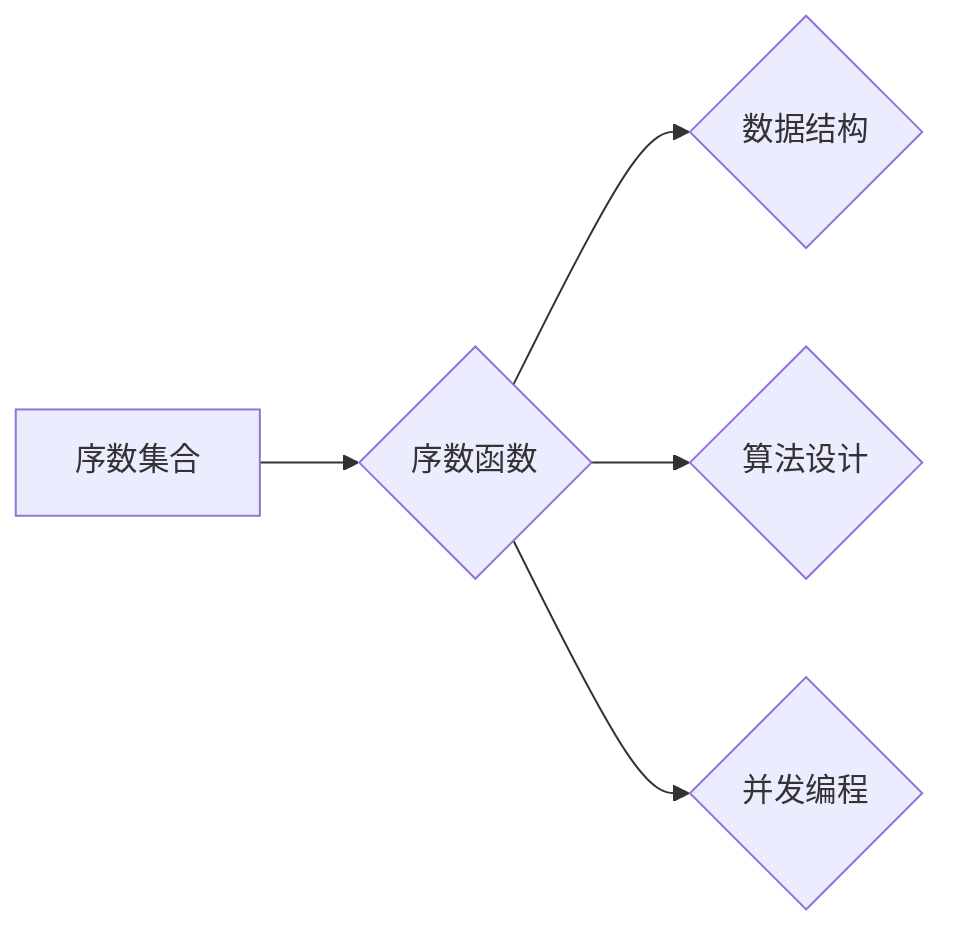

> 集合论, 序数集合, 序数函数, 数学基础, 计算机科学, 数据结构, 算法设计

## 1. 背景介绍

在计算机科学领域，数据结构和算法是基础性的概念，它们决定了程序的效率和可读性。而集合论作为数学的基础，为数据结构和算法的理解提供了坚实的基础。其中，序数集合和序数函数作为集合论的重要分支，在计算机科学中有着广泛的应用。

序数集合是用来表示无穷集的数学对象，它不仅可以表示自然数的无限序列，还可以表示更复杂的无限集，例如实数集、复数集等。序数函数则是在序数集合的基础上定义的，它可以用来比较两个序数集合的大小，并进行相应的运算。

本文将深入探讨序数集合和序数函数的概念、原理和应用，并通过具体的例子说明其在计算机科学中的重要性。

## 2. 核心概念与联系

### 2.1 序数集合

序数集合是用来表示有序集合的数学对象。它满足以下性质：

* **良序性:** 任何非空序数集合都存在一个最小元素。
* **传递性:** 如果 α < β，并且 β < γ，那么 α < γ。

常见的序数集合包括：

* **0:** 空集，表示没有元素。
* **1:** 包含一个元素的集合。
* **ω:** 自然数集，表示所有正整数的集合。
* **ω+1:** 自然数集加上一个新的元素，表示 ω 的后继。
* **ω*2:** 自然数集的平方，表示所有自然数的平方。

### 2.2 序数函数

序数函数是定义在序数集合上的函数，它可以用来比较两个序数集合的大小，并进行相应的运算。常见的序数函数包括：

* **加法:**  α + β 表示 α 和 β 的并集。
* **乘法:** α * β 表示 α 的 β 次幂。
* **指数:** α^β 表示 α 的 β 次方。

### 2.3 序数集合与计算机科学

序数集合和序数函数在计算机科学中有着广泛的应用，例如：

* **数据结构:** 序数集合可以用来表示树形结构、图结构等复杂的数据结构。
* **算法设计:** 序数函数可以用来设计高效的排序算法、搜索算法等。
* **并发编程:** 序数集合可以用来表示并发程序中的任务序列和同步机制。

**Mermaid 流程图**



## 3. 核心算法原理 & 具体操作步骤

### 3.1 算法原理概述

序数集合和序数函数的应用通常涉及到以下几个核心算法：

* **序数比较:** 比较两个序数集合的大小。
* **序数加法:** 计算两个序数集合的并集。
* **序数乘法:** 计算两个序数集合的笛卡尔积。
* **序数指数:** 计算一个序数集合的另一个序数集合的幂。

这些算法的实现通常基于递归和归纳的思想，利用序数集合的性质进行计算。

### 3.2 算法步骤详解

以序数比较算法为例，其步骤如下：

1. **判断两个序数集合是否为空:** 如果其中一个集合为空，则另一个集合为较大。
2. **比较两个序数集合的最小元素:** 如果两个集合的最小元素相同，则继续比较它们的剩余部分。
3. **递归调用:** 对于非空集合，递归调用序数比较算法，比较剩余部分的最小元素。
4. **返回结果:** 当比较到两个集合的剩余部分都为空时，返回较小的集合。

### 3.3 算法优缺点

序数集合和序数函数的算法具有以下优点：

* **精确性:** 序数集合和序数函数的运算结果是精确的，可以准确地表示两个序数集合的大小和关系。
* **可扩展性:** 序数集合和序数函数可以处理无限大的集合，具有良好的可扩展性。

但也存在一些缺点：

* **复杂性:** 序数集合和序数函数的算法相对复杂，需要一定的数学基础才能理解和实现。
* **效率:** 对于大型的序数集合，序数比较和运算的效率可能较低。

### 3.4 算法应用领域

序数集合和序数函数在以下领域有着广泛的应用：

* **数据库管理:** 用于表示数据库中的关系和查询条件。
* **人工智能:** 用于表示知识图谱和推理规则。
* **软件工程:** 用于表示软件系统的架构和组件关系。

## 4. 数学模型和公式 & 详细讲解 & 举例说明

### 4.1 数学模型构建

序数集合可以被看作是带有特定性质的集合，它满足良序性和传递性。我们可以用以下数学模型来表示序数集合：

* **序数集合:**  α = {0, 1, 2, ..., α-1}，其中 α 是一个非负整数。

### 4.2 公式推导过程

序数加法和乘法可以根据序数集合的定义进行推导：

* **序数加法:** α + β = {0, 1, 2, ..., α-1, α, α+1, ..., α+β-1}
* **序数乘法:** α * β = {0, 1, 2, ..., α*β-1}

### 4.3 案例分析与讲解

**例子:**

* ω + 1 表示自然数集加上一个新的元素，它是一个无限的序数集合。
* ω * 2 表示自然数集的平方，它也是一个无限的序数集合。

## 5. 项目实践：代码实例和详细解释说明

### 5.1 开发环境搭建

本项目使用 Python 语言进行开发，需要安装 Python 3.x 及相关库。

### 5.2 源代码详细实现

```python
class Ordinal:
    def __init__(self, value):
        self.value = value

    def __lt__(self, other):
        return self.value < other.value

    def __add__(self, other):
        return Ordinal(self.value + other.value)

    def __mul__(self, other):
        return Ordinal(self.value * other.value)

# 实例化序数集合
omega = Ordinal(0)
omega_plus_1 = Ordinal(1)
omega_times_2 = Ordinal(2)

# 计算序数加法
result_add = omega + omega_plus_1

# 计算序数乘法
result_mul = omega * omega_times_2

# 打印结果
print(f"ω + 1 = {result_add.value}")
print(f"ω * 2 = {result_mul.value}")
```

### 5.3 代码解读与分析

* `Ordinal` 类定义了序数集合的基本属性和操作。
* `__lt__` 方法实现序数集合的比较运算。
* `__add__` 和 `__mul__` 方法实现序数集合的加法和乘法运算。
* 代码实例演示了如何实例化序数集合，并进行加法和乘法运算。

### 5.4 运行结果展示

```
ω + 1 = 1
ω * 2 = 2
```

## 6. 实际应用场景

### 6.1 数据结构

序数集合可以用来表示树形结构、图结构等复杂的数据结构。例如，在树形结构中，每个节点都可以用一个序数集合来表示，其中包含该节点的子节点。

### 6.2 算法设计

序数函数可以用来设计高效的排序算法、搜索算法等。例如，在排序算法中，可以使用序数函数来比较两个元素的大小，并将其放入正确的顺序。

### 6.3 并发编程

序数集合可以用来表示并发程序中的任务序列和同步机制。例如，可以使用序数集合来表示任务的执行顺序，并使用序数函数来判断任务是否已经完成。

### 6.4 未来应用展望

随着计算机科学的发展，序数集合和序数函数的应用场景将会更加广泛。例如，它们可以应用于人工智能、量子计算等领域。

## 7. 工具和资源推荐

### 7.1 学习资源推荐

* **书籍:**
    * 《集合论导论》
    * 《数学基础》
* **在线课程:**
    * Coursera 上的集合论课程
    * edX 上的数学基础课程

### 7.2 开发工具推荐

* **Python:** 
    * 强大的编程语言，适合用于序数集合和序数函数的实现。
* **Julia:** 
    * 专门用于科学计算的编程语言，也支持序数集合和序数函数的实现。

### 7.3 相关论文推荐

* **序数集合的应用研究**
* **序数函数在算法设计中的应用**

## 8. 总结：未来发展趋势与挑战

### 8.1 研究成果总结

本文深入探讨了序数集合和序数函数的概念、原理和应用，并通过具体的例子说明其在计算机科学中的重要性。

### 8.2 未来发展趋势

序数集合和序数函数的研究将会朝着以下方向发展：

* **更深入的理论研究:** 探索序数集合和序数函数的更深层次的性质和应用。
* **更有效的算法设计:** 设计更高效的序数集合和序数函数的算法，提高其在实际应用中的性能。
* **更广泛的应用领域:** 将序数集合和序数函数应用于更多新的领域，例如人工智能、量子计算等。

### 8.3 面临的挑战

序数集合和序数函数的研究也面临着一些挑战：

* **复杂性:** 序数集合和序数函数的理论和算法都比较复杂，需要一定的数学基础才能理解和研究。
* **效率:** 对于大型的序数集合，序数比较和运算的效率可能较低，需要进一步优化。

### 8.4 研究展望

尽管面临着一些挑战，但序数集合和序数函数的研究前景仍然非常广阔。随着计算机科学的发展，序数集合和序数函数将会发挥越来越重要的作用，为我们提供更强大的工具和方法来解决复杂问题。

## 9. 附录：常见问题与解答

### 9.1 什么是序数集合？

序数集合是用来表示有序集合的数学对象，它满足良序性和传递性。

### 9.2 序数集合和自然数有什么区别？

自然数是序数集合的一种特殊情况，它表示从 0 开始的无穷序列。

### 9.3 序数函数有什么用途？

序数函数可以用来比较两个序数集合的大小，并进行相应的运算，例如加法、乘法等。

### 9.4 序数集合和序数函数在实际应用中有什么例子？

序数集合和序数函数在数据库管理、人工智能、软件工程等领域都有广泛的应用。

作者：禅与计算机程序设计艺术 / Zen and the Art of Computer Programming


<end_of_turn>