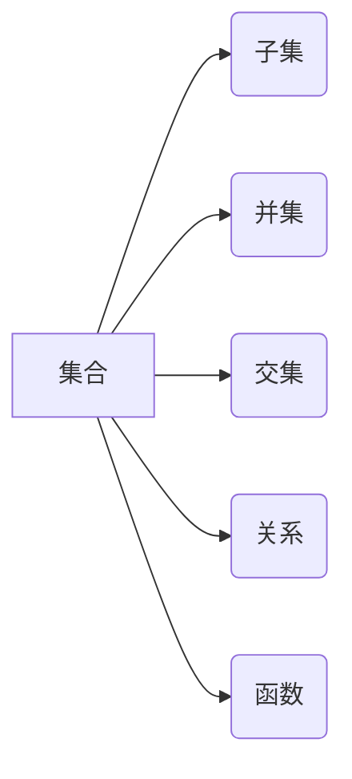

> 集合论，集合，关系，函数，逻辑，数学基础，编程语言

## 1. 背景介绍

在现代计算机科学领域，集合论扮演着至关重要的角色。它为我们提供了描述和操作数据结构的强大工具，并为算法设计、数据结构分析以及编程语言的构建提供了坚实的数学基础。

集合论的起源可以追溯到19世纪，由德国数学家Georg Cantor奠定。Cantor通过引入“无穷集”的概念，开创了集合论的新纪元，并为数学的发展带来了革命性的影响。

随着计算机科学的蓬勃发展，集合论在计算机科学领域也得到了广泛应用。它为我们提供了描述和操作数据结构的强大工具，并为算法设计、数据结构分析以及编程语言的构建提供了坚实的数学基础。

## 2. 核心概念与联系

### 2.1 集合

集合是集合论的基本概念，它是一个包含特定对象的非序的集合。我们可以用大括号{}来表示集合，例如：

```
A = {1, 2, 3}
```

这个集合包含三个元素：1、2和3。

### 2.2 子集

如果一个集合的所有元素都属于另一个集合，则称第一个集合是第二个集合的子集。

例如：

```
A = {1, 2, 3}
B = {1, 2}
```

则B是A的子集，因为B的所有元素都属于A。

### 2.3 并集

两个集合的并集包含这两个集合的所有元素，不重复。

例如：

```
A = {1, 2, 3}
B = {3, 4, 5}
```

则A和B的并集为：

```
A ∪ B = {1, 2, 3, 4, 5}
```

### 2.4 交集

两个集合的交集包含这两个集合的共同元素。

例如：

```
A = {1, 2, 3}
B = {3, 4, 5}
```

则A和B的交集为：

```
A ∩ B = {3}
```

### 2.5 关系

关系是将两个集合的元素映射到彼此的规则。

例如：

```
A = {1, 2, 3}
B = {4, 5, 6}
```

我们可以定义一个关系R，将A中的元素映射到B中的元素：

```
R = {(1, 4), (2, 5), (3, 6)}
```

这个关系表示1映射到4，2映射到5，3映射到6。

### 2.6 函数

函数是一种特殊的二元关系，它满足以下条件：

* 对于集合A中的每个元素，都存在唯一的集合B中的元素与其对应。

例如：

```
A = {1, 2, 3}
B = {4, 5, 6}
```

我们可以定义一个函数f，将A中的元素映射到B中的元素：

```
f(1) = 4
f(2) = 5
f(3) = 6
```

这个函数表示1映射到4，2映射到5，3映射到6。

**Mermaid 流程图**



## 3. 核心算法原理 & 具体操作步骤

### 3.1 算法原理概述

集合论算法通常用于处理集合数据结构，例如查找、插入、删除、合并等操作。这些算法通常基于集合论的基本概念，例如子集、并集、交集等。

### 3.2 算法步骤详解

**示例：查找集合中是否存在某个元素**

1. **输入：** 一个集合A和一个元素x。
2. **遍历：** 遍历集合A中的每个元素。
3. **比较：** 将当前元素与x进行比较。
4. **判断：** 如果当前元素等于x，则返回True，表示x存在于集合A中。
5. **返回：** 如果遍历完集合A后，没有找到x，则返回False，表示x不存在于集合A中。

**示例：合并两个集合**

1. **输入：** 两个集合A和B。
2. **创建：** 创建一个新的集合C。
3. **遍历：** 遍历集合A中的每个元素，将元素添加到集合C中。
4. **遍历：** 遍历集合B中的每个元素，将元素添加到集合C中。
5. **返回：** 返回集合C。

### 3.3 算法优缺点

集合论算法通常具有以下优点：

* **简洁易懂：** 集合论算法通常基于集合论的基本概念，易于理解和实现。
* **高效性：** 许多集合论算法具有良好的时间复杂度和空间复杂度。

但是，集合论算法也有一些缺点：

* **适用范围有限：** 集合论算法主要适用于处理集合数据结构，对于其他类型的数据结构，可能需要使用其他算法。
* **内存消耗：** 对于大型集合，集合论算法可能需要消耗较多的内存。

### 3.4 算法应用领域

集合论算法广泛应用于以下领域：

* **数据库管理系统：** 用于查询、插入、删除和更新数据。
* **人工智能：** 用于知识表示、推理和机器学习。
* **软件工程：** 用于数据结构设计、算法分析和代码优化。

## 4. 数学模型和公式 & 详细讲解 & 举例说明

### 4.1 数学模型构建

集合论的数学模型主要基于以下几个概念：

* **集合：** 用大括号{}表示，例如A = {1, 2, 3}。
* **子集：** 如果集合A的所有元素都属于集合B，则称A是B的子集，记作A ⊆ B。
* **并集：** 集合A和集合B的并集包含这两个集合的所有元素，不重复，记作A ∪ B。
* **交集：** 集合A和集合B的交集包含这两个集合的共同元素，记作A ∩ B。
* **关系：** 将两个集合的元素映射到彼此的规则，记作R ⊆ A × B。
* **函数：** 是一种特殊的二元关系，满足每个输入元素对应唯一的输出元素，记作f: A → B。

### 4.2 公式推导过程

**子集的性质：**

* **自反性：** 对于任意集合A，A ⊆ A。
* **传递性：** 如果A ⊆ B，B ⊆ C，则A ⊆ C。
* **反传递性：** 如果A ⊆ B，B ⊆ A，则A = B。

**并集和交集的性质：**

* **结合律：** (A ∪ B) ∪ C = A ∪ (B ∪ C)。
* **交换律：** A ∪ B = B ∪ A。
* **分配律：** A ∩ (B ∪ C) = (A ∩ B) ∪ (A ∩ C)。

### 4.3 案例分析与讲解

**示例：**

设A = {1, 2, 3}，B = {2, 3, 4}，C = {1, 3, 5}。

* **并集：** A ∪ B = {1, 2, 3, 4}，A ∪ C = {1, 2, 3, 5}。
* **交集：** A ∩ B = {2, 3}，A ∩ C = {1, 3}。
* **子集：** A ⊆ B，C ⊆ A。

## 5. 项目实践：代码实例和详细解释说明

### 5.1 开发环境搭建

本示例使用Python语言进行实现，开发环境搭建如下：

* 操作系统：Windows/macOS/Linux
* Python版本：3.7+
* IDE：PyCharm/VS Code

### 5.2 源代码详细实现

```python
class Set:
    def __init__(self):
        self.elements = set()

    def add(self, element):
        self.elements.add(element)

    def remove(self, element):
        self.elements.remove(element)

    def contains(self, element):
        return element in self.elements

    def union(self, other_set):
        return Set(self.elements | other_set.elements)

    def intersection(self, other_set):
        return Set(self.elements & other_set.elements)

    def __str__(self):
        return str(self.elements)

# 示例代码
set1 = Set()
set1.add(1)
set1.add(2)
set1.add(3)

set2 = Set()
set2.add(2)
set2.add(3)
set2.add(4)

print("set1:", set1)
print("set2:", set2)

union_set = set1.union(set2)
print("union_set:", union_set)

intersection_set = set1.intersection(set2)
print("intersection_set:", intersection_set)
```

### 5.3 代码解读与分析

* **Set类：** 定义了一个集合类，包含添加元素、删除元素、判断元素是否存在、计算并集和交集等方法。
* **__init__方法：** 初始化一个空的集合。
* **add方法：** 添加元素到集合中。
* **remove方法：** 从集合中删除元素。
* **contains方法：** 判断元素是否存在于集合中。
* **union方法：** 计算两个集合的并集。
* **intersection方法：** 计算两个集合的交集。
* **__str__方法：** 返回集合的字符串表示。

### 5.4 运行结果展示

```
set1: {1, 2, 3}
set2: {2, 3, 4}
union_set: {1, 2, 3, 4}
intersection_set: {2, 3}
```

## 6. 实际应用场景

### 6.1 数据处理

集合论算法广泛应用于数据处理领域，例如：

* **数据去重：** 使用集合的交集操作可以去除重复数据。
* **数据分析：** 使用集合的并集和交集操作可以分析数据之间的关系。

### 6.2 图数据库

图数据库是一种专门用于存储和查询图结构数据的数据库。集合论算法在图数据库中用于处理节点和边的关系。

### 6.3 机器学习

在机器学习领域，集合论算法用于构建特征集、进行数据聚类和分类。

### 6.4 未来应用展望

随着数据量的不断增长和计算能力的提升，集合论算法将在以下领域得到更广泛的应用：

* **大数据分析：** 处理海量数据，发现隐藏的模式和趋势。
* **人工智能：** 构建更智能的机器学习模型，实现更复杂的推理和决策。
* **网络安全：** 检测和预防网络攻击，保护数据安全。

## 7. 工具和资源推荐

### 7.1 学习资源推荐

* **书籍：**
    * 《集合论导论》
    * 《数学基础》
* **在线课程：**
    * Coursera上的“集合论”课程
    * edX上的“数学基础”课程

### 7.2 开发工具推荐

* **Python：** 广泛用于数据处理和机器学习。
* **Java：** 适用于大型应用程序开发。
* **C++：** 性能优异，适用于高性能计算。

### 7.3 相关论文推荐

* **“集合论在人工智能中的应用”**
* **“集合论算法在数据处理中的应用”**

## 8. 总结：未来发展趋势与挑战

### 8.1 研究成果总结

集合论在计算机