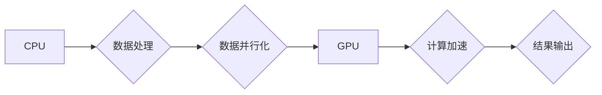

> GPU, CUDA, 深度学习, 黄仁勋, NVIDIA, 计算革命, 并行计算

## 1. 背景介绍

21世纪初，计算机科学迎来了前所未有的变革。互联网的普及、大数据时代的到来以及人工智能的蓬勃发展，都对计算能力提出了前所未有的挑战。传统的CPU架构，以其顺序执行指令的方式，已经难以满足日益增长的计算需求。

在这个关键时刻，黄仁勋，一位来自台湾的计算机科学家，带领NVIDIA公司，开启了GPU计算的革命。GPU（图形处理单元），最初被设计用于渲染游戏画面，拥有着强大的并行计算能力。黄仁勋敏锐地意识到，GPU的架构优势可以被应用于更广泛的计算领域，从而推动计算能力的飞跃。

## 2. 核心概念与联系

**2.1 GPU架构与并行计算**

传统CPU采用串行处理模式，一次只能执行一条指令。而GPU则拥有数千个小型处理单元，并行处理大量数据。这种并行计算模式，使得GPU在处理大量数据和执行重复计算任务时，拥有着远超CPU的优势。

**2.2 CUDA平台与GPU编程**

为了让开发者能够利用GPU的强大计算能力，NVIDIA开发了CUDA（Compute Unified Device Architecture）平台。CUDA提供了一套编程模型和工具，允许开发者将程序移植到GPU上进行加速。

**2.3 GPU计算与深度学习**

深度学习算法，例如卷积神经网络（CNN）和循环神经网络（RNN），需要处理海量数据并进行大量的矩阵运算。GPU的并行计算能力，使得它成为深度学习训练的理想平台。

**Mermaid 流程图**



## 3. 核心算法原理 & 具体操作步骤

**3.1 算法原理概述**

GPU计算的核心算法原理是并行计算。通过将一个大型计算任务分解成许多小的子任务，并将其分配到GPU的多个处理单元上进行并行执行，可以显著提高计算速度。

**3.2 算法步骤详解**

1. **数据并行化:** 将输入数据分解成多个小块，每个小块分配给一个GPU处理单元。
2. **数据传输:** 将数据从CPU传输到GPU内存。
3. **并行计算:** 每个GPU处理单元执行相同的计算操作，对各自的数据块进行处理。
4. **数据聚合:** 将各个处理单元计算的结果聚合起来，得到最终的计算结果。
5. **数据传输:** 将计算结果从GPU内存传输回CPU。

**3.3 算法优缺点**

**优点:**

* 计算速度快，可以显著加速计算任务。
* 适用于处理海量数据和进行大量重复计算。

**缺点:**

* 开发成本较高，需要学习CUDA编程模型。
* 数据传输开销较大，需要考虑数据传输效率。

**3.4 算法应用领域**

GPU计算广泛应用于以下领域:

* 深度学习
* 高性能计算
* 图像处理
* 视频处理
* 科学计算

## 4. 数学模型和公式 & 详细讲解 & 举例说明

**4.1 数学模型构建**

GPU计算的数学模型可以抽象为一个并行计算模型，其中每个处理单元是一个独立的计算单元，可以并行执行相同的计算操作。

**4.2 公式推导过程**

假设一个计算任务需要执行N个操作，每个操作需要T时间。

* CPU执行时间：N * T
* GPU执行时间：N / P * T，其中P是GPU处理单元的数量。

可以看出，GPU的执行时间与CPU的执行时间成反比，并且随着GPU处理单元数量的增加，执行时间会进一步缩短。

**4.3 案例分析与讲解**

例如，训练一个深度学习模型，需要进行大量的矩阵运算。假设一个矩阵运算需要执行10000次乘法操作，每个操作需要1毫秒。

* CPU执行时间：10000 * 1 = 10000毫秒
* GPU执行时间：10000 / 1024 * 1 = 9.77毫秒

在这个例子中，GPU的执行时间比CPU快了约90%。

## 5. 项目实践：代码实例和详细解释说明

**5.1 开发环境搭建**

* 安装CUDA Toolkit
* 安装NVIDIA驱动程序
* 安装C++编译器

**5.2 源代码详细实现**

```c++
#include <iostream>
#include <cuda_runtime.h>

__global__ void vectorAdd(float *a, float *b, float *c, int n) {
  int i = blockIdx.x * blockDim.x + threadIdx.x;
  if (i < n) {
    c[i] = a[i] + b[i];
  }
}

int main() {
  int n = 1024;
  float *a, *b, *c;
  float *d_a, *d_b, *d_c;

  // 申请主机内存
  a = new float[n];
  b = new float[n];
  c = new float[n];

  // 初始化数据
  for (int i = 0; i < n; i++) {
    a[i] = i;
    b[i] = i * 2;
  }

  // 申请设备内存
  cudaMalloc(&d_a, n * sizeof(float));
  cudaMalloc(&d_b, n * sizeof(float));
  cudaMalloc(&d_c, n * sizeof(float));

  // 数据传输到设备
  cudaMemcpy(d_a, a, n * sizeof(float), cudaMemcpyHostToDevice);
  cudaMemcpy(d_b, b, n * sizeof(float), cudaMemcpyHostToDevice);

  // 并行计算
  int threadsPerBlock = 256;
  int blocksPerGrid = (n + threadsPerBlock - 1) / threadsPerBlock;
  vectorAdd<<<blocksPerGrid, threadsPerBlock>>>(d_a, d_b, d_c, n);

  // 数据传输回主机
  cudaMemcpy(c, d_c, n * sizeof(float), cudaMemcpyDeviceToHost);

  // 打印结果
  for (int i = 0; i < n; i++) {
    std::cout << c[i] << " ";
  }
  std::cout << std::endl;

  // 释放内存
  delete[] a;
  delete[] b;
  delete[] c;
  cudaFree(d_a);
  cudaFree(d_b);
  cudaFree(d_c);

  return 0;
}
```

**5.3 代码解读与分析**

* `__global__` 关键字表示该函数是GPU内核函数，将在GPU上执行。
* `blockIdx.x` 和 `threadIdx.x` 是线程的索引信息，用于确定每个线程处理的数据。
* `cudaMemcpy` 函数用于数据传输。
* `vectorAdd` 函数是一个简单的向量加法操作，演示了GPU并行计算的基本原理。

**5.4 运行结果展示**

运行代码后，将输出一个包含所有元素相加结果的向量。

## 6. 实际应用场景

**6.1 深度学习**

GPU在深度学习领域有着广泛的应用，例如图像识别、自然语言处理、语音识别等。

**6.2 高性能计算**

GPU可以加速科学计算、金融建模、天气预报等需要大量计算的领域。

**6.3 图像处理**

GPU可以加速图像渲染、图像处理、视频编码等操作。

**6.4 未来应用展望**

随着GPU计算能力的不断提升，其应用场景将更加广泛，例如：

* 人工智能
* 虚拟现实
* 自动驾驶
* 量子计算

## 7. 工具和资源推荐

**7.1 学习资源推荐**

* NVIDIA CUDA官网：https://developer.nvidia.com/cuda-zone
* CUDA编程指南：https://docs.nvidia.com/cuda/cuda-c-programming-guide/index.html

**7.2 开发工具推荐**

* Visual Studio Code
* CLion

**7.3 相关论文推荐**

* CUDA Programming Guide
* GPU Computing Gems

## 8. 总结：未来发展趋势与挑战

**8.1 研究成果总结**

黄仁勋和NVIDIA的GPU计算革命，推动了计算能力的飞跃，为深度学习、人工智能等领域的发展提供了强大的基础。

**8.2 未来发展趋势**

* GPU计算能力将继续提升，并应用于更广泛的领域。
* GPU架构将不断演进，例如异构计算、量子计算等。

**8.3 面临的挑战**

* GPU编程模型的复杂性
* 数据传输效率的瓶颈
* 功耗和散热问题

**8.4 研究展望**

* 开发更易于使用的GPU编程模型
* 提高数据传输效率
* 探索新的GPU架构和应用场景

## 9. 附录：常见问题与解答

**9.1 如何安装CUDA Toolkit？**

请参考NVIDIA官网的安装指南：https://developer.nvidia.com/cuda-downloads

**9.2 如何编写GPU内核函数？**

请参考CUDA编程指南：https://docs.nvidia.com/cuda/cuda-c-programming-guide/index.html

**9.3 如何调试GPU程序？**

可以使用NVIDIA Nsight工具进行调试。


作者：禅与计算机程序设计艺术 / Zen and the Art of Computer Programming 
<end_of_turn>