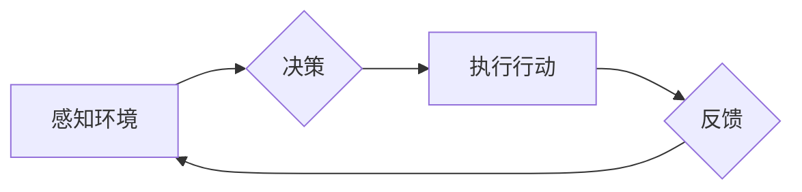

> AI代理，工作流，自主行为，规划策略，强化学习，决策树，图灵奖，人工智能

## 1. 背景介绍

在当今人工智能蓬勃发展的时代，AI代理作为一种能够自主执行任务、学习和适应环境的智能实体，已成为研究和应用的热点。AI代理的工作流是指代理在执行任务过程中所遵循的一系列步骤或规则，它决定了代理的行为方式和决策策略。

传统的代理系统通常依赖于预先定义的规则和知识库，缺乏灵活性和适应性。而随着深度学习和强化学习等技术的进步，AI代理的工作流逐渐朝着更加自主、智能的方向发展。

## 2. 核心概念与联系

**2.1 AI代理的概念**

AI代理是一个能够感知环境、做出决策并执行行动的智能实体。它可以是软件程序、机器人或其他形式的智能系统。

**2.2 工作流的概念**

工作流是指一系列相互关联的活动或任务，按照特定的顺序和规则进行执行。它可以帮助组织和管理复杂的任务流程，提高效率和准确性。

**2.3 AI代理工作流的联系**

AI代理的工作流是指代理在执行任务过程中所遵循的一系列步骤或规则，它将AI代理的概念与工作流的概念结合起来，使得代理能够更加智能地执行任务。

**2.4 AI代理工作流的架构**



**2.5 核心概念原理和架构**

AI代理工作流的核心原理是将任务分解成一系列子任务，并为每个子任务设计相应的决策策略和执行步骤。代理通过感知环境信息，做出决策，执行行动，并根据反馈信息调整策略，最终完成任务。

## 3. 核心算法原理 & 具体操作步骤

**3.1 算法原理概述**

AI代理工作流的算法原理主要基于强化学习、决策树和图搜索等技术。

* **强化学习:** 通过奖励和惩罚机制，训练代理学习最优的决策策略。
* **决策树:** 将决策过程表示为树形结构，每个节点代表一个决策，每个叶子节点代表一个结果。
* **图搜索:** 在任务空间中搜索最优路径，找到完成任务的最佳方案。

**3.2 算法步骤详解**

1. **任务分解:** 将目标任务分解成一系列子任务。
2. **状态空间定义:** 定义代理感知的环境状态空间。
3. **动作空间定义:** 定义代理可以执行的动作空间。
4. **奖励函数设计:** 设计一个奖励函数，用于评估代理的行为效果。
5. **策略学习:** 使用强化学习算法，训练代理学习最优的策略。
6. **决策执行:** 根据学习到的策略，代理做出决策并执行行动。
7. **反馈处理:** 收集环境反馈信息，更新代理的策略。

**3.3 算法优缺点**

* **优点:** 能够学习和适应复杂环境，具有自主性和智能性。
* **缺点:** 训练过程复杂，需要大量数据和计算资源。

**3.4 算法应用领域**

* **机器人控制:** 使机器人能够自主导航、避障和执行任务。
* **游戏AI:** 开发能够与人类玩家进行对抗的智能游戏角色。
* **自动驾驶:** 训练自动驾驶汽车感知环境、做出决策和控制车辆。

## 4. 数学模型和公式 & 详细讲解 & 举例说明

**4.1 数学模型构建**

AI代理工作流可以建模为马尔可夫决策过程 (MDP)。

* **状态空间:** S = {s1, s2, ..., sn}
* **动作空间:** A = {a1, a2, ..., am}
* **转移概率:** P(s' | s, a) 表示从状态 s 执行动作 a 到状态 s' 的概率。
* **奖励函数:** R(s, a) 表示在状态 s 执行动作 a 得到的奖励。

**4.2 公式推导过程**

目标是找到最优策略 π(s) ，使得代理在所有状态下执行的动作能够最大化累积奖励。

Bellman方程：

```latex
V^*(s) = \max_a \left[ R(s, a) + \gamma \sum_{s'} P(s' | s, a) V^*(s') \right]
```

其中：

* V^*(s) 是状态 s 的最优价值函数。
* γ 是折扣因子，控制未来奖励的权重。

**4.3 案例分析与讲解**

例如，一个AI代理需要在迷宫中找到出口。

* 状态空间：迷宫中的每个位置。
* 动作空间：向上、向下、向左、向右。
* 转移概率：根据迷宫结构确定。
* 奖励函数：到达出口获得最大奖励，迷宫中其他位置获得较小奖励。

使用Bellman方程，可以训练代理学习最优的路径，找到出口。

## 5. 项目实践：代码实例和详细解释说明

**5.1 开发环境搭建**

使用Python语言和相关的库，例如OpenAI Gym、TensorFlow或PyTorch。

**5.2 源代码详细实现**

```python
import gym
import numpy as np

# 定义环境
env = gym.make('CartPole-v1')

# 定义代理
class Agent:
    def __init__(self, state_size, action_size):
        self.state_size = state_size
        self.action_size = action_size
        self.model = ... # 使用深度学习模型

    def act(self, state):
        # 使用模型预测动作
        action = self.model.predict(state)
        return action

# 训练代理
agent = Agent(env.observation_space.shape[0], env.action_space.n)
for episode in range(1000):
    state = env.reset()
    done = False
    while not done:
        action = agent.act(state)
        next_state, reward, done, _ = env.step(action)
        # 更新代理模型
        agent.model.train(state, action, reward, next_state)
        state = next_state

# 测试代理
state = env.reset()
while True:
    action = agent.act(state)
    state, reward, done, _ = env.step(action)
    env.render()
    if done:
        break
```

**5.3 代码解读与分析**

代码实现了一个简单的AI代理，使用深度学习模型进行训练。

* `gym` 库用于定义环境和训练代理。
* `Agent` 类定义了代理的结构和行为。
* `act()` 方法使用模型预测动作。
* 训练循环更新代理模型。
* 测试循环展示代理的行为。

**5.4 运行结果展示**

运行代码后，代理将在环境中执行任务，并逐渐学习到最优策略。

## 6. 实际应用场景

**6.1 自动化流程**

AI代理可以自动化执行重复性任务，例如数据处理、文件管理和邮件回复。

**6.2 个性化服务**

AI代理可以根据用户的需求提供个性化服务，例如推荐产品、提供咨询和安排行程。

**6.3 智能客服**

AI代理可以作为智能客服，回答用户的问题、解决问题和提供支持。

**6.4 未来应用展望**

AI代理的工作流将在未来广泛应用于各个领域，例如医疗保健、教育、金融和制造业。

## 7. 工具和资源推荐

**7.1 学习资源推荐**

* **书籍:**
    * 《Reinforcement Learning: An Introduction》 by Richard S. Sutton and Andrew G. Barto
    * 《Artificial Intelligence: A Modern Approach》 by Stuart Russell and Peter Norvig
* **在线课程:**
    * Coursera: Reinforcement Learning Specialization
    * Udacity: Artificial Intelligence Nanodegree

**7.2 开发工具推荐**

* **Python:** 广泛用于AI开发，拥有丰富的库和工具。
* **TensorFlow:** 深度学习框架，用于训练和部署AI模型。
* **PyTorch:** 深度学习框架，灵活易用，适合研究和开发。

**7.3 相关论文推荐**

* **Deep Reinforcement Learning: An Overview** by Volodymyr Mnih et al.
* **Proximal Policy Optimization Algorithms** by John Schulman et al.
* **Asynchronous Methods for Deep Reinforcement Learning** by David Silver et al.

## 8. 总结：未来发展趋势与挑战

**8.1 研究成果总结**

AI代理工作流的研究取得了显著进展，例如强化学习算法的改进、深度学习模型的应用和多智能体协作的探索。

**8.2 未来发展趋势**

* **更强大的学习能力:** 开发能够学习更复杂任务和环境的代理。
* **更安全的代理:** 确保代理的行为安全可靠，避免潜在的风险。
* **更广泛的应用:** 将AI代理应用于更多领域，解决更实际的问题。

**8.3 面临的挑战**

* **数据获取和标注:** 训练AI代理需要大量数据，获取和标注数据成本高昂。
* **模型解释性和可解释性:** 深度学习模型的决策过程难以解释，这限制了代理的信任度。
* **伦理和社会影响:** AI代理的应用可能带来伦理和社会问题，需要谨慎考虑。

**8.4 研究展望**

未来研究将继续探索AI代理工作流的更深层次问题，例如更有效的学习算法、更安全的代理设计和更广泛的应用场景。

## 9. 附录：常见问题与解答

**9.1 如何选择合适的算法？**

选择合适的算法取决于具体的应用场景和任务需求。

**9.2 如何处理稀疏奖励？**

可以使用奖励函数的修改和探索策略的调整来处理稀疏奖励。

**9.3 如何评估代理的性能？**

可以使用奖励累积、成功率和任务完成时间等指标来评估代理的性能。


作者：禅与计算机程序设计艺术 / Zen and the Art of Computer Programming 
<end_of_turn>